# Quiet Core bot 二次开发技术文档

> 版本 2026.6.11 · 文档生成日期 2026-08-03 · 基于 Quiet Core bot 源码 v2026.6.11（MIT, TypeScript ESM, Node 22.19+/24, pnpm 11.2.2, SQLite/Kysely, Lit/Vite UI）
> 深度审计补充：本文档经 6 类审计（功能/内部节点/配置/数据/执行流程/UI）补充，增补内容已作为"补遗"小节分散并入对应正文章节。
> 结构复核修订 2026-09-19：对照源码逐目录核验后更新——3.1 顶层概览补入 `.agents/`、`deploy/`、`packages/`；3.2 src/ 目录树补全至实际 67 个子目录；3.3 extensions/ 由 10 个更正为 139 个（按 manifest 分六类）；3.4 ui/ 补入 config/docs/test-helpers/types 与规模数据；3.5 apps/ 补入 `shared/`、`macos-mlx-tts/`；3.6 docs/ 补全至 30 个子目录；3.7 scripts/ 补全 18 个子目录；3.8 skills/ 由 12 个更正为 52 个；3.10/3.11 同步更新；补遗 4.5 新增 14 个原未记录模块并修正文件计数；补遗 7.7 更正 C.1 误报（realtime-talk.ts 等文件实际存在）并更新各规模计数。
> 二次开发能力增补 2026-09-21：新增 exec 审批 CLI（`quiet-core-bot approvals pending|approve|deny`）与 CLI 轮次挂起正反馈、托管出网代理不可达的可操作文案、独立发行版更新守卫（`QUIET_CORE_INDEPENDENT_BUILD`）、provider 归属头改为 opt-in（`QUIET_CORE_PROVIDER_ATTRIBUTION`）、`tools.loopDetection` 默认开启、`config set|unset` 放行 size-drop 守卫。相应修订 §2.6、§3.2、§3.11、§4.4、§5.4.2、§5.9.2、§6.5、§8.8、§8.9、§8.11。

## 目录

- [1. 项目概述](#1-项目概述)
  - [1.1 简介与核心定位](#11-简介与核心定位)
  - [1.2 项目类型](#12-项目类型)
  - [1.3 技术栈概览](#13-技术栈概览)
  - [1.4 浏览器/环境兼容性](#14-浏览器环境兼容性)
  - [1.5 主入口](#15-主入口)
  - [1.6 许可证与仓库](#16-许可证与仓库)
- [2. 快速上手](#2-快速上手)
  - [2.1 环境要求](#21-环境要求)
  - [2.2 安装与依赖安装](#22-安装与依赖安装)
  - [2.3 环境变量配置](#23-环境变量配置)
  - [2.4 本地运行命令](#24-本地运行命令)
  - [2.5 构建与打包](#25-构建与打包)
  - [2.6 命令速查表](#26-命令速查表)
  - [2.7 技术栈清单表](#27-技术栈清单表)
- [3. 项目目录结构](#3-项目目录结构)
  - [3.1 顶层目录概览](#31-顶层目录概览)
  - [3.2 src/ — 核心 TypeScript 源码](#32-src--核心-typescript-源码)
  - [3.3 extensions/ — 内置插件目录](#33-extensions--内置插件目录)
  - [3.4 ui/ — Web 控制面板（Lit + Vite）](#34-ui--web-控制面板lit--vite)
  - [3.5 apps/ — 原生应用](#35-apps--原生应用)
  - [3.6 docs/ — 项目文档](#36-docs--项目文档)
  - [3.7 scripts/ — 构建 / CI / 工具脚本](#37-scripts--构建--ci--工具脚本)
  - [3.8 skills/ — 内置技能包](#38-skills--内置技能包)
  - [3.9 config/ — 工程级配置](#39-config--工程级配置)
  - [3.10 其余一级目录](#310-其余一级目录)
  - [3.11 关键目录说明](#311-关键目录说明)
- [4. 技术架构](#4-技术架构)
  - [4.1 架构分层图](#41-架构分层图)
  - [4.2 模块依赖图](#42-模块依赖图)
  - [4.3 组件树](#43-组件树)
  - [4.4 模块职责说明表](#44-模块职责说明表)
  - [4.5 补遗：内部节点补遗](#45-补遗内部节点补遗)
- [5. 核心功能与业务流程](#5-核心功能与业务流程)
  - [5.1 核心功能列表](#51-核心功能列表)
  - [5.2 关键调用链时序图](#52-关键调用链时序图)
  - [5.3 调用链速查](#53-调用链速查)
  - [5.4 补遗：完整 CLI 命令入口清单](#54-补遗完整-cli-命令入口清单)
  - [5.5 补遗：Gateway HTTP 路由完整清单](#55-补遗gateway-http-路由完整清单)
  - [5.6 补遗：Hook 系统与事件目录](#56-补遗hook-系统与事件目录)
  - [5.7 补遗：Webhook 入口与 Gmail 集成链路](#57-补遗webhook-入口与-gmail-集成链路)
  - [5.8 补遗：Onboarding 向导完整时序图](#58-补遗onboarding-向导完整时序图)
  - [5.9 补遗：入站消息全链路异步分支补全](#59-补遗入站消息全链路异步分支补全)
  - [5.10 补遗：Cron 调度链补全——isolated-agent 子流程](#510-补遗cron-调度链补全isolated-agent-子流程)
  - [5.11 补遗：核心状态机](#511-补遗核心状态机)
- [6. 数据模型与接口](#6-数据模型与接口)
  - [6.1 数据存储概览](#61-数据存储概览)
  - [6.2 共享状态库（quiet-core-bot.sqlite）数据实体](#62-共享状态库quiet-core-botsqlite数据实体)
  - [6.3 Agent 库（quiet-core-bot-agent.sqlite）数据实体](#63-agent-库quiet-core-bot-agentsqlite数据实体)
  - [6.4 实体关系图](#64-实体关系图)
  - [6.5 Gateway WebSocket RPC 方法清单](#65-gateway-websocket-rpc-方法清单)
  - [6.6 Plugin SDK 主要导出分类](#66-plugin-sdk-主要导出分类)
  - [6.7 补遗：数据库索引清单](#67-补遗数据库索引清单)
  - [6.8 补遗：SQLite 连接 Pragma](#68-补遗sqlite-连接-pragma)
  - [6.9 补遗：文件权限加固](#69-补遗文件权限加固)
  - [6.10 补遗：Schema 版本与迁移机制](#610-补遗schema-版本与迁移机制)
  - [6.11 补遗：外键 ON DELETE 行为表](#611-补遗外键-on-delete-行为表)
  - [6.12 补遗：memory_index_state CHECK 约束](#612-补遗memory_index_state-check-约束)
- [7. 界面与交互说明](#7-界面与交互说明)
  - [7.1 界面总览](#71-界面总览)
  - [7.2 页面/视图清单](#72-页面视图清单)
  - [7.3 UI 组件目录](#73-ui-组件目录)
  - [7.4 页面-组件映射表](#74-页面-组件映射表)
  - [7.5 主题与样式定制](#75-主题与样式定制)
  - [7.6 补遗：前端状态管理](#76-补遗前端状态管理)
  - [7.7 补遗：界面与交互补遗](#77-补遗界面与交互补遗)
- [8. 配置与部署](#8-配置与部署)
  - [8.1 环境变量说明](#81-环境变量说明)
  - [8.2 外部服务依赖清单](#82-外部服务依赖清单)
  - [8.3 本地开发启动指南](#83-本地开发启动指南)
  - [8.4 部署流程](#84-部署流程)
  - [8.5 常见问题排错](#85-常见问题排错)
  - [8.6 补遗：错误处理架构](#86-补遗错误处理架构)
  - [8.7 补遗：Daemon 运行状态](#87-补遗daemon-运行状态)
  - [8.8 补遗：特性开关与实验功能](#88-补遗特性开关与实验功能)
  - [8.9 补遗：运行时 QUIET_CORE\_\* 环境变量](#89-补遗运行时-quiet_core_-环境变量)
  - [8.10 补遗：工作区 .env 安全黑名单](#810-补遗工作区-env-安全黑名单)
  - [8.11 补遗：quiet-core-bot.json 配置 schema 索引](#811-补遗quiet-core-botjson-配置-schema-索引)
  - [8.12 补遗：config env 注入管线](#812-补遗config-env-注入管线)
- [9. 开发者指南](#9-开发者指南)
  - [9.1 二次开发切入点](#91-二次开发切入点)
  - [9.2 新增功能步骤模板：以新增一个 messaging channel 为例](#92-新增功能步骤模板以新增一个-messaging-channel-为例)
  - [9.3 代码风格与提交规范](#93-代码风格与提交规范)
  - [9.4 测试与调试方法](#94-测试与调试方法)
- [附录 A：关键术语表](#附录-a关键术语表)
- [附录 B：参考链接](#附录-b参考链接)

## 1. 项目概述

### 1.1 简介与核心定位

**Quiet Core bot** 是一个**多渠道 AI 网关型个人助手**（Multi-channel AI gateway with extensible messaging integrations）。它运行在你自己的设备上，在你已经使用的渠道上回答你，能在 macOS/iOS/Android 上听说，并可以渲染你可控制的实时 Canvas。Gateway 只是控制平面，真正的产品是这个助手本身。

如果你想要一个个人单用户助手，感觉本地、快速且始终在线，这就是它。

- 官网：<https://github.com/liuda1999/Quiet-Core-bot>
- 文档：<https://github.com/liuda1999/Quiet-Core-bot>
- 仓库：<https://github.com/liuda1999/Quiet-Core-bot>
- Discord：<https://discord.gg/clawd>
- 当前版本：**2026.6.11**
- 许可证：**MIT**（Copyright (c) 2026 Quiet Core bot Foundation）

#### 1.1.1 本仓库定位：裁剪版独立发行版

本仓库是 Quiet Core bot 的**裁剪版、本地维护发行版**，不参与上游 Quiet Core bot 的发布节奏。以下三点是本发行版与上游最显著的差别，二次开发时需先知道：

- **更新被默认拒绝**：`QUIET_CORE_INDEPENDENT_BUILD` 未设置即视为开启，`quiet-core-bot update` / `update repair` / `update finalize` / `update wizard` 与 `update.run` 网关 RPC 均被拒绝，只读的 `quiet-core-bot update status` 保持可用。详见 §8.8.6。
- **出网被强制托管代理接管**：`proxy.enabled=true` 时所有 provider 请求先连代理；代理不可达时会直接给出 `quiet-core-bot proxy start …` 的可操作提示，而不是笼统报"provider 端点连接被拒"。详见 §8.8.5。
- **provider 归属头默认关闭**：attribution 改为 opt-in，且只对内置 canonical 端点表内的 provider 生效。详见 §8.8.6。

另有 `tools.loopDetection`（工具调用循环检测）默认开启（详见 §8.8.4），`config set` 与 `config unset` 都放行 size-drop 守卫（`allowConfigSizeDrop: true`，见 `src/cli/config-cli.ts`）。

**本机部署基线快照（2026-09-21 实测，非通用默认值）**：

| 项       | 取值                                                                                                                                                                       |
| -------- | -------------------------------------------------------------------------------------------------------------------------------------------------------------------------- |
| 模型     | 全部走本地 ollama：`agents.defaults.model = ollama/huihui_ai/gemma-4-abliterated:12b`；另有静态 provider `models.providers.ollama-openai` 指向 `http://127.0.0.1:11434/v1` |
| 出网     | `proxy.enabled=true`、`proxy.proxyUrl=http://127.0.0.1:18888`、`loopbackMode=gateway-only`                                                                                 |
| exec     | `tools.exec.mode=auto`（reviewer 使用本地模型）                                                                                                                            |
| 记忆检索 | `agents.defaults.memorySearch.provider=ollama`（`nomic-embed-text`，768 维），FTS 可用                                                                                     |
| 插件     | `plugins.bundledDiscovery=allowlist` + `plugins.allow` 白名单                                                                                                              |
| 网关     | Windows 计划任务形态（`gateway.vbs` → `gateway.cmd`；脚本会探测 18888 端口并按需拉起代理），端口 18789                                                                     |
| 离线     | `QUIET_CORE_OFFLINE=1`、`QUIET_CORE_NO_AUTO_UPDATE=1`                                                                                                                      |

已知项与剩余阻塞项见工作区 `analysis/` 目录下的阶段报告（当前为 `stage2-gap-fix-report.md`）；剩余阻塞项仅 **G3**（服务自恢复/开机免登录需以管理员身份手动执行）。

### 1.2 项目类型

Quiet Core bot 是一个**混合形态**的开源项目，同时提供以下交付物：

| 形态              | 说明                                                                     | 入口/产物                                                                 |
| ----------------- | ------------------------------------------------------------------------ | ------------------------------------------------------------------------- |
| **CLI 工具**      | 全局命令 `quiet-core-bot`，提供 onboard、gateway、agent、doctor 等子命令 | `quiet-core-bot.mjs`（`bin` 字段）                                        |
| **库（Library）** | 可被外部程序 `import` 的 Node.js ESM 库，导出核心运行时与 Plugin SDK     | `dist/index.js`（`main` 字段），以及 `./plugin-sdk/*` 等子路径导出        |
| **Web 服务**      | Gateway HTTP/WebSocket 服务器 + Control UI 控制面板                      | Gateway 监听 18789 等端口；UI 由 `ui/index.html` 构建到 `dist/control-ui` |
| **原生 App**      | macOS 菜单栏应用、iOS 节点、Android 节点、Windows Hub 配套应用           | `apps/macos`、`apps/ios`、`apps/android` 等                               |

### 1.3 技术栈概览

Quiet Core bot 主要是一个编排系统：提示词、工具、协议和集成。选择 TypeScript 是为了让项目默认可改（hackable）——它广为人知、迭代快、易读易改易扩展。

- **语言**：TypeScript（ESM、`strict: true`、`module: NodeNext`、`target: es2023`、`verbatimModuleSyntax`、`isolatedModules`）
- **运行时**：Node.js 22.19+（推荐 Node 24）；CLI 启动器 `quiet-core-bot.mjs` 会强制校验版本并退出
- **包管理器**：pnpm 11.2.2（通过 `packageManager` 字段锁定，使用 Corepack 激活）
- **工作区**：pnpm workspace，包含 `.`、`ui`、`packages/*`、`extensions/*`；`nodeLinker: hoisted`
- **数据存储**：SQLite（本地状态）+ sqlite-vec（可选向量检索）
- **数据访问**：Kysely 0.29.2（类型安全 SQL 构建器）
- **Web 框架**：Express 5.2.1（Gateway HTTP）、ws 8.21.0（WebSocket）
- **CLI 框架**：Commander 14.0.3
- **UI 框架**：Lit 3.3.3（Web Components）+ Vite（开发与构建）
- **LLM SDK**：OpenAI 6.39.1、@anthropic-ai/sdk 0.100.1、@google/genai 2.7.0 等
- **MCP**：@modelcontextprotocol/sdk 1.29.0（同时作为 server 与 runtime 集成面）
- **校验**：Zod 4.4.3
- **测试**：Vitest 4.1.8
- **构建**：tsdown 0.22.1（基于 Rolldown 的打包器）
- **Lint/格式化**：oxlint 1.67.0、oxfmt 0.52.0
- **TS 直接执行**：tsx 4.22.3（开发循环中直接运行 `.ts`）

### 1.4 浏览器/环境兼容性

Quiet Core bot 的 CLI/Gateway 在主流桌面操作系统上运行，并通过原生 App 扩展到移动平台：

| 平台        | 支持       | 说明                                                                  |
| ----------- | ---------- | --------------------------------------------------------------------- |
| **macOS**   | ✅         | 一等公民，含菜单栏 App（Quiet Core bot.app）、Voice Wake、Live Canvas |
| **Linux**   | ✅         | 通过 systemd 用户服务运行守护进程                                     |
| **Windows** | ✅         | 通过 Windows Hub 配套应用或 CLI 运行                                  |
| **iOS**     | ✅（节点） | 作为 Gateway 的 WS 节点配对，提供语音触发转发与 Canvas                |
| **Android** | ✅（节点） | 作为 WS 节点配对，提供 Connect/Chat/Voice/Camera/Canvas               |

容器化部署支持 Docker、Docker Compose、Fly.io、Render 等平台。Docker 镜像基于 `node:24-bookworm-slim`，多阶段构建，以非 root 用户运行。

### 1.5 主入口

| 入口                | 路径                       | 用途                                                                                                 |
| ------------------- | -------------------------- | ---------------------------------------------------------------------------------------------------- |
| **CLI 入口**        | `quiet-core-bot.mjs`       | npm `bin` 字段指向的全局命令；负责 Node 版本校验、编译缓存、帮助文本快路径，最终加载 `dist/entry.js` |
| **库入口**          | `dist/index.js`            | `package.json` 的 `main` 与 `exports["."]`，外部程序通过 `import` 使用核心运行时                     |
| **Plugin SDK 入口** | `dist/plugin-sdk/index.js` | 通过 `quiet-core-bot/plugin-sdk` 及大量子路径导出，供插件作者扩展                                    |
| **UI 入口**         | `ui/index.html`            | Control UI 的 HTML 入口，由 Vite 构建为静态资源输出到 `dist/control-ui`                              |

### 1.6 许可证与仓库

- **许可证**：MIT（见 `LICENSE`，Copyright (c) 2026 Quiet Core bot Foundation）。第三方代码的致谢与说明记录在 `THIRD_PARTY_NOTICES.md`。
- **仓库地址**：<https://github.com/liuda1999/Quiet-Core-bot>
- **Issue 反馈**：<https://github.com/liuda1999/Quiet-Core-bot/issues>
- **贡献指南**：见 `CONTRIBUTING.md`
- **项目愿景**：见 `VISION.md`
- **安全策略**：见 `SECURITY.md`，安全报告邮箱 `security@openclaw.ai`

---

## 2. 快速上手

### 2.1 环境要求

| 依赖         | 最低版本                | 推荐版本 | 说明                                                      |
| ------------ | ----------------------- | -------- | --------------------------------------------------------- |
| **Node.js**  | 22.19                   | 24       | CLI 启动器会校验版本，低于 22.19 直接退出                 |
| **pnpm**     | 11.2.2                  | 11.2.2   | 由 `packageManager` 字段锁定，通过 `corepack enable` 激活 |
| **操作系统** | macOS / Linux / Windows | —        | 桌面三平台支持；iOS/Android 通过节点 App 接入             |

> 说明：仓库是 pnpm workspace，源码检出**必须**使用 `pnpm install`。在仓库根目录直接运行 `npm install` 不是受支持的源码开发方式（`preinstall` 脚本会发出警告）。Quiet Core bot 也兼容 npm、pnpm、bun 进行全局安装运行。

### 2.2 安装与依赖安装

#### 2.2.1 全局安装（推荐终端用户）

```bash
# 使用 npm
npm install -g quiet-core-bot@latest

# 或使用 pnpm
pnpm add -g quiet-core-bot@latest

# 引导式安装并注册守护进程（launchd / systemd 用户服务）
quiet-core-bot onboard --install-daemon
```

#### 2.2.2 源码开发安装

```bash
git clone https://github.com/liuda1999/Quiet-Core-bot.git
cd quiet-core-bot

# 安装依赖（必须使用 pnpm）
pnpm install

# 首次运行或重置本地配置/工作区后执行
pnpm quiet-core-bot setup

# 可选：首次启动前预构建 Control UI
pnpm ui:build
```

> `pnpm quiet-core-bot ...` 通过 `tsx` 直接运行 TypeScript 源码；`pnpm build` 产出 `dist/` 用于 Node 或打包发布；`pnpm gateway:watch` 在开发循环中按需重建运行时。

### 2.3 环境变量配置

Quiet Core bot 通过 `.env` 文件加载环境变量。将仓库根目录的 `.env.example` 复制为 `.env`（本地运行）或 `~/.quiet-core-bot/.env`（守护进程），只填写你实际使用的值。

**环境变量加载优先级**（从高到低）：

1. `process.env`（已存在的非空变量不会被覆盖）
2. `./.env`（仓库根目录）
3. `~/.quiet-core-bot/.env`
4. `quiet-core-bot.json` 的 `env` 块

> 注意：`quiet-core-bot.json` 中的直接配置键（如 `gateway.auth.token` 或渠道 token）与 env 加载是分开解析的，通常优先于 env 回退。

#### 关键环境变量（摘自 `.env.example`）

| 分类             | 变量                                  | 说明                                                                                         |
| ---------------- | ------------------------------------- | -------------------------------------------------------------------------------------------- |
| **Gateway 鉴权** | `QUIET_CORE_GATEWAY_TOKEN`            | Gateway 绑定到 loopback 之外时必填；留空则首次启动自动生成；可用 `openssl rand -hex 32` 生成 |
| **Gateway 鉴权** | `QUIET_CORE_GATEWAY_PASSWORD`         | 可选的密码鉴权模式（与 token 二选一）                                                        |
| **路径覆盖**     | `QUIET_CORE_STATE_DIR`                | 状态目录，默认 `~/.quiet-core-bot`                                                           |
| **路径覆盖**     | `QUIET_CORE_CONFIG_PATH`              | 配置文件路径，默认 `~/.quiet-core-bot/quiet-core-bot.json`                                   |
| **路径覆盖**     | `QUIET_CORE_HOME`                     | Home 基准目录，默认 `~`                                                                      |
| **模型 API Key** | `OPENAI_API_KEY`                      | OpenAI                                                                                       |
| **模型 API Key** | `ANTHROPIC_API_KEY`                   | Anthropic                                                                                    |
| **模型 API Key** | `GEMINI_API_KEY`                      | Google Gemini                                                                                |
| **模型 API Key** | `OPENROUTER_API_KEY`                  | OpenRouter                                                                                   |
| **渠道 Token**   | `TELEGRAM_BOT_TOKEN`                  | Telegram 机器人                                                                              |
| **渠道 Token**   | `DISCORD_BOT_TOKEN`                   | Discord 机器人                                                                               |
| **渠道 Token**   | `SLACK_BOT_TOKEN` / `SLACK_APP_TOKEN` | Slack（xoxb- / xapp-）                                                                       |
| **工具/媒体**    | `BRAVE_API_KEY`                       | Brave 搜索                                                                                   |
| **工具/媒体**    | `PERPLEXITY_API_KEY`                  | Perplexity 搜索                                                                              |
| **工具/媒体**    | `ELEVENLABS_API_KEY`                  | ElevenLabs TTS（别名 `XI_API_KEY`）                                                          |
| **工具/媒体**    | `DEEPGRAM_API_KEY`                    | Deepgram STT                                                                                 |

### 2.4 本地运行命令

#### 2.4.1 全局安装后的运行

```bash
# 推荐守护进程模式：onboard 安装 launchd/systemd 用户服务，保持常驻
quiet-core-bot onboard --install-daemon
quiet-core-bot gateway status

# 前台调试模式
quiet-core-bot gateway stop
quiet-core-bot gateway --port 18789 --verbose

# 发送测试消息
quiet-core-bot message send --target +1234567890 --message "Hello from Quiet Core bot"

# 与助手对话（可投递到任意已连接渠道）
quiet-core-bot agent --message "Ship checklist" --thinking high
```

#### 2.4.2 源码开发的运行

```bash
# 开发循环：源码/配置改动自动重载（基于 tmux）
pnpm gateway:watch

# 直接通过 tsx 运行 TS 源码（等价于 quiet-core-bot 命令）
pnpm dev

# 带环境覆盖的 Gateway 开发模式（跳过渠道连接）
pnpm gateway:dev

# TUI 终端界面
pnpm tui

# Control UI 开发服务器（Vite，端口 5173）
pnpm ui:dev
```

> `pnpm gateway:watch` 不会重建 `dist/control-ui`，修改 `ui/` 后需重新运行 `pnpm ui:build`，或在迭代 UI 时使用 `pnpm ui:dev`。

### 2.5 构建与打包

```bash
# 完整构建：产出 dist/（用于 Node 运行、打包、发布校验）
pnpm build

# 构建 Control UI 到 dist/control-ui
pnpm ui:build

# Docker 镜像所需的完整构建（tsdown + 检查 + 运行时后处理 + 插件资源 + 元数据）
pnpm build:docker

# 构建后校验
pnpm check

# 运行测试
pnpm test
```

#### Docker 构建

```bash
# 构建本地镜像（多阶段，基于 node:24-bookworm-slim）
docker build -t quiet-core-bot:local .

# 可选：通过 build-arg 启用额外扩展、浏览器、Docker CLI
docker build \
  --build-arg QUIET_CORE_EXTENSIONS="diagnostics-otel,matrix" \
  --build-arg QUIET_CORE_INSTALL_BROWSER=1 \
  --build-arg QUIET_CORE_INSTALL_DOCKER_CLI=1 \
  -t quiet-core-bot:local .

# 使用 Docker Compose 启动 Gateway + CLI
docker compose up
```

Docker 镜像默认以非 root 用户 `node` 运行，内置 `/healthz`（liveness）与 `/readyz`（readiness）探针，入口为 `tini -- node quiet-core-bot.mjs gateway`。

### 2.6 命令速查表

| 用途                     | 命令                                                                            | 说明                                                                                                |
| ------------------------ | ------------------------------------------------------------------------------- | --------------------------------------------------------------------------------------------------- |
| 全局安装                 | `npm install -g quiet-core-bot@latest`                                          | 安装最新发布版本                                                                                    |
| 引导安装                 | `quiet-core-bot onboard --install-daemon`                                       | 交互式引导并安装守护进程                                                                            |
| 网关状态                 | `quiet-core-bot gateway status`                                                 | 查看网关运行状态                                                                                    |
| 前台调试                 | `quiet-core-bot gateway --port 18789 --verbose`                                 | 前台运行并输出详细日志                                                                              |
| 源码依赖安装             | `pnpm install`                                                                  | 安装工作区全部依赖                                                                                  |
| 首次设置                 | `pnpm quiet-core-bot setup`                                                     | 写入本地配置与工作区                                                                                |
| 开发循环                 | `pnpm gateway:watch`                                                            | 源码改动自动重载（tmux）                                                                            |
| 开发运行                 | `pnpm dev`                                                                      | 通过 tsx 直接运行 TS                                                                                |
| Gateway 开发             | `pnpm gateway:dev`                                                              | 跳过渠道连接的 Gateway 开发模式                                                                     |
| UI 开发服务器            | `pnpm ui:dev`                                                                   | Vite 开发服务器（端口 5173）                                                                        |
| 构建                     | `pnpm build`                                                                    | 产出 `dist/`                                                                                        |
| UI 构建                  | `pnpm ui:build`                                                                 | 构建 Control UI 到 `dist/control-ui`                                                                |
| Docker 构建              | `pnpm build:docker`                                                             | 构建 Docker 镜像所需的全部产物                                                                      |
| 检查                     | `pnpm check`                                                                    | 运行代码检查与架构校验                                                                              |
| Lint                     | `pnpm lint`                                                                     | 运行 oxlint（分片）                                                                                 |
| 格式化                   | `pnpm format`                                                                   | 运行 oxfmt 格式化                                                                                   |
| 测试                     | `pnpm test`                                                                     | 运行测试套件                                                                                        |
| 健康诊断                 | `quiet-core-bot doctor`                                                         | 诊断并修复配置/迁移问题                                                                             |
| 发送消息                 | `quiet-core-bot message send --target <num> --message "..."`                    | 发送测试消息                                                                                        |
| 调用助手                 | `quiet-core-bot agent --message "..." --thinking high`                          | 与助手对话                                                                                          |
| 列出待审批               | `quiet-core-bot approvals pending [--session <key>] [--json]`                   | 列出等待决策的 exec 审批请求（网关 RPC `exec.approval.list`）                                       |
| 批准审批                 | `quiet-core-bot approvals approve <id> [--always]`                              | 批准待处理 exec 审批（默认 allow-once，`--always` 为 allow-always）；`<id>` 支持 8 位短前缀         |
| 拒绝审批                 | `quiet-core-bot approvals deny <id>`                                            | 拒绝待处理 exec 审批（网关 RPC `exec.approval.resolve`，scope `operator.approvals`）                |
| 更新状态（只读）         | `quiet-core-bot update status`                                                  | 查看当前更新渠道与版本来源；独立发行版下仍可用                                                      |
| 上游更新（本发行版禁用） | `quiet-core-bot update` / `update repair` / `update finalize` / `update wizard` | 本仓库为独立发行版，默认拒绝上游更新与 `update.run` RPC；设 `QUIET_CORE_INDEPENDENT_BUILD=0` 才恢复 |

### 2.7 技术栈清单表

| 类别         | 技术                            | 版本              | 用途                            |
| ------------ | ------------------------------- | ----------------- | ------------------------------- |
| 语言         | TypeScript                      | 6.0.3             | 主开发语言（ESM strict）        |
| 运行时       | Node.js                         | ≥22.19（推荐 24） | JavaScript 运行时               |
| 包管理       | pnpm                            | 11.2.2            | 工作区包管理（Corepack）        |
| 数据库       | SQLite + sqlite-vec             | 0.1.9（可选）     | 本地状态存储 + 向量检索         |
| ORM          | Kysely                          | 0.29.2            | 类型安全 SQL 构建器             |
| Web 框架     | Express                         | 5.2.1             | Gateway HTTP 服务               |
| WebSocket    | ws                              | 8.21.0            | 实时通信（节点、客户端）        |
| CLI 框架     | Commander                       | 14.0.3            | CLI 命令解析                    |
| 交互提示     | @clack/prompts                  | 1.4.0             | 交互式终端提示                  |
| 终端 UI      | @earendil-works/pi-tui          | 0.78.0            | TUI 终端界面                    |
| UI 框架      | Lit                             | 3.3.3             | Web Components 控制面板         |
| UI 构建      | Vite                            | —                 | UI 开发与打包                   |
| LLM SDK      | openai                          | 6.39.1            | OpenAI 模型接入                 |
| LLM SDK      | @anthropic-ai/sdk               | 0.100.1           | Anthropic 模型接入              |
| LLM SDK      | @google/genai                   | 2.7.0             | Google Gemini 模型接入          |
| MCP          | @modelcontextprotocol/sdk       | 1.29.0            | MCP 协议（server + runtime）    |
| ACP          | @agentclientprotocol/sdk        | 0.22.1            | Agent Client Protocol           |
| 校验         | Zod                             | 4.4.3             | 运行时类型校验                  |
| Schema       | typebox                         | 1.1.39            | JSON Schema 类型构建            |
| 测试         | Vitest                          | 4.1.8             | 单元 / E2E 测试                 |
| 覆盖率       | @vitest/coverage-v8             | 4.1.8             | 测试覆盖率                      |
| 构建         | tsdown                          | 0.22.1            | 基于 Rolldown 的打包器          |
| TS 执行      | tsx                             | 4.22.3            | 直接运行 TypeScript（开发循环） |
| Lint         | oxlint                          | 1.67.0            | 代码静态检查                    |
| 格式化       | oxfmt                           | 0.52.0            | 代码格式化                      |
| Markdown     | @quiet-core/markdown-core       | —                 | Markdown 解析与渲染             |
| 代码高亮     | highlight.js                    | 11.11.1           | 代码语法高亮                    |
| 浏览器自动化 | playwright-core                 | 1.60.0            | 浏览器工具                      |
| 推送         | web-push                        | 3.6.7             | Web Push 通知                   |
| 定时         | croner                          | 10.0.1            | Cron 定时任务                   |
| 文件锁       | proper-lockfile                 | 4.1.2             | 文件锁                          |
| 容器         | Docker（node:24-bookworm-slim） | —                 | 容器化部署                      |
| 入口进程     | tini                            | —                 | 容器内 PID 1 信号转发           |

## 3. 项目目录结构

本章对 Quiet Core bot（v2026.6.11）源码树进行递归遍历，产出带中文职责注解的二级目录树。遍历范围为 `src/`、`extensions/`、`ui/`、`apps/`、`docs/`、`scripts/`、`skills/`、`config/`、`patches/`、`qa/`、`security/`、`git-hooks/`、`.github/`、`.vscode/` 等一级目录；已排除 `node_modules`、`dist`、`.git`、`pnpm-lock.yaml`、`npm-shrinkwrap.json`。

### 3.1 顶层目录概览

```
quiet-core-bot-2026.6.11/
├── src/                          # 核心 TypeScript 源码（CLI 运行时、网关、Agent、渠道、插件系统等，67 个子目录）
├── extensions/                   # 内置插件目录（139 个：channel / provider / tool / 能力 / 诊断等，见 3.3）
├── packages/                     # workspace 共享库包（21 个：gateway-protocol / plugin-sdk / acp-core / llm-core 等）
├── ui/                           # Web 控制面板前端（Lit + Vite，含 WebChat 与 Control UI）
├── apps/                         # 原生应用（macOS / iOS / Android / macOS-mlx-tts / shared / Swabble）
├── docs/                         # 项目文档（按主题分目录：cli / channels / providers / tools 等，681 个 .md）
├── scripts/                      # 构建、CI、部署、PR 流程、QA 脚本（835 个文件、18 个子目录，见 3.7）
├── skills/                       # 内置技能包（52 个，每个含 SKILL.md 声明文件，见 3.8）
├── config/                       # 工程级配置（knip / swiftformat / swiftlint / shellcheck）
├── deploy/                       # 部署配置（fly.private.toml 私有化 Fly.io 部署模板）
├── patches/                      # 依赖补丁目录（当前为空占位）
├── qa/                           # QA 场景定义与说明
├── security/                     # 安全策略文档
├── git-hooks/                    # Git 钩子脚本（pre-commit）
├── test/                         # 测试基础设施（vitest 分片配置、global-setup、mocks、helpers、e2e、proof）
├── .agents/                      # 维护者笔记与 agent 技能（maintainer-notes、claw-score、autoreview 等 SKILL）
├── .github/                      # GitHub 仓库配置（actions / workflows / codeql / codex / instructions / ISSUE_TEMPLATE）
├── .vscode/                      # VSCode 编辑器配置（launch、tasks）
├── quiet-core-bot.mjs                  # CLI 入口可执行脚本（#!/usr/bin/env node）
├── package.json                  # 根包定义（pnpm workspace 根）
├── pnpm-workspace.yaml           # pnpm workspace 声明
├── pnpm-lock.yaml / npm-shrinkwrap.json  # 锁文件（pnpm 开发锁 + npm 发布 shrinkwrap）
├── tsconfig.json / tsconfig.core.json / tsconfig.*.json  # TypeScript 编译配置（根 / core / extensions / projects 分离，共 9 个）
├── tsdown.config.ts              # tsdown 打包配置
├── vitest.config.ts              # Vitest 测试配置（转发到 test/vitest/vitest.config.ts）
├── Dockerfile                    # 容器镜像构建文件
├── docker-compose.yml            # 容器编排配置
├── fly.toml / render.yaml        # Fly.io / Render 部署配置
├── appcast.xml                   # macOS 应用自动更新源（Sparkle 格式）
├── taxonomy.yaml                 # 分类法/标签体系定义
├── .env.example                  # 环境变量示例
├── README.md / CHANGELOG.md / LICENSE / THIRD_PARTY_NOTICES.md  # 项目说明、变更日志、MIT 许可证、第三方声明
├── SECURITY.md / CONTRIBUTING.md / VISION.md  # 安全策略、贡献指南、项目愿景
├── AGENTS.md / CLAUDE.md         # AI 编码助手上下文指引
├── .pre-commit-config.yaml / .gitattributes / .gitignore / .dockerignore  # Git / Docker 元数据
└── .oxlintrc.json / .oxfmtrc.jsonc / .semgrepignore / .npmrc / .crabbox.yaml  # Lint / 格式化 / 安全扫描配置
```

### 3.2 src/ — 核心 TypeScript 源码

```
src/
├── acp/                          # Agent Client Protocol 实现（client / server / commands / policy / translator / types / control-plane）
├── agents/                       # Agent 运行时与配置（btw 侧问、config、context、lanes 并行通道、sandbox 沙箱、timeout、usage 用量、sessions 会话、embedded-agent-runner、harness、modes/interactive、provider-attribution 归属头、tool-loop-detection 工具循环检测）
├── auto-reply/                   # 回复投递核心子系统（reply 队列/会话/模型选择/路由/followup、chunk 分块、tokens、typing、命令鉴权）
├── bindings/                     # 会话绑定记录（current_conversation_bindings 表运行时逻辑）
├── bootstrap/                    # 进程启动引导（Node 启动 TLS 环境、Linux 系统 CA bundle、Node 版本管理器识别）
├── channels/                     # 渠道抽象层（ids、message/ 收发管线、turn/kernel、run-state-machine、draft-stream 流式预览、allow-from、session、registry、plugins 契约）
├── chat/                         # Canvas 渲染与工具内容呈现
├── cli/                          # CLI 命令实现（program/ 注册表、gateway-cli、daemon-cli、tui-cli、cron-cli、mcp-cli 等子命令）
├── commands/                     # 嵌入式 Agent 命令 barrel（agent / docs / flows / onboard / reset / setup / tasks / configure.daemon）
├── commitments/                  # 承诺跟踪系统（extraction 提取、runtime、store-writer、到期触发）
├── compat/                       # 遗留命名兼容（legacy-names）
├── config/                       # 配置 schema 与读写（config / io / schema / types / paths / logging / mutate / legacy / version / talk / sessions / includes、independent-build-guard 独立发行版更新守卫）
├── context-engine/               # 上下文引擎（ContextEngine 注册表、LegacyContextEngine、quarantine-health）
├── crestodian/                   # Crestodian 救援助手（rescue 策略、探针、对话、审计、TUI 后端）
├── cron/                         # Cron 定时调度引擎（delivery / normalize / parse / schedule / service / stagger / store / isolated-agent / session-reaper / task-ledger）
├── daemon/                       # 守护进程管理（launchd / systemd / schtasks / service / inspect / cmd-set / output / paths）
├── docs/                         # 内嵌文档数据（docs list 数据源）
├── flows/                        # 引导/Onboarding/Doctor 流程的选项与贡献类型定义（FlowOption / FlowContribution）
├── gateway/                      # Gateway 网关服务（auth / boot / call / client / events / hooks / net / server / probe / ws-log / methods / exec-approval-manager / node-registry）
├── hooks/                        # Hook 钩子系统（config / gmail / hooks / install / installs / loader / policy / types / update / bundled 内置钩子）
├── i18n/                         # 国际化注册表
├── image-generation/             # 图像生成运行时（ImageGenerationProvider 契约、OpenAI 兼容 provider、资产解析）
├── infra/                        # 基础设施工具库（archive / backoff / binaries / brew / dotenv / env / errors / fetch / git-root / home-dir / ports / retry / ws / wsl / tailnet / scp-host / push-web / net/ssrf / net/proxy 托管出网代理（managed-proxy-unreachable-hint / proxy-lifecycle / active-proxy-state）/ outbound / clawhub / sqlite-wal）
├── interactive/                  # 交互式回复/展示载荷（MessagePresentation / InteractiveReply 类型族）
├── link-understanding/           # 链接理解（detect 检测、runner、apply、format）
├── llm/                          # LLM 集成层（oauth 授权 / stream 流式 / providers/ 内置 provider / types 类型 / utils/hash）
├── logging/                      # 日志系统（config / levels / logger / redact 脱敏 / state / types / subsystem / console）
├── mcp/                          # MCP 桥接与服务（channel-bridge、channel-server、quiet-core-bot-tools-serve、plugin-tools-serve、stdio server）
├── media/                        # 媒体处理（audio / fetch / parse / qr-image / store）
├── media-generation/             # 媒体生成共享运行时（provider 能力契约、live-test-helpers、runtime-shared）
├── media-understanding/          # 媒体理解（图片/音频/视频附件归一化、provider 注册、MediaAttachmentCache、转写运行器）
├── memory/                       # 记忆根文件（root-memory-files）
├── memory-host-sdk/              # 记忆宿主 SDK（dreaming 梦境、engine-qmd、engine-storage、events、multimodal、query、secret、status、host/）
├── model-catalog/                # 模型目录（QUIET_CORE_PROVIDER_INDEX、manifest-planner、provider 索引类型）
├── music-generation/             # 音乐生成（MusicGenerationProvider 契约、generate/edit、资产候选）
├── node-host/                    # 节点宿主运行时工具（withTimeout）
├── pairing/                      # 配对（pairing-store、pairing-challenge、setup-code、allow-from-store、pairing-messages）
├── plugin-sdk/                   # 插件 SDK 公共契约（core / llm / acpx / zod / channel-contract / agent-runtime / memory-core / browser-bridge 等 300+ 子路径）
├── plugin-state/                 # 插件状态存储（SQLite KV、运行时健康记录信封）
├── plugins/                      # 插件加载与管理运行时（cli / enable / hooks / loader / logger / roots / slots / status / tools / types / update / api-builder / manifest-registry）
├── process/                      # 进程管理（exec 执行 / kill-tree / spawn-utils / windows-command / lanes / command-queue）
├── provider-runtime/             # provider 操作重试（operation-retry）
├── proxy-capture/                # 代理抓包（ca 证书、coverage、proxy-server、runtime、store.sqlite）
├── realtime-transcription/       # 实时转录 WebSocket 会话
├── routing/                      # 路由（account-id / account-lookup / bindings / channel-route-targets / bound-account-read / peer-kind-match）
├── scripts/                      # 源码侧脚本（ci-changed-scope、control-ui-i18n、docs-link-audit、sync-plugin-versions、test-live-media 等）
├── secrets/                      # 密钥管理（apply / audit / plan / shared / config-io / path-utils / resolve）
├── security/                     # 安全审计（audit / fix / test-temp-cases）
├── sessions/                     # 会话策略（classify-session-kind、input-provenance、model-overrides、send-policy、session-id-resolution、session-chat-type）
├── shared/                       # 跨模块共享工具（regexp 正则工具、lazy-promise）
├── skills/                       # 技能系统（types、discovery、loading、lifecycle、runtime、security、workshop）
├── state/                        # SQLite schema 与状态库（quiet-core-bot-state-schema.sql、quiet-core-bot-agent-schema.sql、quiet-core-bot-state-db、Kysely 类型）
├── status/                       # 状态展示（status-message、status-plugin-health、status-queue、status-subagents、fallback-notice-state、agent-runtime-label）
├── talk/                         # 语音会话（Talk）日志与事件指标（logging / event-metrics / talk-events）
├── tasks/                        # 任务与流程注册表（task-registry、task-executor、task-flow-registry、detached-task-runtime、native-subagent-task、对账/审计/维护）
├── test-helpers/                 # 跨模块测试辅助（http、ssrf、temp-dir、state-dir-env、workspace、windows-cmd-shim）
├── test-utils/                   # 测试工具（env 环境构造）
├── tools/                        # 工具协议层（index / planner 规划 / protocol / types / availability）
├── trajectory/                   # 轨迹导出与清理（export、metadata、runtime-file、cleanup、command-export）
├── transcripts/                  # 转写存储（TranscriptsStore、provider 注册表、摘要、手动来源）
├── tts/                          # 文本转语音引擎（directives / tts-config / tts-core / tts-types / tts）
├── tui/                          # 终端 UI（commands / tui-launch / tui-submit / tui-types / tui / embedded-backend）
├── types/                        # 全局类型声明（qrcode.d.ts）
├── utils/                        # 通用工具函数（boolean、queue-helpers）
├── video-generation/            # 视频生成（provider 注册表、能力覆盖、DashScope 兼容、时长支持、归一化）
├── web-fetch/                    # Web 抓取运行时与内容提取器
├── web-search/                   # Web 搜索运行时
├── wizard/                       # 设置向导（prompts / session / setup / setup.migration-import / i18n）
├── entry.ts / entry.respawn.ts / entry.compile-cache.ts  # 主入口、自重启入口、编译缓存
├── entry.root-help-fast-path.ts / entry.version-fast-path.ts  # 启动帮助/版本快路径
├── index.ts / library.ts        # 库导出入口与公共 API barrel
├── runtime.ts                    # 运行时上下文
├── extensionAPI.ts               # 插件扩展 API 暴露（遗留）
├── global-state.ts / globals.ts  # 全局状态与全局变量
├── logger.ts / logging.ts        # 根日志器与日志入口
├── version.ts                    # 版本号读取
├── utils.ts                      # 顶层工具函数
├── param-key.ts / poll-params.ts / polls.ts  # 轮询与参数键
├── browser-lifecycle-cleanup.ts / docker-image-digests.ts / docker-build-cache.ts  # 浏览器/镜像辅助
└── *.test.ts                     # 单元测试（entry / index / library / logger / utils / version / polls / docker 等）
```

### 3.3 extensions/ — 内置插件目录

内置插件共 **139 个**，按 `quiet-core-bot.plugin.json` 清单的声明方式（`channels` 字段 / `providers`+`modelCatalog` 字段 / `contracts` 契约）分为六类：**Channel 类**（消息渠道接入方，25 个）、**LLM Provider 类**（模型推理提供方，52 个）、**能力 Provider 类**（语音/搜索/生成/嵌入等非 LLM 能力，26 个）、**Tool 类**（Agent 工具插件，15 个）、**平台/诊断/集成类**（17 个）与**内部库包**（无清单，4 个）。每个插件以 `api.ts` 为公共导出 barrel，遵循 `quiet-core-bot/plugin-sdk/*` 契约。

```
extensions/
│
├── ── Channel 类插件（25 个，manifest 含 channels 字段）──────────
│   ├── clickclack/ discord/ feishu/ googlechat/ imessage/ irc/ line/
│   ├── matrix/ mattermost/ msteams/ nextcloud-talk/ nostr/ qa-channel/
│   ├── qqbot/ raft/ signal/ slack/ sms/ synology-chat/ telegram/
│   └── tlon/ twitch/ whatsapp/ zalo/ zalouser/
│
├── ── LLM Provider 类插件（52 个，manifest 含 providers/modelCatalog）──
│   ├── amazon-bedrock/ amazon-bedrock-mantle/ anthropic/ anthropic-vertex/
│   ├── arcee/ byteplus/ cerebras/ chutes/ cloudflare-ai-gateway/
│   ├── codex/ cohere/ comfy/ copilot-proxy/ deepinfra/ deepseek/
│   ├── fal/ fireworks/ github-copilot/ gmi/ google/ groq/ huggingface/
│   ├── kilocode/ kimi-coding/ litellm/ lmstudio/ microsoft-foundry/
│   ├── minimax/ mistral/ moonshot/ novita/ nvidia/ ollama/ openai/
│   ├── opencode/ opencode-go/ openrouter/ qianfan/ qwen/ sglang/
│   ├── stepfun/ synthetic/ tencent/ together/ venice/ vercel-ai-gateway/
│   └── vllm/ volcengine/ vydra/ xai/ xiaomi/ zai/
│
├── ── 能力 Provider 类插件（26 个，manifest 声明 contracts）────────
│   ├── 语音/STT/TTS：azure-speech/ elevenlabs/ gradium/ inworld/ microsoft/ tts-local-cli/
│   ├── 转写：deepgram/ senseaudio/
│   ├── 嵌入：llama-cpp/ voyage/
│   ├── Web 搜索：brave/ duckduckgo/ exa/ parallel/ perplexity/ searxng/
│   ├── 媒体生成：alibaba/ pixverse/ runway/
│   ├── 迁移：migrate-claude/ migrate-hermes/
│   └── 其他：admin-http-rpc/ document-extract/ qa-lab/ tokenjuice/ web-readability/
│
├── ── Tool 类插件（15 个，contracts 声明 tools）────────────────
│   ├── browser/ canvas/ codex-supervisor/ diffs/ file-transfer/
│   ├── firecrawl/ google-meet/ llm-task/ lobster/ memory-core/
│   └── memory-lancedb/ memory-wiki/ tavily/ voice-call/ workboard/
│
├── ── 平台/诊断/集成类（17 个）────────────────────────────
│   ├── acpx/（ACP 扩展）  active-memory/  bonjour/（mDNS 发现）
│   ├── copilot/  device-pair/  diagnostics-otel/（OpenTelemetry）
│   ├── diagnostics-prometheus/  diffs-language-pack/  oc-path/
│   ├── open-prose/  openshell/  phone-control/  policy/
│   └── qa-matrix/  talk-voice/  thread-ownership/  webhooks/（Gmail 等）
│
├── ── 内部库包（4 个，无 quiet-core-bot.plugin.json，workspace 库）──────
│   ├── image-generation-core/  media-understanding-core/
│   └── test-support/  video-generation-core/
│
├── .npmignore                    # npm 发布忽略
└── AGENTS.md / CLAUDE.md         # 插件边界规则与 AI 助手指引（约束 extensions 不得深导入 src/ 内部）
```

### 3.4 ui/ — Web 控制面板（Lit + Vite）

```
ui/
├── config/                       # UI 构建辅助配置
├── docs/                         # UI 侧文档
├── public/                       # 静态资源（favicon.ico / favicon.svg / sw.js Service Worker）
├── src/
│   ├── i18n/                     # 国际化（index.ts 多语言入口）
│   ├── styles/                   # 样式表（base.css / chat.css / layout.css / layout.mobile.css / components.css / workboard.css / usage.css / skill-workshop.css / config.css / config-quick.css / cron-quick-create.css / dreams.css / activity.css，共 13 个）
│   ├── test-helpers/             # UI 测试辅助
│   ├── types/                    # 共享类型
│   └── ui/                       # UI 组件（Lit 自定义元素，142 个文件）
│       ├── chat/                 # 聊天子模块（77 个文件：流式渲染、工具卡片、输入历史、实时语音等）
│       ├── components/           # 通用组件（dashboard-header / modal-dialog / file-preview-modal / resizable-divider）
│       ├── controllers/          # 状态控制器（45 个，封装 Gateway RPC 调用与本地状态）
│       ├── e2e/                  # UI E2E 测试
│       ├── views/                # 视图层（100 个文件，按 Tab 分发的渲染模块）
│       ├── app.ts                # 根组件（Control UI 主应用）
│       ├── app-*.ts              # 行为拆分模块（lifecycle/gateway/settings/scroll/chat/channels/render/native-bridge/polling/tool-stream/events 等）
│       ├── navigation.ts         # 路由与 Tab 分组（TAB_PATHS / TAB_GROUPS / SETTINGS_TABS）
│       ├── gateway.ts            # Gateway WebSocket 客户端
│       ├── markdown.ts           # Markdown 渲染
│       ├── theme.ts              # 主题切换
│       ├── icons.ts              # 图标
│       ├── thinking.ts           # 思考链展示
│       ├── format.ts             # 格式化
│       ├── storage.ts            # 本地存储
│       ├── types.ts / ui-types.ts  # 类型定义
│       └── uuid.ts               # UUID 生成
├── index.html                    # HTML 入口
├── package.json                  # UI 独立包配置
├── vite.config.ts                # Vite 构建配置
├── vitest.config.ts / vitest.node.config.ts  # Vitest 测试配置
└── AGENTS.md / CLAUDE.md         # UI 开发指引
```

### 3.5 apps/ — 原生应用

```
apps/
├── macos/                        # macOS 原生应用（Quiet Core bot.app，SwiftUI + SPM）
│   ├── Sources/                  # Swift 源码（Quiet Core bot/，257 个 .swift 文件）
│   ├── Tests/                    # Swift 测试
│   ├── Packaging/                # 打包资源
│   ├── Package.swift / Package.resolved  # Swift Package Manager 定义
│   └── README.md                 # 开发运行与签名打包说明（restart-mac.sh / package-mac-app.sh / codesign）
├── ios/                          # iOS 原生应用（Super Alpha，作为 role:node 连接 Gateway）
│   ├── README.md                 # Xcode 手动部署流程、TestFlight 分发说明
│   ├── project.yml               # XcodeGen 项目定义文件
│   ├── version.json              # 版本号定义
│   └── CHANGELOG.md              # iOS 应用变更日志
├── android/                      # Android 原生应用（Kotlin + Jetpack Compose，Gradle）
│   ├── gradlew                   # Gradle Wrapper 脚本
│   └── style.md                  # 代码风格说明
├── macos-mlx-tts/                # macOS MLX 本地 TTS 辅助包（Swift Package）
│   ├── Sources/                  # Swift 源码
│   └── Package.swift / Package.resolved
├── shared/                       # 跨平台共享 Swift 库
│   └── QuietCoreKit/             # macOS/iOS 共享组件（聊天/Talk/Canvas 视图）
└── swabble/                      # Swabble 子项目（仅含 MIT 许可证，Quiet Core bot Foundation）
    └── LICENSE
```

### 3.6 docs/ — 项目文档

```
docs/
├── .generated/                    # 生成文档产物
├── .i18n/                        # 文档国际化配置（README.md）
├── announcements/                # 版本公告
├── assets/                       # 文档静态资源
├── automation/                   # 自动化文档
├── channels/                     # 渠道接入文档（irc / line / nostr / qqbot / raft / sms / tlon / zalo 等）
├── clawhub/                      # ClawHub 文档（cli.md）
├── cli/                          # CLI 命令参考文档（50+ 命令：acp / agent / cron / daemon / gateway / mcp / tui 等）
├── concepts/                     # 核心概念文档（agent / oauth / queue / retry / soul / session / streaming）
├── debug/                        # 调试文档
├── diagnostics/                  # 诊断文档（flags / gateway diagnostics）
├── gateway/                      # Gateway 网关文档（index / doctor / sandboxing）
├── help/                         # 帮助文档（faq / scripts / testing）
├── images/                       # 文档图片
├── install/                      # 安装部署指南（azure / bun / fly / gcp / nix / node）
├── maturity/                     # 成熟度说明
├── nodes/                        # Node 节点文档（audio / camera / images / talk）
├── plan/                         # 规划文档
├── platforms/                    # 平台文档（ios.md）
├── plugins/                      # 插件开发文档（hooks / building-plugins / adding-capabilities / codex-harness）
├── providers/                    # Provider 接入文档（ds4 / fal / gmi / groq / qwen / vllm / xai / zai 等）
├── refactor/                     # 重构文档（acp.md）
├── reference/                    # 参考文档（rpc / test）
├── security/                     # 安全文档
├── snippets/                     # 代码片段
├── specs/                        # 规格说明
├── start/                        # 快速开始（hubs / lore / setup / wizard）
├── tools/                        # 工具文档（browser / btw / clawhub / diffs / exec / goal / lobster / pdf / plugin / skills / steer / tavily / tts / web）
├── web/                          # Web 界面文档（dashboard / tui / webchat）
├── docs.json                     # 文档站点配置
├── index.md                      # 文档首页
├── AGENTS.md / CLAUDE.md         # 文档编写指引
├── ci.md / logging.md / network.md / vps.md / tts.md / date-time.md / prose.md / style.css  # 主题文档与样式
└── brave-search.md / perplexity.md  # 搜索引擎集成文档
```

> docs/ 全目录共约 681 个 `.md` 文件。

### 3.7 scripts/ — 构建 / CI / 工具脚本

```
scripts/
├── clawdock/                      # ClawDock 容器工具
├── dev/                           # 开发循环脚本（tui-pty-test-watch 等）
├── docker/                        # Docker 辅助（setup.sh 沙箱配置）
├── docs-i18n/                     # 文档国际化脚本
├── e2e/                           # E2E Docker lane 脚本
├── fixtures/                      # 测试夹具
├── github/                        # GitHub 集成脚本
├── k8s/                           # Kubernetes 部署脚本（deploy.sh + manifests/）
├── lib/                           # 脚本共享库
├── mantis/                       # Mantis 工具
├── perf/                          # 性能基准脚本
├── podman/                        # Podman 容器支持
├── pr-lib/                        # PR 流程库（push.sh）
├── pre-commit/                    # pre-commit 钩子实现
├── qa/                            # QA 实验室脚本
├── repro/                         # 复现脚本
├── secrets/                       # 密钥处理脚本
├── systemd/                       # systemd 服务安装脚本
├── build-all.mjs                  # 全量构建脚本
├── build-stamp.mjs                # 构建戳
├── check.mjs / verify.mjs / check-changed.mjs  # 检查与验证
├── check-*.mjs                    # 架构守卫（import 边界 / Kysely / channel-agnostic 等，数十个）
├── bench-*.ts                     # 性能基准（cli-startup / gateway-startup / model / sqlite-state）
├── clawlog.sh                    # 日志工具脚本
├── committer / pr / pr-merge / pr-prepare / pr-review  # Git/PR 流程脚本
├── create-dmg.sh                 # macOS DMG 打包
├── docs-list.js                  # 文档列表生成
├── gh-read / gh-read.ts          # GitHub API 读取工具
├── install.sh / install.ps1      # 安装脚本（macOS/Linux + Windows PowerShell）
├── ios-run.sh                    # iOS 运行脚本
├── prepush-ci.sh                  # 推送前 CI 检查
├── qa-e2e.ts / qa-lab-up.ts      # QA 端到端测试与实验环境
├── run-node.mjs / run-tsgo.mjs / run-vitest.mjs / run-oxlint.mjs  # 运行器包装
├── test-force.ts / test-live.mjs / test-docker-all.mjs  # 强制测试 / 实时测试 / Docker lane
├── crabbox-wrapper.mjs           # 远程测试执行包装器（Crabbox/Testbox）
├── ui.js                         # UI 辅助脚本
├── tsconfig.json                 # 脚本专用 TS 配置
└── AGENTS.md / CLAUDE.md         # 脚本编写指引
```

> scripts/ 全目录共约 835 个文件；上表为代表性条目，完整清单以仓库为准。

### 3.8 skills/ — 内置技能包

每个技能以 `SKILL.md` 声明其名称、描述、依赖与安装方式。

```
skills/
├── 1password/ apple-notes/ apple-reminders/ bear-notes/    # 笔记与密码类
├── blogwatcher/ camsnap/ clawhub/ coding-agent/            # 工具与代理类
├── diagram-maker/ eightctl/ gemini/ gh-issues/ gifgrep/    # 图像/GitHub 类
├── github/ gog/ goplaces/ healthcheck/ himalaya/          # GitHub/GOG/邮件类
├── imsg/ mcporter/ meme-maker/ model-usage/ nano-pdf/     # 消息/媒体/用量类
├── node-connect/ node-inspect-debugger/ notion/ obsidian/ # 节点/笔记类
├── openai-whisper/ openai-whisper-api/ openhue/ oracle/    # 语音/家居/预测类
├── ordercli/ peekaboo/ python-debugpy/ sag/ session-logs/ # 订单/调试/日志类
├── sherpa-onnx-tts/ skill-creator/ songsee/ sonoscli/       # TTS/技能创建/音乐类
├── spike/ spotify-player/ summarize/ taskflow/             # 音乐/摘要/任务类
├── taskflow-inbox-triage/ things-mac/ tmux/ trello/        # 收件箱/Things/tmux/看板类
├── video-frames/ weather/ xurl/                            # 视频/天气/URL 类
└── pyproject.toml                # Python 项目配置（技能 Python 依赖）
```

> 共 **52 个**内置技能包，每个含 `SKILL.md` 声明文件。

### 3.9 config/ — 工程级配置

```
config/
├── knip.config.ts                # Knip 未使用代码检测配置
├── shellcheckrc                  # ShellCheck 配置
├── swiftformat                   # SwiftFormat 配置（iOS/macOS 原生代码格式化）
└── swiftlint.yml                 # SwiftLint 配置（iOS/macOS 代码静态检查）
```

### 3.10 其余一级目录

```
patches/                          # 依赖补丁目录（.gitkeep 占位，当前无补丁）
qa/
├── README.md                     # QA 说明
└── scenarios.md                  # QA 测试场景定义
security/
└── README.md                     # 安全策略文档
git-hooks/
└── pre-commit                    # Git pre-commit 钩子
test/                             # 测试基础设施（非源码，根级 test/ 目录）
├── e2e/                          # E2E 测试辅助
├── fixtures/                     # 测试夹具
├── helpers/                      # 测试辅助（paths.ts）
├── mocks/                        # Mock 实现（baileys.ts）
├── proof/                        # 证明辅助
├── scripts/                      # 测试脚本
├── vitest/                       # Vitest 分片配置（vitest.config.ts + 75+ project shard 配置）
├── global-setup.ts               # Vitest 全局 setup
├── setup.ts / setup.shared.ts / setup.extensions.ts / setup-quiet-core-bot-runtime.ts  # 测试环境 setup
├── test-env.ts / test-env.test.ts  # 测试环境变量管理
├── appcast.test.ts / architecture-smells.test.ts / npm-publish-plan.test.ts  # 仓库级测试
├── extension-import-boundaries.test.ts / vitest-*.test.ts  # 边界与配置测试
└── tsconfig.json                 # 测试专用 TS 配置
.agents/                          # 维护者笔记与 agent 技能
├── maintainer-notes/             # 维护者笔记（telegram.md）
└── skills/                       # agent 技能（agent-transcript / autoreview / channel-message-flows / claw-score 等，各含 SKILL.md 与脚本）
.github/
├── actions/ workflows/           # GitHub Actions 工作流
├── codeql/                       # CodeQL 安全扫描
├── codex/                        # Codex 集成
├── instructions/                 # 协作指引（copilot.instructions.md）
├── ISSUE_TEMPLATE/               # Issue 模板
├── CODEOWNERS                    # 代码归属人配置
├── labeler.yml                   # PR 自动标签规则
└── zizmor.yml                    # Zizmor GitHub Actions 安全扫描配置
.vscode/
├── launch.json                   # 调试启动配置
└── tasks.json                    # 任务配置
deploy/
└── fly.private.toml              # 私有化 Fly.io 部署配置（无公网 IP 加固模板）
packages/                         # workspace 共享库包（21 个）
├── gateway-protocol/             # Gateway 协议（版本、client-info、connect-error-details）
├── plugin-sdk/ acp-core/ agent-core/ llm-core/ llm-runtime/  # SDK 与运行时核心
├── markdown-core/ media-core/ media-generation-core/ media-understanding-common/  # 媒体处理
├── memory-host-sdk/ model-catalog-core/ net-policy/ normalization-core/  # 记忆/目录/网络
├── speech-core/ terminal-core/ tool-call-repair/ web-content-core/ sdk/  # 其他共享库
└── （详见各包 package.json）
```

### 3.11 关键目录说明

| 目录           | 路径                               | 职责                                                                                                                                | 关键文件                                                                          |
| -------------- | ---------------------------------- | ----------------------------------------------------------------------------------------------------------------------------------- | --------------------------------------------------------------------------------- |
| 核心源码       | `src/`                             | CLI 运行时、Gateway 网关、Agent 运行时、渠道抽象、插件系统、配置管理、Cron 调度等全部核心逻辑                                       | `entry.ts`、`index.ts`、`gateway/server.ts`、`agents/config.ts`、`cli/program.ts` |
| ACP 协议       | `src/acp/`                         | Agent Client Protocol 的客户端与服务端实现，含命令翻译与策略                                                                        | `client.ts`、`server.ts`、`translator.ts`                                         |
| Agent 运行时   | `src/agents/`                      | Agent 生命周期管理、并行通道（lanes）、沙箱隔离、超时控制、用量统计、`/btw` 侧问                                                    | `config.ts`、`context.ts`、`lanes.ts`、`sandbox.ts`、`btw.ts`                     |
| 渠道抽象       | `src/channels/`                    | 内置渠道 ID 与别名管理、bundled channel catalog 读取                                                                                | `ids.ts`                                                                          |
| CLI 命令       | `src/cli/`                         | 全部 CLI 子命令实现（acp / config / cron / daemon / dns / hooks / mcp / tui 等）                                                    | `program.ts`、`route.ts`、`run-main.ts`                                           |
| 配置系统       | `src/config/`                      | 配置 schema 定义、读写 IO、路径解析、迁移、版本管理                                                                                 | `schema.ts`、`config.ts`、`io.ts`、`paths.ts`                                     |
| Cron 调度      | `src/cron/`                        | 定时任务调度引擎：解析、标准化、投递、错峰、持久化存储                                                                              | `schedule.ts`、`service.ts`、`delivery.ts`、`store.ts`                            |
| 守护进程       | `src/daemon/`                      | macOS launchd / Linux systemd 服务管理与守护进程                                                                                    | `launchd.ts`、`systemd.ts`、`service.ts`                                          |
| Gateway 网关   | `src/gateway/`                     | WebSocket RPC 网关服务：认证、启动、调用、事件、探活                                                                                | `server.ts`、`auth.ts`、`call.ts`、`events.ts`                                    |
| Hook 系统      | `src/hooks/`                       | 钩子配置、加载、安装、策略、Gmail 集成                                                                                              | `loader.ts`、`hooks.ts`、`policy.ts`                                              |
| 基础设施       | `src/infra/`                       | 通用工具：重试、退避、环境变量、HTTP fetch、WebSocket、WSL、SSRF 防护、端口管理                                                     | `env.ts`、`fetch.ts`、`retry.ts`、`ws.ts`、`net/ssrf.ts`                          |
| LLM 集成       | `src/llm/`                         | LLM OAuth 授权、流式响应、类型定义                                                                                                  | `oauth.ts`、`stream.ts`、`types.ts`                                               |
| 日志系统       | `src/logging/`                     | 结构化日志：级别、配置、脱敏、状态管理                                                                                              | `logger.ts`、`redact.ts`、`levels.ts`                                             |
| 插件 SDK       | `src/plugin-sdk/`                  | 插件公共契约（供 extensions 导入的 SDK 子路径）                                                                                     | `core.ts`、`llm.ts`、`acpx.ts`、`zod.ts`                                          |
| 插件运行时     | `src/plugins/`                     | 插件加载、启用、槽位、状态、更新、工具注册                                                                                          | `loader.ts`、`enable.ts`、`slots.ts`、`tools.ts`                                  |
| 密钥管理       | `src/secrets/`                     | 密钥应用、审计、规划                                                                                                                | `apply.ts`、`audit.ts`、`plan.ts`                                                 |
| TTS 引擎       | `src/tts/`                         | 文本转语音核心：指令解析、配置、核心引擎                                                                                            | `tts-core.ts`、`tts-config.ts`、`directives.ts`                                   |
| TUI 终端 UI    | `src/tui/`                         | 终端交互界面：启动、提交、命令、类型                                                                                                | `tui.ts`、`tui-launch.ts`、`commands.ts`                                          |
| 设置向导       | `src/wizard/`                      | 首次设置向导：提示、会话、初始化                                                                                                    | `setup.ts`、`prompts.ts`、`session.ts`                                            |
| Provider 插件  | `extensions/`（LLM 类，52 个）     | LLM 推理 provider 插件（含 anthropic / openai / google / qwen / groq / xai / deepseek / ollama / vllm 等；xAI 额外含 STT/TTS/搜索） | `api.ts`、`xai/stt.ts`、`xai/tts.ts`                                              |
| Channel 插件   | `extensions/`（Channel 类，25 个） | 消息渠道接入插件（telegram / discord / slack / whatsapp / feishu / signal / matrix / msteams / imessage 等）                        | `api.ts`                                                                          |
| 能力/工具插件  | `extensions/`（其余 62 个）        | 语音/搜索/媒体生成/嵌入 provider（26）+ Agent 工具（15）+ 平台诊断集成（17）+ 内部库包（4）                                         | `api.ts`、`quiet-core-bot.plugin.json`                                            |
| Web 控制面板   | `ui/`                              | Lit + Vite 前端，含 WebChat 与 Control UI                                                                                           | `src/ui/app.ts`、`src/ui/app-chat.ts`、`src/ui/gateway.ts`、`vite.config.ts`      |
| macOS 应用     | `apps/macos/`                      | macOS 原生应用（开发、签名、打包）                                                                                                  | `Package.swift`、`README.md`                                                      |
| iOS 应用       | `apps/ios/`                        | iOS 原生应用（Super Alpha，XcodeGen 项目）                                                                                          | `project.yml`、`README.md`、`version.json`                                        |
| Android 应用   | `apps/android/`                    | Android 原生应用（Gradle 构建）                                                                                                     | `gradlew`、`style.md`                                                             |
| 共享 Swift 库  | `apps/shared/`                     | macOS/iOS 共享组件（QuietCoreKit）                                                                                                  | `QuietCoreKit/`                                                                   |
| 项目文档       | `docs/`                            | 按主题分类的完整文档（CLI / 渠道 / Provider / 工具 / 安装 / 概念，681 个 .md）                                                      | `docs.json`、`cli/index.md`、`channels/index.md`                                  |
| 构建/CI 脚本   | `scripts/`                         | 构建、安装、PR 流程、K8s 部署、QA 测试脚本（835 个文件）                                                                            | `build-all.mjs`、`install.sh`、`k8s/deploy.sh`、`qa-e2e.ts`                       |
| 内置技能       | `skills/`                          | 52 个内置技能包，每个含 SKILL.md 声明                                                                                               | `github/SKILL.md`、`tmux/SKILL.md`、`skill-creator/SKILL.md`                      |
| 工程配置       | `config/`                          | Knip / SwiftFormat / SwiftLint / ShellCheck 配置                                                                                    | `knip.config.ts`、`swiftlint.yml`                                                 |
| 测试基础设施   | `test/`                            | Vitest 全局 setup、mock、helpers、75+ 分片配置                                                                                      | `global-setup.ts`、`mocks/baileys.ts`、`vitest/vitest.config.ts`                  |
| workspace 库包 | `packages/`                        | 21 个共享库包（gateway-protocol / plugin-sdk / media-core 等）                                                                      | `gateway-protocol/package.json`                                                   |
| GitHub 配置    | `.github/`                         | 代码归属、PR 标签、工作流、安全扫描                                                                                                 | `CODEOWNERS`、`labeler.yml`、`zizmor.yml`                                         |

## 4. 技术架构

本章基于对 Quiet Core bot 源码树 `src/` 核心模块与 `ui/` Lit 组件的实际分析，梳理系统分层、模块间依赖关系、UI 组件树，以及各模块的职责边界，为二次开发者提供整体架构地图。

Quiet Core bot 是一个以 **Gateway 服务器** 为中枢的 Agent 运行时平台：CLI、Web UI、移动端 App 等客户端通过 WebSocket/HTTP 与 Gateway 通信，Gateway 再调度 Agent Runtime、Channel Router、Plugin Loader、Cron Scheduler 等核心服务，并对外对接模型提供商与消息渠道。源码入口 `src/entry.ts` 仅做进程引导，实际能力由 `src/library.ts`（公共库门面）与 `src/gateway/server.impl.ts`（Gateway 服务实现）承载。

### 4.1 架构分层图

下图展示 Quiet Core bot 自上而下的五层架构。客户端层包含多种入口形态；网关层是所有客户端的统一汇聚点；核心服务层在 Gateway 进程内运行，处理 Agent、渠道、插件、定时任务与工具协议；数据层落盘于 SQLite、配置文件与凭据存储；外部集成层对接模型提供商与消息渠道。

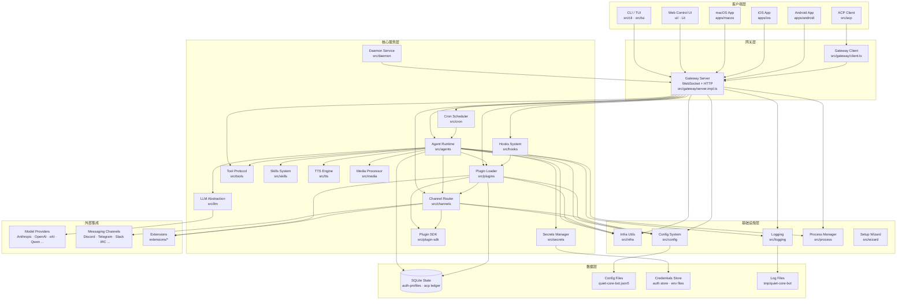

**分层说明**

| 层级       | 角色         | 关键说明                                                                                                           |
| ---------- | ------------ | ------------------------------------------------------------------------------------------------------------------ |
| 客户端层   | 用户交互入口 | CLI/TUI 与 Web UI 共享同一套 Gateway 协议；ACP 客户端通过 `src/acp/server.ts` 桥接到 Gateway                       |
| 网关层     | 协议中枢     | `server.impl.ts` 持有 Agent Runtime、Cron、Plugin 等子系统；`client.ts` 是供 ACP/嵌入式调用方使用的客户端门面      |
| 核心服务层 | 业务能力     | Agent Runtime 是最核心的消费者，几乎依赖所有其它服务模块；Plugin SDK（`src/plugin-sdk`）作为对外契约层隔离内部实现 |
| 基础设施层 | 通用工具     | `infra/`（fetch、ports、env、errors）、`config/`、`logging/`、`process/` 被所有上层模块复用                        |
| 数据层     | 持久化       | SQLite 用于 auth profiles 与 ACP 事件账本；配置以 JSON5 文件为主；日志写入系统临时目录                             |
| 外部集成   | 第三方对接   | 模型提供商通过 `extensions/` 与 `src/plugins` 的 provider 体系接入；消息渠道通过 `src/channels` 插件机制接入       |

### 4.2 模块依赖图

下图聚焦 `src/` 内部模块之间的调用方向（A → B 表示 A 依赖 B）。为保持可读性，基础设施层（`infra`、`config`、`logging`、`process`）作为公共依赖被多个模块引用，仅画出代表性边；`plugin-sdk` 作为对外契约层，被 `plugins` 与 `channels` 同时引用。

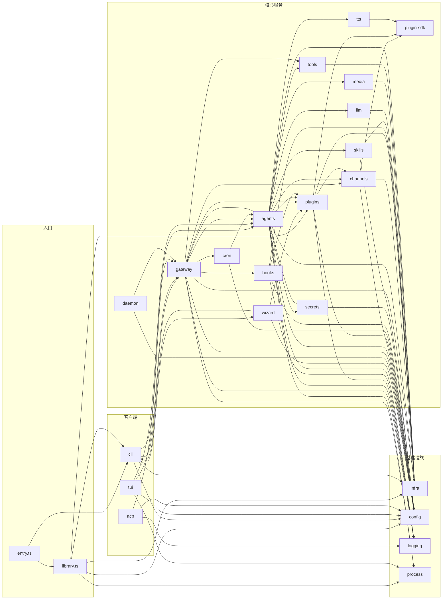

**依赖关系要点**

- **`agents` 是依赖最重的模块**：同时引用 `channels`、`plugins`、`llm`、`skills`、`tools`、`secrets`、`tts`、`media`、`process`、`gateway`，是 Agent 执行回路的中枢。
- **`gateway` 是服务编排者**：`server.impl.ts` 直接调用 `agents`、`channels`、`plugins`、`cron`、`process`、`tools`、`hooks`，并持有插件元数据快照与命令队列。
- **`plugin-sdk` 是契约边界**：`src/plugin-sdk/core.ts` 聚合了 `channels/plugins/types.*`、`plugins/runtime/types`、`routing`、`sessions` 等类型，作为外部插件作者唯一稳定的导入入口（见 `src/channels/AGENTS.md` 边界规则）。
- **`cli/deps.ts` 采用懒加载**：通过 `createLazyRuntimeSurface` 按需加载各渠道发送适配器，避免启动时全量加载。
- **`acp` 是 Gateway 的桥接客户端**：`src/acp/server.ts` 启动 stdio 服务，内部通过 `GatewayClient` 连接本地 Gateway，将 ACP 协议翻译为 Gateway 调用。
- **`daemon` 依赖 `gateway`**：守护进程模块（launchd/systemd/schtasks）负责把 Gateway 注册为系统服务。
- **基础设施层被全局复用**：`infra`（fetch、ports、env、errors、ws）、`config`、`logging`、`process` 几乎被所有上层模块引用，图中只画代表性边以避免噪声。

### 4.3 组件树

下图展示 `ui/` 中基于 Lit 的组件层级。根组件 `QuietCoreApp`（`ui/src/ui/app.ts`）是一个 `LitElement`，通过 `app-render.ts` 渲染不同 Tab 视图，并通过 `controllers/*` 与 Gateway 交互。

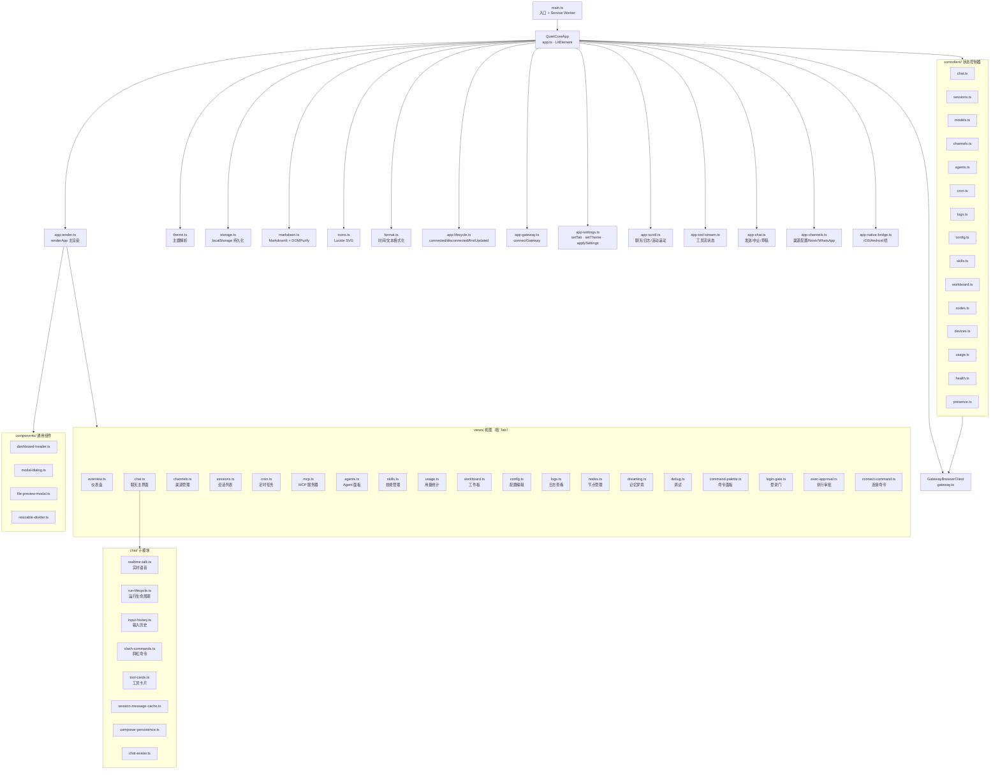

**组件树说明**

- **根组件 `QuietCoreApp`**（`ui/src/ui/app.ts`）继承 `LitElement`，使用 `@state` 装饰器管理视图状态；它将大量行为拆分到 `app-*.ts` 模块（lifecycle、gateway、settings、scroll、chat、channels、render、tool-stream、native-bridge），自身只做组合。
- **`app-render.ts` 是渲染分发器**：根据当前 Tab 调用 `views/*` 中对应的渲染函数（overview、chat、channels、sessions、cron、mcp、agents、skills、usage、workboard、config、logs、nodes、dreaming、debug 等）。
- **`controllers/` 是状态层**：每个控制器（chat、sessions、models、channels、agents、cron、logs、config、skills、workboard、nodes、devices、usage、health、presence）封装对应 Gateway 方法的调用与本地状态，组件通过控制器与 Gateway 交互而非直接 fetch。
- **`gateway.ts` 提供浏览器端 Gateway 客户端**：实现 WebSocket 连接、设备身份签名（`device-identity.ts`）、令牌存储（`device-auth.ts`）、连接错误细节解析（`ConnectErrorDetailCodes`）。
- **`chat/` 子模块** 处理聊天界面细节：实时语音（`realtime-talk.ts` 及 webrtc/google-live/pcm-output 变体）、运行生命周期、输入历史、斜杠命令、工具卡片、会话消息缓存、草稿持久化、头像渲染。
- **`components/` 通用组件**：`modal-dialog`、`file-preview-modal`、`dashboard-header`、`resizable-divider` 被多个视图复用。
- **`main.ts` 负责引导**：加载 `app.ts`、同步 favicon/manifest 等公共资源链接、在生产环境注册 Service Worker（`sw.js`）并在开发环境注销残留 SW。
- **辅助模块**：`theme.ts`（claw/knot/dash/custom 主题 + system/light/dark 模式）、`markdown.ts`（MarkdownIt + highlight.js + DOMPurify 安全渲染）、`storage.ts`（按 Gateway 作用域隔离的 localStorage 设置）、`icons.ts`（内联 Lucide SVG）、`format.ts`（相对时间与时长格式化）。

### 4.4 模块职责说明表

下表汇总 `src/` 核心模块与 `ui/` 关键文件的职责与关键导出。位置均相对于项目根目录 `quiet-core-bot-2026.6.11/`。

#### src/ 核心模块

| 模块名     | 位置              | 职责                                                                                                                                                                                                | 关键导出/文件                                                                                                                                                                                         |
| ---------- | ----------------- | --------------------------------------------------------------------------------------------------------------------------------------------------------------------------------------------------- | ----------------------------------------------------------------------------------------------------------------------------------------------------------------------------------------------------- |
| entry      | `src/entry.ts`    | 进程入口引导：解析 argv、设置进程标题、注册未处理异常钩子、按需 respawn、调用 CLI 主流程                                                                                                            | `runLegacyCliEntry`、`isMainModule` 守卫                                                                                                                                                              |
| library    | `src/library.ts`  | 公共库门面：为嵌入式调用方懒加载 reply runtime、prompt、binaries、exec、web channel 等能力                                                                                                          | `getReplyFromConfig`、`loadConfig`、`promptYesNo`、`runExec`、`monitorWebChannel`、`createDefaultDeps`                                                                                                |
| runtime    | `src/runtime.ts`  | 终端运行时环境抽象：stdout/stderr 写入、JSON 输出、退出处理、Vitest 噪声抑制                                                                                                                        | `defaultRuntime`、`createNonExitingRuntime`、`OutputRuntimeEnv`                                                                                                                                       |
| gateway    | `src/gateway/`    | Gateway 服务器：WebSocket+HTTP 协议端点、客户端门面、设备认证、启动跟踪、BOOT.md 检查                                                                                                               | `server.ts`→`startGatewayServer`、`server.impl.ts`、`client.ts`→`GatewayClient`、`boot.ts`、`auth.ts`、`events.ts`                                                                                    |
| agents     | `src/agents/`     | Agent 运行时：会话上下文、模型选择、上下文窗口缓存、沙箱、超时、PTY、用量统计、Agent 配置目录                                                                                                       | `config.ts`（资产路径）、`context.ts`（上下文窗口）、`context-cache.ts`、`sandbox.ts`、`timeout.ts`、`usage.ts`、`lanes.ts`                                                                           |
| channels   | `src/channels/`   | 渠道抽象：内置渠道 ID/别名、消息收发管线、入站事件分类、出站交付、线程绑定、配对、目录适配、配置写入策略                                                                                            | `ids.ts`→`CHAT_CHANNEL_ORDER`/`CHAT_CHANNEL_ALIASES`、`plugins/types.plugin.ts`、`message/`（收发管线）、`turn/kernel.ts`、`registry.ts`                                                              |
| plugins    | `src/plugins/`    | 插件加载器：发现、清单校验、注册表、激活规划、命令/工具/MCP 绑定、provider 运行时、托管 npm 安装                                                                                                    | `loader.ts`（发现与加载）、`types.ts`、`runtime/types.ts`、`manifest-registry.ts`、`tools.ts`、`status.ts`、`update.ts`                                                                               |
| cli        | `src/cli/`        | CLI 命令：Commander 程序构建、命令注册、argv 解析、端口探测、profile、各种子命令（acp/config/cron/daemon/dns/hooks/logs/mcp/models/nodes/qr/skills/system/tui/update 等）                           | `program/build-program.ts`、`argv.ts`、`ports.ts`、`deps.ts`（默认依赖门面）、`run-main.ts`、`route.ts`                                                                                               |
| tui        | `src/tui/`        | 终端 UI：基于 `@earendil-works/pi-tui` 的交互式循环、命令处理、事件处理、会话动作、本地 shell 运行、提交合并、覆盖层、等待提示                                                                      | `tui.ts`→`runTui`、`commands.ts`、`tui-command-handlers.ts`、`tui-event-handlers.ts`、`tui-submit.ts`、`tui-local-shell.ts`                                                                           |
| config     | `src/config/`     | 配置系统：JSON5 读写、运行时快照、变更通知、会话存储、路径解析、schema、版本、日志配置、talk 配置                                                                                                   | `config.ts`（门面）、`io.ts`、`mutate.ts`、`paths.ts`、`schema.ts`、`sessions/`、`types.quiet-core-bot.ts`                                                                                            |
| cron       | `src/cron/`       | 定时任务调度：CronService 有状态门面、加锁 ops、列表分页、交付、归一化、解析、错峰、运行日志                                                                                                        | `service.ts`→`CronService`、`service/ops.ts`、`schedule.ts`、`delivery.ts`、`normalize.ts`、`parse.ts`                                                                                                |
| daemon     | `src/daemon/`     | 守护进程：跨平台系统服务注册（launchd/systemd/schtasks）、stage/install/restart/stop/uninstall、运行时读取、启动修复                                                                                | `service.ts`（平台注册表）、`launchd.ts`、`systemd.ts`、`schtasks.ts`、`inspect.ts`、`paths.ts`                                                                                                       |
| hooks      | `src/hooks/`      | 钩子系统：内部钩子注册/注销、外部模块动态加载、目录发现（bundled/managed/workspace）、配置过滤、Gmail 钩子、安装与更新                                                                              | `hooks.ts`→`HookHandler`/`createHookEvent`、`loader.ts`、`internal-hooks.ts`、`config.ts`、`install.ts`、`policy.ts`                                                                                  |
| infra      | `src/infra/`      | 基础设施工具：fetch 封装、端口探测、env 归一化、错误格式化、WS 客户端/服务端、SSRF 防护、重试/退避、归档、二进制管理、git 根、tailnet、WSL、Windows 编码                                            | `fetch.ts`、`ports.ts`、`env.ts`、`errors.ts`、`ws.ts`、`net/ssrf.ts`、`backoff.ts`、`retry.ts`、`binaries.ts`、`wsl.ts`                                                                              |
| llm        | `src/llm/`        | LLM 抽象：流式/完成 API、内置 provider 注册、OAuth、环境 API key、类型定义                                                                                                                          | `stream.ts`→`stream`/`complete`/`streamSimple`、`providers/register-builtins.ts`、`oauth.ts`、`types.ts`                                                                                              |
| logging    | `src/logging/`    | 日志系统：基于 tslog 的结构化日志、密钥脱敏、级别控制、子系统日志器、控制台过滤、诊断事件                                                                                                           | `logger.ts`→`Logger`、`redact.ts`、`levels.ts`、`config.ts`、`state.ts`、`subsystem.ts`、`console.ts`                                                                                                 |
| media      | `src/media/`      | 媒体处理：音频 MIME/扩展名归一化、媒体获取、解析、QR 图像、媒体存储                                                                                                                                 | `audio.ts`→`VOICE_MESSAGE_*`、`fetch.ts`、`parse.ts`、`qr-image.ts`、`store.ts`                                                                                                                       |
| secrets    | `src/secrets/`    | 密钥管理：跨配置/认证库/env 文件的迁移计划、应用、审计、共享工具、路径工具、provider env vars                                                                                                       | `apply.ts`、`plan.ts`、`audit.ts`、`shared.ts`、`config-io.ts`、`path-utils.ts`                                                                                                                       |
| skills     | `src/skills/`     | 技能系统：技能契约类型、发现（agent 过滤、bins、聊天命令）、加载（frontmatter、bundled、workspace）、生命周期（安装/解压/clawhub）、运行时（cron 快照、远程、会话快照、工具派发）、安全扫描、工作坊 | `types.ts`→`Skill`/`QuietCoreSkillMetadata`/`SkillInstallSpec`、`discovery/`、`loading/skill-contract.ts`、`lifecycle/install.ts`、`runtime/refresh.ts`、`security/scanner.ts`、`workshop/service.ts` |
| tools      | `src/tools/`      | 工具协议：描述符定义、可用性评估、工具计划构建、协议描述符转换、执行器引用格式化、诊断                                                                                                              | `index.ts`→`buildToolPlan`/`defineToolDescriptor`/`evaluateToolAvailability`/`toToolProtocolDescriptor`、`planner.ts`、`protocol.ts`、`availability.ts`、`types.ts`                                   |
| tts        | `src/tts/`        | 文字转语音：TTS 运行时门面、配置解析、provider 顺序、人格、最大长度、自动模式、合成与流式、电话语音、指令解析                                                                                       | `tts.ts`（barrel）、`tts-core.ts`、`tts-config.ts`、`tts-types.ts`、`directives.ts`                                                                                                                   |
| acp        | `src/acp/`        | Agent Client Protocol：stdio 服务器桥接 ACP 客户端到 Gateway、客户端、命令、策略、翻译器、SQLite 事件账本、类型                                                                                     | `server.ts`→ACP stdio server、`client.ts`、`translator.ts`→`AcpGatewayAgent`、`policy.ts`、`event-ledger.ts`、`types.ts`                                                                              |
| process    | `src/process/`    | 进程管理：子进程执行（execFile/spawn）、超时、中止、进程树杀死、Windows 命令处理、 lanes                                                                                                            | `exec.ts`→`runExec`/`runCommandWithTimeout`、`kill-tree.ts`、`spawn-utils.ts`、`windows-command.ts`、`lanes.ts`                                                                                       |
| wizard     | `src/wizard/`     | 安装向导：onboarding 提示、会话编排、配置生成、迁移导入、安全提示、密钥输入、i18n                                                                                                                   | `setup.ts`、`prompts.ts`→`WizardPrompter`/`WizardCancelledError`、`session.ts`、`setup.migration-import.ts`                                                                                           |
| plugin-sdk | `src/plugin-sdk/` | 插件 SDK：对外稳定契约层，聚合渠道/插件/agent/runtime/媒体/provider/审批/浏览器/memory 等运行时表面，供外部插件与扩展导入                                                                           | `core.ts`（核心契约）、`llm.ts`、`acpx.ts`、`zod.ts`、`channel-contract.ts`、`agent-runtime.ts`、`provider-stream.ts`、`memory-core.ts`、`browser-bridge.ts`                                          |

#### ui/ 关键文件

| 文件      | 位置                     | 职责                                                                                                                                     | 关键导出/内容                                                                                                         |
| --------- | ------------------------ | ---------------------------------------------------------------------------------------------------------------------------------------- | --------------------------------------------------------------------------------------------------------------------- |
| main      | `ui/src/main.ts`         | UI 入口：加载 app、同步公共资源链接、注册/注销 Service Worker                                                                            | `syncDocumentPublicAssetLinks`、SW 注册逻辑                                                                           |
| app       | `ui/src/ui/app.ts`       | 根 LitElement 组件 `QuietCoreApp`：组合 lifecycle/gateway/settings/scroll/chat/channels/render/native-bridge 等模块，管理 `AppViewState` | `QuietCoreApp` 类、`@state` 视图状态                                                                                  |
| app-chat  | `ui/src/ui/app-chat.ts`  | 聊天行为：草稿变更、发送、中止、输入历史、队列重试/steer、附件元数据                                                                     | `handleSendChat`、`handleAbortChat`、`handleChatDraftChange`、`handleChatInputHistoryKey`                             |
| views/mcp | `ui/src/ui/views/mcp.ts` | MCP 视图：渲染 MCP 服务器表格（transport/auth/launch/toolFilter/parallel/TLS）、配置保存/应用                                            | `McpViewProps`、`summarizeServer`                                                                                     |
| gateway   | `ui/src/ui/gateway.ts`   | 浏览器端 Gateway 客户端：WebSocket 连接、设备身份签名、令牌存储、连接错误细节、重试                                                      | `GatewayBrowserClient`、`GatewayRequestError`、`GatewayEventFrame`、`GatewayResponseFrame`、`ConnectErrorDetailCodes` |
| theme     | `ui/src/ui/theme.ts`     | 主题：claw/knot/dash/custom 主题名 + system/light/dark 模式、系统偏好探测、legacy 映射、解析                                             | `ThemeName`、`ThemeMode`、`ResolvedTheme`、`VALID_THEME_NAMES`、`resolveSystemTheme`、`parseThemeSelection`           |
| markdown  | `ui/src/ui/markdown.ts`  | Markdown 渲染：MarkdownIt + highlight.js（多语言注册）+ markdown-it-task-lists + DOMPurify 安全过滤 + 引用控制标记清理                   | `allowedTags` 白名单、渲染函数                                                                                        |
| storage   | `ui/src/ui/storage.ts`   | 本地存储：按 Gateway 作用域隔离的 UI 设置、令牌、用户/助手身份、自定义主题导入、圆角停止点                                               | `settingsKeyForGateway`、`UiSettings`、`BORDER_RADIUS_STOPS`、`parseImportedCustomTheme`                              |
| icons     | `ui/src/ui/icons.ts`     | 图标：内联 Lucide 风格 SVG（messageSquare、barChart、activity、clock 等），使用 currentColor                                             | `icons` 对象                                                                                                          |
| format    | `ui/src/ui/format.ts`    | 格式化：相对时间戳、时长、未知文本、思考标签剥离；复用 `src/infra/format-time`                                                           | `formatRelativeTimestamp`、`formatDurationHuman`、`formatUnknownText`、`stripThinkingTags`                            |

---

**二次开发提示**

1. **扩展 Agent 能力**优先通过 `src/plugin-sdk` 提供的契约，避免直接 import `src/agents` 或 `src/channels` 内部模块（见 `src/channels/AGENTS.md` 与 `src/plugins/AGENTS.md` 的边界规则）。
2. **新增消息渠道**应实现 `src/channels/plugins/types.plugin.ts` 的 `ChannelPlugin` 契约，通过 `src/plugin-sdk/channel-contract.ts` 暴露；热路径（`channel.ts`、`shared.ts`、`gateway.ts`、`outbound.ts`）需保持懒加载。
3. **新增 CLI 子命令**在 `src/cli/program/register.*.ts` 中注册，复杂命令可拆分到 `src/commands/`。
4. **新增 UI 视图**在 `ui/src/ui/views/` 下新增渲染模块并在 `app-render.ts` 的 Tab 分发中接入，状态逻辑放到 `ui/src/ui/controllers/`。
5. **修改 Gateway 协议**需同步 `packages/gateway-protocol`（协议版本、client-info、connect-error-details）与 `ui/src/ui/gateway.ts`（浏览器客户端）。

> 审计对象：`quiet-core-bot-2026.6.11/src/` 全量导出节点、关键私有方法、中间件/AOP、服务/单例/工厂
> 对比基线：`docs/secondary-dev.md` 第 4.4 节（模块职责说明表）与第 5 章（核心功能与业务流程）
> 审计日期：2026-08-03
> 审计方法：Grep 扫描 `export class/function/const/interface/type/enum`、`private async`、`middleware/use/hook`、`class .*Service|Manager|Registry|Factory|Provider|Store` 等模式，逐符号在 secondary-dev.md 中回查覆盖度

### 4.5 补遗：内部节点补遗

#### 模块职责表补遗

下列模块在 `src/` 中实际存在并承载核心逻辑，但第 4.4 节"模块职责说明表"未单列记录（部分仅作为时序图参与者或数据库表被间接提及）。

| 模块                   | 位置                          | 关键导出/文件                                                                                                                                                                                                                                                                | 职责                                                                                                                                                                                                                                                                                                        |
| ---------------------- | ----------------------------- | ---------------------------------------------------------------------------------------------------------------------------------------------------------------------------------------------------------------------------------------------------------------------------- | ----------------------------------------------------------------------------------------------------------------------------------------------------------------------------------------------------------------------------------------------------------------------------------------------------------- |
| auto-reply             | `src/auto-reply/`             | `reply.ts`、`reply/reply-dispatcher.ts`、`reply/queue/`、`reply/session.ts`、`reply/model-selection.ts`、`reply/reply-run-registry.ts`、`reply/route-reply.ts`、`chunk.ts`、`tokens.ts`、`thinking.ts`、`status.ts`、`command-auth.ts`                                       | 回复投递核心子系统：流式回复分块、会话绑定、模型选择、回复队列（enqueue/drain/dedupe）、路由策略、followup 运行、typing 指示、usage token 统计、命令鉴权。是入站消息→回复送达链路的真正实现层（第 5.2.1 时序图仅以"Delivery (auto-reply)"一笔带过）。规模：全目录 564 个文件，其中 `reply/` 子目录约 473 个 |
| tasks                  | `src/tasks/`                  | `task-registry.ts`、`task-registry.store.sqlite.ts`、`task-flow-registry.ts`、`task-executor.ts`、`detached-task-runtime.ts`、`native-subagent-task.ts`、`task-registry.reconcile.ts`、`task-registry.audit.ts`、`task-registry.maintenance.ts`                              | 任务与流程注册表：SQLite 持久化的任务/流程登记、执行器、分离任务运行时、原生 subagent 任务、对账、审计、保留策略、完成契约。规模约 60 个文件，是 cron 之外的另一套调度执行体系                                                                                                                              |
| commitments            | `src/commitments/`            | `store.ts`、`runtime.ts`、`extraction.ts`、`config.ts`、`store-writer.ts`、`model-selection.runtime.ts`                                                                                                                                                                      | 承诺跟踪系统：从对话中提取承诺（extraction + LLM prompt）、排入提取队列（enqueueCommitmentExtraction/drainCommitmentExtractionQueue）、到期触发（listDueCommitments）、状态迁移（markCommitmentsStatus）。对应共享库 `commitments` 表                                                                       |
| bindings               | `src/bindings/`               | `records.ts`                                                                                                                                                                                                                                                                 | 会话绑定记录：createConversationBindingRecord / resolveConversationBindingRecord / listSessionBindingRecords / touchConversationBindingRecord / unbindConversationBindingRecord。对应 `current_conversation_bindings` 表的运行时逻辑                                                                        |
| context-engine         | `src/context-engine/`         | `registry.ts`、`legacy.ts`、`runtime-settings.ts`、`quarantine-health.ts`、`types.ts`                                                                                                                                                                                        | 上下文引擎：ContextEngine 接口注册表、LegacyContextEngine 实现、运行时设置、隔离健康检查。LegacyContextEngine 实现 ContextEngine 契约                                                                                                                                                                       |
| media-understanding    | `src/media-understanding/`    | `runner.ts`、`attachments.cache.ts`→`MediaAttachmentCache`、`provider-registry.ts`、`provider-capability-registry.ts`、`image.ts`、`image-runtime.ts`、`audio-transcription-runner.ts`、`openai-compatible-audio.ts`、`openai-compatible-video.ts`、`apply.ts`、`resolve.ts` | 媒体理解：图片/音频/视频附件的归一化、provider 注册与能力发现、附件缓存（MediaAttachmentCache）、运行器（runner）、Deepgram/OpenAI 兼容音频转写、OpenAI 兼容视频、应用与解析。规模约 67 个文件                                                                                                              |
| transcripts            | `src/transcripts/`            | `store.ts`→`TranscriptsStore`、`provider-registry.ts`、`provider-types.ts`、`summary.ts`、`config.ts`、`manual-source.ts`                                                                                                                                                    | 转写存储：TranscriptsStore、provider 注册表、摘要生成、手动来源、配置                                                                                                                                                                                                                                       |
| plugin-state           | `src/plugin-state/`           | `plugin-state-store.sqlite.ts`、`plugin-state-store.types.ts`、`runtime-health-store.ts`                                                                                                                                                                                     | 插件状态存储：SQLite KV 存储（MAX_PLUGIN_STATE_VALUE_BYTES=65536 / MAX_PLUGIN_STATE_ENTRIES_PER_PLUGIN=50000）、PluginStateStoreError、运行时健康记录信封                                                                                                                                                   |
| model-catalog          | `src/model-catalog/`          | `provider-index/quiet-core-bot-provider-index.ts`→`QUIET_CORE_PROVIDER_INDEX`、`provider-index/types.ts`、`manifest-planner.ts`                                                                                                                                              | 模型目录：Quiet Core bot provider 索引、provider 索引插件安装/认证选择类型、manifest 模型目录抑制条目                                                                                                                                                                                                       |
| image-generation       | `src/image-generation/`       | `runtime.ts`、`types.ts`、`runtime-types.ts`、`openai-compatible-image-provider.ts`、`image-assets.ts`                                                                                                                                                                       | 图像生成：ImageGenerationProvider 契约、运行时 deps、OpenAI 兼容图像 provider（generate/edit）、生成结果资产解析                                                                                                                                                                                            |
| music-generation       | `src/music-generation/`       | `runtime.ts`、`types.ts`、`runtime-types.ts`、`provider-assets.ts`                                                                                                                                                                                                           | 音乐生成：MusicGenerationProvider 契约、generate/edit 模式、能力声明、生成资产候选                                                                                                                                                                                                                          |
| video-generation       | `src/video-generation/`       | `runtime.ts`、`provider-registry.ts`、`types.ts`、`capabilities.ts`、`capability-overlays.ts`、`dashscope-compatible.ts`、`duration-support.ts`、`normalization.ts`                                                                                                          | 视频生成：provider 注册表、能力覆盖、DashScope 兼容、时长支持、归一化                                                                                                                                                                                                                                       |
| web-search             | `src/web-search/`             | `runtime.ts`、`runtime-types.ts`                                                                                                                                                                                                                                             | Web 搜索运行时（受 `lint:web-search-provider-boundaries` 边界约束）                                                                                                                                                                                                                                         |
| web-fetch              | `src/web-fetch/`              | `runtime.ts`、`content-extractors.runtime.ts`                                                                                                                                                                                                                                | Web 抓取运行时与内容提取器（受 `lint:web-fetch-provider-boundaries` 边界约束）                                                                                                                                                                                                                              |
| node-host              | `src/node-host/`              | `with-timeout.ts`                                                                                                                                                                                                                                                            | 节点宿主运行时工具（withTimeout）                                                                                                                                                                                                                                                                           |
| bootstrap              | `src/bootstrap/`              | `node-startup-env.ts`、`node-extra-ca-certs.ts`                                                                                                                                                                                                                              | 进程启动引导：Node 启动 TLS 环境（resolveNodeStartupTlsEnvironment）、Linux 系统 CA bundle 解析、Node 版本管理器运行时识别、自动额外 CA 证书                                                                                                                                                                |
| crestodian             | `src/crestodian/`             | `crestodian.ts`、`tui-backend.ts`、`rescue-policy.ts`、`rescue-message.ts`、`probes.ts`、`dialogue.ts`、`overview.ts`、`operations.ts`、`audit.ts`、`assistant.ts`、`assistant-prompts.ts`、`assistant-backends.ts`                                                          | Crestodian 救援助手：rescue 策略与消息、探针、对话、概览、操作、审计、助手提示与后端、TUI 后端（CrestodianTuiBackend）。环境变量 `QUIET_CORE_LIVE_CRESTODIAN_RESCUE_CHANNEL` 控制实时渠道                                                                                                                   |
| realtime-transcription | `src/realtime-transcription/` | `websocket-session.ts`                                                                                                                                                                                                                                                       | 实时转录 WebSocket 会话：resolveConnection 处理连接建立                                                                                                                                                                                                                                                     |
| interactive            | `src/interactive/`            | `payload.ts`                                                                                                                                                                                                                                                                 | 交互式回复/展示载荷：MessagePresentation / InteractiveReply 类型族、normalizeInteractiveReply、presentationToInteractiveReply、renderMessagePresentationFallbackText                                                                                                                                        |
| mcp                    | `src/mcp/`                    | `channel-bridge.ts`→`QuietCoreChannelBridge`、`channel-server.ts`、`channel-tools.ts`、`channel-shared.ts`、`quiet-core-bot-tools-serve.ts`、`plugin-tools-serve.ts`、`plugin-tools-handlers.ts`、`tools-stdio-server.ts`                                                    | MCP 桥接与服务：QuietCoreChannelBridge（Gateway↔MCP 通道桥）、channel-server（MCP 渠道服务端）、quiet-core-bot-tools-serve（Quiet Core bot 工具暴露为 MCP）、plugin-tools-serve（插件工具 MCP 服务）、stdio 工具服务端                                                                                      |
| security               | `src/security/`               | `audit.ts`、`fix.ts`、`test-temp-cases.ts`→`AsyncTempCaseFactory`                                                                                                                                                                                                            | 安全审计与修复、测试用例工厂                                                                                                                                                                                                                                                                                |
| chat                   | `src/chat/`                   | `canvas-render.ts`、`tool-content.ts`                                                                                                                                                                                                                                        | Canvas 渲染、工具内容呈现                                                                                                                                                                                                                                                                                   |
| compat                 | `src/compat/`                 | `legacy-names.ts`                                                                                                                                                                                                                                                            | 遗留命名兼容                                                                                                                                                                                                                                                                                                |
| i18n                   | `src/i18n/`                   | `registry.test.ts`（registry 实现）                                                                                                                                                                                                                                          | 国际化注册表                                                                                                                                                                                                                                                                                                |
| shared                 | `src/shared/`                 | `regexp.ts`、`lazy-promise.ts`                                                                                                                                                                                                                                               | 跨模块共享工具：正则工具、createLazyPromiseLoader（被中间件系统引用）                                                                                                                                                                                                                                       |
| talk                   | `src/talk/`                   | `logging.ts`、`event-metrics.ts`、`talk-events.ts`                                                                                                                                                                                                                           | 语音会话（Talk）日志、事件指标、Talk 事件                                                                                                                                                                                                                                                                   |
| link-understanding     | `src/link-understanding/`     | `detect.ts`、`runner.ts`、`apply.ts`、`apply.runtime.ts`、`format.ts`、`defaults.ts`                                                                                                                                                                                         | 链接理解：入站消息中的链接检测、抓取运行、结果应用与格式化                                                                                                                                                                                                                                                  |
| media-generation       | `src/media-generation/`       | `runtime-shared.ts`、`live-test-helpers.ts`、`provider-capabilities.contract.test.ts`                                                                                                                                                                                        | 媒体生成共享运行时：图像/音乐/视频生成 provider 的共享能力契约与测试基建                                                                                                                                                                                                                                    |
| memory                 | `src/memory/`                 | `root-memory-files.ts`                                                                                                                                                                                                                                                       | 记忆根文件解析（工作区 memory 目录的根文件处理）                                                                                                                                                                                                                                                            |
| memory-host-sdk        | `src/memory-host-sdk/`        | `dreaming.ts`、`engine-qmd.ts`、`engine-storage.ts`、`events.ts`、`multimodal.ts`、`query.ts`、`secret.ts`、`status.ts`、`host/backend-config.ts`、`host/types.ts`                                                                                                           | 记忆宿主 SDK：梦境（dreaming）、QMD 引擎、存储、事件、多模态、查询、密钥、状态；宿主后端配置与类型（与 `packages/memory-host-sdk` 呼应）                                                                                                                                                                    |
| pairing                | `src/pairing/`                | `pairing-store.ts`、`pairing-challenge.ts`、`setup-code.ts`、`allow-from-store-file.ts`、`pairing-messages.ts`、`pairing-labels.ts`                                                                                                                                          | 配对子系统：配对存储、挑战握手、setup code 生成、allow-from 文件存储、配对消息与标签                                                                                                                                                                                                                        |
| provider-runtime       | `src/provider-runtime/`       | `operation-retry.ts`                                                                                                                                                                                                                                                         | provider 操作重试（provider 调用的操作级重试策略）                                                                                                                                                                                                                                                          |
| proxy-capture          | `src/proxy-capture/`          | `proxy-server.ts`、`ca.ts`、`coverage.ts`、`runtime.ts`、`store.sqlite.ts`、`env.ts`、`paths.ts`                                                                                                                                                                             | 代理抓包：MITM 代理服务器、CA 证书管理、覆盖率、SQLite 存储（对应 `quiet-core-bot proxy` CLI）                                                                                                                                                                                                              |
| routing                | `src/routing/`                | `account-id.ts`、`account-lookup.ts`、`bindings.ts`、`binding-scope.ts`、`channel-route-targets.ts`、`bound-account-read.ts`、`peer-kind-match.ts`、`default-account-warnings.ts`                                                                                            | 路由核心：账户 ID/查找、绑定作用域、渠道路由目标、绑定账户读取、对端类型匹配                                                                                                                                                                                                                                |
| scripts                | `src/scripts/`                | `ci-changed-scope.test.ts`、`control-ui-i18n.test.ts`、`docs-link-audit.test.ts`、`sync-plugin-versions.test.ts`、`test-live-media.test.ts` 等                                                                                                                               | 源码侧脚本：CI 变更范围、Control UI i18n 报告、文档链接审计、插件版本同步、live 媒体测试（被根 `scripts/` 调用的 TS 逻辑载体）                                                                                                                                                                              |
| sessions               | `src/sessions/`               | `classify-session-kind.ts`、`input-provenance.ts`、`model-overrides.ts`、`send-policy.ts`、`session-id-resolution.ts`、`session-chat-type.ts`、`level-overrides.ts`                                                                                                          | 会话策略（独立于 `agents/sessions` 与 `config/sessions`）：会话类型分类、输入来源、模型覆盖、发送策略、会话 ID 解析                                                                                                                                                                                         |
| state                  | `src/state/`                  | `quiet-core-bot-state-schema.sql`、`quiet-core-bot-agent-schema.sql`、`quiet-core-bot-state-db.ts`                                                                                                                                                                           | SQLite 状态层：共享库/Agent 库 DDL、连接管理、schema 版本与迁移（第 6 章数据模型的物理载体）                                                                                                                                                                                                                |
| status                 | `src/status/`                 | `status-message.ts`、`status-plugin-health.ts`、`status-queue.ts`、`status-subagents.ts`、`status-message.runtime.ts`、`fallback-notice-state.ts`、`agent-runtime-label.ts`                                                                                                  | 状态展示：状态消息生成、插件健康、队列/子 agent 状态、回退通知状态、Agent 运行时标签                                                                                                                                                                                                                        |
| test-helpers           | `src/test-helpers/`           | `http.ts`、`ssrf.ts`、`temp-dir.ts`、`state-dir-env.ts`、`workspace.ts`、`windows-cmd-shim.ts`、`network-interfaces.ts`                                                                                                                                                      | 跨模块测试辅助：HTTP/SSRF/临时目录/状态目录环境/工作区/Windows 命令 shim                                                                                                                                                                                                                                    |
| trajectory             | `src/trajectory/`             | `export.ts`、`metadata.ts`、`runtime-file.ts`、`cleanup.ts`、`command-export.ts`、`paths.ts`、`types.ts`                                                                                                                                                                     | 轨迹（trajectory）导出与清理：会话轨迹元数据、运行时文件、命令导出                                                                                                                                                                                                                                          |

---

#### 核心服务/管理类/注册表补遗

下列 `export class` 承载核心运行时职责，但第 4.4 节"关键导出"列未记录（文档仅提到 `CronService`、`GatewayClient` 等少数几个）。

| 类名                        | 位置                                                             | 职责                                                                                                        |
| --------------------------- | ---------------------------------------------------------------- | ----------------------------------------------------------------------------------------------------------- |
| `AcpSessionManager`         | `src/acp/control-plane/manager.core.ts`                          | ACP 会话管理器：runTurn 驱动 ACP 轮次、resolveRuntimeCapabilities/applyRuntimeControls 处理运行时能力与控制 |
| `TranscriptsStore`          | `src/transcripts/store.ts`                                       | 转写存储门面                                                                                                |
| `ExecApprovalManager`       | `src/gateway/exec-approval-manager.ts`                           | 执行审批管理器：承载 `exec.approval.*` RPC 的运行时决策（文档仅在 RPC 清单列出方法，未记录实现类）          |
| `NodeRegistry`              | `src/gateway/node-registry.ts`                                   | 节点注册表：已配对节点的运行时登记与查询                                                                    |
| `MediaAttachmentCache`      | `src/media-understanding/attachments.cache.ts`                   | 媒体附件缓存（resolveLocalPath 解析本地路径）                                                               |
| `ModelRegistry`             | `src/agents/sessions/model-registry.ts`                          | Agent 会话模型注册表                                                                                        |
| `SessionManager`            | `src/agents/sessions/session-manager.ts`                         | Agent 会话管理器（SessionManager）                                                                          |
| `SettingsManager`           | `src/agents/sessions/settings-manager.ts`                        | Agent 会话设置管理器（FileSettingsStorage / InMemorySettingsStorage 后端）                                  |
| `KeybindingsManager`        | `src/agents/sessions/keybindings.ts`                             | 键绑定管理器（继承 TuiKeybindingsManager）                                                                  |
| `DefaultPackageManager`     | `src/agents/sessions/package-manager.ts`                         | 默认包管理器（Agent 会话内 npm 包管理）                                                                     |
| `ExtensionRunner`           | `src/agents/sessions/extensions/runner.ts`                       | Agent 会话扩展运行器                                                                                        |
| `AuthStorage`               | `src/agents/sessions/auth-storage.ts`                            | 认证存储（FileAuthStorageBackend / InMemoryAuthStorageBackend 后端）                                        |
| `AgentSession`              | `src/agents/sessions/agent-session.ts`                           | Agent 会话核心类                                                                                            |
| `AgentSessionRuntime`       | `src/agents/sessions/agent-session-runtime.ts`                   | Agent 会话运行时                                                                                            |
| `DefaultResourceLoader`     | `src/agents/sessions/resource-loader.ts`                         | 默认资源加载器（实现 ResourceLoader）                                                                       |
| `OutputAccumulator`         | `src/agents/sessions/tools/output-accumulator.ts`                | 工具输出累加器                                                                                              |
| `ToolSearchRuntime`         | `src/agents/tool-search.ts`                                      | 工具搜索运行时（动态工具发现）                                                                              |
| `EmbeddedBlockChunker`      | `src/agents/embedded-agent-block-chunker.ts`                     | 嵌入式 Agent 块分块器                                                                                       |
| `TranscriptFileState`       | `src/agents/embedded-agent-runner/transcript-file-state.ts`      | 转写文件状态（resolveCanonicalParentId 解析规范父 ID）                                                      |
| `Theme`                     | `src/agents/modes/interactive/theme/theme.ts`                    | 交互模式主题类                                                                                              |
| `SandboxFsPathGuard`        | `src/agents/sandbox/fs-bridge-path-safety.ts`                    | 沙箱文件系统路径守卫                                                                                        |
| `KeyedAsyncQueue`           | `src/plugin-sdk/keyed-async-queue.ts`                            | 按键异步队列（plugin-sdk 公共契约）                                                                         |
| `PluginLruCache`            | `src/plugins/plugin-cache-primitives.ts`                         | 插件 LRU 缓存原语                                                                                           |
| `PluginLoaderCacheState`    | `src/plugins/loader-cache-state.ts`                              | 插件加载器缓存状态（PluginLoadReentryError 防重入）                                                         |
| `RuntimeCache`              | `src/acp/control-plane/runtime-cache.ts`                         | ACP 运行时缓存                                                                                              |
| `ManagerRuntimeHandleCache` | `src/acp/control-plane/manager.runtime-handle-cache.ts`          | ACP 管理器运行时句柄缓存                                                                                    |
| `SessionActorQueue`         | `src/acp/control-plane/session-actor-queue.ts`                   | ACP 会话 Actor 队列                                                                                         |
| `DirectoryCache`            | `src/infra/outbound/directory-cache.ts`                          | 出站目录缓存                                                                                                |
| `UnauthorizedFloodGuard`    | `src/gateway/server/ws-connection/unauthorized-flood-guard.ts`   | WS 未授权洪水守卫（连接级速率限制）                                                                         |
| `HandshakeAuthLogLimiter`   | `src/gateway/server/ws-connection/handshake-auth-log-limiter.ts` | 握手认证日志限流器                                                                                          |
| `SessionHistorySseState`    | `src/gateway/session-history-state.ts`                           | 会话历史 SSE 状态                                                                                           |

---

#### 中间件 / 拦截器 / AOP 机制

第 5 章调用链未体现下列横切机制，它们是二次开发改造工具调用、消息处理、连接鉴权的关键扩展点。

##### 5.x.1 Agent 工具结果中间件（tool-result-middleware）

- **位置**：`src/agents/harness/tool-result-middleware.ts` → `createAgentToolResultMiddlewareRunner`
- **配套**：`src/plugins/agent-tool-result-middleware.ts`、`agent-tool-result-middleware-types.ts`、`agent-tool-result-middleware-loader.ts`
- **机制**：在工具执行结果返回给模型前，依次运行插件通过 `api.registerAgentToolResultMiddleware(fn, { runtimes: ["quiet-core-bot"|"codex"] })` 注册的中间件链；中间件可重写、阻断（`middlewareError: true`/`blocked by middleware`）或保留结果细节。
- **约束**：仅 bundled 插件可注册；installed 插件需 manifest 显式声明 runtime 契约且配置 `allow: [...]` 显式 opt-in。
- **常量**：`MAX_MIDDLEWARE_CONTENT_BLOCKS=200`、`MAX_MIDDLEWARE_TEXT_CHARS=100_000`、`MAX_MIDDLEWARE_DETAILS_BYTES=100_000` 等。
- **文档现状**：第 5.2.2 Agent 工具调用链时序图未体现该中间件层。

##### 5.x.2 BeforeToolCall 钩子

- **位置**：`src/agents/agent-tools.before-tool-call.ts` → `BeforeToolCallBlockedError`、`isToolWrappedWithBeforeToolCallHook`
- **配套**：`src/agents/agent-tool-definition-adapter.ts`（`beforeHookWrapped` 判定）
- **机制**：工具调用前钩子，可阻断调用并抛 `BeforeToolCallBlockedError`；通过 `isToolWrappedWithBeforeToolCallHook` 判定工具是否已被包装。

##### 5.x.3 beforeMessageWrite 钩子

- **位置**：`src/agents/cli-runner.ts`、`src/agents/command/attempt-execution.ts`（均出现 `beforeMessageWrite: runAgentHarnessBeforeMessageWriteHook`）
- **机制**：harness 写入消息前的钩子，用于在消息持久化前做最终调整。

##### 5.x.4 上下文压缩 before/after 钩子

- **位置**：`src/agents/embedded-agent-runner/compact.ts`（`buildBeforeCompactionHookMetrics`、`beforeHookMetrics`）、`compact.queued.ts`（`afterHookCtx`）
- **机制**：上下文压缩（compaction）前后的钩子，`beforeHook` 携带 `messageCountOriginal` 等指标。

##### 5.x.5 WebSocket 连接中间件链

- **位置**：`src/gateway/server/ws-connection/`
- **组件**：`unauthorized-flood-guard.ts`（`UnauthorizedFloodGuard` 未授权连接速率限制）、`handshake-auth-log-limiter.ts`（`HandshakeAuthLogLimiter` 握手日志限流）、`connect-policy.ts`（连接策略）、`auth-context.ts`（认证上下文）、`auth-messages.ts`（认证消息）、`handshake-auth-helpers.ts`（握手辅助）、`message-handler.ts`（连接后消息处理）
- **文档现状**：第 5 章仅描述 WS/HTTP 监听，未展开连接级中间件链。

##### 5.x.6 回复投递管线钩子

- **位置**：`src/auto-reply/reply/message-preprocess-hooks.ts`（消息预处理钩子）、`src/auto-reply/reply/session-hooks.ts`（会话钩子）、`src/auto-reply/reply/reply-payload-sending-hook.ts`（回复载荷发送钩子）
- **机制**：入站消息预处理、会话生命周期、回复发送前的钩子扩展点。

---

#### 核心私有方法

下列私有方法承载核心算法，但第 5 章核心业务流程未体现其存在与作用。

##### AcpGatewayAgent 事件翻译（`src/acp/translator.ts`）

- `handleGatewayEvent(evt)` — Gateway 事件总入口，按事件类型分发
- `handleAgentEvent(evt)` — Agent 事件翻译为 ACP 事件
- `handleApprovalEvent(params)` / `handleExecApprovalRequestEvent(evt)` / `runApprovalRelay` / `resolveGatewayApproval` — 审批事件中继到 ACP 客户端
- `handleChatEvent(evt)` / `handleDeltaEvent` — 聊天与流式 delta 事件翻译
- `loadSession(params)` — 加载 ACP 会话
- `resolveSessionKeyFromMeta(params)` — 从元数据解析 sessionKey
- `armDisconnectTimer(disconnectContext)` — 装备断连定时器
- `resolveSessionConfigPatch` — 解析会话配置补丁

##### AcpSessionManager 轮次执行（`src/acp/control-plane/manager.core.ts`）

- `runTurn(input)` — ACP 轮次执行入口
- `resolveRuntimeCapabilities(params)` — 解析运行时能力
- `applyRuntimeControls(params)` — 应用运行时控制
- `runtimeOptionCommandServices()` — 运行时选项命令服务

##### QuietCoreChannelBridge MCP 桥接（`src/mcp/channel-bridge.ts`）

- `handleGatewayEvent(event)` — Gateway 事件桥接到 MCP
- `handleSessionMessageEvent(payload)` — 会话消息事件桥接
- `handleClaudePermissionRequest(params)` — Claude 权限请求处理
- `handleHelloOk()` / `resolveReadyOnce()` — 握手就绪处理
- `resolveTrackedApproval(payload)` — 解析追踪的审批

##### EmbeddedTuiBackend 嵌入式 TUI（`src/tui/embedded-backend.ts`）

- `runTurn(params)` — TUI 轮次执行
- `runBtwTurn(params)` — BTW 侧问轮次执行
- `handleAgentEvent(evt)` — Agent 事件处理

##### CrestodianTuiBackend 救援助手（`src/crestodian/tui-backend.ts`）

- `resolveReply(text)` — 救援回复解析

##### ConfigIncludesExpander 配置包含处理（`src/config/includes.ts`）

- `processObject(obj)` / `processInclude(obj)` — 处理对象与 include 指令
- `resolveInclude(value)` / `loadFile(includePath)` / `resolvePath(includePath)` — 解析、加载、定位 include 文件
- `processNested(resolvedPath, parsed)` — 嵌套 include 处理
- **配套错误**：`ConfigIncludeError`、`CircularIncludeError`（循环包含检测）

##### RealtimeTranscriptionWebSocketSession（`src/realtime-transcription/websocket-session.ts`）

- `resolveConnection()` — 实时转录 WebSocket 连接建立

##### MediaAttachmentCache（`src/media-understanding/attachments.cache.ts`）

- `resolveLocalPath(attachment)` — 解析附件本地路径

---

#### 备注

1. 上述遗漏均基于 `src/` 实际 `export` 符号与目录文件扫描，未臆造；符号名、文件路径可在仓库中直接检索复核。
2. `secondary-dev.md` 第 6.2 节虽以数据库表形式提到了 `commitments`、`current_conversation_bindings`、`sandbox_registry_entries`、`exec_approvals_config` 等表，但对应**运行时实现模块/类**（`src/commitments/`、`src/bindings/`、`ExecApprovalManager` 等）在第 4.4 节未记录，存在"有表无模块"的覆盖断层。
3. 第 5.2.1 时序图将 `auto-reply` 作为"Delivery"参与者，但 `src/auto-reply/reply/` 是约 473 个文件的庞大投递子系统（含 queue/session/model-selection/route-reply/followup 等），其内部结构与扩展点未在第 4.4/5 章展开。
4. 建议二次开发前优先补齐 `auto-reply`、`tasks`、`media-understanding`、`mcp`、`agents/harness/tool-result-middleware` 与 `gateway/server/ws-connection/` 的文档，这些是改造消息投递、任务调度、媒体处理、MCP 桥接、工具拦截、连接鉴权的直接切入点。
5. 2026-09-19 结构复核增补：上文表格后半部分（`link-understanding` 起至 `trajectory` 止共 14 行）为二次复核时新增——这些目录在原始审计与正文 3.2 目录树中均未出现，现已补入并同步更新 3.2 目录树与 3.1 顶层概览（`src/` 共 67 个子目录）。

## 5. 核心功能与业务流程

本章基于 Quiet Core bot 源码（`src/entry.ts`、`src/cli/run-main.ts`、`src/gateway/server.impl.ts`、`src/agents/agent-command.ts`、`src/cron/service.ts`、`src/plugins/loader.ts`、`src/tui/tui.ts` 等）梳理出 8 条核心调用链，给出功能列表与关键时序图，帮助二次开发者在改动前建立"入口 → 模块 → 流程"的全景映射。

调用链标注约定：`文件路径` 中出现的函数名为真实符号；`→` 表示同步或异步调用转发；`@gateway` / `@cli` / `@agent` 标注运行域。

### 5.1 核心功能列表

| 功能名          | 触发入口                                                | 涉及模块                                                                                                                                                        | 流程简述                                                                                                                                                                                                                                                                                                                                                                                               |
| --------------- | ------------------------------------------------------- | --------------------------------------------------------------------------------------------------------------------------------------------------------------- | ------------------------------------------------------------------------------------------------------------------------------------------------------------------------------------------------------------------------------------------------------------------------------------------------------------------------------------------------------------------------------------------------------ |
| Onboarding 引导 | `quiet-core-bot onboard` / 裸 `quiet-core-bot` 首次运行 | `src/entry.ts`、`src/cli/run-main.ts`、`src/commands/onboard.ts`、`src/wizard/setup.ts`、`src/commands/configure.daemon.ts`                                     | `entry.ts` 守卫主模块后调用 `runCli`；`run-main.ts` 通过 `shouldStartCrestodianForBareRoot` + `shouldStartOnboardingForFreshInstall` 判定首次安装，再调用 `setupWizardCommand` → `runSetupWizard`，经 `WizardPrompter` 收集 provider/auth/bind 选择，`writeWizardConfigFile` → `replaceConfigFile` 写入配置，最后由 `configure.daemon.ts` 的 `buildGatewayInstallPlan` 安装守护进程。                  |
| Gateway 启动    | `quiet-core-bot gateway run` / `quiet-core-bot gateway` | `src/cli/gateway-cli/run.ts`、`src/gateway/server.ts`、`src/gateway/server.impl.ts`、`src/gateway/boot.ts`                                                      | `run-main.ts` 命中 `isGatewayRunFastPathArgv` 走 `tryRunGatewayRunFastPath` → `runGatewayCommand` 动态 `import("../../gateway/server.js")` 得到 `startGatewayServer`；`server.impl.ts` 依次执行 `loadGatewayStartupConfigSnapshot` → `prepareGatewayStartupConfig`（auth/TLS）→ 加载插件/渠道 → 监听 WS/HTTP；`boot.ts` 的 `runBootOnce` 在工作区存在 `BOOT.md` 时通过 `agentCommand` 跑一次启动检查。 |
| 入站消息处理    | 渠道插件收到消息 / OpenAI 兼容 HTTP / Node 事件         | `src/gateway/server-node-events.ts`、`src/gateway/openai-http.ts`、`src/gateway/openresponses-http.ts`、`src/agents/agent-command.ts`、`src/auto-reply/reply/*` | 渠道或节点事件经 `dispatchNodeAgentCommand`（或 OpenAI/OpenResponses HTTP 适配）调用 `agentCommandFromIngress` → `agentCommandInternal`，完成 session 解析、模型选择、回复投递上下文（`resolveCurrentRunDeliveryContext`）后进入 `runAgentAttempt`。                                                                                                                                                   |
| Agent 执行      | `quiet-core-bot agent --message` / 内部调用             | `src/commands/agent.ts`（barrel）、`src/agents/agent-command.ts`、`src/agents/command/attempt-execution.ts`、`src/agents/sandbox.ts`、`src/tools/index.ts`      | `agentCommand` 是"可信操作者"入口，`agentCommandFromIngress` 是网络入口；二者都进入 `agentCommandInternal` → `prepareAgentCommandExecution` 解析 session/工作区/模型 → `runWithModelFallback` 包裹 `runAgentAttempt`，由后者驱动 LLM 流式响应与工具调用，沙箱由 `agents/sandbox.ts` 提供。                                                                                                             |
| 多渠道路由      | 渠道配置 / 入站消息                                     | `src/channels/ids.ts`、`src/channels/allow-from.ts`、`src/channels/session.ts`、`src/channels/registry.ts`、`src/agents/agent-scope.ts`                         | `normalizeChatChannelId` 归一化渠道；`mergeDmAllowFromSources` / `isSenderIdAllowed` 执行 allowFrom 与配对策略；`recordInboundSession` 写入 session store 并更新最近路由；`resolveSessionAgentId` / `resolveDefaultAgentId` 绑定 Agent。                                                                                                                                                               |
| Cron 调度       | `CronService.start` / 定时器触发                        | `src/cron/service.ts`、`src/cron/service/ops.ts`、`src/cron/service/timer.ts`、`src/cron/schedule.ts`                                                           | `CronService` 门面委托 `service/ops.ts`；`run`/`enqueueRun` → `executeJobCoreWithTimeout` → `executeJobCore` 按 `sessionTarget` 分流到 `executeMainSessionCronJob` 或 `executeDetachedCronJob`，最终调用 `agentCommand`；`armTimer` 基于 `computeJobNextRunAtMs` 重排下一次唤醒。                                                                                                                      |
| TUI 交互        | `quiet-core-bot tui`                                    | `src/tui/tui.ts`、`src/tui/tui-backend.ts`、`src/tui/tui-command-handlers.ts`、`src/tui/tui-event-handlers.ts`                                                  | `runTui` 读取 `getRuntimeConfig`，按 `opts.local`/`opts.backend` 选择本地运行或 Gateway RPC 后端；用户输入经 `createEditorSubmitHandler` 提交，事件处理器把 Agent 事件投影到 `ChatLog`/`CustomEditor` 组件，断线由 `resolveGatewayDisconnectState` 处理。                                                                                                                                              |
| 插件加载        | Gateway/CLI 启动 / `loadQuietCorePlugins`               | `src/plugins/loader.ts`、`src/plugins/discovery.ts`、`src/plugins/manifest-registry.ts`、`src/plugins/api-builder.ts`、`src/plugins/api-facades.ts`             | `loadQuietCorePlugins` 解析 `PluginLoadOptions` → `resolvePluginLoadCacheContext` 命中缓存或新建 → `discoverQuietCorePlugins` 发现候选 → `loadPluginManifestRegistry` 读取 manifest → `createPluginModuleLoader` 加载运行时模块 → `buildPluginApi` + `attachPluginApiFacades` 注入 SDK → `activatePluginRegistry` 注册命令/钩子/渠道。                                                                 |

> 上述 8 条链路在源码中通过 `createLazyImportLoader`、动态 `import()` 与 `startupTrace.measure` 串接，二次开发时建议沿着 `createGatewayStartupTrace` 的 `mark`/`measure` 标注定位耗时阶段。

### 5.2 关键调用链时序图

#### 5.2.1 入站消息全链路

下面绘制一条从用户发送消息到回复送达的完整链路，覆盖渠道插件、Gateway、Agent、Provider、Tool 五个角色。链路对应源码：`src/gateway/server-node-events.ts` 的 `dispatchNodeAgentCommand`、`src/agents/agent-command.ts` 的 `agentCommandFromIngress` / `agentCommandInternal`、`src/agents/command/attempt-execution.ts` 的 `runAgentAttempt`，以及 `src/auto-reply/reply/*` 的投递逻辑。

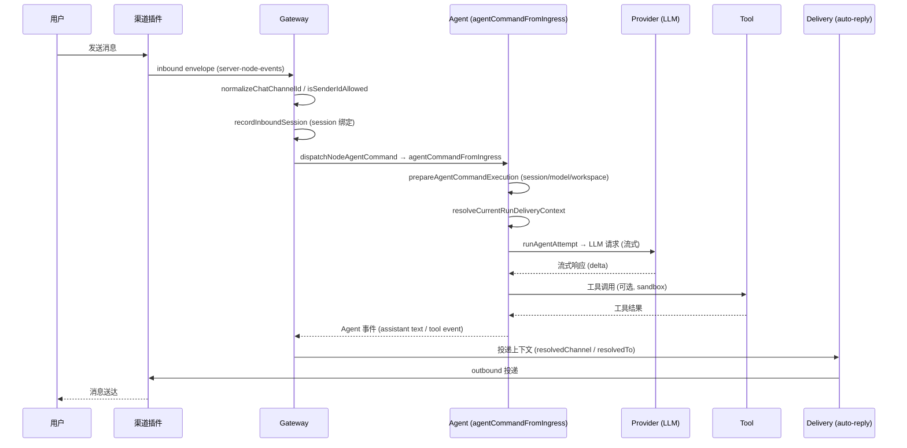

要点说明：

- `agentCommandFromIngress` 与 `agentCommand` 的区别在于 `allowModelOverride` 必须显式设置、`senderIsOwner` 默认 `false`，确保网络入口不能继承可信操作者特权。
- `recordInboundSession`（`src/channels/session.ts`）在写入 session store 的同时调用 `updateLastRoute`，为后续回复投递保留渠道/收件人/线程上下文。
- `resolveCurrentRunDeliveryContext` 会把 `INTERNAL_MESSAGE_CHANNEL` 通过 `resolveMessageChannelSelection` 解析为真实渠道，否则不投递。

#### 5.2.2 Agent 工具调用链

该时序图聚焦 `quiet-core-bot agent --message` 触发的一次 Agent 执行，展示模型回退、尝试（attempt）生命周期、工具执行与结果聚合的细节。对应源码：`src/agents/agent-command.ts` 的 `agentCommand` → `agentCommandInternal` → `runWithModelFallback`，以及 `src/agents/command/attempt-execution.ts` 的 `runAgentAttempt`。

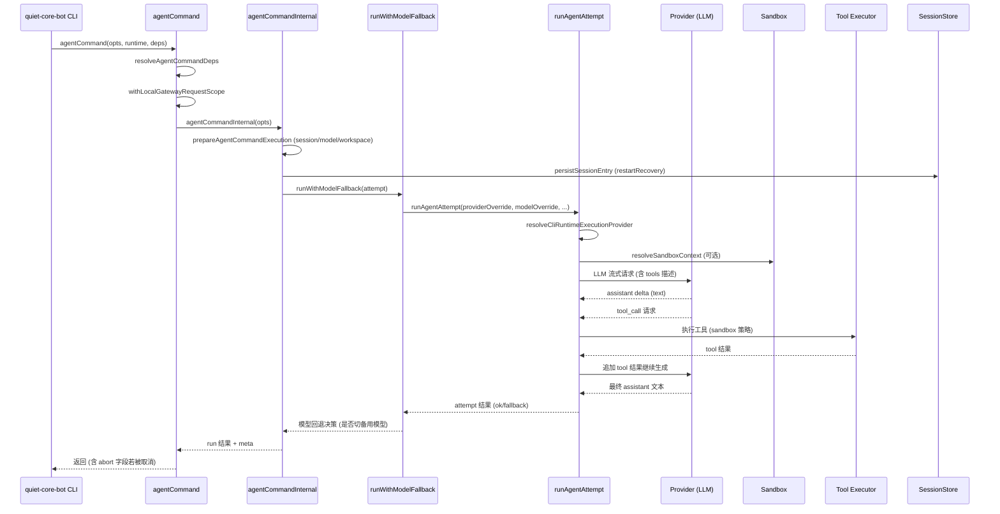

要点说明：

- `runWithModelFallback`（`src/agents/model-fallback.ts`）在 attempt 失败时按 `resolveEffectiveModelFallbacks` 切换 provider/model，`fallbackAttemptIndex` 递增以标记重试。
- `runAgentAttempt` 通过 `resolveAvailableAgentHarnessPolicy` 选择执行器（quiet-core-bot 原生 / claude-cli / codex 等），`isRawModelRun` 走裸模型路径跳过 prompt 注入。
- 工具执行受 `resolveSandboxToolPolicyForAgent`（`src/agents/sandbox.ts`）约束，`isToolAllowed` 决定单次调用是否放行。
- `persistSessionEntry` 在执行前后写入 `restartRecoveryDeliveryContext`，Gateway 重启后可恢复投递。

#### 5.2.3 Gateway 启动与插件加载链

补充绘制 Gateway 启动时配置加载、插件引导、服务器监听的交织顺序，帮助理解"为什么插件钩子在 listen 之前就必须就绪"。对应源码：`src/cli/gateway-cli/run.ts` 的 `runGatewayCommand`、`src/gateway/server.impl.ts` 的 `startGatewayServer`、`src/plugins/loader.ts` 的 `loadQuietCorePlugins`。

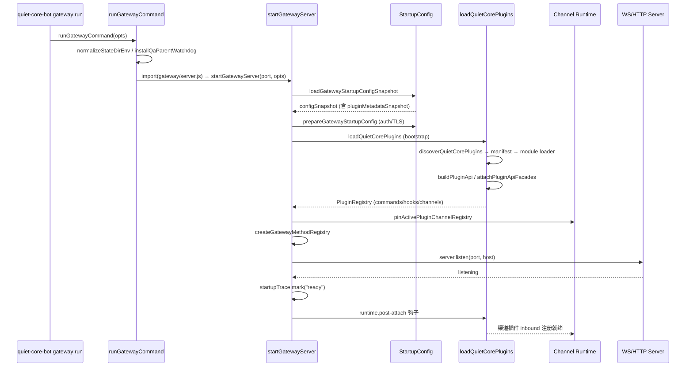

要点说明：

- `runGatewayCommand` 通过 `withProgress` 包裹 `import("../../gateway/server.js")`，把沉重的模块树加载展示为进度条。
- `startGatewayServer` 在 `config.snapshot` → `config.auth` → `plugins.load` → `gateway.ready` 之间用 `startupTrace.measure` 记录耗时，可通过 `QUIET_CORE_GATEWAY_STARTUP_TRACE=1` 查看。
- 插件引导完成后才 `server.listen`，确保入站消息到达时渠道运行时（`pinActivePluginChannelRegistry`）已绑定。
- `boot.ts` 的 `runBootOnce` 在工作区 `BOOT.md` 存在时以独立 `sessionKey`（`agent:<id>:boot`）调用 `agentCommand`，执行后通过 `restoreSessionMapping` 还原原 session 映射。

#### 5.2.4 Cron 调度链

绘制 Cron 作业从定时器触发到 Agent 调用与下一次排程的闭环。对应源码：`src/cron/service.ts`、`src/cron/service/ops.ts`、`src/cron/service/timer.ts`。

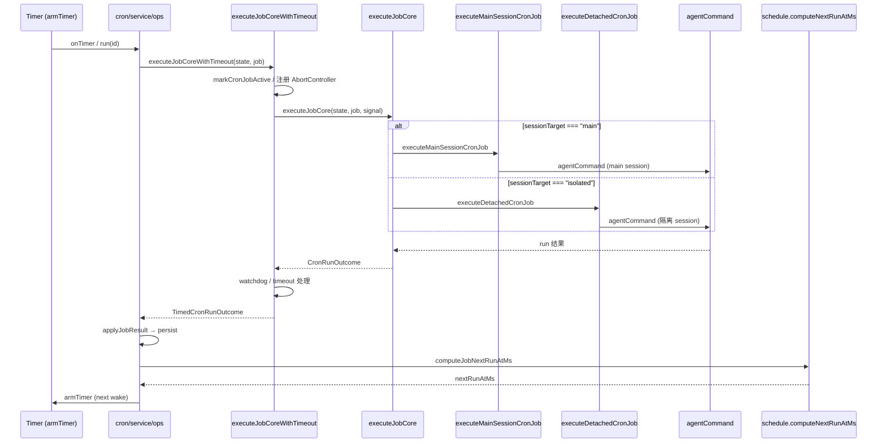

要点说明：

- `executeJobCoreWithTimeout` 用 `Promise.race` 在核心执行、超时、操作者取消之间竞速，`createCronAgentWatchdog` 在隔离 Agent 冷启动时延迟墙钟超时。
- `applyJobResult`（`src/cron/service/timer.ts`）把 outcome 写回 job.state，并经 `failureNotificationDeliveryFromJobState` 触发失败告警投递。
- `armTimer` 以 `MIN_REFIRE_GAP_MS` 兜底，避免 `computeJobNextRunAtMs` 返回值过近导致自旋。

### 5.3 调用链速查

二次开发时按下表快速定位关键符号与文件：

| 调用链       | 入口符号                                               | 文件路径                                                                  |
| ------------ | ------------------------------------------------------ | ------------------------------------------------------------------------- |
| Onboarding   | `setupWizardCommand` / `runSetupWizard`                | `src/commands/onboard.ts` / `src/wizard/setup.ts`                         |
| Gateway 启动 | `runGatewayCommand` / `startGatewayServer`             | `src/cli/gateway-cli/run.ts` / `src/gateway/server.impl.ts`               |
| 入站消息     | `dispatchNodeAgentCommand` / `agentCommandFromIngress` | `src/gateway/server-node-events.ts` / `src/agents/agent-command.ts`       |
| Agent 执行   | `agentCommand` / `runAgentAttempt`                     | `src/agents/agent-command.ts` / `src/agents/command/attempt-execution.ts` |
| 多渠道路由   | `recordInboundSession` / `isSenderIdAllowed`           | `src/channels/session.ts` / `src/channels/allow-from.ts`                  |
| Cron 调度    | `CronService.run` / `executeJobCoreWithTimeout`        | `src/cron/service.ts` / `src/cron/service/timer.ts`                       |
| TUI 交互     | `runTui`                                               | `src/tui/tui.ts`                                                          |
| 插件加载     | `loadQuietCorePlugins`                                 | `src/plugins/loader.ts`                                                   |

> 注：本章所有函数名、文件路径均来自 `quiet-core-bot-2026.6.11` 源码实际符号，未做臆造；如需查看具体实现细节，按上表路径在仓库中检索即可。

### 5.4 补遗：完整 CLI 命令入口清单

> 现有文档第 5.1 节列出 8 条核心调用链，但 CLI 实际注册的命令远不止这些。以下补充 `src/cli/program/command-registry-core.ts` 与 `src/cli/program/register.subclis-core.ts` 中注册的全部命令及其功能归属。

#### 5.4.1 核心命令（Core Commands，`registerCoreCliCommands`）

| 命令                                                       | 注册文件                             | 功能简述                                                            | 文档覆盖             |
| ---------------------------------------------------------- | ------------------------------------ | ------------------------------------------------------------------- | -------------------- |
| `crestodian`                                               | `register.crestodian.ts`             | 资源守护/救援流程（crestodian planner/rescue）                      | ❌ 未覆盖            |
| `setup`                                                    | `register.setup.ts`                  | 写入本地配置与工作区初始化                                          | ✅ 2.6 提及          |
| `onboard`                                                  | `register.onboard.ts`                | 引导式 onboarding（provider/auth/daemon 安装）                      | ✅ 5.1 覆盖          |
| `configure`                                                | `register.configure.ts`              | 重新配置 daemon/gateway/channel                                     | ❌ 未覆盖            |
| `config`                                                   | `config-cli.ts`                      | 读写 `quiet-core-bot.json` 配置键                                   | ❌ 未覆盖            |
| `backup`                                                   | `register.backup.ts`                 | 备份状态库与配置                                                    | ❌ 未覆盖            |
| `migrate`                                                  | `register.migrate.ts`                | 状态迁移（legacy store → SQLite）                                   | ❌ 未覆盖            |
| `doctor` / `dashboard` / `reset` / `uninstall`             | `register.maintenance.ts`            | 诊断/仪表板/重置/卸载                                               | ⚠️ 8.5.1 提及 doctor |
| `message`                                                  | `register.message.ts`                | 消息发送/读取/编辑/删除/reactions/pins/poll/broadcast/discord-admin | ⚠️ 2.6 提及 send     |
| `mcp`                                                      | `mcp-cli.ts`                         | MCP server/client 管理                                              | ❌ 未覆盖            |
| `transcripts`                                              | `register.transcripts.ts`            | 会话转录查看/导出                                                   | ❌ 未覆盖            |
| `agent`                                                    | `register.agent-turn.ts`             | 单轮 agent 调用                                                     | ✅ 5.1 覆盖          |
| `agents`                                                   | `register.agent.ts`                  | Agent 管理（add/list/remove/configure）                             | ❌ 未覆盖            |
| `status` / `health` / `sessions` / `commitments` / `tasks` | `register.status-health-sessions.ts` | 运行态/会话/承诺/任务查询                                           | ❌ 未覆盖            |

#### 5.4.2 子命令（Sub-CLI Commands，`registerSubCliCommands`）

| 命令                        | 注册文件                | 功能简述                                                                                                                                                                                                                                                                  | 文档覆盖        |
| --------------------------- | ----------------------- | ------------------------------------------------------------------------------------------------------------------------------------------------------------------------------------------------------------------------------------------------------------------------- | --------------- |
| `acp`                       | `acp-cli.ts`            | ACP 绑定管理（bind/list/unbind）                                                                                                                                                                                                                                          | ❌ 未覆盖       |
| `gateway`                   | `gateway-cli.ts`        | Gateway run/status/restart/stop/install                                                                                                                                                                                                                                   | ✅ 5.1 覆盖     |
| `daemon`                    | `daemon-cli.ts`         | 守护进程 install/status/restart/stop                                                                                                                                                                                                                                      | ⚠️ 8.5.6 提及   |
| `logs`                      | `logs-cli.ts`           | 日志 follow/no-tail                                                                                                                                                                                                                                                       | ⚠️ 8.5.2 提及   |
| `system`                    | `system-cli.ts`         | 系统信息查询                                                                                                                                                                                                                                                              | ❌ 未覆盖       |
| `models`                    | `models-cli.ts`         | 模型列表/探测                                                                                                                                                                                                                                                             | ❌ 未覆盖       |
| `infer` / `capability`      | `capability-cli.ts`     | 能力推断                                                                                                                                                                                                                                                                  | ❌ 未覆盖       |
| `approvals`                 | `exec-approvals-cli.ts` | 执行审批：`get`（快照）/ `set`（整表替换）/ `allowlist add\|remove` / `pending [--session <key>] [--json]` / `approve <id> [--always]` / `deny <id>`；后三者走网关 RPC `exec.approval.list`/`exec.approval.resolve`（scope `operator.approvals`），`<id>` 支持 8 位短前缀 | ⚠️ 本次新增覆盖 |
| `exec-policy`               | `exec-policy-cli.ts`    | 执行策略配置                                                                                                                                                                                                                                                              | ❌ 未覆盖       |
| `nodes`                     | `nodes-cli.ts`          | 节点管理（pairing/invoke/notify/push/camera/screen/location/status）                                                                                                                                                                                                      | ❌ 未覆盖       |
| `devices`                   | `devices-cli.ts`        | 设备管理（list/approve/revoke/token rotate）                                                                                                                                                                                                                              | ⚠️ 8.5.4 提及   |
| `node`                      | `node-cli.ts`           | 单节点 daemon 管理                                                                                                                                                                                                                                                        | ❌ 未覆盖       |
| `sandbox`                   | `sandbox-cli.ts`        | 沙箱容器管理                                                                                                                                                                                                                                                              | ⚠️ 8.5.5 提及   |
| `tui` / `terminal` / `chat` | `tui-cli.ts`            | TUI 交互界面                                                                                                                                                                                                                                                              | ✅ 5.1 覆盖     |
| `cron`                      | `cron-cli.ts`           | 定时任务 add/edit/list/remove/run                                                                                                                                                                                                                                         | ✅ 5.1 覆盖     |
| `dns`                       | `dns-cli.ts`            | DNS 解析管理                                                                                                                                                                                                                                                              | ❌ 未覆盖       |
| `docs`                      | `docs-cli.ts`           | 文档列表/打开                                                                                                                                                                                                                                                             | ❌ 未覆盖       |
| `qa`                        | `private-qa-cli.ts`     | QA 实验室（内部）                                                                                                                                                                                                                                                         | ❌ 未覆盖       |
| `proxy`                     | `proxy-cli.ts`          | 调试代理与抓包：`start [--host] [--port]`（本地显式调试代理，也是托管出网代理不可达提示所指向的启动命令）、`run`（带抓包子进程）、`validate`（校验受管出网代理）、`coverage`、`sessions`、`query`、`blob`、`purge`                                                        | ❌ 未覆盖       |
| `hooks`                     | `hooks-cli.ts`          | Hook 管理 list/info/enable/disable/check                                                                                                                                                                                                                                  | ❌ 未覆盖       |
| `webhooks`                  | `webhooks-cli.ts`       | Webhook 集成（Gmail Pub/Sub setup/run）                                                                                                                                                                                                                                   | ❌ 未覆盖       |
| `qr`                        | `qr-cli.ts`             | QR 码导入配对                                                                                                                                                                                                                                                             | ❌ 未覆盖       |
| `clawbot`                   | `clawbot-cli.ts`        | ClawBot 管理                                                                                                                                                                                                                                                              | ❌ 未覆盖       |
| `pairing`                   | `pairing-cli.ts`        | 配对审批 qr/approve/list                                                                                                                                                                                                                                                  | ⚠️ 8.5.4 提及   |
| `plugins`                   | `plugins-cli.ts`        | 插件 install/uninstall/update/list/search/inspect/authoring                                                                                                                                                                                                               | ❌ 未覆盖       |
| `channels`                  | `channels-cli.ts`       | 渠道 setup/list/configure                                                                                                                                                                                                                                                 | ❌ 未覆盖       |
| `directory`                 | `directory-cli.ts`      | 目录服务管理                                                                                                                                                                                                                                                              | ❌ 未覆盖       |
| `security`                  | `security-cli.ts`       | 安全审计/修复                                                                                                                                                                                                                                                             | ❌ 未覆盖       |
| `secrets`                   | `secrets-cli.ts`        | 密钥 audit/plan/apply                                                                                                                                                                                                                                                     | ❌ 未覆盖       |
| `skills`                    | `skills-cli.ts`         | 技能 install/list/remove                                                                                                                                                                                                                                                  | ❌ 未覆盖       |
| `update`                    | `update-cli.ts`         | 自更新：`status`（只读，可用）/ `--channel`、`repair`、`finalize`、`wizard`（独立发行版守卫下拒绝，`QUIET_CORE_INDEPENDENT_BUILD=0` 恢复）                                                                                                                                | ⚠️ 2.6 提及     |

> **补充建议**：在 5.1 核心功能列表后增加"5.1.1 完整 CLI 命令矩阵"，将上表纳入，确保二次开发者能快速定位任意命令的注册文件与功能归属。

---

### 5.5 补遗：Gateway HTTP 路由完整清单

> 现有文档 8.5.9 节提及 OpenAI 兼容端点，但未系统列出 Gateway HTTP 服务器（`src/gateway/server-http.ts`）注册的全部路由。以下补充完整路由表。

#### 5.5.1 探针与健康端点

| 路径       | 方法 | 状态映射 | 用途                     |
| ---------- | ---- | -------- | ------------------------ |
| `/health`  | GET  | `live`   | 存活探针（liveness）     |
| `/healthz` | GET  | `live`   | 存活探针（K8s 约定别名） |
| `/ready`   | GET  | `ready`  | 就绪探针（readiness）    |
| `/readyz`  | GET  | `ready`  | 就绪探针（K8s 约定别名） |

> 源码：`src/gateway/server-http.ts` 第 160-163 行 `GATEWAY_PROBE_STATUS_BY_PATH` 映射表。探针在正常网关路由之前处理（`handleProbeEndpoints`）。

#### 5.5.2 OpenAI 兼容 API

| 路径                   | 方法 | 处理模块                | 用途                                                                                    |
| ---------------------- | ---- | ----------------------- | --------------------------------------------------------------------------------------- |
| `/v1/models`           | GET  | `models-http.ts`        | 模型列表（返回 `quiet-core-bot`、`quiet-core-bot/default`、`quiet-core-bot/<agentId>`） |
| `/v1/models/{id}`      | GET  | `models-http.ts`        | 单模型详情                                                                              |
| `/v1/embeddings`       | POST | `embeddings-http.ts`    | 嵌入向量生成                                                                            |
| `/v1/chat/completions` | POST | `openai-http.ts`        | Chat Completions（流式/非流式）                                                         |
| `/v1/responses`        | POST | `openresponses-http.ts` | Responses API（OpenAI 新协议）                                                          |

> 源码：`src/gateway/server-http.ts` 第 205-217 行路径匹配函数 `isOpenAiModelsPath` / `isOpenAiEmbeddingsPath` / `isOpenAiChatCompletionsPath` / `isOpenAiResponsesPath`。`x-quiet-core-bot-model` 头指定后端 provider/model 覆盖。

#### 5.5.3 网关功能 HTTP 端点

| 路径模式                     | 处理模块                          | 用途                                        |
| ---------------------------- | --------------------------------- | ------------------------------------------- |
| `/api/chat/media/outgoing/*` | `managed-image-attachments.ts`    | 出站媒体附件管理                            |
| Control UI 静态资源          | `control-ui.ts`                   | Control UI HTML/JS/CSS（`dist/control-ui`） |
| `/identity/avatar/*`         | `identity-avatar.ts`              | 助手身份头像                                |
| Session kill                 | `session-kill-http.ts`            | 会话终止                                    |
| Tools invoke                 | `tools-invoke-http.ts`            | 工具直接调用（含 cron 回归）                |
| Session history              | `sessions-history-http.ts`        | 会话历史查询                                |
| Hooks HTTP                   | `server/hooks-request-handler.ts` | Hook 触发端点                               |
| MCP HTTP                     | `mcp-http.ts`                     | MCP over HTTP（127.0.0.1 绑定）             |
| 插件 HTTP 路由               | `server/plugins-http.ts`          | 插件注册的 `httpRoutes`（动态）             |

> 插件 HTTP 路由通过 `PluginRegistry.httpRoutes` 动态注册（`src/gateway/server-runtime-state.ts` 第 178/202 行），路径前缀 `/plugins/`，支持 `auth: "plugin"` 或网关认证模式。渠道认证旁路路径由 `resolveBundledChannelGatewayAuthBypassPaths` 解析。

#### 5.5.4 WebSocket 升级

| 路径         | 用途                                         |
| ------------ | -------------------------------------------- |
| `/`（默认）  | Gateway WS 客户端（Control UI / TUI / 节点） |
| 插件 WS 升级 | 插件注册的 `httpUpgradeHandlers`             |

> 源码：`src/gateway/server-http.ts` 第 856 行 `httpServer.on("upgrade", ...)`。WS 升级与 HTTP 路由共享同一服务器实例。

---

### 5.6 补遗：Hook 系统与事件目录

> 现有文档 3.2 节提及 `src/hooks/` 目录，4.4 节提及 Hook 系统职责，但 5.1 核心功能列表未将 Hook 系统作为独立功能链路，5.2 无 Hook 时序图。以下补充。

#### 5.6.1 内部 Hook 事件目录

源码：`src/hooks/internal-hook-types.ts`、`src/hooks/internal-hooks.ts`、`src/hooks/bundled/README.md`。

| 事件类型 (type) | 动作 (action)    | 触发时机               | 上下文关键字段                                                   |
| --------------- | ---------------- | ---------------------- | ---------------------------------------------------------------- |
| `command`       | `new`            | `/new` 命令执行        | `sessionKey`                                                     |
| `command`       | `reset`          | `/reset` 命令执行      | `sessionKey`                                                     |
| `command`       | `stop`           | `/stop` 命令执行       | `sessionKey`                                                     |
| `agent`         | `bootstrap`      | 工作区引导文件注入前   | `workspaceDir`、`bootstrapFiles`、`cfg`、`sessionKey`、`agentId` |
| `gateway`       | `startup`        | Gateway 启动渠道就绪后 | `cfg`、`deps`、`workspaceDir`                                    |
| `session`       | `compact:before` | 会话压缩前快照         | `sessionKey`、压缩前引用                                         |
| `session`       | `compact:after`  | 会话压缩后快照         | `sessionKey`、压缩后引用                                         |
| `session`       | `patch`          | 会话条目变更           | `sessionKey`、patch 参数                                         |
| `message`       | `received`       | 入站消息被接受分发     | `from`、`content`、`channelId`、`conversationId`                 |
| `message`       | `sent`           | 出站消息投递成功       | `to`、`content`、`success`、`channelId`                          |
| `message`       | `transcribed`    | 音频转文字完成         | `transcript`、`mediaPath`、`mediaType`                           |
| `message`       | `preprocessed`   | 消息预处理后           | `bodyForAgent`、`senderName`、`surface`                          |

> 注意：`InternalHookEvent.messages: string[]` 允许 hook 向用户推送消息。

#### 5.6.2 内置 Hook（Bundled Hooks）

源码：`src/hooks/bundled/`。

| Hook 名                 | 监听事件                       | 功能                                          | 输出                                                     |
| ----------------------- | ------------------------------ | --------------------------------------------- | -------------------------------------------------------- |
| `session-memory`        | `command:new`、`command:reset` | 会话结束自动存档到 memory                     | `<workspace>/memory/YYYY-MM-DD-slug.md`（LLM 生成 slug） |
| `bootstrap-extra-files` | `agent:bootstrap`              | 注入额外引导文件（如 `AGENTS.md`/`TOOLS.md`） | 内存上下文修改，无文件写入                               |
| `command-logger`        | `command`（全部）              | 命令审计日志                                  | `~/.quiet-core-bot/logs/commands.log`（JSONL）           |
| `boot-md`               | `gateway:startup`              | 执行工作区 `BOOT.md` 启动检查                 | 由指令决定（可发消息）                                   |
| `compaction-notifier`   | `session:compact:*`            | 会话压缩通知                                  | 通知投递                                                 |

> 启用方式：`quiet-core-bot hooks enable <name>`；配置：`quiet-core-bot.json` 的 `hooks.internal.enabled` + `hooks.internal.entries.<name>.enabled`。Hook 发现优先级：workspace hooks（`<workspace>/hooks/`）> managed hooks（`~/.quiet-core-bot/hooks/`）> bundled hooks。

#### 5.6.3 Hook 加载与触发链路

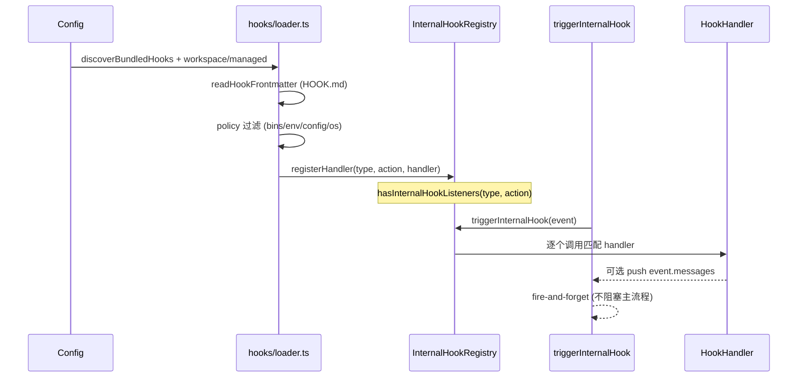

> 源码：`src/hooks/loader.ts`（发现/加载）、`src/hooks/policy.ts`（过滤策略）、`src/hooks/internal-hooks.ts`（`triggerInternalHook`、`hasInternalHookListeners`）、`src/hooks/fire-and-forget.ts`（非阻塞触发）。

---

### 5.7 补遗：Webhook 入口与 Gmail 集成链路

> 现有文档未描述 `webhooks` CLI 命令与 webhook ingress 流程。以下补充。

#### 5.7.1 Webhook 入口点

| 入口                 | 命令/路径                             | 处理模块                                     | 用途                                                 |
| -------------------- | ------------------------------------- | -------------------------------------------- | ---------------------------------------------------- |
| Gmail Pub/Sub setup  | `quiet-core-bot webhooks gmail setup` | `src/hooks/gmail-ops.ts` → `runGmailSetup`   | 配置 Gmail watch + GCP Pub/Sub + Quiet Core bot hook |
| Gmail Pub/Sub run    | `quiet-core-bot webhooks gmail run`   | `src/hooks/gmail-ops.ts` → `runGmailService` | 运行 gog watch serve（接收 Pub/Sub push）            |
| 插件 Webhook ingress | 插件注册 `webhook-ingress`            | `src/plugin-sdk/webhook-ingress`             | 插件自定义 webhook 端点                              |

#### 5.7.2 Gmail Pub/Sub 链路

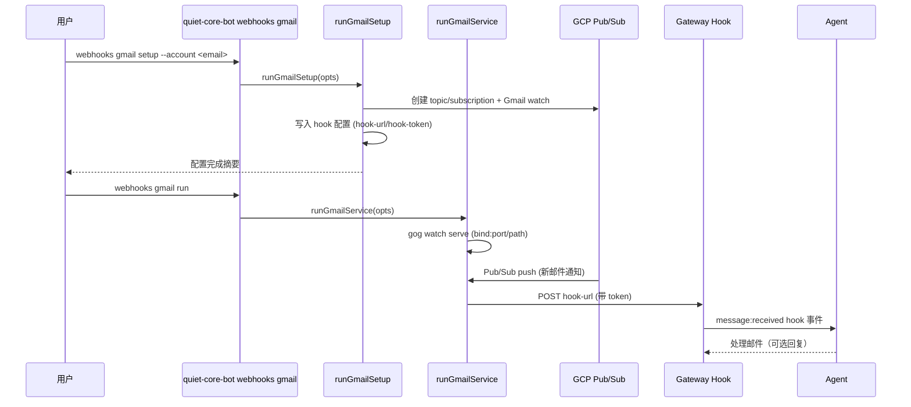

> 关键配置项：`--topic`（默认 `quiet-core-bot-gmail`）、`--subscription`（默认 `quiet-core-bot-gmail-sub`）、`--label`（默认 `INBOX`）、`--bind`/`--port`/`--path`（gog serve 监听）、`--tailscale`（funnel/serve/off 暴露公网）、`--include-body`/`--max-bytes`（正文片段）。源码：`src/hooks/gmail.ts`、`src/hooks/gmail-ops.ts`、`src/hooks/gmail-watcher.ts`。

---

### 5.8 补遗：Onboarding 向导完整时序图

> **关键遗漏**：现有文档 5.2 节有 4 个时序图（入站消息、Agent 工具调用、Gateway 启动、Cron 调度），但 **Onboarding 向导流程缺少时序图**。任务要求覆盖"wizard 步骤 → 配置写入 → channel pairing → doctor 校验"。以下补充。

#### 5.8.1 Onboarding 向导时序图

源码：`src/commands/onboard.ts`、`src/wizard/setup.ts`、`src/wizard/prompts.ts`、`src/wizard/setup.types.ts`、`src/commands/configure.daemon.ts`。

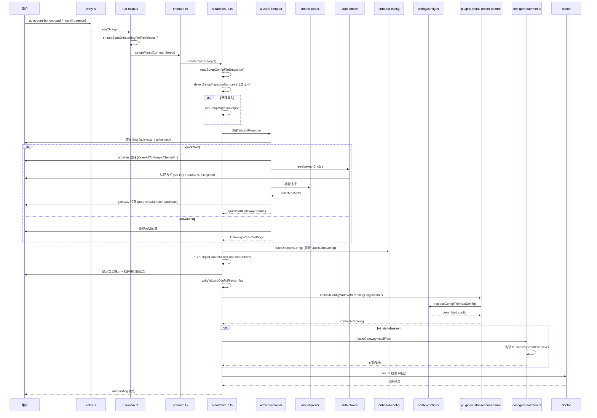

#### 5.8.2 Wizard 流程分支要点

- **flow 选择**：`quickstart`（快速）vs `advanced`（高级），由 `WizardFlow` 类型定义（`src/wizard/setup.types.ts`）。
- **迁移导入**：`detectSetupMigrationSources` 检测已有配置（如 `.quiet-core-bot.json`、环境变量），`runSetupMigrationImport` 导入。
- **provider/auth 选择**：`resolveAuthChoiceModelSelectionPolicy` 解析 provider 与认证方式的组合策略，`resolveManifestProviderAuthChoice` 查插件 manifest 提供的 auth choice。
- **gateway 设置**：`QuickstartGatewayDefaults` 含 `port`、`bind`（loopback/lan/auto/custom/tailnet）、`authMode`、`tailscaleMode`（off/serve/funnel）、`token`/`password`。
- **配置写入**：`writeWizardConfigFile` → `commitConfigWriteWithPendingPluginInstalls` → `replaceConfigFile`，支持 `allowConfigSizeDrop`（迁移时允许丢弃待安装插件记录）。
- **daemon 安装**：`--install-daemon` 触发 `buildGatewayInstallPlan`，按平台安装 launchd/systemd/schtasks。
- **doctor 校验**：onboarding 完成后可选执行 `doctor` 验证配置完整性。
- **取消处理**：`WizardCancelledError`（`src/wizard/prompts.ts` 第 54 行）在用户 Ctrl+C 时抛出，向导优雅退出。

---

### 5.9 补遗：入站消息全链路异步分支补全

> 现有文档 5.2.1 的入站消息时序图覆盖主链路，但遗漏以下异步分支。以下补全。

#### 5.9.1 流式预览（Draft Streaming）分支

源码：`src/channels/draft-stream-loop.ts`、`src/channels/draft-stream-controls.ts`、`src/channels/draft-streaming-chunking.ts`、`src/channels/streaming.ts`。

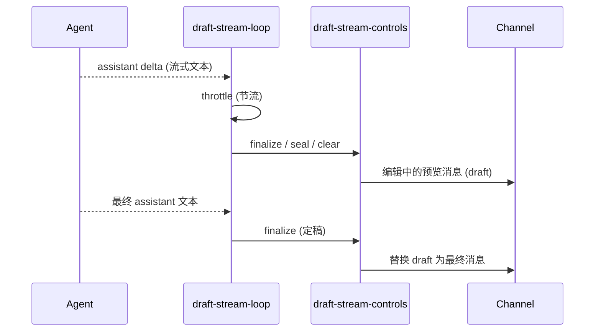

> `createDraftStreamLoop`（`src/channels/draft-stream-loop.ts`）创建节流发送器；`resolveChannelStreamingPreviewChunk`（`src/channels/streaming.ts`）解析流式预览分块；`createStandardDraftLifecycle`（`src/channels/draft-stream-controls.ts` 第 153 行）构建标准 draft 生命周期（finalize/seal/clear）。

#### 5.9.2 执行审批（Exec Approval）分支

源码：`src/channels/plugins/approvals.ts`、`src/channels/plugins/approval-native.types.ts`、`src/cli/exec-approvals-cli.ts`、`src/infra/exec-approvals.ts`。

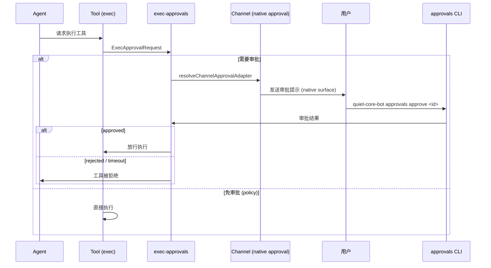

> `ChannelApprovalKind` 支持 `exec` 与 `plugin` 两类审批。`approvalCapability`（`src/channels/plugins/approvals.ts`）由渠道插件声明，`resolveChannelApprovalAdapter` 投影为运行时适配器。审批状态查询：`quiet-core-bot approvals pending [--session <key>]`；批准/拒绝：`quiet-core-bot approvals approve <id> [--always]` 与 `quiet-core-bot approvals deny <id>`（`<id>` 支持 8 位短前缀）。
>
> **无 UI 场景（纯 CLI / 无人值守）**：网关侧 exec 工具登记审批请求后，非 headless 轮次会挂起等待，超时上限 30 分钟（`DEFAULT_EXEC_APPROVAL_TIMEOUT_MS`），超时后按 `askFallback` 收敛（默认 `deny`）。CLI 轮次若在审批仍挂起时结束，`quiet-core-bot agent` 会打印 `Blocked on N pending exec approval(s) for <sessionKey>: <短id>` 与 `List with: quiet-core-bot approvals pending   Resolve with: quiet-core-bot approvals approve <id> | quiet-core-bot approvals deny <id>`，把"静默挂起"变成可操作提示。实现：`src/commands/agent-via-gateway.ts` 的 `reportPendingExecApprovalHint`（对网关 `exec.approval.list` 做 500ms/1.5s/3s 有界重试，避免请求登记晚于轮次结束时漏报；查询失败被吞掉，不影响轮次结果）。挂起期间可直接用 CLI 决策：`quiet-core-bot approvals pending` → `approve <短id>`，审批通过后网关会真正执行该命令并把工具结果写回会话。

#### 5.9.3 入站去抖（Inbound Debounce）分支

源码：`src/channels/inbound-debounce-policy.ts`、`src/auto-reply/inbound-debounce.ts`。

- **策略**：`createChannelInboundDebouncer` 按渠道配置 `debounceMs` 合并连续文本消息，避免快速连续输入触发多次 agent 调用。
- **放行条件**：`isSafeToDebounceInboundText` 判断消息是否安全去抖——**媒体载荷不去抖**（每条携带独立附件，合并会丢数据）。
- **配置**：`debounceMsOverride` 可按渠道覆盖默认去抖时长。

#### 5.9.4 Bot 循环保护（Bot Loop Protection）分支

源码：`src/channels/turn/bot-loop-protection.ts`。

- **目的**：防止 agent 自回复或渠道回环导致无限循环。
- **机制**：`turn/kernel.ts` 在每次 turn 开始前检查 bot-loop 守卫，连续自回复超过阈值时熔断。

#### 5.9.5 会话压缩（Session Compaction）中间件

源码：`src/config/sessions/types.ts`（`SessionCompactionCheckpoint`）、`src/hooks/internal-hooks.ts`（`session.compact:before/after`）。

- **触发原因**：`manual`（手动）、`auto-threshold`（自动阈值）、`overflow-retry`（溢出重试）、`timeout-retry`（超时重试）。
- **上下文预算路由**：`SessionContextBudgetStatusRoute` = `fits` / `compact_only` / `truncate_tool_results_only` / `compact_then_truncate`。
- **Hook 集成**：压缩前后触发 `session:compact:before` / `session:compact:after`，允许 hook 快照转录。

---

### 5.10 补遗：Cron 调度链补全——isolated-agent 子流程

> 现有文档 5.2.4 覆盖 Cron 主链路，但 `sessionTarget === "isolated"` 的子流程（`src/cron/isolated-agent/run.ts`）细节未展开。以下补充。

#### 5.10.1 Isolated Agent 执行子流程

源码：`src/cron/isolated-agent/run.ts`、`src/cron/isolated-agent/run-execution.runtime.ts`、`src/cron/isolated-agent/delivery-dispatch.ts`、`src/cron/isolated-agent/session-cleanup.ts`。

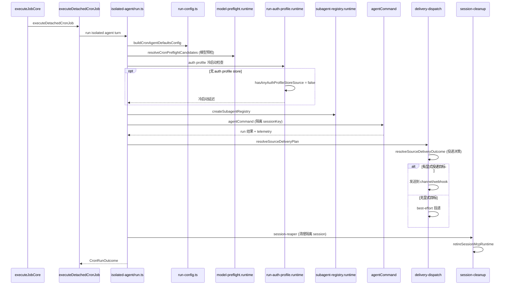

#### 5.10.2 Cron 子流程补充要点

- **模型预检**（`model-preflight.runtime.ts`）：`resolveCronPreflightCandidates` 在实际调用前验证模型可用性，避免冷启动失败。
- **Auth profile 冷启动**（`run-auth-profile.runtime.ts`）：隔离 agent 首次运行时 auth profile store 可能未初始化，`hasAnyAuthProfileStoreSource` 检查决定是否延迟。
- **子 agent 注册表**（`subagent-registry.runtime.ts`）：隔离 session 的子 agent 跟踪与回收。
- **会话收割**（`session-cleanup.ts`、`src/cron/session-reaper.ts`）：隔离 session 执行完成后由 reaper 清理，避免 session store 膨胀。配置项 `cronConfig` 的 session retention 策略控制保留时长。
- **失败告警投递**（`src/cron/service/failure-alerts.ts`）：`failureNotificationDeliveryFromJobState` 读取 `job.state.lastFailureNotificationDeliveryStatus`，按 `failureDestination` 配置发送失败通知，支持去重（`lastFailureAlertAtMs`）。
- **唤醒来源投递**（`src/cron/service/wake-origin.ts`、`wake.ts`）：`CronWakeMode` = `next-heartbeat` / `now`，main-session job 可等待心跳唤醒。
- **任务账本**（`src/cron/service/task-ledger.ts`、`task-runs.ts`）：cron run 结果写入 `task_runs` 表（`runtime`、`task_kind`、`owner_key`、`agent_id`、`run_id`、`status`、`delivery_status`、`terminal_outcome`）。
- **错峰调度**（`src/cron/stagger.ts`）：`staggerMs` 在 cron 表达式基础上加确定性抖动窗口，避免多 job 同时刻触发。
- **重启补偿**（`missedJobStaggerMs`、`maxMissedJobsPerRestart`）：Gateway 重启时检测错过的 job，按 `maxMissedJobsPerRestart` 限制立即执行数量，其余按 `missedJobStaggerMs` 逐步排程（参见 `CronServiceDeps` 第 76-92 行，issue #18892）。

---

### 5.11 补遗：核心状态机

> **关键遗漏**：现有文档全文搜索"状态机"/"state machine"零命中。以下补充四大核心状态机。

#### 5.11.1 Agent Run 终止状态机

源码：`src/agents/agent-run-terminal-outcome.ts`。

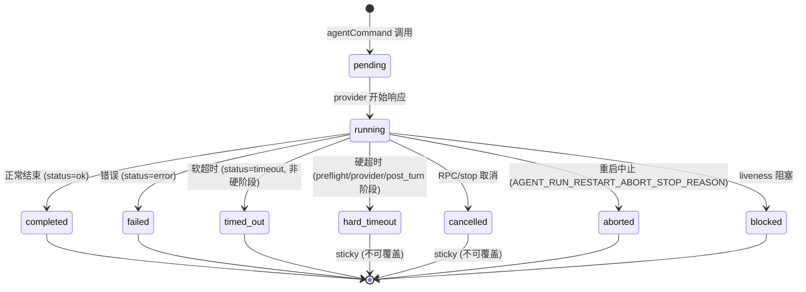

**状态说明**：

- `AgentRunTerminalReason` = `completed` | `hard_timeout` | `timed_out` | `cancelled` | `aborted` | `blocked` | `failed`（第 18-25 行）。
- `AgentRunWaitStatus` = `ok` | `error` | `timeout`（第 15 行）。
- **sticky 状态**：`hard_timeout` 和 `cancelled` 一旦设定不可被后续普通状态覆盖（`isStickyAgentRunTerminalOutcome` 第 81-85 行）。
- **硬超时阶段**：`HARD_TIMEOUT_PHASES` = `preflight` / `provider` / `post_turn`（第 57 行）。
- **取消原因**：`isCancellationStopReason` 匹配 `rpc` 或 `stop`（第 87-89 行）。

#### 5.11.2 Cron Job 状态机

源码：`src/cron/types.ts`、`src/cron/service/state.ts`、`src/cron/service/jobs.ts`、`src/cron/active-jobs.ts`。

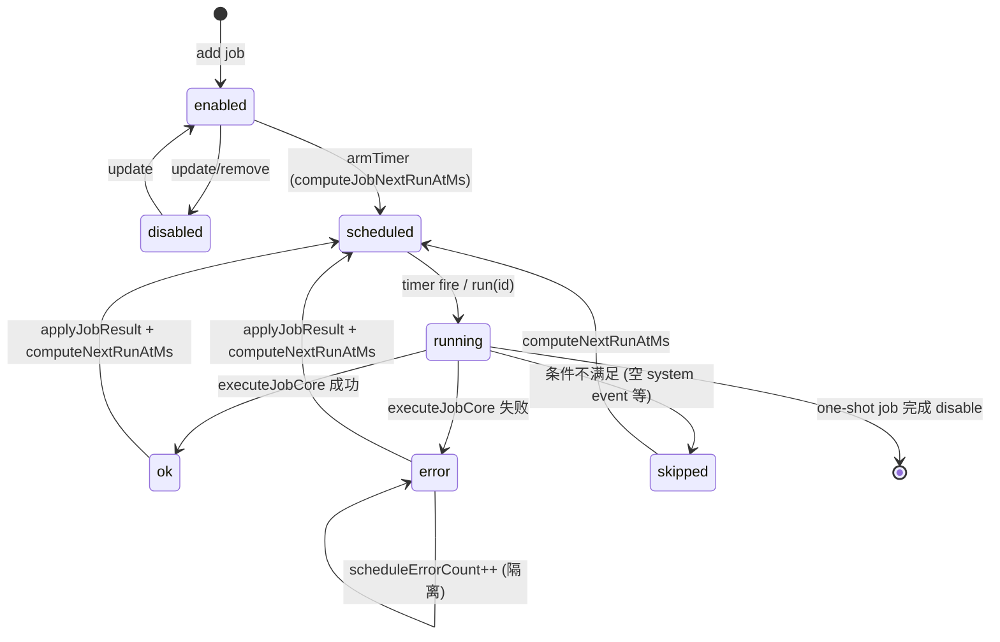

**关键字段**（`cron_jobs` 表 + `job.state`）：

- `lastRunStatus`：`ok` | `error` | `skipped`（`CronRunStatus`，`types.ts` 第 81 行）。
- `lastRunAtMs` / `nextRunAtMs`：上次/下次运行时间戳。
- `lastFailureAlertAtMs`：上次失败告警时间（去重）。
- `lastFailureNotificationDeliveryStatus` / `lastFailureNotificationDelivered` / `lastFailureNotificationDeliveryError`：失败通知投递状态。
- `scheduleErrorCount`：调度错误计数（超阈值告警）。
- `enabled`（`CronJobsEnabledFilter` = `all` | `enabled` | `disabled`，`list-page-types.ts` 第 5 行）。
- **活跃 job 跟踪**：`active-jobs.ts` 用全局单例 `CRON_ACTIVE_JOB_STATE_KEY` 跟踪当前运行中的 job 数量（`getActiveCronJobCountForGeneration`），支持等待空闲（`notifyActiveCronJobWaitersIfEmpty`）。

**投递状态**：`CronDeliveryStatus` = `delivered` | `not-delivered` | `unknown` | `not-requested`（`types.ts` 第 84 行）。

#### 5.11.3 Channel Run-State 状态机

源码：`src/channels/run-state-machine.ts`。

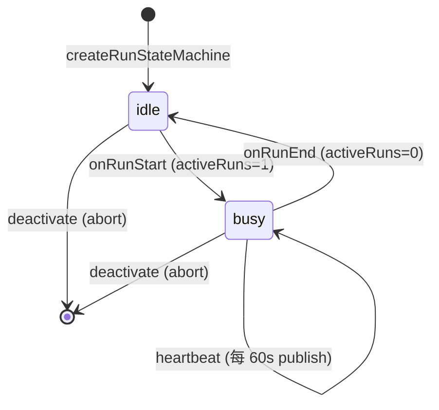

**说明**：

- `DEFAULT_RUN_ACTIVITY_HEARTBEAT_MS = 60_000`（第 18 行）：活跃 run 期间每 60 秒发布心跳。
- `publish()` 输出 `{ activeRuns, busy, lastRunActivityAt }`。
- `lifecycleActive` 在 `abortSignal` 触发时置 false，停止发布。
- 初始化时重置继承自上一进程的状态（`activeRuns: 0, busy: false`）。

#### 5.11.4 Session 生命周期状态机

源码：`src/config/sessions/types.ts`、`src/config/sessions/cleanup-service.ts`、`src/config/sessions/disk-budget.ts`。

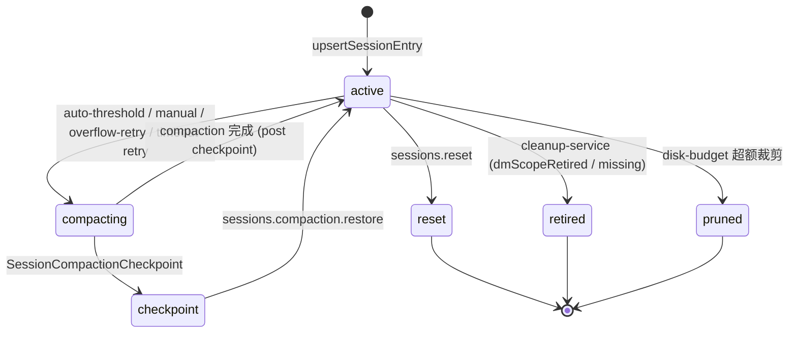

**压缩检查点**（`SessionCompactionCheckpoint`，`types.ts` 第 77-89 行）：

- `reason`：`manual` | `auto-threshold` | `overflow-retry` | `timeout-retry`。
- 含 `preCompaction` / `postCompaction` 转录引用（`sessionId`、`sessionFile`、`leafId`、`entryId`）。
- 支持 `sessions.compaction.list` / `branch` / `restore` RPC。

**上下文预算路由**（`SessionContextBudgetStatusRoute`，第 91-95 行）：

- `fits`：上下文无需处理。
- `compact_only`：仅压缩。
- `truncate_tool_results_only`：仅截断工具结果。
- `compact_then_truncate`：先压缩再截断。

**清理服务**（`cleanup-service.ts`）：

- `SessionEntryLifecycleRemoval` 类型驱动退役/裁剪。
- `applySessionEntryLifecycleMutation` 原子应用移除操作。
- DM scope retired 与 missing removals 分别处理。

**磁盘预算**（`disk-budget.ts`）：

- `measureStoreBytes` 测量 session store 字节数。
- `buildStoreEntryChunkSizeMap` 构建条目分块大小映射。
- 超额时按 `buildSessionIdRefCounts` 引用计数裁剪。

## 6. 数据模型与接口

本章基于 Quiet Core bot 源码中 SQLite schema 定义（`src/state/quiet-core-bot-state-schema.sql`、`src/state/quiet-core-bot-agent-schema.sql`）、Gateway 方法描述符（`src/gateway/methods/core-descriptors.ts`）以及 `package.json` 的 `exports` 字段，梳理系统的数据实体、实体关系、Gateway WebSocket RPC 方法清单与 Plugin SDK 主要导出分类，为二次开发者提供数据落点与接口契约的完整地图。

Quiet Core bot 的持久化以 **SQLite** 为核心，分为两套库：由 Kysely 管理的共享状态库（`state/quiet-core-bot.sqlite`，承载网关级配对、诊断、定时任务、投递队列、ACP 账本、插件状态等）与每个 Agent 独立的 agent 库（`agents/<id>/agent/quiet-core-bot-agent.sqlite`，承载该 Agent 的缓存、认证档案、记忆索引与向量嵌入）。对外接口分两层：**Gateway WebSocket RPC**（客户端与网关交互的统一协议）与 **Plugin SDK**（外部插件作者通过 `quiet-core-bot/plugin-sdk/*` 子路径导入的稳定契约层）。

### 6.1 数据存储概览

| 库         | 文件路径（默认）                                                            | Schema 来源                                                  | 管理工具                                     | 角色                                                                                       |
| ---------- | --------------------------------------------------------------------------- | ------------------------------------------------------------ | -------------------------------------------- | ------------------------------------------------------------------------------------------ |
| 共享状态库 | `~/.quiet-core-bot/quiet-core-bot.sqlite`（`QUIET_CORE_STATE_DIR` 可覆盖）  | `src/state/quiet-core-bot-state-schema.sql`                  | Kysely + `scripts/generate-kysely-types.mjs` | 网关级单例状态：配对、诊断、定时任务、投递队列、ACP 账本、插件 KV、媒体 blob、沙箱注册表等 |
| Agent 库   | `~/.quiet-core-bot/agents/<agentId>/agent/quiet-core-bot-agent.sqlite`      | `src/state/quiet-core-bot-agent-schema.sql`                  | Kysely                                       | 单 Agent 私有状态：缓存、认证档案、记忆索引/分块/嵌入缓存                                  |
| 配置文件   | `~/.quiet-core-bot/quiet-core-bot.json`（`QUIET_CORE_CONFIG_PATH` 可覆盖）  | `src/config/schema.ts`、`src/config/types.quiet-core-bot.ts` | JSON5 读写 + 热重载                          | 运行时配置快照（agents/channels/gateway/auth/bindings/plugins 等）                         |
| 凭据存储   | `~/.quiet-core-bot/credentials/`、`~/.quiet-core-bot-auth-profile-secrets/` | `src/secrets/`、`src/agents/auth-profiles/`                  | SecretRef + auth profile store               | API key、APNs `.p8`、设备身份密钥                                                          |

两套 SQLite 库均通过 Kysely（`kysely@0.29.2`）声明表结构与行类型，并由 `scripts/generate-kysely-types.mjs` 生成类型基线（`pnpm db:kysely:gen` / `pnpm db:kysely:check` 守卫）。架构守卫脚本 `pnpm check:database-first-legacy-stores` 与 `pnpm lint:kysely` 强制所有持久化走 Kysely 优先路径，禁止遗留 store 绕过 schema。

### 6.2 共享状态库（quiet-core-bot.sqlite）数据实体

共享状态库共定义 50+ 张表，按业务域分组如下。所有表均带 `updated_at`/`created_at` 时间戳字段；JSON 字段统一以 `*_json` 后缀存储序列化文本。

#### 6.2.1 认证与配对域

| 表名                            | 主键                                    | 关键字段                                                                                                 | 用途                             |
| ------------------------------- | --------------------------------------- | -------------------------------------------------------------------------------------------------------- | -------------------------------- |
| `auth_profile_stores`           | `store_key`                             | `store_json`、`updated_at`                                                                               | 认证档案存储快照（共享库侧镜像） |
| `auth_profile_state`            | `store_key`                             | `state_json`、`updated_at`                                                                               | 认证档案运行时状态               |
| `device_pairing_pending`        | `request_id`                            | `device_id`、`public_key`、`platform`、`role`、`scopes_json`、`ts`                                       | 待审批的设备配对请求             |
| `device_pairing_paired`         | `device_id`                             | `public_key`、`display_name`、`approved_scopes_json`、`tokens_json`、`approved_at_ms`、`last_seen_at_ms` | 已配对设备登记                   |
| `device_bootstrap_tokens`       | `token_key`                             | `token`、`device_id`、`public_key`、`profile_json`、`redeemed_profile_json`                              | 设备引导令牌（一次性）           |
| `device_identities`             | `identity_key`                          | `device_id`、`public_key_pem`、`private_key_pem`                                                         | 设备身份密钥对                   |
| `device_auth_tokens`            | `(device_id, role)`                     | `token`、`scopes_json`、`updated_at_ms`                                                                  | 设备认证令牌（按角色）           |
| `node_pairing_pending`          | `request_id`                            | `node_id`、`platform`、`version`、`caps_json`、`commands_json`、`permissions_json`                       | 待审批的节点配对请求             |
| `node_pairing_paired`           | `node_id`                               | `token`、`display_name`、`caps_json`、`bins_json`、`last_connected_at_ms`                                | 已配对节点登记                   |
| `node_host_config`              | `config_key`                            | `node_id`、`token`、`gateway_host`、`gateway_port`、`gateway_tls`、`gateway_tls_fingerprint`             | 节点宿主配置                     |
| `channel_pairing_requests`      | `(channel_key, account_id, request_id)` | `code`、`created_at`、`meta_json`                                                                        | 渠道配对请求                     |
| `channel_pairing_allow_entries` | `(channel_key, account_id, entry)`      | `sort_order`、`updated_at`                                                                               | 渠道配对允许清单                 |
| `plugin_binding_approvals`      | `(plugin_root, channel, account_id)`    | `plugin_id`、`plugin_name`、`approved_at`                                                                | 插件绑定审批记录                 |

#### 6.2.2 诊断与稳定性域

| 表名                           | 主键                 | 关键字段                                                                                       | 用途                       |
| ------------------------------ | -------------------- | ---------------------------------------------------------------------------------------------- | -------------------------- |
| `diagnostic_events`            | `(scope, event_key)` | `payload_json`、`created_at`                                                                   | 诊断事件流                 |
| `diagnostic_stability_bundles` | `bundle_key`         | `reason`、`generated_at`、`bundle_json`、`created_at`                                          | 稳定性诊断打包快照         |
| `config_health_entries`        | `config_path`        | `last_known_good_json`、`last_promoted_good_json`、`last_observed_suspicious_signature`        | 配置健康检查点             |
| `update_check_state`           | `state_key`          | `last_checked_at`、`last_available_version`、`auto_last_success_version`                       | 版本更新检查状态           |
| `installed_plugin_index`       | `index_key`          | `version`、`host_contract_version`、`install_records_json`、`plugins_json`、`diagnostics_json` | 已安装插件索引快照         |
| `gateway_restart_sentinel`     | `sentinel_key`       | `kind`、`status`、`session_key`、`delivery_channel`、`payload_json`                            | 网关重启哨兵（跨重启续跑） |
| `gateway_restart_intent`       | `intent_key`         | `kind`、`pid`、`reason`、`force`、`wait_ms`                                                    | 网关重启意图               |
| `gateway_restart_handoff`      | `handoff_key`        | `intent_id`、`pid`、`expires_at`、`supervisor_mode`                                            | 网关重启交接               |

#### 6.2.3 调度与运行域

| 表名                            | 主键                       | 关键字段                                                                                                                                                                  | 用途                     |
| ------------------------------- | -------------------------- | ------------------------------------------------------------------------------------------------------------------------------------------------------------------------- | ------------------------ |
| `cron_jobs`                     | `(store_key, job_id)`      | `name`、`schedule_kind`、`schedule_expr`、`schedule_tz`、`every_ms`、`payload_message`、`delivery_channel`、`next_run_at_ms`、`last_run_status`、`job_json`、`state_json` | 定时任务定义与运行时状态 |
| `cron_run_logs`                 | `(store_key, job_id, seq)` | `ts`、`status`、`error`、`delivery_status`、`run_id`、`duration_ms`、`total_tokens`、`entry_json`                                                                         | 定时任务运行日志         |
| `task_runs`                     | `task_id`                  | `runtime`、`task_kind`、`owner_key`、`agent_id`、`run_id`、`status`、`delivery_status`、`terminal_outcome`                                                                | 任务运行记录             |
| `task_delivery_state`           | `task_id`                  | `requester_origin_json`、`last_notified_event_at`（FK→`task_runs`）                                                                                                       | 任务投递状态             |
| `subagent_runs`                 | `run_id`                   | `child_session_key`、`requester_session_key`、`task`、`spawn_mode`、`outcome_json`、`ended_reason`                                                                        | 子 Agent 运行记录        |
| `flow_runs`                     | `flow_id`                  | `shape`、`owner_key`、`status`、`goal`、`current_step`、`blocked_task_id`、`state_json`                                                                                   | 流程运行记录             |
| `commitments`                   | `id`                       | `agent_id`、`session_key`、`channel`、`kind`、`sensitivity`、`status`、`due_earliest_ms`、`due_latest_ms`、`dedupe_key`                                                   | 承诺跟踪（定时提醒）     |
| `current_conversation_bindings` | `binding_key`              | `target_agent_id`、`target_session_key`、`channel`、`account_id`、`conversation_id`、`expires_at`                                                                         | 当前会话绑定（渠道路由） |
| `tui_last_sessions`             | `scope_key`                | `session_key`、`updated_at`                                                                                                                                               | TUI 最近会话记忆         |

#### 6.2.4 投递与入站域

| 表名                             | 主键                     | 关键字段                                                                                                    | 用途                            |
| -------------------------------- | ------------------------ | ----------------------------------------------------------------------------------------------------------- | ------------------------------- |
| `channel_ingress_events`         | `(queue_name, event_id)` | `channel_id`、`account_id`、`status`、`lane_key`、`payload_json`、`claim_token`、`attempts`、`completed_at` | 渠道入站事件队列（含认领/重试） |
| `delivery_queue_entries`         | `(queue_name, id)`       | `status`、`session_key`、`channel`、`target`、`retry_count`、`recovery_state`、`entry_json`                 | 出站投递队列                    |
| `command_log_entries`            | `id`                     | `timestamp_ms`、`action`、`session_key`、`sender_id`、`source`、`entry_json`                                | 命令日志                        |
| `managed_outgoing_image_records` | `attachment_id`          | `session_key`、`message_id`、`original_media_id`、`retention_class`、`record_json`                          | 托管出站图片记录                |

#### 6.2.5 ACP 与会话回放域

| 表名                  | 主键                | 关键字段                                                                                      | 用途           |
| --------------------- | ------------------- | --------------------------------------------------------------------------------------------- | -------------- |
| `acp_sessions`        | `session_key`       | `session_id`、`backend`、`agent`、`runtime_session_name`、`mode`、`state`、`last_activity_at` | ACP 会话登记   |
| `acp_replay_sessions` | `session_id`        | `session_key`、`cwd`、`complete`、`next_seq`                                                  | ACP 回放会话   |
| `acp_replay_events`   | `(session_id, seq)` | `at`、`session_key`、`run_id`、`update_json`（FK→`acp_replay_sessions`）                      | ACP 回放事件流 |

#### 6.2.6 插件状态、媒体与沙箱域

| 表名                       | 主键                                | 关键字段                                                                                                                         | 用途             |
| -------------------------- | ----------------------------------- | -------------------------------------------------------------------------------------------------------------------------------- | ---------------- |
| `plugin_state_entries`     | `(plugin_id, namespace, entry_key)` | `value_json`、`created_at`、`expires_at`                                                                                         | 插件 KV 状态     |
| `plugin_blob_entries`      | `(plugin_id, namespace, entry_key)` | `metadata_json`、`blob`、`expires_at`                                                                                            | 插件二进制 blob  |
| `media_blobs`              | `(subdir, id)`                      | `content_type`、`size_bytes`、`blob`、`created_at`                                                                               | 媒体 blob 存储   |
| `skill_uploads`            | `upload_id`                         | `kind`、`slug`、`sha256`、`archive_blob`、`committed`、`idempotency_key_hash`                                                    | 技能上传分片归档 |
| `sandbox_registry_entries` | `(registry_kind, container_name)`   | `session_key`、`backend_id`、`image`、`cdp_port`、`no_vnc_port`、`entry_json`                                                    | 沙箱容器注册表   |
| `capture_sessions`         | `id`                                | `started_at`、`ended_at`、`mode`、`source_scope`、`proxy_url`                                                                    | 抓包会话         |
| `capture_blobs`            | `blob_id`                           | `content_type`、`encoding`、`sha256`、`data`                                                                                     | 抓包二进制       |
| `capture_events`           | `id`                                | `session_id`、`ts`、`protocol`、`direction`、`method`、`host`、`status`、`data_blob_id`（FK→`capture_sessions`/`capture_blobs`） | 抓包事件         |

#### 6.2.7 模型、推送与杂项域

| 表名                                   | 主键                      | 关键字段                                                                                                            | 用途               |
| -------------------------------------- | ------------------------- | ------------------------------------------------------------------------------------------------------------------- | ------------------ |
| `model_capability_cache`               | `(provider_id, model_id)` | `name`、`input_text`、`input_image`、`reasoning`、`supports_tools`、`context_window`、`cost_input`、`cost_output`   | 模型能力缓存       |
| `agent_model_catalogs`                 | `catalog_key`             | `agent_dir`、`raw_json`、`updated_at`                                                                               | Agent 模型目录     |
| `web_push_subscriptions`               | `endpoint_hash`           | `subscription_id`、`endpoint`、`p256dh`、`auth`                                                                     | Web Push 订阅      |
| `web_push_vapid_keys`                  | `key_id`                  | `public_key`、`private_key`、`subject`                                                                              | VAPID 密钥         |
| `apns_registrations`                   | `node_id`                 | `transport`、`token`、`relay_handle`、`send_grant`、`topic`、`environment`                                          | APNs 注册          |
| `voicewake_triggers`                   | `(config_key, position)`  | `trigger`、`updated_at_ms`                                                                                          | 语音唤醒触发词     |
| `voicewake_routing_config`             | `config_key`              | `default_target_mode`、`default_target_agent_id`、`default_target_session_key`                                      | 语音唤醒路由配置   |
| `voicewake_routing_routes`             | `(config_key, position)`  | `trigger`、`target_mode`、`target_agent_id`（FK→`voicewake_routing_config`）                                        | 语音唤醒路由规则   |
| `exec_approvals_config`                | `config_key`              | `raw_json`、`socket_path`、`default_security`、`default_ask`、`auto_allow_skills`、`agent_count`、`allowlist_count` | 执行审批配置       |
| `state_leases`                         | `(scope, lease_key)`      | `owner`、`expires_at`、`heartbeat_at`、`payload_json`                                                               | 状态租约           |
| `workspace_setup_state`                | `workspace_key`           | `workspace_path`、`version`、`bootstrap_seeded_at`、`setup_completed_at`                                            | 工作区初始化状态   |
| `migration_runs`                       | `id`                      | `started_at`、`finished_at`、`status`、`report_json`                                                                | 数据迁移运行       |
| `migration_sources`                    | `source_key`              | `migration_kind`、`source_path`、`target_table`、`last_run_id`（FK→`migration_runs`）、`status`                     | 数据迁移来源       |
| `backup_runs`                          | `id`                      | `created_at`、`archive_path`、`status`、`manifest_json`                                                             | 备份运行           |
| `schema_meta`                          | `meta_key`                | `role`、`schema_version`、`agent_id`、`app_version`                                                                 | Schema 版本元数据  |
| `agent_databases`                      | `(agent_id, path)`        | `schema_version`、`last_seen_at`、`size_bytes`                                                                      | Agent 库注册表     |
| `android_notification_recent_packages` | `package_name`            | `sort_order`、`updated_at_ms`                                                                                       | 安卓通知最近包     |
| `macos_port_guardian_records`          | `pid`                     | `port`、`command`、`mode`、`timestamp`                                                                              | macOS 端口守护记录 |
| `native_hook_relay_bridges`            | `relay_id`                | `pid`、`hostname`、`port`、`token`、`expires_at_ms`                                                                 | 原生钩子中继桥     |

### 6.3 Agent 库（quiet-core-bot-agent.sqlite）数据实体

Agent 库结构精简，聚焦单 Agent 的缓存、认证与记忆索引。schema 通过触发器维护 `memory_index_state.revision` 单调递增，供记忆系统判断索引变更。

| 表名                     | 主键                                    | 关键字段                                                                                       | 用途                                       |
| ------------------------ | --------------------------------------- | ---------------------------------------------------------------------------------------------- | ------------------------------------------ |
| `schema_meta`            | `meta_key`                              | `role`、`schema_version`、`agent_id`、`app_version`                                            | Agent 库 schema 版本                       |
| `cache_entries`          | `(scope, key)`                          | `value_json`、`blob`、`expires_at`、`updated_at`                                               | Agent 通用缓存（含过期与 BLOB）            |
| `auth_profile_store`     | `store_key`                             | `store_json`、`updated_at`                                                                     | Agent 私有认证档案存储                     |
| `auth_profile_state`     | `state_key`                             | `state_json`、`updated_at`                                                                     | Agent 私有认证档案状态                     |
| `memory_index_meta`      | `key`                                   | `value`                                                                                        | 记忆索引元信息                             |
| `memory_index_sources`   | `(path, source)`                        | `hash`、`mtime`、`size`                                                                        | 记忆索引源文件登记（source 默认 `memory`） |
| `memory_index_chunks`    | `id`                                    | `path`、`source`、`start_line`、`end_line`、`hash`、`model`、`text`、`embedding`、`updated_at` | 记忆分块与向量嵌入                         |
| `memory_embedding_cache` | `(provider, model, provider_key, hash)` | `embedding`、`dims`、`updated_at`                                                              | 嵌入向量缓存（避免重复计算）               |
| `memory_index_state`     | `id`（固定为 1）                        | `revision`                                                                                     | 记忆索引修订号（由触发器维护）             |

**触发器**：`memory_index_sources` 与 `memory_index_chunks` 的 `INSERT/UPDATE/DELETE` 各有 3 个 `AFTER` 触发器，均执行 `UPDATE memory_index_state SET revision = revision + 1 WHERE id = 1`，确保任何索引变更都能被消费者通过比较 `revision` 检测。

### 6.4 实体关系图

下图聚焦共享状态库中存在外键约束与业务关联的核心实体。绝大多数表为独立实体（无外键），其关联通过 `session_key`、`agent_id`、`run_id`、`channel` 等逻辑键在应用层维护；图中仅画出 schema 层显式声明的外键关系与关键业务归属。

```mermaid
erDiagram
    voicewake_routing_config ||--o{ voicewake_routing_routes : "config_key"
    acp_replay_sessions ||--o{ acp_replay_events : "session_id"
    capture_sessions ||--o{ capture_events : "session_id"
    capture_blobs ||--o{ capture_events : "data_blob_id"
    task_runs ||--|| task_delivery_state : "task_id"
    migration_runs ||--o{ migration_sources : "last_run_id"

    cron_jobs ||--o{ cron_run_logs : "(store_key, job_id)"
    task_runs ||--o{ subagent_runs : "run_id"
    flow_runs ||--o{ task_runs : "flow_id"

    device_pairing_pending ||--o|| device_pairing_paired : "device_id"
    node_pairing_pending ||--o|| node_pairing_paired : "node_id"
    device_identities ||--o{ device_auth_tokens : "device_id"
    device_bootstrap_tokens }o--o| device_pairing_paired : "device_id"

    plugin_state_entries }o--|| media_blobs : "logical"
    channel_ingress_events }o--|| delivery_queue_entries : "logical"

    voicewake_routing_config {
        TEXT config_key PK
        INTEGER version
        TEXT default_target_mode
        TEXT default_target_agent_id
    }
    voicewake_routing_routes {
        TEXT config_key PK
        INTEGER position PK
        TEXT trigger
        TEXT target_mode
    }
    acp_replay_sessions {
        TEXT session_id PK
        TEXT session_key
        INTEGER complete
        INTEGER next_seq
    }
    acp_replay_events {
        TEXT session_id PK
        INTEGER seq PK
        INTEGER at
        TEXT update_json
    }
    task_runs {
        TEXT task_id PK
        TEXT runtime
        TEXT owner_key
        TEXT status
        TEXT delivery_status
    }
    task_delivery_state {
        TEXT task_id PK
        TEXT requester_origin_json
        INTEGER last_notified_event_at
    }
    cron_jobs {
        TEXT store_key PK
        TEXT job_id PK
        TEXT schedule_kind
        INTEGER next_run_at_ms
        TEXT state_json
    }
    cron_run_logs {
        TEXT store_key PK
        TEXT job_id PK
        INTEGER seq PK
        TEXT status
        TEXT entry_json
    }
    device_pairing_paired {
        TEXT device_id PK
        TEXT public_key
        TEXT approved_scopes_json
        INTEGER approved_at_ms
    }
    device_auth_tokens {
        TEXT device_id PK
        TEXT role PK
        TEXT token
        TEXT scopes_json
    }
    migration_runs {
        TEXT id PK
        TEXT status
        TEXT report_json
    }
    migration_sources {
        TEXT source_key PK
        TEXT last_run_id FK
        TEXT source_path
        TEXT target_table
    }
```

> 说明：上图中标注 `logical` 的关联为应用层逻辑关系（无数据库外键）。共享状态库的设计哲学是“宽表 + JSON 字段 + 应用层关联”，仅对强一致性要求的父子结构（如回放事件、路由规则、迁移来源）使用外键级联删除。

### 6.5 Gateway WebSocket RPC 方法清单

Gateway 通过单一多路复用端口对外暴露 WebSocket RPC。所有核心方法在 `src/gateway/methods/core-descriptors.ts` 的 `CORE_GATEWAY_METHOD_SPECS` 表中集中声明，包含方法名、权限作用域（scope）、是否启动期可用（startup）、是否为控制面写操作（controlPlaneWrite）、是否对外广播（advertise）。客户端首帧必须为 `connect`，网关返回 `hello-ok` 快照（含 `presence`、`health`、`stateVersion`、`limits/policy`、`features.methods`/`events` 发现清单）。

权限作用域（scope）取值：`operator.read`（读）、`operator.write`（写）、`operator.admin`（管理）、`operator.approvals`（审批）、`operator.pairing`（配对）、`node`（节点专用）、`dynamic`（运行时解析）。下表按业务域分组列出核心方法（参数为典型调用参数，详细 schema 见 `docs/reference/rpc.md` 与 `src/gateway/methods/` 各 handler）。

#### 6.5.1 健康/诊断/状态

| 方法名                                  | scope          | 用途             | 典型参数                    |
| --------------------------------------- | -------------- | ---------------- | --------------------------- |
| `health`                                | operator.read  | 网关健康检查     | 无                          |
| `status`                                | operator.read  | 网关运行状态快照 | 无                          |
| `system-presence`                       | operator.read  | 系统在线状态     | 无                          |
| `last-heartbeat`                        | operator.read  | 最近心跳         | 无                          |
| `set-heartbeats`                        | operator.admin | 设置心跳         | `beats`                     |
| `diagnostics.stability`                 | operator.read  | 稳定性诊断       | 无                          |
| `doctor.memory.status`                  | operator.read  | 记忆诊断状态     | 无                          |
| `doctor.memory.dreamDiary`              | operator.read  | 梦境日记         | 无                          |
| `doctor.memory.backfillDreamDiary`      | operator.write | 回填梦境日记     | 无                          |
| `doctor.memory.resetDreamDiary`         | operator.write | 重置梦境日记     | 无                          |
| `doctor.memory.resetGroundedShortTerm`  | operator.write | 重置短期记忆     | 无                          |
| `doctor.memory.repairDreamingArtifacts` | operator.write | 修复梦境产物     | 无                          |
| `doctor.memory.dedupeDreamDiary`        | operator.write | 梦境日记去重     | 无                          |
| `doctor.memory.remHarness`              | operator.read  | REM 睡眠框架     | 无                          |
| `logs.tail`                             | operator.read  | 实时日志尾随     | `filter`、`follow`          |
| `usage.status`                          | operator.read  | 用量状态         | 无                          |
| `usage.cost`                            | operator.read  | 成本统计         | `range`                     |
| `gateway.identity.get`                  | operator.read  | 网关身份         | 无                          |
| `gateway.restart.preflight`             | operator.read  | 重启预检         | 无                          |
| `gateway.restart.request`               | operator.admin | 请求重启         | `kind`、`reason`、`wait_ms` |
| `system-event`                          | operator.admin | 系统事件         | `event`                     |

#### 6.5.2 配置与执行审批

| 方法名                       | scope              | 用途                 | 典型参数           |
| ---------------------------- | ------------------ | -------------------- | ------------------ |
| `config.get`                 | operator.read      | 读取配置             | `path`             |
| `config.set`                 | operator.admin     | 设置配置             | `path`、`value`    |
| `config.apply`               | operator.admin     | 应用配置（控制面写） | `config`           |
| `config.patch`               | operator.admin     | 补丁配置（控制面写） | `patch`            |
| `config.schema`              | operator.admin     | 配置 schema          | 无                 |
| `config.schema.lookup`       | operator.read      | 查询 schema 节点     | `path`             |
| `config.openFile`            | operator.admin     | 打开配置文件         | 无                 |
| `exec.approvals.get`         | operator.admin     | 执行审批配置         | 无                 |
| `exec.approvals.set`         | operator.admin     | 设置执行审批         | `config`           |
| `exec.approvals.node.get`    | operator.admin     | 节点执行审批         | `nodeId`           |
| `exec.approvals.node.set`    | operator.admin     | 设置节点执行审批     | `nodeId`、`config` |
| `exec.approval.get`          | operator.approvals | 获取审批             | `id`               |
| `exec.approval.list`         | operator.approvals | 审批列表             | `filter`           |
| `exec.approval.request`      | operator.approvals | 请求审批             | `request`          |
| `exec.approval.waitDecision` | operator.approvals | 等待审批决定         | `id`               |
| `exec.approval.resolve`      | operator.approvals | 解决审批             | `id`、`decision`   |

#### 6.5.3 渠道与模型

| 方法名              | scope          | 用途                     | 典型参数               |
| ------------------- | -------------- | ------------------------ | ---------------------- |
| `channels.status`   | operator.read  | 渠道状态                 | 无                     |
| `channels.start`    | operator.admin | 启动渠道                 | `channel`              |
| `channels.stop`     | operator.admin | 停止渠道                 | `channel`              |
| `channels.logout`   | operator.admin | 登出渠道                 | `channel`、`accountId` |
| `models.list`       | operator.read  | 模型列表（启动期可用）   | `agentId`              |
| `models.authStatus` | operator.read  | 模型认证状态             | `provider`             |
| `models.authLogout` | operator.admin | 模型认证登出（控制面写） | `provider`             |
| `tts.status`        | operator.read  | TTS 状态                 | 无                     |
| `tts.providers`     | operator.read  | TTS provider 列表        | 无                     |
| `tts.personas`      | operator.read  | TTS 人格列表             | 无                     |
| `tts.enable`        | operator.write | 启用 TTS                 | 无                     |
| `tts.disable`       | operator.write | 禁用 TTS                 | 无                     |
| `tts.convert`       | operator.write | TTS 转换                 | `text`、`persona`      |
| `tts.setProvider`   | operator.write | 设置 TTS provider        | `provider`             |
| `tts.setPersona`    | operator.write | 设置 TTS 人格            | `persona`              |

#### 6.5.4 Agent/会话/聊天

| 方法名                        | scope          | 用途                              | 典型参数                               |
| ----------------------------- | -------------- | --------------------------------- | -------------------------------------- |
| `agents.list`                 | operator.read  | Agent 列表                        | 无                                     |
| `agents.create`               | operator.admin | 创建 Agent                        | `agent`                                |
| `agents.update`               | operator.admin | 更新 Agent                        | `agentId`、`patch`                     |
| `agents.delete`               | operator.admin | 删除 Agent                        | `agentId`                              |
| `agents.files.list`           | operator.read  | Agent 文件列表                    | `agentId`、`path`                      |
| `agents.files.get`            | operator.read  | 读取 Agent 文件                   | `agentId`、`path`                      |
| `agents.files.set`            | operator.admin | 写入 Agent 文件                   | `agentId`、`path`、`content`           |
| `sessions.list`               | operator.read  | 会话列表（启动期可用）            | `agentId`                              |
| `sessions.create`             | operator.write | 创建会话（启动期可用）            | `agentId`、`sessionKey`                |
| `sessions.send`               | operator.write | 发送会话消息（启动期可用）        | `sessionKey`、`message`                |
| `sessions.abort`              | operator.write | 中止会话运行（启动期可用）        | `sessionKey`                           |
| `sessions.patch`              | operator.admin | 修补会话                          | `sessionKey`、`patch`                  |
| `sessions.delete`             | operator.admin | 删除会话                          | `sessionKey`                           |
| `sessions.reset`              | operator.admin | 重置会话                          | `sessionKey`                           |
| `sessions.compact`            | operator.admin | 压缩会话                          | `sessionKey`                           |
| `sessions.subscribe`          | operator.read  | 订阅会话事件                      | `sessionKey`                           |
| `sessions.preview`            | operator.read  | 会话预览                          | `sessionKey`                           |
| `sessions.describe`           | operator.read  | 会话描述                          | `sessionKey`                           |
| `sessions.compaction.list`    | operator.read  | 压缩检查点列表                    | `sessionKey`                           |
| `sessions.compaction.branch`  | operator.write | 分支压缩检查点                    | `sessionKey`、`checkpointId`           |
| `sessions.compaction.restore` | operator.admin | 恢复压缩检查点                    | `sessionKey`、`checkpointId`           |
| `chat.history`                | operator.read  | 聊天历史（启动期可用）            | `sessionKey`、`maxChars`               |
| `chat.send`                   | operator.write | 发送聊天消息                      | `sessionKey`、`message`、`attachments` |
| `chat.abort`                  | operator.write | 中止聊天                          | `sessionKey`                           |
| `chat.inject`                 | operator.admin | 注入助手消息（不触发运行）        | `sessionKey`、`message`                |
| `chat.message.get`            | operator.read  | 获取单条消息全文                  | `sessionKey`、`messageId`              |
| `agent`                       | operator.write | 触发 Agent 运行                   | `agentId`、`sessionKey`、`message`     |
| `agent.wait`                  | operator.write | 等待 Agent 运行完成（启动期可用） | `runId`                                |
| `send`                        | operator.write | 发送消息                          | `sessionKey`、`message`                |
| `wake`                        | operator.write | 唤醒                              | `sessionKey`                           |
| `message.action`              | operator.write | 消息动作                          | `messageId`、`action`                  |

#### 6.5.5 工具/任务/技能/MCP

| 方法名                    | scope              | 用途                       | 典型参数             |
| ------------------------- | ------------------ | -------------------------- | -------------------- |
| `tools.catalog`           | operator.read      | 工具目录                   | 无                   |
| `tools.effective`         | operator.read      | 当前生效工具（启动期可用） | `sessionKey`         |
| `tools.invoke`            | operator.write     | 调用工具                   | `tool`、`input`      |
| `tasks.list`              | operator.read      | 任务列表                   | `filter`             |
| `tasks.get`               | operator.read      | 获取任务                   | `taskId`             |
| `tasks.cancel`            | operator.write     | 取消任务                   | `taskId`             |
| `skills.status`           | operator.read      | 技能状态                   | 无                   |
| `skills.search`           | operator.read      | 搜索技能                   | `query`              |
| `skills.detail`           | operator.read      | 技能详情                   | `slug`               |
| `skills.install`          | operator.admin     | 安装技能                   | `slug`、`source`     |
| `skills.update`           | operator.admin     | 更新技能                   | `slug`               |
| `skills.upload.begin`     | operator.admin     | 开始上传技能               | `slug`、`size`       |
| `skills.upload.chunk`     | operator.admin     | 上传技能分片               | `uploadId`、`chunk`  |
| `skills.upload.commit`    | operator.admin     | 提交技能上传               | `uploadId`           |
| `skills.proposals.create` | operator.admin     | 创建技能提案               | `proposal`           |
| `skills.proposals.apply`  | operator.admin     | 应用技能提案               | `proposalId`         |
| `plugins.uiDescriptors`   | operator.read      | 插件 UI 描述符             | 无                   |
| `plugins.sessionAction`   | dynamic            | 插件会话动作               | `pluginId`、`action` |
| `plugin.approval.list`    | operator.approvals | 插件审批列表               | `filter`             |
| `plugin.approval.request` | operator.approvals | 请求插件审批               | `request`            |
| `plugin.approval.resolve` | operator.approvals | 解决插件审批               | `id`、`decision`     |

#### 6.5.6 定时任务/向导/语音/更新

| 方法名                     | scope          | 用途                                                                                                      | 典型参数             |
| -------------------------- | -------------- | --------------------------------------------------------------------------------------------------------- | -------------------- |
| `cron.list`                | operator.read  | 定时任务列表                                                                                              | 无                   |
| `cron.get`                 | operator.read  | 获取定时任务                                                                                              | `jobId`              |
| `cron.add`                 | operator.admin | 添加定时任务                                                                                              | `job`                |
| `cron.update`              | operator.admin | 更新定时任务                                                                                              | `jobId`、`patch`     |
| `cron.remove`              | operator.admin | 删除定时任务                                                                                              | `jobId`              |
| `cron.run`                 | operator.admin | 手动运行定时任务                                                                                          | `jobId`              |
| `cron.runs`                | operator.read  | 定时任务运行历史                                                                                          | `jobId`              |
| `wizard.start`             | operator.admin | 启动向导                                                                                                  | 无                   |
| `wizard.next`              | operator.admin | 向导下一步                                                                                                | `input`              |
| `wizard.cancel`            | operator.admin | 取消向导                                                                                                  | 无                   |
| `wizard.status`            | operator.admin | 向导状态                                                                                                  | 无                   |
| `talk.catalog`             | operator.read  | 语音会话目录                                                                                              | 无                   |
| `talk.session.create`      | operator.write | 创建语音会话                                                                                              | `agentId`            |
| `talk.session.appendAudio` | operator.write | 追加音频                                                                                                  | `sessionId`、`audio` |
| `talk.session.startTurn`   | operator.write | 开始轮次                                                                                                  | `sessionId`          |
| `talk.speak`               | operator.write | 语音播报                                                                                                  | `text`               |
| `voicewake.get`            | operator.read  | 语音唤醒配置                                                                                              | 无                   |
| `voicewake.set`            | operator.write | 设置语音唤醒                                                                                              | `config`             |
| `voicewake.routing.get`    | operator.read  | 语音唤醒路由                                                                                              | 无                   |
| `voicewake.routing.set`    | operator.write | 设置语音唤醒路由                                                                                          | `routes`             |
| `update.status`            | operator.admin | 更新状态                                                                                                  | 无                   |
| `update.run`               | operator.admin | 执行更新（控制面写；独立发行版守卫下拒绝，返回 skipped 且 `reason: "independent-build-update-disabled"`） | `version`            |
| `secrets.reload`           | operator.admin | 重新加载密钥                                                                                              | 无                   |
| `secrets.resolve`          | operator.admin | 解析密钥                                                                                                  | `ref`                |

#### 6.5.7 节点/设备配对

| 方法名                 | scope            | 用途           | 典型参数                    |
| ---------------------- | ---------------- | -------------- | --------------------------- |
| `node.pair.request`    | operator.pairing | 节点配对请求   | `nodeId`、`publicKey`       |
| `node.pair.list`       | operator.pairing | 节点配对列表   | 无                          |
| `node.pair.approve`    | operator.pairing | 批准节点配对   | `requestId`                 |
| `node.pair.reject`     | operator.pairing | 拒绝节点配对   | `requestId`                 |
| `node.pair.remove`     | operator.pairing | 移除节点配对   | `nodeId`                    |
| `node.list`            | operator.read    | 节点列表       | 无                          |
| `node.describe`        | operator.read    | 节点描述       | `nodeId`                    |
| `node.invoke`          | operator.write   | 调用节点命令   | `nodeId`、`command`、`args` |
| `node.pending.enqueue` | operator.write   | 入队节点待处理 | `nodeId`、`payload`         |
| `node.pending.pull`    | node             | 节点拉取待处理 | 无                          |
| `node.pending.ack`     | node             | 节点确认待处理 | `id`                        |
| `node.invoke.result`   | node             | 节点调用结果   | `id`、`result`              |
| `node.event`           | node             | 节点事件       | `event`                     |
| `device.pair.list`     | operator.pairing | 设备配对列表   | 无                          |
| `device.pair.approve`  | operator.pairing | 批准设备配对   | `requestId`                 |
| `device.pair.reject`   | operator.pairing | 拒绝设备配对   | `requestId`                 |
| `device.token.rotate`  | operator.pairing | 轮换设备令牌   | `deviceId`                  |
| `device.token.revoke`  | operator.pairing | 撤销设备令牌   | `deviceId`                  |
| `node.rename`          | operator.pairing | 重命名节点     | `nodeId`、`name`            |

#### 6.5.8 其他/内部方法

| 方法名                                              | scope          | 用途               | 说明                          |
| --------------------------------------------------- | -------------- | ------------------ | ----------------------------- |
| `connect`                                           | operator.admin | 建立连接           | 客户端首帧，`advertise:false` |
| `poll`                                              | operator.write | 轮询               | `advertise:false`             |
| `sessions.get`/`sessions.resolve`/`sessions.usage*` | operator.read  | 会话查询/用量      | `advertise:false`             |
| `sessions.steer`                                    | operator.write | 会话转向           | `advertise:false`             |
| `push.test`/`push.web.*`                            | operator.write | Web Push 测试/订阅 | `advertise:false`             |
| `web.login.start`/`web.login.wait`                  | operator.admin | Web 登录流程       | `advertise:false`             |
| `nativeHook.invoke`                                 | operator.admin | 原生钩子调用       | `advertise:false`             |
| `assistant.media.get`                               | operator.read  | 助手媒体获取       | `advertise:false`             |

> **协议要点**：`hello-ok.features.methods`/`events` 是保守的发现清单（仅含 `advertise !== false` 的方法），并非所有可调用路由的全量转储。Agent 运行为两阶段：立即接受确认（`status:"accepted"`）→ 最终完成响应（`status:"ok"|"error"`），期间流式推送 `agent` 事件。事件不回放，序列间隙需刷新状态（`health`、`system-presence`）。除 WebSocket RPC 外，Gateway 同端口还提供 OpenAI 兼容 HTTP 端点（`/v1/models`、`/v1/embeddings`、`/v1/chat/completions`、`/v1/responses`）与默认关闭的管理 HTTP RPC（`POST /api/v1/admin/rpc`）。

### 6.6 Plugin SDK 主要导出分类

Plugin SDK 是外部插件作者与 Quiet Core bot 交互的唯一稳定契约层，通过 `package.json` 的 `exports` 字段以子路径形式暴露（`quiet-core-bot/plugin-sdk/*`）。`src/plugin-sdk/core.ts` 聚合渠道/插件/agent/runtime/媒体/provider/审批/memory 等核心类型作为主入口。SDK 子路径数量超过 300 个，按下表分类列出主要子路径及其用途。

| 分类                   | 代表子路径                                                                                                                                                                                                                                                                                                                                                                                                                                                                                                                                                                                                                                                         | 用途                                                                                              |
| ---------------------- | ------------------------------------------------------------------------------------------------------------------------------------------------------------------------------------------------------------------------------------------------------------------------------------------------------------------------------------------------------------------------------------------------------------------------------------------------------------------------------------------------------------------------------------------------------------------------------------------------------------------------------------------------------------------ | ------------------------------------------------------------------------------------------------- |
| **核心/入口**          | `./plugin-sdk`、`./plugin-sdk/core`、`./plugin-sdk/types`、`./plugin-sdk/plugin-entry`、`./plugin-sdk/plugin-runtime`、`./plugin-sdk/host-runtime`、`./plugin-sdk/compat`                                                                                                                                                                                                                                                                                                                                                                                                                                                                                          | SDK 主入口、核心契约类型、插件入口与宿主运行时                                                    |
| **渠道契约**           | `./plugin-sdk/channel-contract`、`./plugin-sdk/channel-runtime`、`./plugin-sdk/channel-core`、`./plugin-sdk/channel-inbound`、`./plugin-sdk/channel-outbound`、`./plugin-sdk/channel-message`、`./plugin-sdk/channel-envelope`、`./plugin-sdk/channel-pairing`、`./plugin-sdk/channel-policy`、`./plugin-sdk/channel-targets`、`./plugin-sdk/channel-lifecycle`                                                                                                                                                                                                                                                                                                    | 渠道插件契约、入站/出站管线、消息信封、配对、策略、目标解析                                       |
| **渠道配置**           | `./plugin-sdk/channel-config-helpers`、`./plugin-sdk/channel-config-writes`、`./plugin-sdk/channel-config-schema`、`./plugin-sdk/bundled-channel-config-schema`、`./plugin-sdk/chat-channel-ids`                                                                                                                                                                                                                                                                                                                                                                                                                                                                   | 渠道配置读写、schema 与渠道 ID 常量                                                               |
| **Provider/LLM**       | `./plugin-sdk/llm`、`./plugin-sdk/provider-entry`、`./plugin-sdk/provider-stream`、`./plugin-sdk/provider-http`、`./plugin-sdk/provider-auth`、`./plugin-sdk/provider-auth-api-key`、`./plugin-sdk/provider-auth-login`、`./plugin-sdk/provider-oauth-runtime`、`./plugin-sdk/provider-catalog-runtime`、`./plugin-sdk/provider-onboard`、`./plugin-sdk/provider-env-vars`、`./plugin-sdk/provider-usage`、`./plugin-sdk/provider-tools`、`./plugin-sdk/provider-web-fetch`、`./plugin-sdk/provider-web-search`、`./plugin-sdk/models-provider-runtime`                                                                                                            | LLM 抽象、provider 流式/HTTP/OAuth、认证、目录、接入、环境变量、用量、工具、Web 抓取/搜索         |
| **Agent 运行时**       | `./plugin-sdk/agent-runtime`、`./plugin-sdk/agent-core`、`./plugin-sdk/agent-sessions`、`./plugin-sdk/agent-harness`、`./plugin-sdk/agent-harness-runtime`、`./plugin-sdk/agent-harness-task-runtime`、`./plugin-sdk/agent-harness-tool-runtime`、`./plugin-sdk/simple-completion-runtime`                                                                                                                                                                                                                                                                                                                                                                         | Agent 运行时契约、核心、会话、测试框架（harness）、简单补全                                       |
| **媒体**               | `./plugin-sdk/media-runtime`、`./plugin-sdk/media-store`、`./plugin-sdk/media-mime`、`./plugin-sdk/image-generation`、`./plugin-sdk/image-generation-runtime`、`./plugin-sdk/video-generation`、`./plugin-sdk/music-generation`、`./plugin-sdk/media-understanding`、`./plugin-sdk/media-understanding-runtime`、`./plugin-sdk/outbound-media`、`./plugin-sdk/web-media`、`./plugin-sdk/agent-media-payload`                                                                                                                                                                                                                                                       | 媒体运行时、存储、MIME、图像/视频/音乐生成、媒体理解、出站媒体                                    |
| **记忆**               | `./plugin-sdk/memory-core`、`./plugin-sdk/memory-core-engine-runtime`、`./plugin-sdk/memory-core-host-*`（engine/embeddings/foundation/qmd/storage/multimodal/query/secret/events/status/runtime-\*）、`./plugin-sdk/memory-host-core`、`./plugin-sdk/memory-host-events`、`./plugin-sdk/memory-host-files`、`./plugin-sdk/memory-host-markdown`、`./plugin-sdk/memory-host-search`、`./plugin-sdk/embedding-providers`                                                                                                                                                                                                                                            | 记忆核心引擎、向量嵌入、宿主文件/Markdown/搜索/事件                                               |
| **会话/对话**          | `./plugin-sdk/session-key-runtime`、`./plugin-sdk/session-store-runtime`、`./plugin-sdk/session-transcript-runtime`、`./plugin-sdk/session-binding-runtime`、`./plugin-sdk/session-visibility`、`./plugin-sdk/conversation-runtime`、`./plugin-sdk/conversation-binding-runtime`、`./plugin-sdk/thread-bindings-runtime`、`./plugin-sdk/model-session-runtime`                                                                                                                                                                                                                                                                                                     | 会话键、存储、转写、绑定、可见性、对话/线程绑定                                                   |
| **回复投递**           | `./plugin-sdk/reply-runtime`、`./plugin-sdk/reply-payload`、`./plugin-sdk/reply-dispatch-runtime`、`./plugin-sdk/reply-dedupe`、`./plugin-sdk/reply-chunking`、`./plugin-sdk/reply-reference`、`./plugin-sdk/reply-history`、`./plugin-sdk/inbound-reply-dispatch`、`./plugin-sdk/channel-reply-pipeline`                                                                                                                                                                                                                                                                                                                                                          | 回复运行时、负载、分发、去重、分块、引用、入站回复分发                                            |
| **审批**               | `./plugin-sdk/approval-runtime`、`./plugin-sdk/approval-auth-runtime`、`./plugin-sdk/approval-client-runtime`、`./plugin-sdk/approval-delivery-runtime`、`./plugin-sdk/approval-gateway-runtime`、`./plugin-sdk/approval-handler-runtime`、`./plugin-sdk/approval-native-runtime`、`./plugin-sdk/approval-reaction-runtime`、`./plugin-sdk/approval-reply-runtime`、`./plugin-sdk/exec-approvals-runtime`                                                                                                                                                                                                                                                          | 审批运行时全套（认证、客户端、投递、网关、处理器、原生、反应、回复、执行审批）                    |
| **密钥/安全**          | `./plugin-sdk/secret-ref-runtime`、`./plugin-sdk/secret-file-runtime`、`./plugin-sdk/secret-input`、`./plugin-sdk/secret-provider-integration`、`./plugin-sdk/channel-secret-runtime`、`./plugin-sdk/channel-secret-basic-runtime`、`./plugin-sdk/channel-secret-tts-runtime`、`./plugin-sdk/security-runtime`、`./plugin-sdk/ssrf-runtime`、`./plugin-sdk/ssrf-policy`、`./plugin-sdk/ssrf-dispatcher`、`./plugin-sdk/allow-from`、`./plugin-sdk/access-groups`                                                                                                                                                                                                   | SecretRef、密钥文件/输入、provider 集成、渠道密钥、安全运行时、SSRF 防护、访问控制                |
| **配置**               | `./plugin-sdk/config-runtime`、`./plugin-sdk/config-contracts`、`./plugin-sdk/config-types`、`./plugin-sdk/config-schema`、`./plugin-sdk/config-mutation`、`./plugin-sdk/plugin-config-runtime`、`./plugin-sdk/json-schema-runtime`、`./plugin-sdk/runtime-config-snapshot`、`./plugin-sdk/runtime-group-policy`                                                                                                                                                                                                                                                                                                                                                   | 配置运行时、契约、类型、schema、变更、插件配置、JSON schema、运行时快照、组策略                   |
| **工具/技能/钩子**     | `./plugin-sdk/tool-plugin`、`./plugin-sdk/tool-payload`、`./plugin-sdk/tool-send`、`./plugin-sdk/skills-runtime`、`./plugin-sdk/skill-commands-runtime`、`./plugin-sdk/hook-runtime`                                                                                                                                                                                                                                                                                                                                                                                                                                                                               | 工具插件、负载、发送、技能运行时、技能命令、钩子运行时                                            |
| **TTS/语音**           | `./plugin-sdk/tts-runtime`、`./plugin-sdk/speech`、`./plugin-sdk/speech-core`、`./plugin-sdk/realtime-voice`、`./plugin-sdk/realtime-transcription`、`./plugin-sdk/realtime-bootstrap-context`、`./plugin-sdk/transcripts`                                                                                                                                                                                                                                                                                                                                                                                                                                         | TTS、语音、实时语音/转录、转写                                                                    |
| **网关/CLI/ACP**       | `./plugin-sdk/gateway-runtime`、`./plugin-sdk/gateway-method-runtime`、`./plugin-sdk/cli-runtime`、`./plugin-sdk/cli-backend`、`./plugin-sdk/acp-runtime`、`./plugin-sdk/acp-runtime-backend`、`./plugin-sdk/acp-binding-runtime`、`./plugin-sdk/acp-binding-resolve-runtime`、`./plugin-sdk/acpx`                                                                                                                                                                                                                                                                                                                                                                 | 网关运行时/方法、CLI 运行时/后端、ACP 运行时/绑定/解析                                            |
| **基础设施/工具**      | `./plugin-sdk/infra-runtime`、`./plugin-sdk/fetch-runtime`、`./plugin-sdk/runtime-fetch`、`./plugin-sdk/retry-runtime`、`./plugin-sdk/time-runtime`、`./plugin-sdk/logging-core`、`./plugin-sdk/error-runtime`、`./plugin-sdk/text-runtime`、`./plugin-sdk/text-chunking`、`./plugin-sdk/file-lock`、`./plugin-sdk/keyed-async-queue`、`./plugin-sdk/async-lock-runtime`、`./plugin-sdk/concurrency-runtime`、`./plugin-sdk/dedupe-runtime`、`./plugin-sdk/persistent-dedupe`、`./plugin-sdk/runtime-store`、`./plugin-sdk/json-store`、`./plugin-sdk/sqlite-runtime`、`./plugin-sdk/temp-path`、`./plugin-sdk/state-paths`、`./plugin-sdk/markdown-table-runtime` | 基础设施（fetch/重试/时间/日志/错误/文本/锁/并发/去重/存储/SQLite/临时路径）                      |
| **命令/账户/路由**     | `./plugin-sdk/command-auth`、`./plugin-sdk/command-gating`、`./plugin-sdk/command-status`、`./plugin-sdk/command-surface`、`./plugin-sdk/command-detection`、`./plugin-sdk/native-command-registry`、`./plugin-sdk/account-core`、`./plugin-sdk/account-id`、`./plugin-sdk/account-resolution`、`./plugin-sdk/account-helpers`、`./plugin-sdk/routing`、`./plugin-sdk/direct-dm`、`./plugin-sdk/group-access`、`./plugin-sdk/group-activation`                                                                                                                                                                                                                     | 命令认证/门控/状态/表面、原生命令注册、账户核心/ID/解析、路由、DM、群组                           |
| **沙箱/浏览器/Canvas** | `./plugin-sdk/sandbox`、`./plugin-sdk/browser-config`、`./plugin-sdk/proxy-capture`、`./plugin-sdk/codex-mcp-projection`                                                                                                                                                                                                                                                                                                                                                                                                                                                                                                                                           | 沙箱、浏览器配置、代理抓包、Codex MCP 投影                                                        |
| **诊断/迁移/其他**     | `./plugin-sdk/diagnostic-runtime`、`./plugin-sdk/migration`、`./plugin-sdk/migration-runtime`、`./plugin-sdk/health`、`./plugin-sdk/runtime-doctor`、`./plugin-sdk/runtime-env`、`./plugin-sdk/runtime-logger`、`./plugin-sdk/runtime-secret-resolution`、`./plugin-sdk/setup`、`./plugin-sdk/setup-runtime`、`./plugin-sdk/channel-setup`、`./plugin-sdk/provider-setup`、`./plugin-sdk/self-hosted-provider-setup`、`./plugin-sdk/lmstudio`、`./plugin-sdk/lmstudio-runtime`、`./plugin-sdk/zod`                                                                                                                                                                 | 诊断、迁移、健康、运行时医生/环境/日志/密钥解析、安装向导、渠道/provider 安装、LM Studio、Zod     |
| **测试契约**           | `./plugin-sdk/testing`、`./plugin-sdk/test-env`、`./plugin-sdk/test-fixtures`、`./plugin-sdk/test-utils`、`./plugin-sdk/test-node-mocks`、`./plugin-sdk/plugin-test-runtime`、`./plugin-sdk/plugin-test-contracts`、`./plugin-sdk/channel-contract-testing`、`./plugin-sdk/provider-test-contracts`、`./plugin-sdk/sqlite-runtime-testing`、`./plugin-sdk/qa-runner-runtime`                                                                                                                                                                                                                                                                                       | 测试工具、测试运行时、契约测试、QA 运行器（这些产物在 npm 发布时被 `files` 字段排除，仅源码可用） |

> **二次开发提示**：插件应仅从 `quiet-core-bot/plugin-sdk/*` 子路径导入，禁止直接 import `src/` 内部模块。架构守卫 `pnpm lint:extensions:no-plugin-sdk-internal`、`pnpm lint:plugins:no-extension-imports`、`pnpm lint:plugins:plugin-sdk-subpaths-exported` 强制该边界。新增渠道应实现 `./plugin-sdk/channel-contract` 的 `ChannelPlugin` 契约；新增 provider 应实现 `./plugin-sdk/provider-stream` 与 `./plugin-sdk/provider-entry`。Schema 校验统一使用 `./plugin-sdk/zod` 暴露的 Zod 实例。

---

### 6.7 补遗：数据库索引清单

`quiet-core-bot-state-schema.sql` 定义了 **60+ 条 `CREATE INDEX`**，含大量**部分索引**（带 `WHERE` 条件）与**复合索引**，文档第 6 章零提及。索引是二次开发者编写高效查询、避免全表扫描的必备信息。分类举例如下：

#### 索引分类总览（精选示例）

| 索引类别                       | 代表索引                                                                              | 表                         | 用途                                         |
| ------------------------------ | ------------------------------------------------------------------------------------- | -------------------------- | -------------------------------------------- |
| 时间倒序查询                   | `idx_diagnostic_events_scope_created`                                                 | `diagnostic_events`        | 按 scope+created_at 倒序查事件               |
| 过期清理（部分索引）           | `idx_plugin_state_expiry` `WHERE expires_at IS NOT NULL`                              | `plugin_state_entries`     | 仅扫描有过期时间的行做 TTL 清理              |
| 待处理队列                     | `idx_channel_ingress_pending`                                                         | `channel_ingress_events`   | 按 queue+status+received_at 取待处理入站事件 |
| 认领队列                       | `idx_channel_ingress_claims`                                                          | `channel_ingress_events`   | 按 queue+status+claimed_at 查认领            |
| 投递失败队列                   | `idx_delivery_queue_failed`                                                           | `delivery_queue_entries`   | 按 queue+status+failed_at 查失败投递         |
| 目标定位（部分索引）           | `idx_delivery_queue_target` `WHERE channel IS NOT NULL AND target IS NOT NULL`        | `delivery_queue_entries`   | 按 channel+target 定位投递                   |
| 调度下次运行（部分索引）       | `idx_cron_jobs_enabled_next_run` `WHERE next_run_at_ms IS NOT NULL`                   | `cron_jobs`                | 调度器取 enabled 且有待运行任务              |
| Agent/session 归属（部分索引） | `idx_cron_jobs_agent_session` `WHERE agent_id IS NOT NULL OR session_key IS NOT NULL` | `cron_jobs`                | 按 agent/session 查 cron                     |
| 任务清理                       | `idx_task_runs_cleanup_after`                                                         | `task_runs`                | 按 cleanup_after 清理已结束任务              |
| 子 agent 归档                  | `idx_subagent_runs_archive_at`                                                        | `subagent_runs`            | 按 archive_at_ms+cleanup_handled 归档        |
| 配对审批倒序                   | `idx_device_pairing_paired_approved`                                                  | `device_pairing_paired`    | 按 approved_at_ms 倒序列出最近配对           |
| 唯一约束                       | `idx_web_push_subscriptions_updated` + `subscription_id UNIQUE`                       | `web_push_subscriptions`   | subscription_id 唯一性                       |
| 沙箱会话（部分索引）           | `idx_sandbox_registry_session` `WHERE session_key IS NOT NULL`                        | `sandbox_registry_entries` | 按 session_key 查沙箱                        |
| 抓包事件流                     | `capture_events_session_ts_idx`、`capture_events_flow_idx`                            | `capture_events`           | 按 session+ts / flow_id+ts 查抓包            |
| 承诺到期                       | `idx_commitments_status_due`                                                          | `commitments`              | 按 status+due_earliest_ms 取到期承诺         |

**建议补充方式**：在第 6.2 节后新增"6.2.8 索引清单"小节，按表分组列出全部索引名、列、是否部分索引（`WHERE` 条件）、用途；或在每张表的"关键字段"列后追加"索引"列。完整索引清单可直接从 `quiet-core-bot-state-schema.sql` 的 `CREATE INDEX` 语句提取。

### 6.8 补遗：SQLite 连接 Pragma

`src/infra/sqlite-wal.ts` 与 `src/state/quiet-core-bot-state-db.ts` 对每个连接应用一组 Pragma，文档完全未提。这些 Pragma 直接影响并发、持久化与数据安全：

#### SQLite 连接 Pragma

| Pragma               | 值                                       | 来源                                                                          | 作用                           |
| -------------------- | ---------------------------------------- | ----------------------------------------------------------------------------- | ------------------------------ |
| `journal_mode`       | `WAL`（默认）；网络卷降级为 `DELETE`     | `sqlite-wal.ts:314`、`:265`                                                   | 写前日志模式，WAL 提升并发读写 |
| `wal_autocheckpoint` | `1000`（页）                             | `sqlite-wal.ts:315`、`DEFAULT_SQLITE_WAL_AUTOCHECKPOINT_PAGES`                | 自动检查点阈值                 |
| `wal_checkpoint`     | 周期 `PASSIVE`，间隔 30 分钟             | `sqlite-wal.ts:295`、`DEFAULT_SQLITE_WAL_CHECKPOINT_INTERVAL_MS = 30*60*1000` | 周期性截断 WAL，防止无限增长   |
| `busy_timeout`       | `30000` ms                               | `quiet-core-bot-state-db.ts:287`、`QUIET_CORE_SQLITE_BUSY_TIMEOUT_MS`         | 写锁等待超时                   |
| `foreign_keys`       | `ON`                                     | `sqlite-wal.ts:366`                                                           | 启用外键约束级联               |
| `synchronous`        | `NORMAL`                                 | `sqlite-wal.ts:363`                                                           | WAL 模式下的安全/性能折中      |
| `user_version`       | `1`（`QUIET_CORE_STATE_SCHEMA_VERSION`） | `quiet-core-bot-state-db.ts:828`                                              | schema 版本戳                  |

**网络卷降级**（`sqlite-wal.ts:260-274`）：检测到 NFS/SMB/CIFS（`LINUX_NFS_SUPER_MAGIC=0x6969`、`LINUX_SMB_SUPER_MAGIC=0x517b`、`LINUX_CIFS_SUPER_MAGIC=0xff534d42`）时强制 `journal_mode = DELETE`，若降级失败则拒绝启动（避免 WAL 在网络存储上损坏）。

### 6.9 补遗：文件权限加固

`quiet-core-bot-state-db.ts:37-38`、`:100-107`：状态目录 `0o700`、数据库文件 `0o600` 的 best-effort chmod。在 Azure Files/NFS/Docker 卷等不支持 chmod 的文件系统上静默跳过（#91919），但意外 chmod 失败仍抛错以保持凭据相邻加固的可见性。

**补充到第 6.1 节**：在"数据存储概览"表后补一段"文件权限加固"说明。

### 6.10 补遗：Schema 版本与迁移机制

文档第 6.1 节提到 `schema_meta` 表与 Kysely 类型生成，但未说明版本控制与迁移机制：

- **版本戳**：`QUIET_CORE_STATE_SCHEMA_VERSION = 1`，写入 `PRAGMA user_version`；`assertSupportedSchemaVersion` 拒绝读取比当前构建更新的 schema（`quiet-core-bot-state-db.ts:62-69`）
- **加法迁移**：`ensureColumn()` 用 `ALTER TABLE ADD COLUMN` 做加法列补充；**破坏性/形状变更修复属于 `quiet-core-bot doctor --fix`**，不在运行时执行（`quiet-core-bot-state-db.ts:138-139` 注释）
- **数据修复**：`repairLegacyTaskAgentAttribution()`（`quiet-core-bot-state-db.ts:143-193`）修复历史 `task_runs` 的 `requester_agent_id`/`agent_id` 归属
- **主键迁移**：`repairAgentDatabasesCompositePrimaryKey()`（`quiet-core-bot-state-db.ts:211-246`）将 `agent_databases` 从 `PRIMARY KEY(agent_id)` 迁移到 `PRIMARY KEY(agent_id, path)`，通过建新表+`INSERT OR REPLACE`+`DROP`+`RENAME` 完成；`assertCanonicalStateSchemaShape` 检测未迁移的旧库并要求 `quiet-core-bot doctor --fix`
- **schema_meta 角色**：`role`/`schema_version`/`agent_id`/`app_version` 四字段记录 schema 来源与写入版本

**补充到第 6.1 节**：新增"Schema 版本与迁移策略"小节，说明加法迁移 vs doctor 修复的边界、`user_version` 守卫、`agent_databases` 主键迁移案例。

### 6.11 补遗：外键 ON DELETE 行为表

第 6.4 节 erDiagram 画出了外键关系线，但未明确每条外键的 `ON DELETE` 行为。共享状态库共 6 条显式外键：

#### 外键级联行为表

| 子表                       | 外键列         | 父表                       | 父列         | ON DELETE  | 来源行            |
| -------------------------- | -------------- | -------------------------- | ------------ | ---------- | ----------------- |
| `voicewake_routing_routes` | `config_key`   | `voicewake_routing_config` | `config_key` | `CASCADE`  | `schema.sql:422`  |
| `acp_replay_events`        | `session_id`   | `acp_replay_sessions`      | `session_id` | `CASCADE`  | `schema.sql:573`  |
| `capture_events`           | `session_id`   | `capture_sessions`         | `id`         | `CASCADE`  | `schema.sql:736`  |
| `capture_events`           | `data_blob_id` | `capture_blobs`            | `blob_id`    | `SET NULL` | `schema.sql:737`  |
| `task_delivery_state`      | `task_id`      | `task_runs`                | `task_id`    | `CASCADE`  | `schema.sql:1140` |
| `migration_sources`        | `last_run_id`  | `migration_runs`           | `id`         | `CASCADE`  | `schema.sql:1193` |

注意 `capture_events.data_blob_id` 是唯一的 `SET NULL`（保留事件记录但解除 blob 引用），其余均为 `CASCADE`（父子同删）。

### 6.12 补遗：memory_index_state CHECK 约束

`quiet-core-bot-agent-schema.sql:79`：`id INTEGER PRIMARY KEY CHECK (id = 1)` —— 单行不变量；`:83` `INSERT OR IGNORE INTO memory_index_state (id, revision) VALUES (1, 0)` 种子插入。文档第 6.3 节提到了触发器与 `id` 固定为 1，但未明确 `CHECK (id = 1)` 约束与种子插入语句。

**补充到第 6.3 节**：在触发器说明后补一句"单行不变量由 `CHECK (id = 1)` 与 `INSERT OR IGNORE` 种子共同保证"。

## 7. 界面与交互说明

本章基于 `ui/`（Web Control UI）、`src/tui/`（终端 UI）与 `apps/`（macOS/iOS/Android 原生 App）源码及官方文档，梳理 Quiet Core bot 的页面/视图清单、UI 组件目录、页面-组件映射关系与主题样式定制入口，为二次开发者提供界面扩展的定位地图。

Quiet Core bot 的客户端形态分为四类：① **Web Control UI**（`ui/`，基于 Lit 的浏览器单页应用，由 Gateway 在 `/` 提供）；② **TUI**（`src/tui/`，基于 `@earendil-works/pi-tui` 的终端交互界面）；③ **原生 App**（`apps/macos` SwiftUI、`apps/ios` SwiftUI、`apps/android` Kotlin/Compose）；④ **ACP 客户端**（通过 `src/acp/server.ts` 桥接到 Gateway 的 stdio 协议客户端，如 Claude Code、Codex）。所有客户端共享同一套 Gateway WebSocket 协议，差异在于能力表面与平台特性。

### 7.1 界面总览

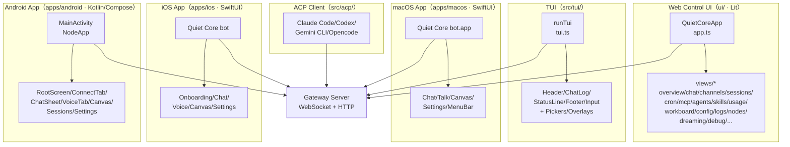

### 7.2 页面/视图清单

#### 7.2.1 Web Control UI 视图

Web Control UI 由根组件 `QuietCoreApp`（`ui/src/ui/app.ts`）通过 `app-render.ts` 按 Tab 分发到 `ui/src/ui/views/*` 渲染。默认由 Gateway 在 `http://127.0.0.1:18789/` 提供（`gateway.controlUi.basePath` 可覆盖），TLS 启用时为 `https://`。访问需通过 Gateway 认证（shared-secret token/password、Tailscale Serve 或 trusted-proxy）。

| 视图名                   | 入口文件                             | Tab/路径   | 说明                                                                       |
| ------------------------ | ------------------------------------ | ---------- | -------------------------------------------------------------------------- |
| Overview 仪表盘          | `ui/src/ui/views/overview.ts`        | 概览 Tab   | 网关访问、健康、用量概览                                                   |
| Chat 聊天                | `ui/src/ui/views/chat.ts`            | 聊天 Tab   | 主聊天界面，调用 `chat.history`/`chat.send`/`chat.inject`                  |
| Channels 渠道            | `ui/src/ui/views/channels.ts`        | 渠道 Tab   | 渠道配置与状态（Discord/Telegram/Slack/Nostr/WhatsApp 等）                 |
| Sessions 会话            | `ui/src/ui/views/sessions.ts`        | 会话 Tab   | 会话列表与检查点管理                                                       |
| Cron 定时任务            | `ui/src/ui/views/cron.ts`            | 定时 Tab   | 定时任务 CRUD 与运行历史                                                   |
| MCP 服务器               | `ui/src/ui/views/mcp.ts`             | MCP Tab    | MCP 服务器配置（transport/auth/launch/toolFilter/TLS）                     |
| Agents 面板              | `ui/src/ui/views/agents.ts`          | Agents Tab | Agent 列表、文件管理、工具面板（Available Right Now / Tool Configuration） |
| Skills 技能              | `ui/src/ui/views/skills.ts`          | Skills Tab | 技能搜索、安装、提案管理                                                   |
| Usage 用量               | `ui/src/ui/views/usage.ts`           | 用量 Tab   | Token 用量与成本统计                                                       |
| Workboard 工作板         | `ui/src/ui/views/workboard.ts`       | 工作板 Tab | 任务/流程工作板                                                            |
| Config 配置              | `ui/src/ui/views/config.ts`          | 配置 Tab   | 配置编辑器（JSON5）                                                        |
| Logs 日志                | `ui/src/ui/views/logs.ts`            | 日志 Tab   | 实时日志查看                                                               |
| Nodes 节点               | `ui/src/ui/views/nodes.ts`           | 节点 Tab   | 节点/设备管理与配对                                                        |
| Dreaming 记忆梦境        | `ui/src/ui/views/dreaming.ts`        | 记忆 Tab   | 记忆梦境诊断                                                               |
| Debug 调试               | `ui/src/ui/views/debug.ts`           | 调试 Tab   | 调试面板                                                                   |
| Command Palette 命令面板 | `ui/src/ui/views/command-palette.ts` | 全局浮层   | 命令快速调用                                                               |
| Login Gate 登录门        | `ui/src/ui/views/login-gate.ts`      | 认证前置   | 共享密钥登录                                                               |
| Exec Approval 执行审批   | `ui/src/ui/views/exec-approval.ts`   | 审批浮层   | 执行/插件审批决策                                                          |
| Connect Command 连接命令 | `ui/src/ui/views/connect-command.ts` | 连接浮层   | 连接命令展示                                                               |

#### 7.2.2 TUI 视图

TUI（`quiet-core-bot tui`）支持 Gateway 模式（连接远端 `--url ws://<host>:<port> --token <token>`）与本地模式（`quiet-core-bot chat` / `quiet-core-bot tui --local`，使用嵌入式 Agent 运行时）。界面区域固定，通过斜杠命令与快捷键交互。

| 视图区域       | 实现文件              | 说明                                                                                                           |
| -------------- | --------------------- | -------------------------------------------------------------------------------------------------------------- |
| Header         | `src/tui/tui.ts`      | 连接 URL、当前 Agent、当前会话                                                                                 |
| Chat Log       | `src/tui/tui.ts`      | 用户消息、助手回复、系统通知、工具卡片                                                                         |
| Status Line    | `src/tui/tui.ts`      | 连接/运行状态（connecting/running/streaming/idle/error）                                                       |
| Footer         | `src/tui/tui.ts`      | Agent + 会话 + 模型 + 目标状态 + think/fast/verbose/trace/reasoning + token 计数 + deliver（可选显示远程主机） |
| Input          | `src/tui/tui.ts`      | 文本编辑器，支持自动补全                                                                                       |
| Model Picker   | `src/tui/commands.ts` | 模型列表与覆盖（Ctrl+L）                                                                                       |
| Agent Picker   | `src/tui/commands.ts` | Agent 切换（Ctrl+G）                                                                                           |
| Session Picker | `src/tui/commands.ts` | 会话列表（最近 7 天最多 50 个，Ctrl+P）                                                                        |
| Settings       | `src/tui/commands.ts` | 切换 deliver/工具输出展开/思考可见性（Ctrl+O/Ctrl+T）                                                          |

#### 7.2.3 原生 App 视图

| 平台    | 入口                                                                                       | 主要视图/屏幕                                                                                                                                                                                                                                                                                         | 状态                                                                                  |
| ------- | ------------------------------------------------------------------------------------------ | ----------------------------------------------------------------------------------------------------------------------------------------------------------------------------------------------------------------------------------------------------------------------------------------------------- | ------------------------------------------------------------------------------------- |
| macOS   | `apps/macos/`（SwiftUI，`scripts/restart-mac.sh` 启动，`scripts/package-mac-app.sh` 打包） | Chat、Talk、Canvas、Settings、MenuBar                                                                                                                                                                                                                                                                 | 稳定（Developer ID / Apple Distribution 签名）                                        |
| iOS     | `apps/ios/`（SwiftUI，`pnpm ios:open` / `pnpm ios:release:upload`，Xcode 16+ + xcodegen）  | Onboarding、Chat、Voice、Canvas、Settings、Share Extension                                                                                                                                                                                                                                            | Super Alpha（App Store 发布走 Fastlane，bundle ID `ai.quiet-core-botfoundation.app`） |
| Android | `apps/android/`（Kotlin + Jetpack Compose，`pnpm android:run`，Gradle）                    | RootScreen、ConnectTab、ChatSheet、VoiceTab、VoiceScreen、CanvasScreen、SessionsScreen、SettingsSheet、ChannelsSettingsScreen、ProvidersModelsScreen、SkillsSettingsScreen、NodesDevicesSettingsScreen、DreamingSettingsScreen、HealthLogsSettingsScreen、OnboardingFlow、CommandPalette、ShellScreen | 稳定（Play / ThirdParty 双 flavor，包名 `ai.quiet-core-bot.app`）                     |

> **iOS 能力说明**：iOS App 以 `role: node` 连接 Gateway，通过 `node.invoke` 暴露设备能力（camera/canvas/screen/location/contacts/calendar/photos/motion/notifications）。前台优先，后台 `canvas.*`/`camera.*`/`screen.*`/`talk.*` 受限。推送通过 APNs（本地直连）或托管 Relay（App Store 构建，`https://ios-push-relay.openclaw.ai`）。Computer Use 不走 iOS，iOS 仅作节点能力提供方。
>
> **Android 结构说明**：`apps/android/app/src/main/java/ai/quietcore/app/` 下按 `chat/`、`gateway/`、`node/`、`protocol/`、`tools/`、`ui/`、`voice/` 分包。UI 层 `ui/chat/`（ChatComposer/ChatMarkdown/ChatMessageListCard/ChatTimeline）、`ui/design/`（ClawComponents/ClawNavigation/ClawTheme/ClawSurfaces）、`ui/` 根屏幕（RootScreen/ConnectTab/ChatSheet/VoiceTab/CanvasScreen/SessionsScreen/SettingsSheet 等）。节点能力处理器在 `node/`（CalendarHandler/CameraHandler/ContactsHandler/LocationHandler/NotificationsHandler/PhotosHandler 等）。双 flavor：`play`（Play Store，含 CallLogHandler/SmsHandler）与 `thirdParty`（第三方构建，不含敏感功能）。

### 7.3 UI 组件目录

#### 7.3.1 Web Control UI 组件

##### 通用组件（`ui/src/ui/components/`）

| 组件             | 文件                    | 用途         |
| ---------------- | ----------------------- | ------------ |
| DashboardHeader  | `dashboard-header.ts`   | 仪表盘页头   |
| ModalDialog      | `modal-dialog.ts`       | 模态对话框   |
| FilePreviewModal | `file-preview-modal.ts` | 文件预览模态 |
| ResizableDivider | `resizable-divider.ts`  | 可调整分隔条 |

##### 业务视图（`ui/src/ui/views/`）

见 7.2.1 节视图清单，每个视图为独立渲染模块。

##### 状态控制器（`ui/src/ui/controllers/`）

控制器封装对应 Gateway 方法的调用与本地状态，组件通过控制器与 Gateway 交互而非直接 fetch。

| 控制器    | 文件           | 对接 Gateway 方法                                                  |
| --------- | -------------- | ------------------------------------------------------------------ |
| Chat      | `chat.ts`      | `chat.history`/`chat.send`/`chat.abort`/`chat.inject`              |
| Sessions  | `sessions.ts`  | `sessions.list`/`sessions.create`/`sessions.send`/`sessions.abort` |
| Models    | `models.ts`    | `models.list`/`models.authStatus`                                  |
| Channels  | `channels.ts`  | `channels.status`/`channels.start`/`channels.stop`                 |
| Agents    | `agents.ts`    | `agents.list`/`agents.create`/`agents.files.*`                     |
| Cron      | `cron.ts`      | `cron.list`/`cron.add`/`cron.update`/`cron.run`                    |
| Logs      | `logs.ts`      | `logs.tail`                                                        |
| Config    | `config.ts`    | `config.get`/`config.set`/`config.apply`                           |
| Skills    | `skills.ts`    | `skills.search`/`skills.install`/`skills.proposals.*`              |
| Workboard | `workboard.ts` | `tasks.list`/`tasks.cancel`                                        |
| Nodes     | `nodes.ts`     | `node.list`/`node.pair.*`                                          |
| Devices   | `devices.ts`   | `device.pair.*`/`device.token.*`                                   |
| Usage     | `usage.ts`     | `usage.status`/`usage.cost`                                        |
| Health    | `health.ts`    | `health`/`status`                                                  |
| Presence  | `presence.ts`  | `system-presence`                                                  |

##### 聊天子模块（`ui/src/ui/chat/`）

| 子模块              | 文件                       | 用途                                        |
| ------------------- | -------------------------- | ------------------------------------------- |
| RealtimeTalk        | `realtime-talk.ts`         | 实时语音（WebRTC/Google Live/PCM 输出变体） |
| RunLifecycle        | `run-lifecycle.ts`         | 运行生命周期                                |
| InputHistory        | `input-history.ts`         | 输入历史                                    |
| SlashCommands       | `slash-commands.ts`        | 斜杠命令                                    |
| ToolCards           | `tool-cards.ts`            | 工具卡片                                    |
| SessionMessageCache | `session-message-cache.ts` | 会话消息缓存                                |
| ComposerPersistence | `composer-persistence.ts`  | 草稿持久化                                  |
| ChatAvatar          | `chat-avatar.ts`           | 头像渲染                                    |

##### 辅助模块（`ui/src/ui/`）

| 模块     | 文件          | 用途                                                                                    |
| -------- | ------------- | --------------------------------------------------------------------------------------- |
| Gateway  | `gateway.ts`  | 浏览器端 Gateway 客户端（WebSocket、设备身份签名、令牌存储、`ConnectErrorDetailCodes`） |
| Theme    | `theme.ts`    | 主题解析（见 7.5）                                                                      |
| Storage  | `storage.ts`  | 按 Gateway 作用域隔离的 localStorage 设置                                               |
| Markdown | `markdown.ts` | MarkdownIt + highlight.js + DOMPurify 安全渲染                                          |
| Icons    | `icons.ts`    | 内联 Lucide SVG（currentColor）                                                         |
| Format   | `format.ts`   | 相对时间戳、时长、思考标签剥离                                                          |

#### 7.3.2 TUI 组件

TUI 无独立组件文件，所有交互通过 `src/tui/tui.ts`（主循环）、`src/tui/commands.ts`（斜杠命令与快捷键）、`src/tui/tui-command-handlers.ts`、`src/tui/tui-event-handlers.ts`、`src/tui/tui-submit.ts`、`src/tui/tui-local-shell.ts` 实现。会话动作、本地 shell 运行、提交合并、覆盖层、等待提示均在 `src/tui/` 内闭合。

#### 7.3.3 原生 App 组件

- **macOS/iOS**（SwiftUI）：共享 `apps/shared/QuietCoreKit/`，聊天/Talk/Canvas 视图，菜单栏（macOS），Share Extension（iOS）。
- **Android**（Compose）：`ui/design/ClawComponents.kt`、`ClawNavigation.kt`、`ClawTheme.kt`、`ClawSurfaces.kt` 提供设计系统；`ui/chat/` 提供聊天组件（ChatComposer/ChatMarkdown/ChatMessageListCard/ChatTimeline）；`ui/` 根屏幕提供各功能页。

### 7.4 页面-组件映射表

| 页面/视图       | 复用的通用组件                                  | 依赖的状态控制器        | 关键子模块                                                                                                               |
| --------------- | ----------------------------------------------- | ----------------------- | ------------------------------------------------------------------------------------------------------------------------ |
| Overview        | DashboardHeader                                 | Health、Presence、Usage | —                                                                                                                        |
| Chat            | ModalDialog、FilePreviewModal、ResizableDivider | Chat、Sessions、Models  | RealtimeTalk、RunLifecycle、InputHistory、SlashCommands、ToolCards、SessionMessageCache、ComposerPersistence、ChatAvatar |
| Channels        | ModalDialog                                     | Channels                | —                                                                                                                        |
| Sessions        | ModalDialog                                     | Sessions                | —                                                                                                                        |
| Cron            | ModalDialog                                     | Cron                    | —                                                                                                                        |
| MCP             | ModalDialog                                     | Config                  | —                                                                                                                        |
| Agents          | ModalDialog、FilePreviewModal                   | Agents、Models          | —                                                                                                                        |
| Skills          | ModalDialog                                     | Skills                  | —                                                                                                                        |
| Usage           | —                                               | Usage                   | —                                                                                                                        |
| Workboard       | —                                               | Workboard、Tasks        | —                                                                                                                        |
| Config          | ModalDialog                                     | Config                  | —                                                                                                                        |
| Logs            | —                                               | Logs                    | —                                                                                                                        |
| Nodes           | ModalDialog                                     | Nodes、Devices          | —                                                                                                                        |
| Dreaming        | —                                               | Health                  | —                                                                                                                        |
| Debug           | —                                               | Health                  | —                                                                                                                        |
| Command Palette | —                                               | 多控制器                | —                                                                                                                        |
| Login Gate      | —                                               | —                       | —                                                                                                                        |
| Exec Approval   | ModalDialog                                     | —                       | —                                                                                                                        |

### 7.5 主题与样式定制

#### 7.5.1 Web Control UI 主题

主题系统由 `ui/src/ui/theme.ts` 定义，采用“主题名 × 模式”二维模型：

| 维度          | 取值                                                                                                 | 说明                                                                                 |
| ------------- | ---------------------------------------------------------------------------------------------------- | ------------------------------------------------------------------------------------ |
| ThemeName     | `claw` / `knot` / `dash` / `custom`                                                                  | 主题族：claw（默认深色）、knot（openknot）、dash（字段手册风）、custom（自定义导入） |
| ThemeMode     | `system` / `light` / `dark`                                                                          | 模式：system 跟随 `prefers-color-scheme`                                             |
| ResolvedTheme | `dark` / `light` / `openknot` / `openknot-light` / `dash` / `dash-light` / `custom` / `custom-light` | 解析后的最终主题                                                                     |

关键导出：`VALID_THEME_NAMES`、`resolveSystemTheme()`（基于 `matchMedia('(prefers-color-scheme: light)')`）、`parseThemeSelection(themeRaw, modeRaw)`（含 legacy 映射，如 `defaultTheme`→claw/dark、`openknot`→knot/dark、`fieldmanual`→dash/dark）、`resolveTheme(theme, mode)`。

**定制入口**：

- **CSS 变量**：`ui/src/styles/base.css` 与 `ui/src/styles/chat.css` 定义 CSS 自定义属性（颜色、圆角等）。`ui/src/ui/storage.ts` 暴露 `BORDER_RADIUS_STOPS`（圆角停止点）与 `parseImportedCustomTheme()`（自定义主题导入解析）。
- **设置持久化**：`ui/src/ui/storage.ts` 的 `settingsKeyForGateway` 按 Gateway 作用域隔离 UI 设置（主题、令牌、用户/助手身份、自定义主题）。
- **设置应用**：`ui/src/ui/app-settings.ts` 的 `setTab`/`setTheme`/`applySettings` 将主题应用到文档。
- **入口切换**：Overview → Gateway Access → Language（语言选择）；Appearance 区域切换主题。

#### 7.5.2 TUI 定制

TUI 通过配置项与斜杠命令定制显示：

- `tui.footer.showRemoteHost`（`quiet-core-bot config set tui.footer.showRemoteHost true`）：非本地连接显示远程主机（loopback 与嵌入式本地连接不显示）。
- 斜杠命令：`/think`、`/fast`、`/verbose`、`/trace`、`/reasoning`、`/usage` 控制思考/快速/详细/追踪/推理/用量显示。
- `/deliver on|off`：切换消息投递到 provider。

#### 7.5.3 原生 App 定制

- **Android**：`apps/android/app/src/main/res/values/themes.xml` 与 `values-night/themes.xml`（日/夜主题），`ui/design/ClawTheme.kt`（Compose 主题），`QuietCoreTheme.kt`，`AppearanceThemeMode.kt`（外观模式），字体 Manrope（`res/font/`）。
- **iOS/macOS**：SwiftUI 主题，`apps/macos/Sources/` 与 `apps/ios/Sources/` 各自实现，共享 `apps/shared/QuietCoreKit/`。

---

### 7.6 补遗：前端状态管理

文档第 7 章覆盖页面/组件/主题，但未描述 Control UI 的客户端状态管理：

- Control UI 基于 Lit（`lit@3.3.3`），通过 Gateway WebSocket RPC 拉取/订阅状态
- 状态同步：UI 侧持有 gateway 配置快照、agent 列表、channel 状态、cron 任务等镜像，配置变更通过 `gateway.reload` RPC 触发热重载
- `ui/package.json` 依赖：`@quiet-core/media-core`、`@quiet-core/normalization-core`（workspace 包）、`lit`、`markdown-it`、`marked`、`dompurify`、`highlight.js`、`@noble/ed25519`（设备配对签名）、`json5`（配置解析）

**补充到第 7 章**：新增"7.6 前端状态管理"小节，说明 UI 与 Gateway 的状态同步模型、配置快照原子交换、`@noble/ed25519` 在设备配对中的签名用途。

---

> 本文件是对 `docs/secondary-dev.md` 第 7 章「界面与交互说明」的审计补充。
> 审计方法:对 `ui/src/`、`apps/macos/Sources/`、`apps/ios/Sources/`、`apps/android/app/src/main/java/`、`src/tui/`、`ui/src/styles/` 进行 Glob/Grep 扫描,与第 7 章逐项对比。
> 主文档未修改,本文件仅记录遗漏项。

### 7.7 补遗：界面与交互补遗

#### 遗漏的组件

##### A. Web Control UI 视图与路由遗漏(对应 7.2.1)

第 7.2.1 节视图清单遗漏以下独立视图,且 `ui/src/ui/navigation.ts` 中的 `TAB_PATHS` 路由表也未在文档中给出。

###### A.1 遗漏的独立视图文件

| 视图名                        | 路径                                               | Tab/路径                                   | 用途                          |
| ----------------------------- | -------------------------------------------------- | ------------------------------------------ | ----------------------------- |
| Activity 活动                 | `ui/src/ui/views/activity.ts`                      | `/activity`(control 组)                    | 活动事件流                    |
| Instances 实例                | `ui/src/ui/views/instances.ts`                     | `/instances`(control 组)                   | 网关实例管理                  |
| Skill Workshop 技能工作坊     | `ui/src/ui/views/skill-workshop.ts`                | `/skills/workshop`(skillWorkshop,agent 组) | 技能开发工作坊(含 EmptyState) |
| Markdown Sidebar              | `ui/src/ui/views/markdown-sidebar.ts`              | —                                          | Markdown 侧边栏预览           |
| Nodes Exec Approvals          | `ui/src/ui/views/nodes-exec-approvals.ts`          | —                                          | 节点执行审批视图              |
| Gateway URL Confirmation      | `ui/src/ui/views/gateway-url-confirmation.ts`      | —                                          | 网关 URL 确认弹层             |
| Dreaming Restart Confirmation | `ui/src/ui/views/dreaming-restart-confirmation.ts` | —                                          | 梦境重启确认弹层              |
| Channel Config Extras         | `ui/src/ui/views/channel-config-extras.ts`         | —                                          | 渠道配置扩展字段              |

###### A.2 遗漏的路由(对应 `navigation.ts` 中的 `TAB_PATHS`)

文档 7.2.1 节列出的视图未覆盖以下 8 个 Tab 路由,这些是 `SETTINGS_TABS` 与 `TAB_GROUPS` 中实际存在的:

| Tab              | 路径               | 分组     | 说明                       |
| ---------------- | ------------------ | -------- | -------------------------- |
| `activity`       | `/activity`        | control  | 活动事件                   |
| `instances`      | `/instances`       | control  | 网关实例                   |
| `skillWorkshop`  | `/skills/workshop` | agent    | 技能工作坊                 |
| `communications` | `/communications`  | settings | 通信设置                   |
| `appearance`     | `/appearance`      | settings | 外观设置                   |
| `automation`     | `/automation`      | settings | 自动化设置                 |
| `infrastructure` | `/infrastructure`  | settings | 基础设施设置               |
| `aiAgents`       | `/ai-agents`       | settings | AI Agents 设置             |
| `dreams`         | `/dreams`(别名)    | agent    | 梦境别名(指向 `/dreaming`) |

> 关键文件:`ui/src/ui/navigation.ts` 定义 `TAB_GROUPS`(chat/control/agent/settings)、`SETTINGS_TABS`、`TAB_PATHS`、`PATH_ALIASES`、`tabFromPath()`、`pathForTab()`、`iconForTab()`、`titleForTab()`。第 7 章未引用此文件,导致路由表缺失。

###### A.3 遗漏的视图子模块文件

每个视图实际由多个子模块文件组成,文档仅列主文件:

**Channels 渠道**(主文件 `channels.ts` + 12 个子模块):
`channels.whatsapp.ts`、`channels.telegram.ts`、`channels.slack.ts`、`channels.signal.ts`、`channels.nostr.ts`、`channels.nostr-profile-form.ts`、`channels.imessage.ts`、`channels.googlechat.ts`、`channels.discord.ts`、`channels.config.ts`、`channels.shared.ts`、`channels.types.ts`

**Agents 面板**(主文件 `agents.ts` + 5 个子模块):
`agents-panels-overview.ts`、`agents-panels-status-files.ts`、`agents-panels-tools-skills.ts`、`agents-utils.ts`、`agents.types.ts`

**Config 配置**(主文件 `config.ts` + 7 个子模块):
`config-form.ts`、`config-form.node.ts`、`config-form.analyze.ts`、`config-form.shared.ts`、`config-form.render.ts`、`config-quick.ts`、`config-presets.ts`

**Cron 定时**(主文件 `cron.ts` + 1 个子模块):`cron-quick-create.ts`

**Nodes 节点**(主文件 `nodes.ts` + 2 个子模块):`nodes-shared.ts`、`nodes.types.ts`

**Overview 概览**(主文件 `overview.ts` + 5 个子模块):
`overview-log-tail.ts`、`overview-hints.ts`、`overview-event-log.ts`、`overview-cards.ts`、`overview-attention.ts`

**Skills 技能**(主文件 `skills.ts` + 2 个子模块):`skills-shared.ts`、`skills-grouping.ts`

**Usage 用量**(主文件 `usage.ts` + 5 个子模块):
`usageTypes.ts`、`usage-render-overview.ts`、`usage-render-details.ts`、`usage-query.ts`、`usage-metrics.ts`

##### B. Web 控制器遗漏(对应 7.3.1)

第 7.3.1 节「状态控制器」表遗漏以下控制器文件:

| 控制器               | 文件                                                                    | 用途                                         |
| -------------------- | ----------------------------------------------------------------------- | -------------------------------------------- |
| Skill Workshop       | `controllers/skill-workshop.ts`                                         | 技能工作坊状态                               |
| Scope Errors         | `controllers/scope-errors.ts`                                           | 作用域错误处理                               |
| Model Auth Status    | `controllers/model-auth-status.ts`                                      | 模型认证状态                                 |
| Exec Approvals(复数) | `controllers/exec-approvals.ts`                                         | 执行审批集合(与单数 `exec-approval.ts` 并存) |
| Control UI Bootstrap | `controllers/control-ui-bootstrap.ts`                                   | Control UI 启动初始化                        |
| Assistant Identity   | `controllers/assistant-identity.ts`                                     | 助手身份                                     |
| Agent Skills         | `controllers/agent-skills.ts`                                           | Agent 技能列表                               |
| Agent Identity       | `controllers/agent-identity.ts`                                         | Agent 身份                                   |
| Agent Files          | `controllers/agent-files.ts`                                            | Agent 文件管理                               |
| Config Form Utils    | `controllers/config/form-coerce.ts`、`controllers/config/form-utils.ts` | 配置表单工具                                 |

##### C. Web 聊天子模块遗漏(对应 7.3.1)

第 7.3.1 节「聊天子模块」表列出 8 项,但实际 `ui/src/ui/chat/` 下有 77 个文件;实时语音除主入口 `realtime-talk.ts` 外另有 8 个变体文件。

###### C.1 原审计更正（2026-09-19 结构复核）

> 原审计曾声称下列文件"不存在/未找到"，经逐一直接核验，**全部实际存在于 `ui/src/ui/chat/` 下**，原文档 7.3.1 聊天子模块表的条目是正确的，原审计误报，特此更正：

| 文档列出                                       | 核验结果（实际存在）                                                                                                                                                                                                                                                                                                                                                                                                          |
| ---------------------------------------------- | ----------------------------------------------------------------------------------------------------------------------------------------------------------------------------------------------------------------------------------------------------------------------------------------------------------------------------------------------------------------------------------------------------------------------------- |
| RealtimeTalk `realtime-talk.ts`                | ✅ 存在于 `chat/realtime-talk.ts`，且另有 8 个变体文件：`realtime-talk-catalog.ts`、`realtime-talk-audio.ts`、`realtime-talk-gateway-relay.ts`、`realtime-talk-conversation.ts`、`realtime-talk-pcm-output.ts`、`realtime-talk-google-live.ts`、`realtime-talk-shared.ts`、`realtime-talk-webrtc.ts`（原审计漏列 webrtc 变体，且"顶层 `ui/src/ui/realtime-talk.ts` 入口"的说法有误——顶层只有测试文件，实现入口在 `chat/` 内） |
| RunLifecycle `run-lifecycle.ts`                | ✅ 存在于 `chat/run-lifecycle.ts`（附 `run-lifecycle.test.ts`）                                                                                                                                                                                                                                                                                                                                                               |
| SlashCommands `slash-commands.ts`              | ✅ 存在于 `chat/slash-commands.ts`（附 browser/node 测试；另有 `slash-command-executor.ts` 执行器）                                                                                                                                                                                                                                                                                                                           |
| ToolCards `tool-cards.ts`                      | ✅ 存在于 `chat/tool-cards.ts`（附 node 测试）                                                                                                                                                                                                                                                                                                                                                                                |
| SessionMessageCache `session-message-cache.ts` | ✅ 存在于 `chat/session-message-cache.ts`（附测试）                                                                                                                                                                                                                                                                                                                                                                           |

另核验补充 `chat/` 下原表遗漏的子模块：`role-normalizer.ts`、`run-controls.ts`、`search-match.ts`、`session-cache.ts`、`session-controls.ts`、`side-result.ts`、`side-result-render.ts`、`sidebar-session-picker`、`slash-command-executor.ts`、`status-indicators.ts`、`stream-reconciliation.ts`、`stream-text.ts`、`token-format.ts`、`tool-expansion-state.ts`、`tool-helpers.ts`、`tool-message-refs.ts`、`user-message-content.ts`。`chat/` 目录实际共 **77 个文件**（原审计称"30+ 文件"系低估）。

###### C.2 遗漏的实际聊天子模块

| 子模块                      | 文件                             | 用途                         |
| --------------------------- | -------------------------------- | ---------------------------- |
| Chat Welcome                | `chat-welcome.ts`                | 欢迎页                       |
| Chat Sidebar Raw            | `chat-sidebar-raw.ts`            | 侧边栏原始数据               |
| Chat Queue                  | `chat-queue.ts`                  | 消息队列                     |
| Chat Avatar                 | `chat-avatar.ts`                 | 头像(文档已列,确认存在)      |
| Build Chat Items            | `build-chat-items.ts`            | 聊天项构建                   |
| Attachment Support          | `attachment-support.ts`          | 附件支持                     |
| Attachment Payload Store    | `attachment-payload-store.ts`    | 附件载荷存储                 |
| Heartbeat Display           | `heartbeat-display.ts`           | 心跳显示                     |
| Grouped Render              | `grouped-render.ts`              | 分组渲染(含删除确认 popover) |
| Export                      | `export.ts`                      | 聊天导出                     |
| Deleted Messages            | `deleted-messages.ts`            | 已删消息                     |
| Copy As Markdown            | `copy-as-markdown.ts`            | 复制为 Markdown              |
| Context Notice              | `context-notice.ts`              | 上下文提示                   |
| Constants                   | `constants.ts`                   | 常量                         |
| Composer Persistence        | `composer-persistence.ts`        | 草稿持久化(文档已列,确认)    |
| Clipboard                   | `clipboard.ts`                   | 剪贴板                       |
| Message Normalizer          | `message-normalizer.ts`          | 消息归一化                   |
| Message Extract             | `message-extract.ts`             | 消息提取                     |
| Input History               | `input-history.ts`               | 输入历史(文档已列,确认)      |
| History Merge               | `history-merge.ts`               | 历史合并                     |
| History Limits              | `history-limits.ts`              | 历史限制                     |
| Realtime Talk Catalog       | `realtime-talk-catalog.ts`       | 实时语音目录                 |
| Realtime Talk Audio         | `realtime-talk-audio.ts`         | 实时语音音频                 |
| Pinned Summary              | `pinned-summary.ts`              | 置顶摘要                     |
| Pinned Messages             | `pinned-messages.ts`             | 置顶消息                     |
| Realtime Talk Gateway Relay | `realtime-talk-gateway-relay.ts` | 网关中继                     |
| Realtime Talk Conversation  | `realtime-talk-conversation.ts`  | 会话管理                     |
| Realtime Talk PCM Output    | `realtime-talk-pcm-output.ts`    | PCM 输出                     |
| Realtime Talk Google Live   | `realtime-talk-google-live.ts`   | Google Live 变体             |
| Realtime Talk WebRTC        | `realtime-talk-webrtc.ts`        | WebRTC 变体                  |
| Realtime Talk Shared        | `realtime-talk-shared.ts`        | 共享逻辑                     |

##### D. Web 辅助模块遗漏(对应 7.3.1)

第 7.3.1 节「辅助模块」仅列 6 项,实际 `ui/src/ui/` 下有 142 个文件。重点遗漏:

###### D.1 应用生命周期与渲染(文档完全未列)

| 模块                 | 文件                      | 用途                                                      |
| -------------------- | ------------------------- | --------------------------------------------------------- |
| App Render           | `app-render.ts`           | 主渲染入口(按 Tab 分发,文档 7.2.1 提及但未列入辅助模块表) |
| App Render Helpers   | `app-render.helpers.ts`   | 渲染辅助(含 sidebar 在线/离线状态、chat-settings-popover) |
| App Render Usage Tab | `app-render-usage-tab.ts` | Usage Tab 渲染                                            |
| App Channels         | `app-channels.ts`         | 渠道状态管理                                              |
| App Chat             | `app-chat.ts`             | 聊天状态管理                                              |
| App Defaults         | `app-defaults.ts`         | 默认值                                                    |
| App Events           | `app-events.ts`           | 事件处理                                                  |
| App Gateway          | `app-gateway.ts`          | 网关连接管理                                              |
| App Lifecycle        | `app-lifecycle.ts`        | 生命周期                                                  |
| App Native Bridge    | `app-native-bridge.ts`    | 原生桥接(iOS/Android WebView)                             |
| App Polling          | `app-polling.ts`          | 轮询                                                      |
| App Scroll           | `app-scroll.ts`           | 滚动管理                                                  |
| App Settings         | `app-settings.ts`         | 设置应用(setTab/setTheme/applySettings)                   |
| App Tool Stream      | `app-tool-stream.ts`      | 工具流                                                    |
| App View State       | `app-view-state.ts`       | 视图状态                                                  |
| Navigation           | `navigation.ts`           | 路由与 Tab 分组(见 A.2)                                   |

###### D.2 其他重点辅助模块

| 模块                    | 文件                         | 用途                                                  |
| ----------------------- | ---------------------------- | ----------------------------------------------------- |
| Connect Error           | `connect-error.ts`           | 连接错误(含 `ConnectErrorDetailCodes`)                |
| Control UI Auth         | `control-ui-auth.ts`         | Control UI 认证                                       |
| Control UI Performance  | `control-ui-performance.ts`  | 性能优化                                              |
| Control UI Chunking     | `control-ui-chunking.ts`     | 分块渲染                                              |
| Custom Theme            | `custom-theme.ts`            | 自定义主题(含 popover/popover-foreground 等 CSS 变量) |
| Theme Transition        | `theme-transition.ts`        | 主题切换过渡                                          |
| Device Auth             | `device-auth.ts`             | 设备认证                                              |
| Device Identity         | `device-identity.ts`         | 设备身份                                              |
| DOM Tooltips            | `dom-tooltips.ts`            | DOM 工具提示                                          |
| Embed Sandbox           | `embed-sandbox.ts`           | 嵌入沙箱                                              |
| External Link           | `external-link.ts`           | 外部链接处理                                          |
| Gateway Methods         | `gateway-methods.ts`         | 网关方法                                              |
| Lazy View               | `lazy-view.ts`               | 懒加载视图                                            |
| Model Auth Helpers      | `model-auth-helpers.ts`      | 模型认证辅助                                          |
| Open External URL       | `open-external-url.ts`       | 打开外部 URL                                          |
| Plugin Activation       | `plugin-activation.ts`       | 插件激活                                              |
| Presenter               | `presenter.ts`               | 演示层                                                |
| Public Assets           | `public-assets.ts`           | 公共资源                                              |
| Push Subscription       | `push-subscription.ts`       | Web Push 订阅                                         |
| Provider Quota Summary  | `provider-quota-summary.ts`  | Provider 配额摘要                                     |
| Select Options          | `select-options.ts`          | 选择项                                                |
| Session Display         | `session-display.ts`         | 会话显示                                              |
| Session Goal            | `session-goal.ts`            | 会话目标                                              |
| Session Key             | `session-key.ts`             | 会话键                                                |
| Sidebar Content         | `sidebar-content.ts`         | 侧边栏内容                                            |
| Text Direction          | `text-direction.ts`          | 文本方向(LTR/RTL)                                     |
| Thinking Labels         | `thinking-labels.ts`         | 思考标签                                              |
| Cron Status             | `cron-status.ts`             | Cron 状态                                             |
| Cron Payload            | `cron-payload.ts`            | Cron 载荷                                             |
| Activity Model          | `activity-model.ts`          | 活动模型                                              |
| Assistant Identity      | `assistant-identity.ts`      | 助手身份                                              |
| Browser Redact          | `browser-redact.ts`          | 浏览器脱敏                                            |
| Canvas URL              | `canvas-url.ts`              | Canvas URL                                            |
| Chat Model Select State | `chat-model-select-state.ts` | 模型选择状态                                          |
| Chat Model Ref          | `chat-model-ref.ts`          | 模型引用                                              |
| Chat Event Reload       | `chat-event-reload.ts`       | 事件重载                                              |

##### E. 弹窗/抽屉/模态遗漏(对应 7.3.1 / 7.4)

第 7.3.1 节仅列 `ModalDialog`、`FilePreviewModal` 两个组件,遗漏以下浮层:

###### E.1 Web Control UI 浮层

| 浮层                          | 实现位置                                               | 类型     | 用途                                         |
| ----------------------------- | ------------------------------------------------------ | -------- | -------------------------------------------- |
| Nav Drawer 导航抽屉           | `app-render.ts`(class `shell--nav-drawer-open`)        | Drawer   | 移动端/折叠态导航抽屉                        |
| Chat Settings Popover         | `app-render.helpers.ts`(class `chat-settings-popover`) | Popover  | 聊天设置弹出层(think/fast/verbose 等开关)    |
| Chat Delete Confirm           | `chat/grouped-render.ts`(class `chat-delete-confirm`)  | Popover  | 消息删除确认气泡                             |
| Dreaming Restart Confirmation | `views/dreaming-restart-confirmation.ts`               | Dialog   | 梦境重启确认                                 |
| Gateway URL Confirmation      | `views/gateway-url-confirmation.ts`                    | Dialog   | 网关 URL 确认                                |
| Command Palette               | `views/command-palette.ts`                             | 全局浮层 | 命令快速调用(文档 7.2.1 已列,但未归入弹窗类) |
| Exec Approval                 | `views/exec-approval.ts`                               | 浮层     | 执行审批(文档 7.2.1 已列,但未归入弹窗类)     |
| Login Gate                    | `views/login-gate.ts`                                  | 前置门   | 登录认证(文档 7.2.1 已列,但未归入弹窗类)     |

###### E.2 iOS Sheet/Dialog/Alert(文档完全未列)

| 组件                                    | 文件                                                 | 类型                          | 用途                 |
| --------------------------------------- | ---------------------------------------------------- | ----------------------------- | -------------------- |
| Gateway Quick Setup Sheet               | `Gateway/GatewayQuickSetupSheet.swift`               | Sheet                         | 网关快速设置         |
| Gateway Problem Banner                  | `Gateway/GatewayProblemView.swift`                   | Banner                        | 网关问题横幅         |
| Gateway Problem Details Sheet           | `Gateway/GatewayProblemView.swift`                   | Sheet                         | 网关问题详情         |
| Gateway Discovery Debug Log View        | `Gateway/GatewayDiscoveryDebugLogView.swift`         | View                          | 网关发现调试日志     |
| Gateway Trust Prompt Alert              | `Gateway/GatewayTrustPromptAlert.swift`              | Alert(ViewModifier)           | 网关信任提示         |
| Deep Link Agent Prompt Alert            | `Gateway/DeepLinkAgentPromptAlert.swift`             | Alert(ViewModifier)           | Deep Link Agent 提示 |
| Notification Permission Guidance Dialog | `Gateway/NotificationPermissionGuidanceDialog.swift` | Dialog                        | 通知权限引导         |
| Exec Approval Prompt Dialog             | `Gateway/ExecApprovalPromptDialog.swift`             | Dialog                        | 执行审批对话框       |
| Talk Runtime Issue Banner               | `Design/TalkRuntimeIssueBanner.swift`                | Banner                        | Talk 运行时问题横幅  |
| Talk Runtime Issue Details Sheet        | `Design/TalkRuntimeIssueBanner.swift`                | Sheet                         | Talk 问题详情        |
| Talk Permission Prompt View             | `Voice/TalkPermissionPromptView.swift`               | View                          | Talk 权限提示        |
| Voice Wake Toast                        | `Status/VoiceWakeToast.swift`                        | Toast                         | Voice Wake 提示      |
| iPad Workboard Card Detail Sheet        | `Design/IPadWorkboardScreen.swift`                   | Sheet                         | 工作板卡片详情       |
| QR Scanner View                         | `Onboarding/QRScannerView.swift`                     | UIViewControllerRepresentable | QR 扫码              |

###### E.3 macOS Overlay/Window(文档完全未列)

| 组件                          | 文件                                                                                | 类型                | 用途                |
| ----------------------------- | ----------------------------------------------------------------------------------- | ------------------- | ------------------- |
| Notify Overlay                | `NotifyOverlay.swift`(`NotifyOverlayView`)                                          | Overlay             | 通知覆盖层          |
| Hover HUD                     | `HoverHUD.swift`(`HoverHUDView`)                                                    | Overlay             | 悬停 HUD            |
| Voice Wake Overlay            | `VoiceWakeOverlayView.swift`                                                        | Overlay             | Voice Wake 覆盖层   |
| Voice Wake Overlay Text Views | `VoiceWakeOverlayTextViews.swift`(`TranscriptTextView`、`VibrantLabelView`)         | NSViewRepresentable | Voice Wake 文本视图 |
| Talk Overlay                  | `TalkOverlayView.swift`(`TalkOverlayView`、`TalkOrbView`、`TalkOrbInteractionView`) | Overlay             | Talk 悬浮球         |
| Agent Events Window           | `AgentEventsWindow.swift`                                                           | Window              | Agent 事件窗口      |
| Dashboard Window              | `DashboardWindow.swift`、`DashboardWindowController.swift`                          | Window              | Dashboard 窗口      |
| Context Menu Card View        | `ContextMenuCardView.swift`、`ContextRootMenuLabelView.swift`                       | Menu                | 上下文菜单卡片      |

###### E.4 Android Sheet/Dialog/Overlay(文档未列)

| 组件                        | 文件                                            | 类型    | 用途           |
| --------------------------- | ----------------------------------------------- | ------- | -------------- |
| Gateway Trust Dialog        | `ui/ShellScreen.kt`(`GatewayTrustDialog`)       | Dialog  | 网关信任对话框 |
| Talk Orb Overlay            | `ui/TalkOrbOverlay.kt`                          | Overlay | Talk 浮球      |
| Camera Hud Overlay          | `ui/CameraHudOverlay.kt`(`CameraFlashOverlay`)  | Overlay | 相机 HUD       |
| Permission Rationale Dialog | `PermissionRequester.kt`(`showRationaleDialog`) | Dialog  | 权限说明对话框 |
| Permission Settings Dialog  | `PermissionRequester.kt`(`showSettingsDialog`)  | Dialog  | 权限设置对话框 |

##### F. macOS 视图/组件遗漏(对应 7.2.3 / 7.3.3)

第 7.2.3 节 macOS 仅列「Chat、Talk、Canvas、Settings、MenuBar」,实际 `apps/macos/Sources/` 下有 257 个 Swift 文件。

###### F.1 Settings 视图(14+ 个,文档仅说"Settings")

| 视图                          | 文件                                                                                       | 用途                     |
| ----------------------------- | ------------------------------------------------------------------------------------------ | ------------------------ |
| Settings Root View            | `SettingsRootView.swift`                                                                   | 设置根视图               |
| General Settings              | `GeneralSettings.swift`                                                                    | 通用设置                 |
| About Settings                | `AboutSettings.swift`                                                                      | 关于                     |
| Channels Settings             | `ChannelsSettings.swift`(+`+Config`/`+View`/`+Helpers`/`+ChannelState`/`+ChannelSections`) | 渠道设置                 |
| Config Settings               | `ConfigSettings.swift`                                                                     | 配置设置                 |
| Cron Settings                 | `CronSettings.swift`(+`+Actions`/`+Helpers`/`+Layout`/`+Rows`/`+Testing`)                  | Cron 设置                |
| Debug Settings                | `DebugSettings.swift`                                                                      | 调试设置                 |
| Instances Settings            | `InstancesSettings.swift`                                                                  | 实例设置                 |
| Permissions Settings          | `PermissionsSettings.swift`(`LocationAccessSettings`)                                      | 权限设置(含位置访问)     |
| Sessions Settings             | `SessionsSettings.swift`                                                                   | 会话设置                 |
| Skills Settings               | `SkillsSettings.swift`(`EnvEditorView`)                                                    | 技能设置(含环境变量编辑) |
| System Run Settings View      | `SystemRunSettingsView.swift`(`ExecApprovalsSettings`)                                     | 系统运行/执行审批设置    |
| Voice Wake Settings           | `VoiceWakeSettings.swift`                                                                  | Voice Wake 设置          |
| Tailscale Integration Section | `TailscaleIntegrationSection.swift`                                                        | Tailscale 集成           |

###### F.2 MenuBar / Tray(文档仅说"MenuBar")

| 组件                         | 文件                                                          | 用途                                                                                                  |
| ---------------------------- | ------------------------------------------------------------- | ----------------------------------------------------------------------------------------------------- |
| MenuBar                      | `MenuBar.swift`                                               | 菜单栏主组件(`MenuBarExtra` + `NSStatusItem` + `menuBarExtraAccess`,使用 **MenuBarExtraAccess** 框架) |
| Menu Context Card Injector   | `MenuContextCardInjector.swift`                               | 上下文卡片注入器(NSMenuDelegate)                                                                      |
| Menu Sessions Injector       | `MenuSessionsInjector.swift`                                  | 会话注入器(注入会话/节点到菜单)                                                                       |
| Menu Hosted Item             | `MenuHostedItem.swift`                                        | SwiftUI 内容托管为 NSMenuItem.view                                                                    |
| Menu Sessions Header View    | `MenuSessionsHeaderView.swift`                                | 会话菜单头                                                                                            |
| Menu Usage Header View       | `MenuUsageHeaderView.swift`                                   | 用量菜单头                                                                                            |
| Cost Usage History Menu View | `CostUsageMenuView.swift`(`CostUsageHistoryMenuView`)         | 成本用量历史菜单                                                                                      |
| Usage Menu Label View        | `UsageMenuLabelView.swift`                                    | 用量菜单标签                                                                                          |
| Session Menu Label View      | `SessionMenuLabelView.swift`                                  | 会话菜单标签                                                                                          |
| Session Menu Preview View    | `SessionMenuPreviewView.swift`                                | 会话菜单预览                                                                                          |
| Nodes Menu                   | `NodesMenu.swift`(`NodeMenuRowView`、`NodeMenuMultilineView`) | 节点菜单                                                                                              |
| Gateway Discovery Menu       | `GatewayDiscoveryMenu.swift`(`GatewayDiscoveryMenu`)          | 网关发现菜单                                                                                          |
| Dock Menu                    | `MenuBar.swift`(`applicationDockMenu`)                        | Dock 菜单                                                                                             |

###### F.3 Canvas(文档仅说"Canvas")

| 组件                               | 文件                                                                                         | 用途                          |
| ---------------------------------- | -------------------------------------------------------------------------------------------- | ----------------------------- |
| Canvas Window Controller           | `CanvasWindowController.swift`(+`+Window`/`+UIDelegate`/`+Navigation`/`+Helpers`/`+Testing`) | Canvas 窗口控制器(多文件扩展) |
| Canvas Window                      | `CanvasWindow.swift`                                                                         | Canvas 窗口                   |
| Canvas Manager                     | `CanvasManager.swift`                                                                        | Canvas 管理器                 |
| Canvas Scheme                      | `CanvasScheme.swift`                                                                         | Canvas 协议                   |
| Canvas Scheme Handler              | `CanvasSchemeHandler.swift`                                                                  | Canvas 协议处理器             |
| Canvas Chrome Container View       | `CanvasChromeContainerView.swift`                                                            | Canvas Chrome 容器            |
| Canvas A2UI Action Message Handler | `CanvasA2UIActionMessageHandler.swift`                                                       | A2UI 动作消息处理器           |
| Canvas File Watcher                | `CanvasFileWatcher.swift`                                                                    | Canvas 文件监听               |

###### F.4 Voice Wake(文档完全未列 macOS Voice Wake 组件)

| 组件                            | 文件                                                            | 用途                                          |
| ------------------------------- | --------------------------------------------------------------- | --------------------------------------------- |
| Voice Wake Overlay View         | `VoiceWakeOverlayView.swift`                                    | Voice Wake 覆盖视图                           |
| Voice Wake Overlay Text Views   | `VoiceWakeOverlayTextViews.swift`                               | 文本视图(TranscriptTextView/VibrantLabelView) |
| Voice Wake Overlay Controller   | `VoiceWakeOverlayController.swift`                              | 覆盖控制器                                    |
| Voice Wake Runtime              | `VoiceWakeRuntime.swift`(`VoiceWakeRuntime.shared`)             | 运行时                                        |
| Voice Wake Forwarder            | `VoiceWakeForwarder.swift`                                      | 转发器                                        |
| Voice Wake Helpers              | `VoiceWakeHelpers.swift`                                        | 辅助                                          |
| Voice Wake Global Settings Sync | `VoiceWakeGlobalSettingsSync.swift`                             | 全局设置同步                                  |
| Voice Wake Chime                | `AppState.swift`(`voiceWakeTriggerChime`、`voiceWakeSendChime`) | 触发/发送提示音                               |
| Voice Push To Talk              | `AppState.swift`(`voicePushToTalkEnabled`)                      | 按键说话(含热键)                              |

###### F.5 其他 macOS 视图

| 视图                                 | 文件                                                              | 用途                                |
| ------------------------------------ | ----------------------------------------------------------------- | ----------------------------------- |
| Onboarding View                      | `Onboarding.swift`(`OnboardingView`)                              | 引导视图                            |
| Onboarding Wizard Step View          | `OnboardingWizard.swift`(`OnboardingWizardStepView`)              | 引导步骤                            |
| Cron Job Editor                      | `CronJobEditor.swift`(+`+Helpers`/`+Testing`)                     | Cron 任务编辑器                     |
| Critter Status Label                 | `CritterStatusLabel.swift`(+`+Behavior`)                          | 状态标签                            |
| Critter Icon Renderer                | `CritterIconRenderer.swift`                                       | 图标渲染                            |
| Context Usage Bar                    | `ContextUsageBar.swift`                                           | 上下文用量条                        |
| Visual Effect View                   | `VisualEffectView.swift`(NSViewRepresentable)                     | 视觉效果                            |
| App Navigation Actions               | `AppNavigationActions.swift`                                      | 应用导航动作                        |
| App State                            | `AppState.swift`                                                  | 应用状态(含 VoiceWake/Swabble 状态) |
| Control Channel                      | `ControlChannel.swift`                                            | 控制通道                            |
| Connection Mode Resolver/Coordinator | `ConnectionModeResolver.swift`、`ConnectionModeCoordinator.swift` | 连接模式                            |
| CLI Installer / Install Prompter     | `CLIInstaller.swift`、`CLIInstallPrompter.swift`                  | CLI 安装                            |
| Config Store / Config File Watcher   | `ConfigStore.swift`、`ConfigFileWatcher.swift`                    | 配置存储/监听                       |
| Agent Workspace / Agent Event Store  | `AgentWorkspace.swift`、`AgentEventStore.swift`                   | Agent 工作区/事件                   |
| Coalescing FSEvents Watcher          | `CoalescingFSEventsWatcher.swift`                                 | FSEvents 合并监听                   |
| Deep Links                           | `DeepLinks.swift`                                                 | Deep Link                           |
| Debug Actions                        | `DebugActions.swift`                                              | 调试动作                            |
| Color Hex Support                    | `ColorHexSupport.swift`                                           | 颜色十六进制                        |
| Age Formatting                       | `AgeFormatting.swift`                                             | 时间格式化                          |
| Command Resolver                     | `CommandResolver.swift`                                           | 命令解析                            |

##### G. iOS 视图/组件遗漏(对应 7.2.3 / 7.3.3)

第 7.2.3 节 iOS 仅列「Onboarding、Chat、Voice、Canvas、Settings、Share Extension」,实际 `apps/ios/Sources/` 下有 110 个 Swift 文件。

###### G.1 主 Tab 与导航(文档未列)

| 组件                           | 文件                                                                                                                   | 用途                          |
| ------------------------------ | ---------------------------------------------------------------------------------------------------------------------- | ----------------------------- |
| Root Tabs                      | `RootTabs.swift`、`RootTabsNavigation.swift`                                                                           | 根 Tab 导航(Phone/Pad 自适应) |
| Root Tabs Phone Control Hub    | `Design/RootTabsPhoneControlHub.swift`                                                                                 | 手机控制中心                  |
| Chat Pro Tab                   | `Design/ChatProTab.swift`                                                                                              | Chat Pro Tab                  |
| Agent Pro Tab                  | `Design/AgentProTab.swift`(+`+Usage`/`+Skills`/`+Overview`/`+GatewayData`/`+DetailComponents`/`+Destinations`/`+Cron`) | Agent Pro Tab(7 个扩展文件)   |
| Talk Pro Tab                   | `Design/TalkProTab.swift`                                                                                              | Talk Pro Tab                  |
| Settings Pro Tab               | `Design/SettingsProTab.swift`(+`+Support`/`+Sections`/`+Actions`)                                                      | Settings Pro Tab              |
| Command Center Tab             | `Design/CommandCenterTab.swift`(`CommandSessionsScreen`)                                                               | 命令中心 Tab                  |
| Agent Pro Nodes Destination    | `Design/AgentProNodesDestination.swift`                                                                                | 节点目标                      |
| Agent Pro Dreaming Destination | `Design/AgentProDreamingDestination.swift`                                                                             | 梦境目标                      |
| Settings Channels Destination  | `Design/SettingsChannelsDestination.swift`                                                                             | 渠道目标                      |
| Quiet Core bot Docs Screen     | `Design/QuietCoreDocsScreen.swift`                                                                                     | 文档屏幕                      |
| Quiet Core bot Pro Components  | `Design/QuietCoreProComponents.swift`                                                                                  | Pro 组件                      |
| Quiet Core bot Brand           | `Design/QuietCoreBrand.swift`                                                                                          | 品牌                          |
| Command Center Support         | `Design/CommandCenterSupport.swift`                                                                                    | 命令中心支持                  |

###### G.2 iPad 屏幕(文档完全未列 iPad 专属屏幕)

| 屏幕                          | 文件                                                               | 用途               |
| ----------------------------- | ------------------------------------------------------------------ | ------------------ |
| IPad Activity Screen          | `Design/IPadActivityScreen.swift`                                  | iPad 活动屏幕      |
| IPad Workboard Screen         | `Design/IPadWorkboardScreen.swift`(`IPadWorkboardCardDetailSheet`) | iPad 工作板屏幕    |
| IPad Skill Workshop Screen    | `Design/IPadSkillWorkshopScreen.swift`                             | iPad 技能工作坊    |
| IPad Sidebar Screen Chrome    | `Design/IPadSidebarScreenChrome.swift`                             | iPad 侧边栏 Chrome |
| IPad Sidebar Feature Screens  | `Design/IPadSidebarFeatureScreens.swift`                           | iPad 侧边栏功能屏  |
| IPad Sidebar Feature Previews | `Design/IPadSidebarFeaturePreviews.swift`                          | iPad 侧边栏预览    |

###### G.3 Onboarding(文档仅说"Onboarding")

| 组件                     | 文件                                      | 用途     |
| ------------------------ | ----------------------------------------- | -------- |
| Onboarding Wizard View   | `Onboarding/OnboardingWizardView.swift`   | 引导向导 |
| Onboarding Wizard Steps  | `Onboarding/OnboardingWizardSteps.swift`  | 步骤定义 |
| Onboarding State Store   | `Onboarding/OnboardingStateStore.swift`   | 状态存储 |
| Gateway Onboarding Reset | `Onboarding/GatewayOnboardingReset.swift` | 重置     |
| QR Scanner View          | `Onboarding/QRScannerView.swift`          | QR 扫码  |

###### G.4 Voice / Talk Mode(文档仅说"Voice")

| 组件                           | 文件                                           | 用途              |
| ------------------------------ | ---------------------------------------------- | ----------------- |
| Talk Mode Manager              | `Voice/TalkModeManager.swift`(+`+Permissions`) | Talk Mode 管理器  |
| Talk Mode Gateway Config       | `Voice/TalkModeGatewayConfig.swift`            | 网关配置          |
| Talk Gateway Permission State  | `Voice/TalkGatewayPermissionState.swift`       | 权限状态          |
| Talk Defaults                  | `Voice/TalkDefaults.swift`                     | 默认值            |
| Talk Speech Locale             | `Voice/TalkSpeechLocale.swift`                 | 语音区域          |
| Talk Realtime WebRTC Session   | `Voice/TalkRealtimeWebRTCSession.swift`        | WebRTC 会话       |
| Talk Realtime Client Session   | `Voice/TalkRealtimeClientSession.swift`        | 客户端会话        |
| Realtime Talk Relay Session    | `Voice/RealtimeTalkRelaySession.swift`         | 中继会话          |
| Talk Permission Prompt View    | `Voice/TalkPermissionPromptView.swift`         | 权限提示          |
| Voice Wake Manager             | `Voice/VoiceWakeManager.swift`                 | Voice Wake 管理器 |
| Voice Wake Preferences         | `Voice/VoiceWakePreferences.swift`             | Voice Wake 偏好   |
| Voice Wake Words Settings View | `Settings/VoiceWakeWordsSettingsView.swift`    | 唤醒词设置        |
| Voice Wake Toast               | `Status/VoiceWakeToast.swift`                  | Voice Wake 提示   |
| Talk Runtime Issue Banner      | `Design/TalkRuntimeIssueBanner.swift`          | Talk 问题横幅     |

###### G.5 Gateway(文档未列 iOS Gateway 组件)

| 组件                                    | 文件                                                 | 用途                 |
| --------------------------------------- | ---------------------------------------------------- | -------------------- |
| Gateway Connection Controller           | `Gateway/GatewayConnectionController.swift`          | 连接控制器           |
| Gateway Connection Issue                | `Gateway/GatewayConnectionIssue.swift`               | 连接问题             |
| Gateway Discovery Model                 | `Gateway/GatewayDiscoveryModel.swift`                | 发现模型             |
| Gateway Settings Store                  | `Gateway/GatewaySettingsStore.swift`                 | 设置存储             |
| Gateway Service Resolver                | `Gateway/GatewayServiceResolver.swift`               | 服务解析             |
| Gateway Connect Config                  | `Gateway/GatewayConnectConfig.swift`                 | 连接配置             |
| Gateway Health Monitor                  | `Gateway/GatewayHealthMonitor.swift`                 | 健康监控             |
| Gateway Problem View                    | `Gateway/GatewayProblemView.swift`                   | 问题视图             |
| Gateway Quick Setup Sheet               | `Gateway/GatewayQuickSetupSheet.swift`               | 快速设置             |
| Gateway Discovery Debug Log View        | `Gateway/GatewayDiscoveryDebugLogView.swift`         | 调试日志             |
| Gateway Trust Prompt Alert              | `Gateway/GatewayTrustPromptAlert.swift`              | 信任提示             |
| Deep Link Agent Prompt Alert            | `Gateway/DeepLinkAgentPromptAlert.swift`             | Deep Link Agent 提示 |
| Notification Permission Guidance Dialog | `Gateway/NotificationPermissionGuidanceDialog.swift` | 通知权限引导         |
| Exec Approval Prompt Dialog             | `Gateway/ExecApprovalPromptDialog.swift`             | 执行审批对话框       |
| TCP Probe                               | `Gateway/TCPProbe.swift`                             | TCP 探测             |
| Keychain Store                          | `Gateway/KeychainStore.swift`                        | 钥匙串               |
| IOS Gateway Chat Transport              | `Chat/IOSGatewayChatTransport.swift`                 | iOS 网关聊天传输     |
| Apple Review Demo Chat Transport        | `Chat/AppleReviewDemoChatTransport.swift`            | Apple 审核演示传输   |
| Gateway Status Builder                  | `Status/GatewayStatusBuilder.swift`                  | 状态构建器           |

###### G.6 推送(文档仅概要提及 APNs/Relay)

| 组件                              | 文件                                                              | 用途           |
| --------------------------------- | ----------------------------------------------------------------- | -------------- |
| Push Enrollment Consent           | `Push/PushEnrollmentConsent.swift`(`disclosureAccepted`)          | 推送注册同意   |
| Push Build Config                 | `Push/PushBuildConfig.swift`                                      | 构建配置       |
| Push Relay Keychain Store         | `Push/PushRelayKeychainStore.swift`(`PushRelayRegistrationStore`) | Relay 钥匙串   |
| Push Relay Client                 | `Push/PushRelayClient.swift`                                      | Relay 客户端   |
| Push Registration Manager         | `Push/PushRegistrationManager.swift`                              | 注册管理器     |
| Exec Approval Notification Bridge | `Push/ExecApprovalNotificationBridge.swift`                       | 执行审批通知桥 |
| Background Alive Beacon           | `Push/BackgroundAliveBeacon.swift`                                | 后台存活信标   |

###### G.7 Live Activity(文档完全未列)

| 组件                                  | 文件                                                 | 用途          |
| ------------------------------------- | ---------------------------------------------------- | ------------- |
| Quiet Core bot Live Activity          | `ActivityWidget/QuietCoreLiveActivity.swift`         | Live Activity |
| Quiet Core bot Activity Widget Bundle | `ActivityWidget/QuietCoreActivityWidgetBundle.swift` | Widget Bundle |
| Live Activity Manager                 | `LiveActivity/LiveActivityManager.swift`             | 管理器        |
| Quiet Core bot Activity Attributes    | `LiveActivity/QuietCoreActivityAttributes.swift`     | 属性          |

###### G.8 Apple Watch(文档完全未列)

| 组件                          | 文件                                               | 用途             |
| ----------------------------- | -------------------------------------------------- | ---------------- |
| Quiet Core bot Watch App      | `WatchApp/Sources/QuietCoreWatchApp.swift`         | Watch 应用入口   |
| Watch Inbox View              | `WatchApp/Sources/WatchInboxView.swift`            | Watch 收件箱     |
| Watch Inbox Store             | `WatchApp/Sources/WatchInboxStore.swift`           | Watch 收件箱存储 |
| Watch Connectivity Receiver   | `WatchApp/Sources/WatchConnectivityReceiver.swift` | Watch 连接接收器 |
| Watch Messaging Service       | `Services/WatchMessagingService.swift`             | Watch 消息服务   |
| Watch Messaging Payload Codec | `Services/WatchMessagingPayloadCodec.swift`        | Watch 消息编解码 |
| Watch Connectivity Transport  | `Services/WatchConnectivityTransport.swift`        | Watch 连接传输   |
| Watch Reply Coordinator       | `Model/WatchReplyCoordinator.swift`                | Watch 回复协调   |

###### G.9 Screen 共享(文档完全未列)

| 组件                  | 文件                                              | 用途           |
| --------------------- | ------------------------------------------------- | -------------- |
| Screen Web View       | `Screen/ScreenWebView.swift`(UIViewRepresentable) | Screen WebView |
| Screen Record Service | `Screen/ScreenRecordService.swift`                | 录屏服务       |
| Screen Controller     | `Screen/ScreenController.swift`                   | Screen 控制器  |

###### G.10 节点能力(文档仅概要提及 node.invoke)

| 组件                        | 文件                                                                          | 用途          |
| --------------------------- | ----------------------------------------------------------------------------- | ------------- |
| Node App Model              | `Model/NodeAppModel.swift`(+`+WatchNotifyNormalization`/`+Canvas`)            | 节点应用模型  |
| Node Capability Router      | `Capabilities/NodeCapabilityRouter.swift`                                     | 能力路由      |
| Node Display Name           | `Device/NodeDisplayName.swift`                                                | 节点显示名    |
| Calendar Service            | `Calendar/CalendarService.swift`                                              | 日历          |
| Reminders Service           | `Reminders/RemindersService.swift`                                            | 提醒事项      |
| Contacts Service            | `Contacts/ContactsService.swift`                                              | 通讯录        |
| Location Service            | `Location/LocationService.swift`、`Location/SignificantLocationMonitor.swift` | 位置          |
| Motion Service              | `Motion/MotionService.swift`                                                  | 运动          |
| Photo Library Service       | `Media/PhotoLibraryService.swift`                                             | 照片          |
| Camera Controller           | `Camera/CameraController.swift`                                               | 相机          |
| Audio Input Device Observer | (macOS) `AudioInputDeviceObserver.swift`                                      | 音频输入      |
| Network Status Service      | `Device/NetworkStatusService.swift`                                           | 网络状态      |
| Device Status Service       | `Device/DeviceStatusService.swift`                                            | 设备状态      |
| Device Info Helper          | `Device/DeviceInfoHelper.swift`                                               | 设备信息      |
| EventKit Authorization      | `EventKit/EventKitAuthorization.swift`                                        | EventKit 授权 |
| Permission Request Bridge   | `Permissions/PermissionRequestBridge.swift`                                   | 权限请求桥    |

###### G.11 Share Extension(文档仅说"Share Extension")

| 组件                     | 文件                                       | 用途                     |
| ------------------------ | ------------------------------------------ | ------------------------ |
| Share View Controller    | `ShareExtension/ShareViewController.swift` | Share Extension 入口     |
| Share To Agent Deep Link | (Tests) `ShareToAgentDeepLinkTests.swift`  | Share to Agent Deep Link |

##### H. Android 视图/组件遗漏(对应 7.2.3 / 7.3.3)

第 7.2.3 节 Android 列出 17 个根屏幕,但每个屏幕内部含多个子屏幕,且遗漏 Voice Wake/Node 服务组件。

###### H.1 SettingsScreens 内部子屏幕(11 个,文档未列)

| 子屏幕                             | 文件                             | 用途         |
| ---------------------------------- | -------------------------------- | ------------ |
| Usage Settings Screen              | `ui/SettingsScreens.kt`          | 用量设置     |
| Cron Jobs Settings Screen          | `ui/SettingsScreens.kt`          | Cron 设置    |
| Agents Settings Screen             | `ui/SettingsScreens.kt`          | Agent 设置   |
| Approvals Settings Screen          | `ui/SettingsScreens.kt`          | 审批设置     |
| Profile Settings Screen            | `ui/SettingsScreens.kt`          | 个人资料     |
| Voice Settings Screen              | `ui/SettingsScreens.kt`          | 语音设置     |
| Notification Settings Screen       | `ui/SettingsScreens.kt`          | 通知设置     |
| Phone Capabilities Screen          | `ui/SettingsScreens.kt`          | 手机能力     |
| Gateway Settings Screen            | `ui/SettingsScreens.kt`          | 网关设置     |
| Appearance Settings Screen         | `ui/SettingsScreens.kt`          | 外观设置     |
| About Settings Screen              | `ui/SettingsScreens.kt`          | 关于         |
| Settings Detail Screen             | `ui/SettingsScreens.kt`          | 设置详情容器 |
| Gateway Log Detail Settings Screen | `ui/HealthLogsSettingsScreen.kt` | 网关日志详情 |

###### H.2 OnboardingFlow 内部屏幕(4 个)

| 子屏幕                  | 文件                   | 用途     |
| ----------------------- | ---------------------- | -------- |
| Welcome Screen          | `ui/OnboardingFlow.kt` | 欢迎     |
| Gateway Setup Screen    | `ui/OnboardingFlow.kt` | 网关设置 |
| Gateway Recovery Screen | `ui/OnboardingFlow.kt` | 网关恢复 |
| Permission Setup Screen | `ui/OnboardingFlow.kt` | 权限设置 |

###### H.3 ShellScreen 内部屏幕(5 个)

| 子屏幕                | 文件                | 用途           |
| --------------------- | ------------------- | -------------- |
| Overview Screen       | `ui/ShellScreen.kt` | 概览           |
| Chat Shell Screen     | `ui/ShellScreen.kt` | Chat Shell     |
| Voice Shell Screen    | `ui/ShellScreen.kt` | Voice Shell    |
| Settings Shell Screen | `ui/ShellScreen.kt` | Settings Shell |
| Gateway Trust Dialog  | `ui/ShellScreen.kt` | 网关信任对话框 |

###### H.4 VoiceScreen 内部屏幕(2 个)

| 子屏幕              | 文件                | 用途      |
| ------------------- | ------------------- | --------- |
| Dictation Screen    | `ui/VoiceScreen.kt` | 听写      |
| Talk Session Screen | `ui/VoiceScreen.kt` | Talk 会话 |

###### H.5 其他遗漏屏幕/组件

| 组件                           | 文件                                                    | 用途            |
| ------------------------------ | ------------------------------------------------------- | --------------- |
| Android Screenshot Mode Screen | `ui/AndroidScreenshotModeScreen.kt`                     | 截图模式屏幕    |
| Skill Detail Settings Screen   | `ui/SkillsSettingsScreen.kt`                            | 技能详情        |
| Screen Tab Screen              | `ui/PostOnboardingTabs.kt`                              | Screen Tab      |
| Notification App Picker        | `ui/NotificationAppPicker.kt`                           | 通知应用选择器  |
| Command Palette                | `ui/CommandPalette.kt`                                  | 命令面板        |
| Talk Orb Overlay               | `ui/TalkOrbOverlay.kt`                                  | Talk 浮球       |
| Camera Hud Overlay             | `ui/CameraHudOverlay.kt`                                | 相机 HUD        |
| Gateway Diagnostics            | `ui/GatewayDiagnostics.kt`                              | 网关诊断        |
| Gateway Config Resolver        | `ui/GatewayConfigResolver.kt`                           | 网关配置解析    |
| Connect Tab Screen             | `ui/ConnectTabScreen.kt`                                | 连接 Tab        |
| Sessions Screen                | `ui/SessionsScreen.kt`                                  | 会话            |
| Canvas Settings Screen         | `ui/CanvasSettingsScreen.kt`                            | Canvas 设置     |
| Chat Sheet Content             | `ui/chat/ChatSheetContent.kt`                           | Chat Sheet 内容 |
| Chat Timeline                  | `ui/chat/ChatTimeline.kt`                               | Chat 时间线     |
| Chat Message Views / List Card | `ui/chat/ChatMessageViews.kt`、`ChatMessageListCard.kt` | 消息视图        |
| Chat Markdown                  | `ui/chat/ChatMarkdown.kt`                               | Markdown 渲染   |
| Chat Image Codec               | `ui/chat/ChatImageCodec.kt`                             | 图片编解码      |
| Base64 Image State             | `ui/chat/Base64ImageState.kt`                           | Base64 图片     |
| Session Filters                | `ui/chat/SessionFilters.kt`                             | 会话过滤        |
| Tool Display                   | `tools/ToolDisplay.kt`                                  | 工具显示        |

###### H.6 设计系统(文档 7.3.3 提及但未详列)

| 组件                  | 文件                          | 用途            |
| --------------------- | ----------------------------- | --------------- |
| Claw Theme            | `ui/design/ClawTheme.kt`      | Compose 主题    |
| Claw Surfaces         | `ui/design/ClawSurfaces.kt`   | 表面            |
| Claw Preview          | `ui/design/ClawPreview.kt`    | 预览            |
| Claw Navigation       | `ui/design/ClawNavigation.kt` | 导航            |
| Claw Components       | `ui/design/ClawComponents.kt` | 组件            |
| Quiet Core bot Theme  | `ui/QuietCoreTheme.kt`        | 主题            |
| Mobile UI Tokens      | `ui/MobileUiTokens.kt`        | 移动端 UI Token |
| Appearance Theme Mode | `AppearanceThemeMode.kt`      | 外观模式        |

###### H.7 Voice Wake / Talk Mode / Node 服务(文档未详列)

| 组件                                 | 文件                                                                       | 用途                          |
| ------------------------------------ | -------------------------------------------------------------------------- | ----------------------------- |
| Voice Wake Manager                   | `voice/VoiceWakeManager.kt`                                                | Voice Wake 管理器             |
| Voice Wake Command Extractor         | `voice/VoiceWakeCommandExtractor.kt`                                       | 命令提取                      |
| Voice Capture Mode                   | `VoiceCaptureMode.kt`(`TalkMode`/`Off`/`VoiceWake`)                        | 语音捕获模式                  |
| Wake Words                           | `WakeWords.kt`                                                             | 唤醒词                        |
| Voice Wake Mode                      | `VoiceWakeMode.kt`                                                         | Voice Wake 模式               |
| Talk Mode Manager                    | `voice/TalkModeManager.kt`                                                 | Talk Mode 管理器              |
| Talk Mode Gateway Config             | `voice/TalkModeGatewayConfig.kt`                                           | 网关配置                      |
| Talk Mode Gateway Config Parser      | `voice/TalkModeGatewayConfig.kt`(`TalkModeGatewayConfigParser`)            | 配置解析                      |
| Talk Directive Parser                | `voice/TalkDirectiveParser.kt`                                             | 指令解析                      |
| Talk Speak Client                    | `voice/TalkSpeakClient.kt`                                                 | 语音合成客户端                |
| Talk Audio Player                    | `voice/TalkAudioPlayer.kt`                                                 | 音频播放                      |
| Talk Defaults                        | `voice/TalkDefaults.kt`                                                    | 默认值                        |
| Mic Capture Manager                  | `voice/MicCaptureManager.kt`                                               | 麦克风捕获                    |
| Chat Event Text                      | `voice/ChatEventText.kt`                                                   | 聊天事件文本                  |
| Node Foreground Service              | `NodeForegroundService.kt`                                                 | 前台服务(维持 Talk Mode 通知) |
| Node Runtime                         | `NodeRuntime.kt`                                                           | 节点运行时                    |
| Node App                             | `NodeApp.kt`                                                               | 节点应用                      |
| Main Activity                        | `MainActivity.kt`(`ComponentActivity`)                                     | 主 Activity                   |
| Main View Model                      | `MainViewModel.kt`                                                         | 主 ViewModel                  |
| Assistant Launch                     | `AssistantLaunch.kt`                                                       | 助手启动                      |
| Android Screenshot Mode              | `AndroidScreenshotMode.kt`                                                 | 截图模式                      |
| Permission Requester                 | `PermissionRequester.kt`                                                   | 权限请求                      |
| Gateway Exec Approvals               | `GatewayExecApprovals.kt`                                                  | 执行审批                      |
| Notification Forwarding Policy       | `NotificationForwardingPolicy.kt`                                          | 通知转发策略                  |
| Device Notification Listener Service | `node/DeviceNotificationListenerService.kt`(`NotificationListenerService`) | 通知监听                      |
| Secure Prefs                         | `SecurePrefs.kt`                                                           | 安全偏好                      |
| Device Names                         | `DeviceNames.kt`                                                           | 设备名                        |
| Location Mode                        | `LocationMode.kt`                                                          | 位置模式                      |
| Session Key                          | `SessionKey.kt`                                                            | 会话键                        |

---

#### 交互状态矩阵

第 7 章无独立「交互状态矩阵」章节。下表基于源码 Grep 结果整理各页面/视图的 5 类交互状态实现情况。

##### 状态实现总览

| 状态类型                    | 实现位置                                                                                                                                                                                                      | 说明                                       |
| --------------------------- | ------------------------------------------------------------------------------------------------------------------------------------------------------------------------------------------------------------- | ------------------------------------------ |
| loading(加载中)             | `app-polling.ts`(轮询)、各控制器的 `isLoading` 字段、`lazy-view.ts`(懒加载)                                                                                                                                   | 通过控制器状态字段驱动;无统一 loading 组件 |
| empty(空数据)               | `workboard.ts`(`renderWorkboardEmptyState`)、`usage.ts`(`renderUsageEmptyState`)、`skill-workshop.ts`(`renderWorkshopEmptyState`、`resolveBoardEmptyState`)、`workboard.css`(`workboard-health__item--empty`) | 部分视图有专门 EmptyState 渲染函数         |
| error(错误)                 | `connect-error.ts`(`ConnectErrorDetailCodes`)、`scope-errors.ts`、`gateway.ts`(`AUTH_TOKEN_MISMATCH`/`AUTH_DEVICE_TOKEN_MISMATCH`)                                                                            | 连接错误有详细码;视图错误未统一            |
| permission denied(权限拒绝) | `control-ui-auth.ts`、`device-auth.ts`、`exec-approval.ts`、`nodes-exec-approvals.ts`                                                                                                                         | 认证/执行审批类有处理                      |
| offline(离线)               | `app-render.helpers.ts`(class `sidebar-connection-status--offline`)、`config.ts`、`nodes.ts`(`connected`/`offline`)、i18n `common.offline`、`mcp.test.ts`("disables save actions while offline")              | 侧边栏显示在线/离线;离线时禁用保存         |

##### 页面 × 状态矩阵(✅ 有实现 / ❌ 无专门实现 / ⚠️ 部分)

| 页面/视图       | loading | empty                          | error            | permission       | offline                      |
| --------------- | ------- | ------------------------------ | ---------------- | ---------------- | ---------------------------- |
| Overview        | ⚠️ 轮询 | ❌                             | ⚠️ Health 错误   | ❌               | ⚠️ 侧边栏                    |
| Chat            | ⚠️ 流式 | ❌                             | ⚠️ connect-error | ❌               | ✅ 离线草稿(`app-lifecycle`) |
| Channels        | ⚠️      | ❌                             | ⚠️               | ❌               | ⚠️                           |
| Sessions        | ⚠️      | ❌                             | ⚠️               | ❌               | ⚠️                           |
| Cron            | ⚠️      | ❌                             | ⚠️               | ❌               | ⚠️                           |
| MCP             | ⚠️      | ❌                             | ⚠️               | ❌               | ✅ 离线禁用保存              |
| Agents          | ⚠️      | ❌                             | ⚠️               | ❌               | ⚠️                           |
| Skills          | ⚠️      | ❌                             | ⚠️               | ❌               | ⚠️                           |
| Skill Workshop  | ⚠️      | ✅ `renderWorkshopEmptyState`  | ⚠️               | ❌               | ⚠️                           |
| Usage           | ⚠️      | ✅ `renderUsageEmptyState`     | ⚠️               | ❌               | ⚠️                           |
| Workboard       | ⚠️      | ✅ `renderWorkboardEmptyState` | ⚠️               | ❌               | ⚠️                           |
| Config          | ⚠️      | ❌                             | ⚠️               | ❌               | ✅ 显示 connected/offline    |
| Logs            | ⚠️ tail | ❌                             | ⚠️               | ❌               | ⚠️                           |
| Nodes           | ⚠️      | ❌                             | ⚠️               | ⚠️ exec-approval | ✅ 显示 connected/offline    |
| Instances       | ⚠️      | ❌                             | ⚠️               | ❌               | ⚠️                           |
| Activity        | ⚠️      | ❌                             | ⚠️               | ❌               | ⚠️                           |
| Dreaming        | ⚠️      | ❌                             | ⚠️               | ❌               | ⚠️                           |
| Debug           | ⚠️      | ❌                             | ⚠️               | ❌               | ⚠️                           |
| Login Gate      | ❌      | ❌                             | ✅ connect-error | ✅ 认证          | ❌                           |
| Exec Approval   | ❌      | ❌                             | ⚠️               | ✅               | ❌                           |
| Command Palette | ❌      | ❌                             | ❌               | ❌               | ❌                           |

> **关键发现**:loading 状态分散在各控制器无统一规范;empty 状态仅 3 个视图实现;error 状态仅有连接错误码,视图错误处理不统一;permission 状态仅在认证/审批类页面;offline 状态在侧边栏与部分视图有显示,但离线行为(禁用保存等)未文档化。

---

#### TUI 命令遗漏(对应 7.5.2)

第 7.5.2 节仅列出 7 条命令(`/think`、`/fast`、`/verbose`、`/trace`、`/reasoning`、`/usage`、`/deliver`),实际 `src/tui/commands.ts` 注册的命令远多于此。

##### 完整 TUI 斜杠命令表

| 命令                                   | 说明                                 | 文档是否覆盖                        |
| -------------------------------------- | ------------------------------------ | ----------------------------------- |
| `/help`                                | 帮助                                 | ❌                                  |
| `/commands`                            | 命令列表                             | ❌                                  |
| `/status`                              | 状态                                 | ❌                                  |
| `/gateway-status`                      | 网关状态                             | ❌                                  |
| `/gwstatus`                            | 网关状态别名                         | ❌                                  |
| `/auth [provider]`                     | 本地模式 Provider 认证(仅 `--local`) | ❌                                  |
| `/agent <id>` 或 `/agents`             | Agent 切换(Ctrl+G)                   | ❌(文档 7.2.2 提及快捷键但未列命令) |
| `/crestodian [request]`                | Crestodian 请求                      | ❌                                  |
| `/session <key>` 或 `/sessions`        | 会话列表(Ctrl+P)                     | ❌(同上)                            |
| `/model <provider/model>` 或 `/models` | 模型覆盖(Ctrl+L)                     | ❌(同上)                            |
| `/think <level>`                       | 思考级别                             | ✅                                  |
| `/fast <status\|auto\|on\|off>`        | 快速模式                             | ✅(文档列为 `/fast`,未列 `auto`)    |
| `/verbose <on\|off>`                   | 详细                                 | ✅                                  |
| `/trace <on\|off>`                     | 追踪                                 | ✅                                  |
| `/reasoning <on\|off>`                 | 推理                                 | ✅                                  |
| `/usage <off\|tokens\|full>`           | 用量显示                             | ✅(未列 `full`)                     |
| `/elevated <on\|off\|ask\|full>`       | 提权模式                             | ❌                                  |
| `/elev <on\|off\|ask\|full>`           | 提权别名                             | ❌                                  |
| `/activation <mention\|always>`        | 激活模式                             | ❌                                  |
| `/new` 或 `/reset`                     | 新建会话                             | ❌                                  |
| `/abort`                               | 中止运行                             | ❌                                  |
| `/settings`                            | 设置(Ctrl+O/Ctrl+T)                  | ❌(文档 7.2.2 提及快捷键但未列命令) |
| `/exit`                                | 退出                                 | ❌                                  |
| `/deliver on\|off`                     | 投递开关                             | ✅                                  |

> 文档 7.2.2 节「Settings」提及 Ctrl+O/Ctrl+T,但未说明 `/settings` 命令本身;7.5.2 节「斜杠命令」列表不完整。

---

#### 主题/样式定制遗漏(对应 7.5.1)

第 7.5.1 节仅提及 `ui/src/styles/base.css` 与 `ui/src/styles/chat.css`,实际 `ui/src/styles/` 下有 13 个 CSS 文件。

##### 完整 CSS 文件清单

| 文件                    | 用途                                                            | 文档是否覆盖 |
| ----------------------- | --------------------------------------------------------------- | ------------ |
| `base.css`              | 基础变量与重置                                                  | ✅           |
| `chat.css`              | 聊天样式                                                        | ✅           |
| `layout.css`            | 布局(shell 容器、sidebar、topbar)                               | ❌           |
| `layout.mobile.css`     | 移动端布局(nav-drawer 折叠态)                                   | ❌           |
| `components.css`        | 通用组件(btn、data-table、markdown-preview、code-mirror 等)     | ❌           |
| `workboard.css`         | 工作板(含 `--workboard-control-*`、`--workboard-health-*` 变量) | ❌           |
| `usage.css`             | 用量(含 `--bar-max-width`)                                      | ❌           |
| `skill-workshop.css`    | 技能工作坊(sw-btn、sw-today)                                    | ❌           |
| `config.css`            | 配置编辑器                                                      | ❌           |
| `config-quick.css`      | 快速配置(qs-row、qs-preset)                                     | ❌           |
| `cron-quick-create.css` | Cron 快速创建(cqc-preset)                                       | ❌           |
| `dreams.css`            | 梦境                                                            | ❌           |
| `activity.css`          | 活动                                                            | ❌           |

##### CSS 变量补充

文档 7.5.1 提到 `BORDER_RADIUS_STOPS`,但未提及 `custom-theme.ts` 中定义的完整 CSS 变量族:

- **颜色族**(`custom-theme.ts`):`background`、`foreground`、`card`、`card-foreground`、`popover`、`popover-foreground`、`primary`、`primary-foreground`、`secondary`、`secondary-foreground`、`muted`、`muted-foreground`、`accent`、`accent-foreground`、`destructive`、`destructive-foreground`、`border`、`border-strong`、`input`、`ring`、`bg`、`bg-elevated`、`panel`、`info`、`warn`、`danger` 等(每族有 light/dark 变体)
- **布局变量**(`layout.css`):`--shell-pad`、`--shell-gap`、`--shell-nav-width`、`--shell-nav-rail-width`、`--shell-topbar-height`、`--shell-focus-duration`、`--shell-focus-ease`
- **工作板变量**(`workboard.css`):`--workboard-control-height`、`--workboard-control-radius`、`--workboard-control-bg`、`--workboard-control-border`、`--workboard-health-color`、`--workboard-health-highlight-color`
- **Markdown/CodeMirror**(`components.css`):`--md-preview-serif`、`--md-preview-document-bg`、`--cm-bg`、`--cm-border`、`--cm-code-bg`、`--cm-inline-code-bg`

##### 主题切换机制补充

文档 7.5.1 提及 `setTheme`/`applySettings`,但未提及:

- `theme-transition.ts`:主题切换过渡处理
- `text-direction.ts`:LTR/RTL 文本方向(支持阿拉伯语/希伯来语等 RTL 语言)
- `custom-theme.ts` 的 `parseImportedCustomTheme()`:自定义主题导入(支持 OKLCH 色彩空间)
- `:root[data-theme-mode="light"]` 选择器:亮色模式 CSS 变量覆盖(见 `components.css`)

---

#### 原生 App 交互细节遗漏(对应 7.2.3 / 7.3.3)

##### 1. macOS Menu Bar / Tray 机制

文档 7.2.3 仅说「MenuBar」,实际机制:

- **框架**:使用 **MenuBarExtraAccess** 第三方框架(`import MenuBarExtraAccess`),通过 SwiftUI `MenuBarExtra` + `.menuBarExtraAccess(isPresented:)` 暴露 `NSStatusItem`
- **菜单样式**:`.menuBarExtraStyle(.menu)`(原生菜单样式,非 popover)
- **注入器**:
  - `MenuContextCardInjector`:在菜单中注入上下文卡片(`NSMenuItem.view`,通过 `NSHostingView` 托管 SwiftUI)
  - `MenuSessionsInjector`:注入会话列表与节点列表(`injectNodes`)
  - `MenuHostedItem`:将任意 SwiftUI 内容托管为 `NSMenuItem.view`(因 `MenuBarExtraStyle.menu` 会简化视图层级)
- **Dock 菜单**:`applicationDockMenu(_:)` 返回 `NSMenu`(Dock 右键菜单)
- **状态项鼠标处理**:`installStatusItemMouseHandler`(状态栏图标鼠标交互)
- **菜单代理**:`menuWillOpen`/`menuDidClose`/`menuNeedsUpdate`/`confinementRect`(动态更新菜单内容)

##### 2. macOS Canvas 机制

文档 7.2.3 仅说「Canvas」,实际机制:

- **窗口控制器**:`CanvasWindowController` 拆分为 6 个文件(`+Window`/`+UIDelegate`/`+Navigation`/`+Helpers`/`+Testing`/主体)
- **协议层**:`CanvasScheme` + `CanvasSchemeHandler`(自定义 URL 协议处理)
- **管理器**:`CanvasManager`(Canvas 生命周期)
- **Chrome 容器**:`CanvasChromeContainerView`(Chrome UI 容器)
- **A2UI 消息**:`CanvasA2UIActionMessageHandler`(Agent-to-UI 动作消息,与 Web `embed-sandbox.ts` 对应)
- **文件监听**:`CanvasFileWatcher` + `CoalescingFSEventsWatcher`(FSEvents 合并监听)

##### 3. macOS Voice Wake 机制

文档完全未列 macOS Voice Wake 组件,实际有完整子系统:

- **覆盖层**:`VoiceWakeOverlayView`(SwiftUI)、`VoiceWakeOverlayTextViews`(`TranscriptTextView`、`VibrantLabelView`,NSViewRepresentable)
- **控制器**:`VoiceWakeOverlayController`(`bringToFrontIfVisible`)
- **运行时**:`VoiceWakeRuntime`(`shared.refresh(state:)`)
- **转发器**:`VoiceWakeForwarder`(`forward(transcript:)`)
- **全局同步**:`VoiceWakeGlobalSettingsSync`(`scheduleVoiceWakeGlobalSyncIfNeeded`、`suppressVoiceWakeGlobalSync`)
- **触发词**:默认 `["quiet-core-bot"]`(`defaultVoiceWakeTriggers`),通过 `sanitizeVoiceWakeTriggers` 清理
- **提示音**:`VoiceWakeChime`(`voiceWakeTriggerChime`、`voiceWakeSendChime`,可序列化存储)
- **Push-to-Talk**:`voicePushToTalkEnabled`(独立于 Voice Wake 的按键说话,含热键 `VoicePushToTalkHotkey`)
- **权限**:`PermissionManager.ensureVoiceWakePermissions(interactive:)`
- **Swabble 别名**:代码中 Voice Wake 亦称 "Swabble"(`swabbleEnabled`、`swabbleTriggersKey`、`swabbleEnabledKey`)

##### 4. iOS Talk Mode 机制

文档 7.2.3 仅说「Voice」,实际 Talk Mode 是独立子系统:

- **管理器**:`TalkModeManager`(NSObject,含 `activeTalkProvider`、`executionMode`、`silenceWindow`)
- **Provider 选择**:`TalkModeProviderSelection.resolved`(`storageKey`,UserDefaults 持久化)
- **Realtime Voice 选择**:`TalkModeRealtimeVoiceSelection.resolvedOverride`
- **执行模式**:`TalkModeExecutionMode`(`.native`)
- **会话**:`TalkRealtimeWebRTCSession`、`TalkRealtimeClientSession`、`RealtimeTalkRelaySession`
- **权限**:`TalkModeManager+Permissions`、`TalkGatewayPermissionState`、`TalkPermissionPromptView`
- **网关同步**:`TalkModeGatewayConfig`、`pushTalkModeToGateway(enabled:phase:)`、`applyTalkModeSync(enabled:phase:)`
- **默认值**:`TalkDefaults`、`defaultSilenceTimeoutMs`、`defaultTalkProvider`
- **语言**:`TalkSpeechLocale`
- **问题提示**:`TalkRuntimeIssueBanner`、`TalkRuntimeIssueDetailsSheet`
- **iOS Tab**:`TalkProTab`(Pro 系列 Tab 之一)

##### 5. iOS 节点配对与能力暴露

文档 7.2.3 提到「以 role: node 连接 Gateway,通过 node.invoke 暴露能力」,但未详列:

- **应用模型**:`NodeAppModel`(+`+WatchNotifyNormalization`/`+Canvas`,4500+ 行)
- **能力路由**:`NodeCapabilityRouter`
- **能力清单**(实际暴露):camera、canvas、screen、location、contacts、calendar、photos、motion、notifications
- **服务实现**:
  - `CalendarService`、`RemindersService`(EventKit)
  - `ContactsService`(Contacts framework)
  - `LocationService`、`SignificantLocationMonitor`(CoreLocation)
  - `MotionService`(CoreMotion)
  - `PhotoLibraryService`(Photos)
  - `CameraController`(AVFoundation)
  - `ScreenController`、`ScreenRecordService`、`ScreenWebView`(ReplayKit)
- **权限桥**:`PermissionRequestBridge`、`EventKitAuthorization`
- **Watch 协调**:`WatchReplyCoordinator`、`NodeAppModel+WatchNotifyNormalization`

##### 6. iOS 推送机制

文档 7.2.3 概要提及「APNs(本地直连)或托管 Relay」,但未详列:

- **注册同意**:`PushEnrollmentConsent.disclosureAccepted`(用户需明确同意)
- **构建配置**:`PushBuildConfig`(区分 App Store vs 第三方构建)
- **Relay 钥匙串**:`PushRelayKeychainStore`(`PushRelayRegistrationStore`,存储 `StoredPushRelayRegistrationState`)
- **Relay 客户端**:`PushRelayClient`、`fetchPushRelayGatewayIdentity()`(获取 `deviceId`/`publicKey`)
- **注册管理器**:`PushRegistrationManager`
- **审批通知桥**:`ExecApprovalNotificationBridge`(执行审批通过推送通知)
- **后台存活**:`BackgroundAliveBeacon`(后台保活信标)
- **通知权限引导**:`NotificationPermissionGuidancePrompt`、`presentNotificationPermissionGuidanceForExecApprovalIfNeeded`
- **Relay URL**:`https://ios-push-relay.openclaw.ai`(App Store 构建)

##### 7. iOS Live Activity 与 Apple Watch

文档完全未列:

- **Live Activity**:`QuietCoreLiveActivity`、`QuietCoreActivityWidgetBundle`、`LiveActivityManager`、`QuietCoreActivityAttributes`(Dynamic Island/Lock Screen 实时活动)
- **Apple Watch 应用**:
  - Watch 端:`QuietCoreWatchApp`、`WatchInboxView`、`WatchInboxStore`、`WatchConnectivityReceiver`
  - iOS 端:`WatchMessagingService`、`WatchMessagingPayloadCodec`、`WatchConnectivityTransport`、`WatchReplyCoordinator`

##### 8. iOS Share Extension

文档仅说「Share Extension」,实际:

- **入口**:`ShareViewController`(自定义 Share Sheet)
- **Deep Link**:`ShareToAgentDeepLink`(将分享内容作为 Agent 输入)

##### 9. Android Talk Mode 机制

文档 7.2.3 列出「VoiceTab、VoiceScreen」,但未详列:

- **管理器**:`TalkModeManager`(2000+ 行,含 `TalkModeRuntime` 内部对象)
- **Provider**:`TalkModeGatewayConfig`、`TalkModeGatewayConfigParser`(`parse(config:)`)
- **指令解析**:`TalkDirectiveParser`(`language`、`speed`、`rateWpm`)
- **语音合成**:`TalkSpeakClient`、`TalkAudioPlayer`
- **麦克风**:`MicCaptureManager`
- **默认值**:`TalkDefaults`
- **聊天事件**:`ChatEventText`
- **模式枚举**:`VoiceCaptureMode`(`Off`/`VoiceWake`/`TalkMode`)
- **前台服务**:`NodeForegroundService`(`Service`,Talk Mode 激活时显示 "Quiet Core bot Node · Talk" 通知)
- **Talk 浮球**:`TalkOrbOverlay`
- **Talk 子屏幕**:`DictationScreen`、`TalkSessionScreen`
- **Relay 关闭**:`finishTalkModeAfterRelayClose()`、`onStoppedByRelay`

##### 10. Android 节点配对与能力暴露

文档 7.2.3 提到「节点能力处理器在 `node/`」,但未详列:

- **运行时**:`NodeRuntime`(1300+ 行,含 `voiceReplySpeakerLazy`、`talkMode` lazy 实例)
- **应用**:`NodeApp`、`MainActivity`(`ComponentActivity`)、`MainViewModel`、`AssistantLaunch`
- **前台服务**:`NodeForegroundService`(维持节点在线)
- **能力处理器清单**(`node/` 包):
  - `CameraHandler`、`CameraCaptureManager`(相机)
  - `CanvasController`、`CanvasActionTrust`(Canvas)
  - `LocationHandler`、`LocationCaptureManager`(位置)
  - `ContactsHandler`(通讯录)
  - `CalendarHandler`(日历)
  - `PhotosHandler`、`JpegSizeLimiter`(照片)
  - `NotificationsHandler`、`DeviceNotificationListenerService`(`NotificationListenerService`,通知监听)
  - `MotionHandler`(`MotionActivityRequest`/`MotionActivityRecord`,运动)
  - `SystemHandler`(系统)
  - `DeviceHandler`(设备)
  - `DebugHandler`(调试)
  - `A2UIHandler`(A2UI 动作)
  - `InvokeCommandRegistry`、`InvokeDispatcher`(命令注册/分发)
  - `GatewayEventHandler`(网关事件)
  - `ConnectionManager`(连接管理)
  - `NodePresenceAliveBeacon`(存活信标)
  - `NodeUtils`(工具)

##### 11. Android Voice Wake 机制

文档 7.2.3 未列 Android Voice Wake:

- **管理器**:`VoiceWakeManager`
- **命令提取**:`VoiceWakeCommandExtractor`
- **唤醒词**:`WakeWords`
- **模式**:`VoiceWakeMode`
- **与 Talk Mode 协作**:`onComplete` 回调(完成唤醒命令后禁用 TalkMode 并重新 arm VoiceWake)
- **E2E 测试**:`VoiceE2eReceiver`(debug 构建)

##### 12. Android 截图模式

文档未列:

- **模式**:`AndroidScreenshotMode`(`parseAndroidScreenshotModeIntent`)
- **屏幕**:`AndroidScreenshotModeScreen`(`ScreenshotHeader`、`ScreenshotSceneBody`、`ScreenScene`、`ScreenshotTabBar`,支持 Camera/Screen 场景切换)

---

## 8. 配置与部署

本章基于 `.env.example`、`Dockerfile`、`docker-compose.yml`、`fly.toml`、`render.yaml`、`scripts/k8s/deploy.sh`、`docs/install/` 与 `docs/gateway/index.md`，梳理 Quiet Core bot 的环境变量、外部服务依赖、本地开发启动指南、各平台部署流程与常见问题排错。

### 8.1 环境变量说明

环境变量加载优先级（从高到低）：进程环境变量 → `./.env` → `~/.quiet-core-bot/.env` → `quiet-core-bot.json` 的 `env` 块。已存在的非空进程环境变量不被 dotenv 覆盖。直接配置键（如 `gateway.auth.token` 或 `quiet-core-bot.json` 中的渠道令牌）独立于 env 加载解析，通常优先于 env 回退。

#### 8.1.1 网关认证与路径

| 变量名                                 | 含义                                                                                     | 默认值                                  | 必填                |
| -------------------------------------- | ---------------------------------------------------------------------------------------- | --------------------------------------- | ------------------- |
| `QUIET_CORE_GATEWAY_TOKEN`             | 网关共享密钥令牌（非环回绑定必填；留空则首启自动生成；可用 `openssl rand -hex 32` 生成） | 自动生成                                | 非环回绑定时必填    |
| `QUIET_CORE_GATEWAY_PASSWORD`          | 网关共享密钥密码（与 token 二选一）                                                      | 空                                      | 否                  |
| `QUIET_CORE_GATEWAY_PORT`              | 网关端口                                                                                 | `18789`（配置键 `gateway.port`）        | 否                  |
| `QUIET_CORE_STATE_DIR`                 | 状态目录（SQLite、凭据、工作区）                                                         | `~/.quiet-core-bot`                     | 否                  |
| `QUIET_CORE_CONFIG_PATH`               | 配置文件路径                                                                             | `~/.quiet-core-bot/quiet-core-bot.json` | 否                  |
| `QUIET_CORE_CONFIG_DIR`                | 配置目录                                                                                 | `~/.quiet-core-bot`                     | 否                  |
| `QUIET_CORE_HOME`                      | 主目录                                                                                   | `~`                                     | 否                  |
| `QUIET_CORE_WORKSPACE_DIR`             | 工作区目录                                                                               | `~/.quiet-core-bot/workspace`           | 否                  |
| `QUIET_CORE_AUTH_PROFILE_SECRET_DIR`   | 认证档案加密密钥目录（Docker 场景将宿主目录挂载进容器）                                  | 空                                      | Docker 部署推荐     |
| `QUIET_CORE_INCLUDE_ROOTS`             | `$include` 指令允许的额外目录清单（POSIX `:` / Windows `;` 分隔，支持 `~` 展开）         | 配置文件所在目录                        | 否                  |
| `QUIET_CORE_LOAD_SHELL_ENV`            | 是否从登录 shell profile 导入缺失 key                                                    | `0`                                     | 否                  |
| `QUIET_CORE_SHELL_ENV_TIMEOUT_MS`      | shell 环境导入超时                                                                       | `15000`                                 | 否                  |
| `QUIET_CORE_DISABLE_BONJOUR`           | 禁用 Bonjour/mDNS（容器内默认自动禁用；`0` 强制开启，`1` 强制关闭）                      | 自动                                    | 否                  |
| `QUIET_CORE_ALLOW_INSECURE_PRIVATE_WS` | 允许不安全的私有 WebSocket                                                               | 空                                      | 否                  |
| `QUIET_CORE_SERVICE_REPAIR_POLICY`     | 服务修复策略（`external` 表示系统级服务单元拥有生命周期，doctor 不自动安装用户级服务）   | 空                                      | 系统级 systemd 部署 |
| `QUIET_CORE_PREFER_PNPM`               | UI 构建优先使用 pnpm（Bun 在 ARM/Synology 可能失败）                                     | 空                                      | Docker 构建推荐     |
| `QUIET_CORE_SKIP_CHANNELS`             | 启动时跳过渠道（`gateway:dev` 脚本设为 1）                                               | 空                                      | 否                  |

#### 8.1.2 模型 Provider API Key

| 变量名                                                                                                           | 含义                           | 必填                  |
| ---------------------------------------------------------------------------------------------------------------- | ------------------------------ | --------------------- |
| `ANTHROPIC_API_KEY`                                                                                              | Anthropic API key              | 至少一个 provider key |
| `OPENAI_API_KEY`                                                                                                 | OpenAI API key                 | 同上                  |
| `GEMINI_API_KEY` / `GOOGLE_API_KEY`                                                                              | Google Gemini API key          | 同上                  |
| `OPENROUTER_API_KEY`                                                                                             | OpenRouter API key             | 同上                  |
| `ZAI_API_KEY`、`AI_GATEWAY_API_KEY`、`TOKENHUB_API_KEY`、`LKEAP_API_KEY`、`MINIMAX_API_KEY`、`SYNTHETIC_API_KEY` | 其他 provider key              | 否                    |
| `ANTHROPIC_API_KEYS` / `OPENAI_API_KEYS` / `GEMINI_API_KEYS`                                                     | 逗号分隔多 key 轮换            | 否                    |
| `ANTHROPIC_API_KEY_1` / `OPENAI_API_KEY_1` / `GEMINI_API_KEY_1`                                                  | 编号 key                       | 否                    |
| `QUIET_CORE_LIVE_OPENAI_KEY` / `QUIET_CORE_LIVE_ANTHROPIC_KEY` / `QUIET_CORE_LIVE_GEMINI_KEY`                    | live test 专用 key             | 否                    |
| `CLAUDE_AI_SESSION_KEY` / `CLAUDE_WEB_SESSION_KEY` / `CLAUDE_WEB_COOKIE`                                         | Claude Web 会话（CLI backend） | 否                    |

#### 8.1.3 渠道令牌

| 变量名                                    | 含义                                     | 必填               |
| ----------------------------------------- | ---------------------------------------- | ------------------ |
| `TELEGRAM_BOT_TOKEN`                      | Telegram bot token（`123456:ABCDEF...`） | 启用 Telegram 时   |
| `DISCORD_BOT_TOKEN`                       | Discord bot token                        | 启用 Discord 时    |
| `SLACK_BOT_TOKEN` / `SLACK_APP_TOKEN`     | Slack bot/app token                      | 启用 Slack 时      |
| `MATTERMOST_BOT_TOKEN` / `MATTERMOST_URL` | Mattermost token 与 URL                  | 启用 Mattermost 时 |
| `ZALO_BOT_TOKEN`                          | Zalo bot token                           | 启用 Zalo 时       |
| `QUIET_CORE_TWITCH_ACCESS_TOKEN`          | Twitch access token                      | 启用 Twitch 时     |

#### 8.1.4 工具/语音/媒体

| 变量名                              | 含义                                      | 必填               |
| ----------------------------------- | ----------------------------------------- | ------------------ |
| `BRAVE_API_KEY`                     | Brave Search API key                      | 启用 Brave 时      |
| `PERPLEXITY_API_KEY`                | Perplexity API key                        | 启用 Perplexity 时 |
| `FIRECRAWL_API_KEY`                 | Firecrawl API key                         | 启用 Firecrawl 时  |
| `ELEVENLABS_API_KEY` / `XI_API_KEY` | ElevenLabs TTS key（`XI_API_KEY` 为别名） | 启用 ElevenLabs 时 |
| `INWORLD_API_KEY`                   | InWorld key                               | 启用 InWorld 时    |
| `DEEPGRAM_API_KEY`                  | Deepgram key                              | 启用 Deepgram 时   |

#### 8.1.5 APNs（iOS 推送，网关侧）

| 变量名                                                                | 含义                                                                                | 必填             |
| --------------------------------------------------------------------- | ----------------------------------------------------------------------------------- | ---------------- |
| `QUIET_CORE_APNS_TEAM_ID`                                             | APNs Team ID                                                                        | iOS 推送时       |
| `QUIET_CORE_APNS_KEY_ID`                                              | APNs Key ID                                                                         | 同上             |
| `QUIET_CORE_APNS_PRIVATE_KEY_P8` / `QUIET_CORE_APNS_PRIVATE_KEY_PATH` | APNs `.p8` 私钥（推荐路径 `~/.quiet-core-bot/credentials/apns/AuthKey_<KEYID>.p8`） | 同上             |
| `QUIET_CORE_APNS_RELAY_BASE_URL`                                      | 托管 Relay 基础 URL（临时 env 覆盖；正式配置走 `gateway.push.apns.relay.baseUrl`）  | App Store 构建时 |

#### 8.1.6 可观测性（OpenTelemetry）

| 变量名                                                                                                                                            | 含义                              |
| ------------------------------------------------------------------------------------------------------------------------------------------------- | --------------------------------- |
| `OTEL_EXPORTER_OTLP_ENDPOINT` / `OTEL_EXPORTER_OTLP_TRACES_ENDPOINT` / `OTEL_EXPORTER_OTLP_METRICS_ENDPOINT` / `OTEL_EXPORTER_OTLP_LOGS_ENDPOINT` | OTLP 导出端点                     |
| `OTEL_EXPORTER_OTLP_PROTOCOL`                                                                                                                     | OTLP 协议（默认 `http/protobuf`） |
| `OTEL_SERVICE_NAME`                                                                                                                               | 服务名                            |
| `OTEL_SEMCONV_STABILITY_OPT_IN`                                                                                                                   | 语义约定稳定版选择                |
| `QUIET_CORE_OTEL_PRELOADED`                                                                                                                       | OTEL 预加载标记                   |

### 8.2 外部服务依赖清单

| 服务                                                   | 用途                                                         | 获取方式                                                           | 必填         |
| ------------------------------------------------------ | ------------------------------------------------------------ | ------------------------------------------------------------------ | ------------ |
| Node.js 22.19+（推荐 24）                              | 运行时                                                       | `winget install OpenJS.NodeJS.LTS` / `brew install node` / nvm/fnm | 是           |
| pnpm 11.2.2                                            | 包管理器（Corepack 自动启用）                                | `corepack enable`                                                  | 是           |
| SQLite                                                 | 数据存储（Node 内置 `node:sqlite` 或 `sqlite-vec` 可选依赖） | 随 Node 运行时                                                     | 是           |
| 模型 Provider（Anthropic/OpenAI/Gemini/OpenRouter 等） | LLM 推理                                                     | 各 provider 官网注册 API key                                       | 至少一个     |
| 消息渠道（Discord/Telegram/Slack 等）                  | 多渠道接入                                                   | 各平台开发者后台创建 bot token                                     | 按需         |
| ElevenLabs/InWorld/Deepgram                            | TTS / 语音                                                   | 各服务官网                                                         | 否           |
| Brave/Perplexity/Firecrawl                             | Web 搜索/抓取工具                                            | 各服务官网                                                         | 否           |
| APNs（iOS 推送）                                       | iOS 设备推送                                                 | Apple Developer 后台创建 key                                       | iOS App 时   |
| Docker CLI（容器内沙箱）                               | Agent 沙箱隔离（`agents.defaults.sandbox`）                  | Docker 安装                                                        | 沙箱模式时   |
| Chromium + Xvfb                                        | 浏览器自动化（Playwright）                                   | Docker 构建参数 `QUIET_CORE_INSTALL_BROWSER=1`                     | 浏览器工具时 |
| Fly.io / Render / K8s 集群                             | 云部署                                                       | 各平台账号                                                         | 云部署时     |

### 8.3 本地开发启动指南

```bash
# 1. 确认 Node 版本（22.19+，推荐 24）
node -v

# 2. 克隆仓库并安装依赖（Corepack 启用 pnpm）
git clone https://github.com/liuda1999/Quiet-Core-bot.git
cd quiet-core-bot
corepack enable
pnpm install

# 3. 配置环境变量
cp .env.example .env
# 编辑 .env，至少填入一个 provider key（如 ANTHROPIC_API_KEY）
# 非环回绑定时填入 QUIET_CORE_GATEWAY_TOKEN=$(openssl rand -hex 32)

# 4. 首次设置（onboarding 向导）
pnpm quiet-core-bot setup

# 5. 构建
pnpm build

# 6. 启动网关（开发模式，热重载，tmux 分屏）
pnpm gateway:watch
# 或不带 tmux 的原始模式
pnpm gateway:watch:raw
# 或跳过渠道的快速开发模式
pnpm gateway:dev

# 7. 构建 Web UI
pnpm ui:build
# 或 UI 开发服务器
pnpm ui:dev

# 8. 打开 Control UI
open http://127.0.0.1:18789/
# 或用 CLI 自动打开
pnpm quiet-core-bot dashboard

# 9. 启动 TUI（连接本地网关）
pnpm tui
# 或本地嵌入式模式
pnpm quiet-core-bot chat

# 10. 验证健康
pnpm quiet-core-bot gateway status
pnpm quiet-core-bot status
pnpm quiet-core-bot channels status --probe

# 11. 运行测试
pnpm test          # 单元测试
pnpm test:e2e      # 端到端
pnpm lint          # oxlint
pnpm check         # 架构检查
```

**Dev profile 快速路径**（隔离状态/配置，基础端口 19001）：

```bash
pnpm quiet-core-bot --dev setup
pnpm quiet-core-bot --dev gateway --allow-unconfigured
pnpm quiet-core-bot --dev status
```

**多网关同主机**（每实例需唯一 `gateway.port`、`QUIET_CORE_CONFIG_PATH`、`QUIET_CORE_STATE_DIR`、`agents.defaults.workspace`）：

```bash
QUIET_CORE_CONFIG_PATH=~/.quiet-core-bot/a.json QUIET_CORE_STATE_DIR=~/.quiet-core-bot-a quiet-core-bot gateway --port 19001
QUIET_CORE_CONFIG_PATH=~/.quiet-core-bot/b.json QUIET_CORE_STATE_DIR=~/.quiet-core-bot-b quiet-core-bot gateway --port 19002
```

### 8.4 部署流程

#### 8.4.1 Docker

Quiet Core bot 提供多阶段 `Dockerfile`，产出最小运行时镜像（基于 `node:24-bookworm-slim`，无构建工具/源码/Bun）。基础镜像以 SHA256 摘要固定以保证可复现构建，入口为 `tini`。

```bash
# 构建本地镜像（可选捆绑扩展）
docker build -t quiet-core-bot:local .
# 捆绑特定扩展
docker build --build-arg QUIET_CORE_EXTENSIONS="diagnostics-otel,matrix" -t quiet-core-bot:local .
# 捆绑浏览器自动化（+300MB，省去每次启动 Playwright 安装）
docker build --build-arg QUIET_CORE_INSTALL_BROWSER=1 -t quiet-core-bot:local .
# 捆绑 Docker CLI（沙箱模式，+50MB）
docker build --build-arg QUIET_CORE_INSTALL_DOCKER_CLI=1 -t quiet-core-bot:local .
# 额外 APT/PIP 包
docker build --build-arg QUIET_CORE_IMAGE_APT_PACKAGES="python3 wget" \
             --build-arg QUIET_CORE_IMAGE_PIP_PACKAGES="requests humanize" -t quiet-core-bot:local .

# Docker Compose 一键启动（gateway + cli 服务）
# 编辑 .env 填入 QUIET_CORE_GATEWAY_TOKEN 与 provider key
docker compose up -d
# 查看日志
docker compose logs -f quiet-core-bot-gateway
# 进入 cli 容器
docker compose run --rm quiet-core-bot-cli
```

`docker-compose.yml` 关键点：

- 两个服务：`quiet-core-bot-gateway`（主服务，`--bind lan --port 18789`）与 `quiet-core-bot-cli`（共享网络，交互式）。
- 端口映射：`18789`（网关）、`18790`（bridge）、`3978`（MS Teams）。
- 卷挂载：`~/.quiet-core-bot`（状态/配置）、`~/.quiet-core-bot/workspace`（工作区）、`~/.quiet-core-bot-auth-profile-secrets`（认证密钥）。
- 安全加固：`cap_drop: [NET_RAW, NET_ADMIN]`、`security_opt: [no-new-privileges:true]`、`extra_hosts: host.docker.internal:host-gateway`（本地模型 provider 访问）。
- 健康检查：`GET /healthz`，间隔 30s。
- 容器内路径固定：`QUIET_CORE_STATE_DIR=/home/node/.quiet-core-bot` 等，避免宿主路径泄漏（#77436）。

**环回绑定注意**：默认 `CMD` 绑定 `127.0.0.1`，Docker bridge 网络（`-p 18789:18789`）下不可达。需 `--network host` 或覆盖 `--bind lan` 并设置认证。

#### 8.4.2 Fly.io

```bash
# 1. 安装 flyctl 并登录
flyctl install
flyctl auth login

# 2. 克隆仓库
git clone https://github.com/liuda1999/Quiet-Core-bot.git
cd quiet-core-bot

# 3. 创建应用与持久卷
fly apps create my-quiet-core-bot
fly volumes create quiet_core_bot_data --size 1 --region iad

# 4. 编辑 fly.toml（设置 app 名、primary_region、env、processes、http_service、vm、mounts）
#    关键：--bind lan（绑定 0.0.0.0）、internal_port=3000、memory=2048mb、QUIET_CORE_STATE_DIR=/data

# 5. 设置 secrets
fly secrets set QUIET_CORE_GATEWAY_TOKEN=$(openssl rand -hex 32)
fly secrets set ANTHROPIC_API_KEY=...
fly secrets set DISCORD_BOT_TOKEN=...

# 6. 部署
fly deploy

# 7. 验证
fly status
fly logs

# 8. 创建配置文件（SSH 进机器）
fly ssh console
# 在容器内创建 /data/quiet-core-bot.json（QUIET_CORE_STATE_DIR=/data）

# 9. 重启生效
exit
fly machine restart <machine-id>

# 10. 打开 Control UI
fly open
```

`fly.toml` 关键配置：`--bind lan`（绑定 0.0.0.0 让 Fly 代理可达）、`--allow-unconfigured`（无配置文件启动）、`internal_port=3000`（匹配 `--port 3000`）、`memory=2048mb`（512MB 太小，2GB 推荐）、`QUIET_CORE_STATE_DIR=/data`（持久化到卷）、`force_https=true`、`auto_start_machines=true`、`min_machines_running=1`。

**私有部署（加固）**：使用 `deploy/fly.private.toml`，无公网 IP，通过 `fly proxy 3000:3000`、WireGuard VPN 或 `fly ssh console` 访问。

#### 8.4.3 Render

`render.yaml` 定义 Docker web 服务，配置最小：

```yaml
services:
  - type: web
    name: quiet-core-bot
    runtime: docker
    plan: starter
    healthCheckPath: /health
    envVars:
      - key: QUIET_CORE_GATEWAY_PORT
        value: "8080"
      - key: QUIET_CORE_STATE_DIR
        value: /data/.quiet-core-bot
      - key: QUIET_CORE_WORKSPACE_DIR
        value: /data/workspace
      - key: QUIET_CORE_GATEWAY_TOKEN
        generateValue: true
    disk:
      name: quiet-core-bot-data
      mountPath: /data
      sizeGB: 1
```

Render 自动生成 `QUIET_CORE_GATEWAY_TOKEN`，持久化磁盘挂载 `/data`，健康检查 `GET /health`。

#### 8.4.4 Kubernetes

部署脚本 `scripts/k8s/deploy.sh` 使用 kubectl + kustomize（manifests 在 `scripts/k8s/manifests/`），secrets 在临时目录生成并服务端应用，不写入仓库。

```bash
# 1. 前置：kubectl、openssl 可用，kubeconfig 已配置
kubectl cluster-info

# 2. 创建/更新 Secret（至少一个 provider key）
export ANTHROPIC_API_KEY="sk-ant-..."
./scripts/k8s/deploy.sh --create-secret

# 3. 部署
./scripts/k8s/deploy.sh

# 4. 查看网关 token（可选）
./scripts/k8s/deploy.sh --show-token

# 5. 端口转发访问
kubectl port-forward svc/quiet-core-bot 18789:18789 -n quiet-core-bot
open http://localhost:18789

# 6. 销毁
./scripts/k8s/deploy.sh --delete
```

关键行为：默认 namespace `quiet-core-bot`（`QUIET_CORE_NAMESPACE` 可覆盖）；Secret `quiet-core-bot-secrets` 含 `QUIET_CORE_GATEWAY_TOKEN`（无则 `openssl rand -hex 32` 生成）与各 provider key；`kubectl apply -k manifests`；`kubectl rollout restart/status deployment/quiet-core-bot`（超时 300s）。

### 8.5 常见问题排错

#### 8.5.1 `quiet-core-bot doctor` 诊断

```bash
quiet-core-bot doctor              # 全面诊断
quiet-core-bot doctor --fix        # 自动修复（服务配置漂移、遗留配置项等）
quiet-core-bot doctor --generate-gateway-token  # 无共享密钥时生成
```

`doctor` 审计并修复服务配置漂移（launchd/systemd/schtasks）。当检测到系统级 Quiet Core bot 网关服务时，doctor 拒绝自动安装同 profile/端口的用户级服务（设 `QUIET_CORE_SERVICE_REPAIR_POLICY=external` 表示系统单元拥有生命周期）。修改 `gateway.port` 后需 `quiet-core-bot doctor --fix` 或 `quiet-core-bot gateway install --force` 让 supervisor 元数据同步新端口。

#### 8.5.2 日志路径

```bash
quiet-core-bot logs --follow       # 实时日志
quiet-core-bot logs --no-tail      # 最近日志
```

日志写入系统临时目录（`tmp/quiet-core-bot`），基于 tslog 结构化输出，含密钥脱敏。Gateway 调试/跟踪可镜像到 stdio：`quiet-core-bot gateway --port 18789 --verbose`。

#### 8.5.3 端口与绑定问题

| 签名                                                                   | 原因                                    | 修复                                                                                                               |
| ---------------------------------------------------------------------- | --------------------------------------- | ------------------------------------------------------------------------------------------------------------------ |
| `refusing to bind gateway ... without auth`                            | 非环回绑定但无有效认证                  | 设置 `QUIET_CORE_GATEWAY_TOKEN` 或 `gateway.auth.password` 或 `trusted-proxy`                                      |
| `another gateway instance is already listening` / `EADDRINUSE`         | 端口冲突                                | `quiet-core-bot gateway --force`（强制杀死监听者）或换端口                                                         |
| `Gateway start blocked: set gateway.mode=local`                        | 配置为 remote 模式或 local 模式戳记缺失 | 配置 `gateway.mode="local"`                                                                                        |
| `unauthorized` / 1008                                                  | 客户端与网关认证不匹配                  | 检查 token/password；`AUTH_TOKEN_MISMATCH` 可能缓存设备 token 重试；`AUTH_SCOPE_MISMATCH` 需重新配对而非轮换 token |
| Fly `App is not listening on expected address`                         | 网关绑定 `127.0.0.1`                    | `fly.toml` 的 processes 加 `--bind lan`                                                                            |
| Fly 健康检查失败                                                       | `internal_port` 与网关端口不一致        | `internal_port` 匹配 `--port 3000` 或 `QUIET_CORE_GATEWAY_PORT=3000`                                               |
| Fly OOM（`SIGABRT`/`v8::internal::Runtime_AllocateInYoungGeneration`） | 内存不足                                | `[[vm]] memory = "2048mb"`（2GB 推荐）                                                                             |
| Fly 网关锁 `already running`                                           | 容器重启但 PID 锁文件残留               | `fly ssh console --command "rm -f /data/gateway.*.lock"` 后重启                                                    |
| Fly 状态不持久                                                         | 状态写到容器文件系统                    | 确认 `QUIET_CORE_STATE_DIR=/data` 并重新部署                                                                       |
| `quiet-core-bot: command not found`                                    | npm 全局 bin 目录不在 PATH              | `export PATH="$(npm prefix -g)/bin:$PATH"` 加入 `~/.zshrc`/`~/.bashrc`                                             |
| `npm install -g` EACCES                                                | 全局前缀不可写                          | `npm config set prefix "$HOME/.npm-global"` 并更新 PATH                                                            |

#### 8.5.4 DM 配对（Device/Node Pairing）

设备/节点配对走 Gateway RPC：

- 发起：`/pair qr` 或 `/pair`（TUI/CLI），或设备端 App 扫码/输入 setup code。
- 审批：`/pair approve`（在已认证渠道如 Telegram 中执行），对应 RPC `device.pair.approve` / `node.pair.approve`。
- 状态：`quiet-core-bot devices list`、`quiet-core-bot nodes list`。
- 令牌漂移修复：`AUTH_TOKEN_MISMATCH` 时客户端可能用缓存设备 token 重试一次；仍失败按 Token drift recovery checklist（`/cli/devices#token-drift-recovery-checklist`）处理，必要时 `device.token.rotate` / `device.token.revoke`。
- 配对错误会故意暂停重连循环，直到人工修复认证/配对状态（iOS）。

#### 8.5.5 沙箱模式

`agents.defaults.sandbox` 启用 Agent 沙箱隔离（Docker 容器）。Docker 部署需：

- 构建时 `--build-arg QUIET_CORE_INSTALL_DOCKER_CLI=1` 安装 Docker CLI（仅 CLI，无 daemon）。
- 运行时挂载 `/var/run/docker.sock:/var/run/docker.sock` 并 `group_add` 宿主 docker GID（`docker-compose.yml` 中注释行，`DOCKER_GID=$(stat -c '%g' /var/run/docker.sock)`）。
- 或用 `scripts/docker/setup.sh` 配合 `QUIET_CORE_SANDBOX=1` 自动设置。

沙箱注册表落盘共享状态库 `sandbox_registry_entries`（含 `registry_kind`、`container_name`、`session_key`、`backend_id`、`image`、`cdp_port`、`no_vnc_port`）。

#### 8.5.6 服务守护（生产可靠性）

| 平台                    | 安装/管理命令                                                                                                                                                                 |
| ----------------------- | ----------------------------------------------------------------------------------------------------------------------------------------------------------------------------- |
| macOS（launchd）        | `quiet-core-bot gateway install` / `quiet-core-bot gateway restart` / `quiet-core-bot gateway stop`（`--disable` 持久抑制自启）；LaunchAgent 标签 `ai.quiet-core-bot.gateway` |
| Linux（systemd user）   | `quiet-core-bot gateway install` → `systemctl --user enable --now quiet-core-bot-gateway.service`；`sudo loginctl enable-linger <user>` 持久化                                |
| Linux（system service） | 安装到 `/etc/systemd/system/quiet-core-bot-gateway.service`，`sudo systemctl enable --now`；设 `QUIET_CORE_SERVICE_REPAIR_POLICY=external`                                    |
| Windows（schtasks）     | `quiet-core-bot gateway install`；计划任务名 `Quiet Core bot Gateway`；权限不足时回退到 Startup 文件夹启动器                                                                  |

#### 8.5.7 热重载模式

`gateway.reload.mode`（默认 `hybrid`）控制配置变更应用方式：

| 模式             | 行为                               |
| ---------------- | ---------------------------------- |
| `off`            | 不重载配置                         |
| `hot`            | 仅应用热安全变更                   |
| `restart`        | 遇到需重启的变更时重启             |
| `hybrid`（默认） | 热安全变更热应用，需重启变更时重启 |

配置重载监视活动配置文件路径（由 profile/state 默认解析或 `QUIET_CORE_CONFIG_PATH` 指定）。首次成功加载后，运行进程服务活动内存配置快照；成功重载原子交换该快照。

#### 8.5.8 远程访问

推荐 Tailscale/VPN，回退 SSH 隧道：

```bash
ssh -N -L 18789:127.0.0.1:18789 user@host
# 然后本地连接 ws://127.0.0.1:18789
```

SSH 隧道不绕过网关认证，共享密钥模式客户端仍需发送 `token`/`password`。

#### 8.5.9 OpenAI 兼容端点

Gateway 同端口提供 OpenAI 兼容 HTTP API（`GET /v1/models`、`GET /v1/models/{id}`、`POST /v1/embeddings`、`POST /v1/chat/completions`、`POST /v1/responses`），便于接入 Open WebUI/LobeChat/LibreChat。`/v1/models` 返回 `quiet-core-bot`、`quiet-core-bot/default`、`quiet-core-bot/<agentId>`；`x-quiet-core-bot-model` 头指定后端 provider/model 覆盖。所有端点使用与 Gateway HTTP API 相同的受信操作者认证边界。

### 8.6 补遗：错误处理架构

#### 8.6.1 错误类体系

源码全局搜索 `extends Error` 发现 40+ 错误类，按域分组如下：

| 域         | 错误类                                                         | 源码位置                                                    | 触发场景                        |
| ---------- | -------------------------------------------------------------- | ----------------------------------------------------------- | ------------------------------- |
| Gateway    | `GatewayLockError`                                             | `src/infra/gateway-lock.ts:60`                              | 端口占用/绑定失败（EADDRINUSE） |
| Gateway    | `GatewayTransportError`                                        | `src/gateway/call.ts:118`                                   | WS 传输层错误                   |
| Gateway    | `GatewayCredentialsRequiredError`                              | `src/gateway/call.ts:149`                                   | 缺少认证凭据                    |
| Gateway    | `GatewayExplicitAuthRequiredError`                             | `src/gateway/call.ts:167`                                   | 需要显式认证                    |
| Gateway    | `GatewayStoredDeviceAuthUnavailableError`                      | `src/gateway/call.ts:174`                                   | 设备认证不可用                  |
| Gateway    | `GatewayLocalBackendSharedAuthUnavailableError`                | `src/gateway/call.ts:181`                                   | 本地后端共享认证不可用          |
| Gateway    | `GatewaySecretRefUnavailableError`                             | `src/gateway/credentials.ts:41`                             | SecretRef 解析失败              |
| Gateway    | `UnknownGatewayAgentError`                                     | `src/gateway/http-utils.ts:48`                              | 未知 agent                      |
| Gateway    | `GatewaySessionKeyOverrideError`                               | `src/gateway/http-utils.ts:55`                              | sessionKey 覆盖冲突             |
| Gateway    | `NodePairingRateLimitError`                                    | `src/gateway/server/ws-connection/message-handler.ts:191`   | 节点配对限流                    |
| HTTP       | `RequestBodyLimitError`                                        | `src/infra/http-body.ts:39`                                 | 请求体超限                      |
| Config     | `ConfigRuntimeRefreshError`                                    | `src/config/io.ts:285`                                      | 配置热重载失败                  |
| Config     | `ConfigMutationConflictError`                                  | `src/config/mutation-conflict.ts:2`                         | 配置并发修改冲突                |
| Config     | `ConfigIncludeError` / `CircularIncludeError`                  | `src/config/includes.ts:107/118`                            | `$include` 解析/循环引用        |
| Config     | `MissingEnvVarError`                                           | `src/config/env-substitution.ts:30`                         | 环境变量替换缺失                |
| Config     | `NixModeConfigMutationError`                                   | `src/config/nix-mode-write-guard.ts:10`                     | Nix 模式禁止写配置              |
| Config     | `DuplicateAgentDirError`                                       | `src/config/agent-dirs.ts:17`                               | 重复 agent 目录                 |
| Secrets    | `UnresolvedSecretInputError`                                   | `src/config/types.secrets.ts:183`                           | 密钥输入未解析                  |
| Secrets    | `SecretProviderResolutionError`                                | `src/secrets/resolve.ts:81`                                 | 密钥 provider 解析失败          |
| Secrets    | `SecretRefResolutionError`                                     | `src/secrets/resolve.ts:100`                                | SecretRef 解析失败              |
| Process    | `CommandLaneClearedError`                                      | `src/process/command-queue.ts:16`                           | 命令通道被清除                  |
| Process    | `CommandLaneTaskTimeoutError`                                  | `src/process/command-queue.ts:28`                           | 命令通道任务超时                |
| Process    | `GatewayDrainingError`                                         | `src/process/command-queue.ts:49`                           | 网关排空中                      |
| Reply      | `ReplyRunAlreadyActiveError`                                   | `src/auto-reply/reply/reply-run-registry.ts:142`            | 回复 run 已激活                 |
| Reply      | `ReplyRunFollowupAdmissionBlockedError`                        | `src/auto-reply/reply/reply-run-registry.ts:149`            | 回复 followup 被阻止            |
| Reply      | `FollowupRunDeferredError`                                     | `src/auto-reply/reply/queue/types.ts:38`                    | followup 延迟                   |
| Reply      | `DispatchReplyOperationAbortedError`                           | `src/auto-reply/reply/dispatch-from-config.ts:194`          | 回复操作中止                    |
| Outbound   | `OutboundDeliveryError`                                        | `src/infra/outbound/deliver-types.ts:59`                    | 出站投递失败                    |
| Outbound   | `SessionBindingError`                                          | `src/infra/outbound/session-binding-service.ts:40`          | 会话绑定失败                    |
| Security   | `SsrFBlockedError`                                             | `src/infra/net/ssrf.ts:37`                                  | SSRF 防护拦截                   |
| Wizard     | `WizardCancelledError`                                         | `src/wizard/prompts.ts:54`                                  | 向导取消                        |
| ClawHub    | `ClawHubRequestError`                                          | `src/infra/clawhub.ts:398`                                  | ClawHub 请求失败                |
| Port       | `PortInUseError`                                               | `src/infra/ports.ts:19`                                     | 端口占用                        |
| Plugin     | `PluginStateStoreError`                                        | `src/plugin-state/plugin-state-store.types.ts:81`           | 插件状态存储错误                |
| Flow       | `ParentFlowLinkError`                                          | `src/tasks/task-registry.ts:111`                            | 父流程链接错误                  |
| Exec       | `ExecApprovalChannelRuntimeTerminalStartError`                 | `src/infra/exec-approval-channel-runtime.ts:27`             | 审批通道启动失败                |
| Context    | `ContextEngineRuntimeSettingsUnavailableError`                 | `src/context-engine/types.ts:110`                           | 上下文引擎设置不可用            |
| Attachment | `UnsupportedAttachmentError`                                   | `src/gateway/chat-attachments.ts:79`                        | 不支持的附件                    |
| Attachment | `MediaOffloadError`                                            | `src/gateway/chat-attachments.ts:88`                        | 媒体卸载失败                    |
| LLM        | `CodexApiError` / `CodexProtocolError` / `WebSocketCloseError` | `src/llm/providers/openai-chatgpt-responses.ts:628/644/955` | Codex API/协议/WS 错误          |

#### 8.6.2 失败恢复链路

| 场景              | 触发点                                      | 恢复机制                                                                                                                                        | 源码                                                     |
| ----------------- | ------------------------------------------- | ----------------------------------------------------------------------------------------------------------------------------------------------- | -------------------------------------------------------- |
| DM pairing 失败   | `device.pair.approve` / `node.pair.approve` | 暂停重连循环，等人工修复认证/配对；`AUTH_TOKEN_MISMATCH` 用缓存设备 token 重试一次                                                              | `src/gateway/auth.ts`、iOS 端                            |
| Channel 连接失败  | 渠道插件 `connect()`                        | 渠道状态置 `error`，`channel-status` 上报；不阻塞其他渠道                                                                                       | `src/channels/plugins/status.ts`                         |
| Provider 调用失败 | `runAgentAttempt`                           | `runWithModelFallback` 按 `resolveEffectiveModelFallbacks` 切备用 provider/model，`fallbackAttemptIndex` 递增                                   | `src/agents/model-fallback.ts`                           |
| Sandbox 启动失败  | `resolveSandboxContext`                     | 回退到非沙箱执行或报错（按 `resolveSandboxToolPolicyForAgent`）                                                                                 | `src/agents/sandbox.ts`                                  |
| Gateway 重启      | 进程退出                                    | `gateway_restart_sentinel` + `gateway_restart_intent` + `gateway_restart_handoff` 三表协调跨重启续跑；`restartRecoveryDeliveryContext` 恢复投递 | `src/state/quiet-core-bot-state-schema.sql`              |
| 配置热重载失败    | `ConfigRuntimeRefreshError`                 | `config_health_entries` 保留 `last_known_good` / `last_promoted_good`，可回滚                                                                   | `src/config/io.ts`                                       |
| Cron job 调度错误 | `scheduleErrorCount`                        | 隔离调度错误，不污染其他 job；`scheduleErrorCount` 超阈值时告警                                                                                 | `src/cron/service/jobs.schedule-error-isolation.test.ts` |

---

### 8.7 补遗：Daemon 运行状态

源码：`src/cli/daemon-cli/lifecycle-core.ts`、`src/cli/daemon-cli/status.ts`。

| 状态      | 含义                       |
| --------- | -------------------------- |
| `running` | 守护进程运行中（含 `pid`） |
| `stopped` | 守护进程已停止             |

> `quiet-core-bot gateway status` / `quiet-core-bot daemon status` 读取此状态。`restart-health.ts` 在 restart 后轮询健康。

---

### 8.8 补遗：特性开关与实验功能

> 现有文档 8.5.7 提及 `gateway.reload.mode`，但以下实验性开关未覆盖。

#### 8.8.1 Experimental 配置开关

源码：`src/config/types.tools.ts`、`src/config/types.agent-defaults.ts`、`src/config/zod-schema.agent-defaults.ts`、`src/config/schema.labels.ts`。

| 配置路径                                                  | 类型    | 默认          | 用途                           |
| --------------------------------------------------------- | ------- | ------------- | ------------------------------ |
| `tools.experimental.planTool`                             | boolean | false         | 启用结构化 Plan Tool（实验性） |
| `agents.defaults.experimental.localModelLean`             | boolean | false         | 启用本地模型精简模式（实验性） |
| `agents.list[].experimental.localModelLean`               | boolean | 继承 defaults | 单 agent 本地模型精简模式      |
| `agents.defaults.memorySearch.experimental.sessionMemory` | boolean | false         | 启用会话记忆索引（实验性）     |

> Schema 标签（`schema.labels.ts`）：`experimental` 路径标记为 `["advanced", "security"]`（`schema.tags.ts` 第 88 行），提示高级/安全相关。

#### 8.8.2 运行时调试开关

| 环境变量                                          | 用途                                                             | 源码                                 |
| ------------------------------------------------- | ---------------------------------------------------------------- | ------------------------------------ |
| `QUIET_CORE_GATEWAY_STARTUP_TRACE=1`              | 输出 Gateway 启动阶段耗时 trace                                  | `src/gateway/server.ts` 第 11 行     |
| `QUIET_CORE_SKIP_CHANNELS=1`                      | Gateway 开发模式跳过渠道连接                                     | `package.json` scripts `gateway:dev` |
| `QUIET_CORE_AUTH_STORE_READONLY=1`                | secrets audit 时强制只读 auth store                              | `src/entry.ts` 第 81-83 行           |
| `QUIET_CORE_DISABLE_CLI_STARTUP_HELP_FAST_PATH=1` | 禁用 CLI 启动帮助快路径                                          | `src/entry.ts` 第 222 行             |
| `QUIET_CORE_LOAD_SHELL_ENV=1`                     | 从登录 shell profile 导入缺失环境变量                            | `.env.example` 第 42 行              |
| `QUIET_CORE_SERVICE_REPAIR_POLICY=external`       | 标记系统级服务拥有生命周期，doctor 不干预                        | `docs/cli/doctor.md`                 |
| `QUIET_CORE_STATE_DIR`                            | 覆盖状态库目录（默认 `~/.quiet-core-bot`）                       | `.env.example` 第 28 行              |
| `QUIET_CORE_CONFIG_PATH`                          | 覆盖配置文件路径（默认 `~/.quiet-core-bot/quiet-core-bot.json`） | `.env.example` 第 29 行              |
| `QUIET_CORE_AUTH_PROFILE_SECRET_DIR`              | auth profile 加密密钥目录（Docker 部署）                         | `.env.example` 第 33 行              |
| `QUIET_CORE_INCLUDE_ROOTS`                        | `$include` 允许的额外根目录列表                                  | `.env.example` 第 39 行              |

#### 8.8.3 Gateway 热重载模式（补充）

现有文档 8.5.7 已列模式表，补充配置路径与快照机制：

- 配置路径：`gateway.reload.mode`（`off` | `hot` | `restart` | `hybrid`，默认 `hybrid`）。
- 快照机制：`getRuntimeConfigSnapshot` / `getRuntimeConfigSourceSnapshot`（`src/config/config.ts`）维护活动内存配置快照；成功重载原子交换。
- 监视路径：活动配置文件路径（由 profile/state 默认解析或 `QUIET_CORE_CONFIG_PATH` 指定）。
- 配置健康：`config_health_entries` 表记录 `last_known_good_json` / `last_promoted_good_json` / `last_observed_suspicious_signature`，支持回滚。

#### 8.8.4 工具循环检测默认开启

源码：`src/agents/tool-loop-detection.ts`（`DEFAULT_LOOP_DETECTION`，`enabled: true`）、`src/config/types.tools.ts`、`src/config/schema.help.ts`。

`tools.loopDetection` 是**默认开启**的工具循环保护（不是 experimental）：未显式设置时按开启处理，只有 `enabled: false` 才完全关闭。

| 配置路径                                                                                                                | 类型    | 默认               | 用途                                                               |
| ----------------------------------------------------------------------------------------------------------------------- | ------- | ------------------ | ------------------------------------------------------------------ |
| `tools.loopDetection.enabled`                                                                                           | boolean | true               | 启用重复工具调用循环检测与退避保护；`enabled !== false` 即视为开启 |
| `tools.loopDetection.historySize`                                                                                       | number  | 30                 | 循环检测保留的工具调用历史窗口                                     |
| `tools.loopDetection.warningThreshold` / `criticalThreshold` / `unknownToolThreshold` / `globalCircuitBreakerThreshold` | number  | 10 / 20 / 10 / 30  | 警告、阻断、未知工具、全局断路器阈值                               |
| `tools.loopDetection.detectors.genericRepeat` / `knownPollNoProgress` / `pingPong`                                      | boolean | true / true / true | 各检测器开关                                                       |
| `tools.loopDetection.postCompactionGuard.windowSize`                                                                    | number  | 3                  | 压缩后循环守卫保持的尝试次数                                       |

> 注意区分：`src/channels/turn/bot-loop-protection.ts`（§5.9.4）是渠道侧的 Bot 自环保护，与本节的工具调用循环检测是两套独立机制。

#### 8.8.5 托管出网代理不可达的用户文案

源码：`src/infra/net/proxy/managed-proxy-unreachable-hint.ts`（新增模块）、`src/agents/embedded-agent-helpers/sanitize-user-facing-text.ts` 的 `formatTransportErrorCopy`。

强制托管代理（`proxy.enabled=true`）下所有 provider 请求先连代理，代理进程死掉时会表现为普通连接失败，原本会被误读成"provider 端点不可达"。现在同时满足以下三条时改为输出可操作文案：

1. 存在活动的托管代理（进程内注册，或继承 `QUIET_CORE_PROXY_ACTIVE=1` + `HTTP(S)_PROXY`）；
2. 代理端点是 loopback（`127.*` / `localhost` / `::1`）；
3. 错误为连接层失败（`ECONNREFUSED` / `connection refused` / `actively refused` / `fetch failed` / `connection error` / `network request failed`）。

输出形如：

```
LLM request failed: the local egress proxy http://127.0.0.1:18888 is not reachable.
Start it with: quiet-core-bot proxy start --host 127.0.0.1 --port 18888
```

**不会误报**的依据：真正的远端网络故障不会产生 loopback 拒绝；而当代理在监听、只是上游不通时，代理会返回 HTTP 错误（实测 `curl -x http://127.0.0.1:18888 http://127.0.0.1:11435/` → `502`），该响应会按原样上报，不会触发代理提示。未启用托管代理或代理端点非 loopback 时，原"connection refused by the provider endpoint."文案保持不变。

#### 8.8.6 独立发行版与 provider 归属头

- **独立发行版守卫**：`QUIET_CORE_INDEPENDENT_BUILD` 未设置即视为开启（只有 `0`/`false`/`off`/`no` 才关闭）。开启时 `quiet-core-bot update`、`update repair`、`update finalize`、`update wizard` 以及 `update.run` 网关 RPC、doctor 前置更新提示全部被拒绝，只读的 `quiet-core-bot update status` 保持可用。实现：`src/config/independent-build-guard.ts`（`isIndependentBuild` / `assertUpstreamUpdateAllowed` / `formatIndependentBuildUpdateMessage`），守卫下沉在 `src/infra/update-runner.ts`，因此 CLI、RPC、doctor 三条入口一致。
- **provider 归属头（attribution）为 opt-in**：默认关闭，只有把 `QUIET_CORE_PROVIDER_ATTRIBUTION` 设为真值才发头；且仅对**内置 canonical 端点表**内的 provider、并命中已验证原生端点时才生效（OpenRouter：`HTTP-Referer`/`X-OpenRouter-Title`/`X-OpenRouter-Categories`；NVIDIA NIM：`X-BILLING-INVOKE-ORIGIN`；OpenAI/xAI：`originator`/`version`/`User-Agent`）。自定义代理 baseUrl 与无 provider manifest 的端点不发头。实现：`src/agents/provider-attribution.ts`。

---

### 8.9 补遗：运行时 QUIET_CORE\_\* 环境变量

`.env.example` 仅是"快速上手"子集；源码中尚有 45 个 `QUIET_CORE_*` 运行时变量未被文档第 8.1 节收录。证据来源：`src/infra/dotenv.ts:97-170`（`BLOCKED_WORKSPACE_DOTENV_KEYS`，这些变量因安全敏感性被显式列入工作区 `.env` 黑名单，反证它们都是真实存在的运行时控制变量）、`src/config/future-version-guard.ts:7-8`、`src/hooks/bundled-dir.ts:7`、`src/wizard/i18n/index.ts:53`、`src/logging/env-log-level.ts`、`src/gateway/call.ts`、`src/gateway/connection-details.ts`、`src/entry.ts`、`src/extensionAPI.ts`、`src/media-understanding/runner.ts` 等。

#### 遗漏的环境变量（运行时控制类）

| 变量名                                              | 含义                                                                                                                   | 默认值                             | 来源文件:行                                                                           | 必填 |
| --------------------------------------------------- | ---------------------------------------------------------------------------------------------------------------------- | ---------------------------------- | ------------------------------------------------------------------------------------- | ---- |
| `QUIET_CORE_LOCALE`                                 | 向导 i18n 语言覆盖（优先于 `LC_ALL`/`LC_MESSAGES`/`LANG`）                                                             | 系统 locale                        | `src/wizard/i18n/index.ts:53`                                                         | 否   |
| `QUIET_CORE_LOG_LEVEL`                              | 运行时日志级别（`debug`/`info`/`warn`/`error`）                                                                        | `info`（测试环境 `silent`）        | `src/logging/env-log-level.ts`、`src/logging/logger.ts`                               | 否   |
| `QUIET_CORE_GATEWAY_URL`                            | 客户端连接网关的完整 WS URL（覆盖 host:port 推导）                                                                     | 由 host+port 推导                  | `src/gateway/call.ts`、`src/gateway/connection-details.ts`                            | 否   |
| `QUIET_CORE_GATEWAY_SECRET`                         | 网关共享密钥别名（与 `QUIET_CORE_GATEWAY_TOKEN` 同义，历史别名）                                                       | 空                                 | `src/infra/dotenv.ts:137`                                                             | 否   |
| `QUIET_CORE_HANDSHAKE_TIMEOUT_MS`                   | WebSocket 握手超时（毫秒）                                                                                             | 内置默认                           | `src/gateway/call.ts`                                                                 | 否   |
| `QUIET_CORE_PROXY_ACTIVE`                           | 标记托管出网代理已激活；子进程据此继承代理路由，也是"代理不可达"提示与 `active-proxy-state` 的判定信号                 | 空                                 | `src/infra/net/proxy/active-proxy-state.ts`、`src/infra/net/proxy/proxy-lifecycle.ts` | 否   |
| `QUIET_CORE_PROXY_LOOPBACK_MODE`                    | 托管代理的 loopback 策略（`gateway-only`/`proxy`/`block`，默认 `gateway-only`）                                        | 空（视为 `gateway-only`）          | `src/infra/net/proxy/proxy-lifecycle.ts`、`src/infra/net/proxy/active-proxy-state.ts` | 否   |
| `QUIET_CORE_PROVIDER_ATTRIBUTION`                   | provider 身份归属头 opt-in（默认关闭；仅内置端点表内 provider 与已验证原生端点 OpenRouter/NVIDIA NIM/OpenAI/xAI 生效） | 空                                 | `src/agents/provider-attribution.ts`、`docs/help/environment.md`                      | 否   |
| `QUIET_CORE_INDEPENDENT_BUILD`                      | 独立发行版标记（**未设置即开启**；设 `0`/`false`/`off`/`no` 才恢复上游更新命令与 `update.run` RPC）                    | 空（视为开启）                     | `src/config/independent-build-guard.ts`                                               | 否   |
| `QUIET_CORE_NO_AUTO_UPDATE`                         | 禁用启动期自动更新检查                                                                                                 | 空                                 | `src/infra/update-startup.ts`                                                         | 否   |
| `QUIET_CORE_OFFLINE`                                | 离线模式（工具安装等跳过联网）                                                                                         | 空                                 | `src/agents/utils/tools-manager.ts`                                                   | 否   |
| `QUIET_CORE_ALLOW_OLDER_BINARY_DESTRUCTIVE_ACTIONS` | 允许旧版二进制对更新版本写入的配置执行破坏性动作（降级/恢复用）                                                        | `0`                                | `src/config/future-version-guard.ts:7-8`                                              | 否   |
| `QUIET_CORE_ALLOW_PROJECT_LOCAL_BIN`                | 允许项目本地 bin 注入 PATH                                                                                             | 空                                 | `src/infra/dotenv.ts:123`                                                             | 否   |
| `QUIET_CORE_ALLOW_PLUGIN_INSTALL_OVERRIDES`         | 允许插件安装覆盖                                                                                                       | 空                                 | `src/infra/dotenv.ts:121`                                                             | 否   |
| `QUIET_CORE_PLUGIN_INSTALL_OVERRIDES`               | 插件安装覆盖清单                                                                                                       | 空                                 | `src/infra/dotenv.ts:151`                                                             | 否   |
| `QUIET_CORE_PLUGIN_CATALOG_PATHS`                   | 插件目录额外搜索路径                                                                                                   | 空                                 | `src/infra/dotenv.ts:152`                                                             | 否   |
| `QUIET_CORE_MPM_CATALOG_PATHS`                      | MPM（multi-package manager）目录路径                                                                                   | 空                                 | `src/infra/dotenv.ts:145`                                                             | 否   |
| `QUIET_CORE_BUNDLED_HOOKS_DIR`                      | 覆盖打包 hooks 目录位置                                                                                                | 自动探测（exec/dist/src 三级回退） | `src/hooks/bundled-dir.ts:7`                                                          | 否   |
| `QUIET_CORE_BUNDLED_PLUGINS_DIR`                    | 覆盖打包插件目录位置                                                                                                   | 自动                               | `src/infra/dotenv.ts:127`                                                             | 否   |
| `QUIET_CORE_BUNDLED_SKILLS_DIR`                     | 覆盖打包 skills 目录位置                                                                                               | 自动                               | `src/infra/dotenv.ts:128`                                                             | 否   |
| `QUIET_CORE_AGENT_DIR`                              | 覆盖单个 Agent 目录                                                                                                    | 默认 agents 子目录                 | `src/infra/dotenv.ts:120`                                                             | 否   |
| `QUIET_CORE_OAUTH_DIR`                              | OAuth 凭据目录                                                                                                         | 默认 state 目录下                  | `src/infra/dotenv.ts:148`                                                             | 否   |
| `QUIET_CORE_PROFILE`                                | 运行 profile（`dev` 等，隔离 state/config/端口）                                                                       | 空                                 | `src/infra/dotenv.ts:153`、`secondary-dev.md:2695`                                    | 否   |
| `QUIET_CORE_BROWSER_EXECUTABLE_PATH`                | 浏览器自动化可执行文件路径                                                                                             | Playwright 默认                    | `src/infra/dotenv.ts:124`                                                             | 否   |
| `QUIET_CORE_BROWSER_CONTROL_MODULE`                 | 浏览器控制模块覆盖                                                                                                     | 空                                 | `src/infra/dotenv.ts:125`                                                             | 否   |
| `QUIET_CORE_PINNED_PYTHON`                          | 钉选 Python 解释器路径                                                                                                 | 空                                 | `src/infra/dotenv.ts:149`                                                             | 否   |
| `QUIET_CORE_PINNED_WRITE_PYTHON`                    | 钉选写操作 Python 解释器                                                                                               | 空                                 | `src/infra/dotenv.ts:150`                                                             | 否   |
| `QUIET_CORE_NODE_EXEC_FALLBACK`                     | Node 执行回退路径                                                                                                      | 空                                 | `src/infra/dotenv.ts:146`                                                             | 否   |
| `QUIET_CORE_NODE_EXEC_HOST`                         | Node 执行宿主                                                                                                          | 空                                 | `src/infra/dotenv.ts:147`                                                             | 否   |
| `QUIET_CORE_CACHE_TRACE`                            | 启用缓存追踪                                                                                                           | `0`                                | `src/infra/dotenv.ts:129`                                                             | 否   |
| `QUIET_CORE_CACHE_TRACE_FILE`                       | 缓存追踪输出文件                                                                                                       | 空                                 | `src/infra/dotenv.ts:130`                                                             | 否   |
| `QUIET_CORE_CACHE_TRACE_MESSAGES`                   | 追踪消息缓存                                                                                                           | `0`                                | `src/infra/dotenv.ts:131`                                                             | 否   |
| `QUIET_CORE_CACHE_TRACE_PROMPT`                     | 追踪 prompt 缓存                                                                                                       | `0`                                | `src/infra/dotenv.ts:132`                                                             | 否   |
| `QUIET_CORE_CACHE_TRACE_SYSTEM`                     | 追踪 system 缓存                                                                                                       | `0`                                | `src/infra/dotenv.ts:133`                                                             | 否   |
| `QUIET_CORE_RAW_STREAM`                             | 启用原始流录制                                                                                                         | `0`                                | `src/infra/dotenv.ts:154`                                                             | 否   |
| `QUIET_CORE_RAW_STREAM_PATH`                        | 原始流输出路径                                                                                                         | 空                                 | `src/infra/dotenv.ts:155`                                                             | 否   |
| `QUIET_CORE_SHOW_SECRETS`                           | 日志显示密钥（仅调试，生产禁用）                                                                                       | `0`                                | `src/infra/dotenv.ts:156`                                                             | 否   |
| `QUIET_CORE_SUPPRESS_EXTENSION_API_WARNING`         | 抑制 extensionAPI 弃用警告                                                                                             | `0`                                | `src/extensionAPI.ts`                                                                 | 否   |
| `QUIET_CORE_DISABLE_CLI_STARTUP_HELP_FAST_PATH`     | 禁用 CLI 启动帮助快速路径                                                                                              | `0`                                | `src/entry.test.ts`（生产见 `src/entry.ts`）                                          | 否   |
| `QUIET_CORE_AUTH_STORE_READONLY`                    | 认证存储只读模式（库入口侧设置）                                                                                       | `0`                                | `src/entry.ts`                                                                        | 否   |
| `QUIET_CORE_SKIP_BROWSER_CONTROL_SERVER`            | 跳过浏览器控制服务                                                                                                     | `0`                                | `src/infra/dotenv.ts:157`                                                             | 否   |
| `QUIET_CORE_ANTIGRAVITY_CLI`                        | Antigravity CLI 可执行文件路径（媒体理解）                                                                             | 空                                 | `src/media-understanding/runner.ts`                                                   | 否   |
| `QUIET_CORE_MIGRATION_EXISTING_IMPORT`              | 允许已存在导入的迁移                                                                                                   | `0`                                | `src/wizard/setup.migration-import.ts`                                                | 否   |
| `QUIET_CORE_LIVE_ANTHROPIC_KEYS`                    | live test 逗号分隔多 Anthropic key                                                                                     | 空                                 | `src/infra/dotenv.ts:142`                                                             | 否   |

#### 测试/集成专用环境变量（单独归类，避免与生产变量混淆）

| 变量名                                                                                                                                                                                                         | 含义                                                               | 来源文件                                                                                                                                                                     |
| -------------------------------------------------------------------------------------------------------------------------------------------------------------------------------------------------------------- | ------------------------------------------------------------------ | ---------------------------------------------------------------------------------------------------------------------------------------------------------------------------- |
| `QUIET_CORE_TEST_FAST`                                                                                                                                                                                         | 测试快速模式（跳过 provider runtime hints、缩短队列/会话更新等待） | `src/utils/queue-helpers.ts:135`、`src/auto-reply/reply/session-updates.ts:136`、`src/auto-reply/reply/test-helpers.ts:27`、`src/cron/isolated-agent/subagent-followup.ts:8` |
| `QUIET_CORE_TEST_FILE_LOG`                                                                                                                                                                                     | 测试期启用文件日志                                                 | `src/logging/logger.ts`                                                                                                                                                      |
| `QUIET_CORE_TEST_CONSOLE`                                                                                                                                                                                      | 测试期启用控制台输出                                               | `src/logging/console.ts`                                                                                                                                                     |
| `QUIET_CORE_TEST_HANDSHAKE_TIMEOUT_MS`                                                                                                                                                                         | 测试期握手超时覆盖                                                 | `src/gateway/call.ts`                                                                                                                                                        |
| `QUIET_CORE_TEST_TAILSCALE_BINARY`                                                                                                                                                                             | 测试期 Tailscale 二进制路径                                        | `src/infra/dotenv.ts:159`                                                                                                                                                    |
| `QUIET_CORE_LIVE_ANDROID_NODE` / `QUIET_CORE_ANDROID_GATEWAY_URL` / `QUIET_CORE_ANDROID_GATEWAY_TOKEN` / `QUIET_CORE_ANDROID_GATEWAY_PASSWORD` / `QUIET_CORE_ANDROID_NODE_ID` / `QUIET_CORE_ANDROID_NODE_NAME` | Android 节点 live 测试连接参数                                     | `src/gateway/android-node.capabilities.live.test.ts`                                                                                                                         |
| `QUIET_CORE_SKIP_GMAIL_WATCHER`                                                                                                                                                                                | 测试期跳过 Gmail watcher                                           | `src/agents/bash-tools.exec-gateway-approval.e2e.test.ts:31`                                                                                                                 |

> 命名空间提示（来自 `src/infra/dotenv.ts:176-187`）：工作区 `.env` 对以下前缀**默认 fail-closed 拒绝**——`QUIET_CORE_`、`QUIET_CORE_DISABLE_`、`QUIET_CORE_SKIP_`、`QUIET_CORE_UPDATE_`、`QUIET_CORE_CLAWHUB_`，以及后缀 `_API_HOST`、`_BASE_URL`、`_HOMESERVER`。新增 `QUIET_CORE_*` 变量时需意识到工作区 `.env` 不会加载它们，只能走全局 `~/.quiet-core-bot/.env` 或进程 env。

### 8.10 补遗：工作区 .env 安全黑名单

`src/infra/dotenv.ts` 的 `loadWorkspaceDotEnvFile` 实现了一个安全控制：工作区本地 `.env`（`process.cwd()/.env`，视为不可信）不会注入危险变量。黑名单包含：

- 全量 provider auth key（`ANTHROPIC_API_KEY`、`OPENAI_API_KEY` 等约 30 个，见 `BLOCKED_PROVIDER_AUTH_WORKSPACE_DOTENV_KEYS`）
- 代理/路径类：`ALL_PROXY`、`HTTP_PROXY`、`HTTPS_PROXY`、`NO_PROXY`、`BROWSER_EXECUTABLE_PATH`、`NODE_TLS_REJECT_UNAUTHORIZED`、`PATH`、`COMSPEC`、`PROGRAMFILES` 等
- 全量 `QUIET_CORE_*` 前缀（fail-closed）
- ClawHub：`CLAWHUB_AUTH_TOKEN`、`CLAWHUB_TOKEN`、`CLAWHUB_URL`、`CLAWHUB_CONFIG_PATH`
- 渠道主机类后缀：`_API_HOST`、`_BASE_URL`、`_HOMESERVER`

**补充到第 8.1 节**：新增"工作区 `.env` 安全模型"小节，说明：可信顺序为 `~/.quiet-core-bot/.env`（全局）> `./.env`（工作区，受限）；工作区 `.env` 仅用于非敏感业务变量，敏感/路径/代理变量被显式拒绝并记录。

### 8.11 补遗：quiet-core-bot.json 配置 schema 索引

文档第 6.1 节仅列出 `agents/channels/gateway/auth/bindings/plugins` 等高层 key，第 8.5.7 节提到 `gateway.reload.mode`，但缺少完整的「配置 key → 类型 → 默认值 → 重载行为（hot/restart/none）」参考表。实际 schema 分布在：

- `src/config/zod-schema*.ts`（约 30 个 zod schema 文件：`zod-schema.core.ts`、`zod-schema.agents.ts`、`zod-schema.channels.ts`、`zod-schema.providers-core.ts`、`zod-schema.hooks.ts`、`zod-schema.session.ts`、`zod-schema.talk.ts`、`zod-schema.proxy.ts`、`zod-schema.approvals.ts`、`zod-schema.installs.ts` 等）
- `src/config/types.quiet-core-bot.ts`（根配置类型）
- `src/config/schema.ts`（`ConfigSchemaReloadKind = "restart" | "hot" | "none"`，`ConfigSchemaReloadMetadata`）
- `src/config/schema.help.ts`、`schema.hints.ts`、`schema.labels.ts`、`schema.tags.ts`（UI 提示/标签元数据）

**补充到第 8 章**：新增"8.1.7 `quiet-core-bot.json` 配置 schema 索引"小节，列出顶层 key（`agents`、`channels`、`gateway`、`bindings`、`plugins`、`hooks`、`memory`、`talk`、`cron`、`approvals`、`sandbox`、`logging`、`push`、`webSearch`、`tts`、`mcp`、`proxy`、`tools`、`meta`）→ 对应 zod schema 文件 → 重载行为。重载行为分类（来自 `ConfigSchemaReloadKind`）：

- `hot`：热安全变更（如部分渠道参数），运行进程原子交换内存快照
- `restart`：需重启网关（如 `gateway.port`、`gateway.bind`）
- `none`：仅启动时读取

### 8.12 补遗：config env 注入管线

`src/config/config-env-vars.ts` 实现了配置 env 注入的完整管线，文档第 8.1 节仅说明了加载优先级，未说明以下运行时行为：

- **Windows 大小写不敏感语义**：`cloneEnvWithPlatformSemantics` 用 Proxy 模拟 `process.env` 的大小写不敏感查找/赋值（Windows 平台）
- **`${VAR}` 引用阻断**：`applyConfigEnvVars` 在 env 替换前运行，会跳过含未解析 `${VAR}` 的值，防止 `process.env.QUIET_CORE_GATEWAY_TOKEN = "${VAULT_TOKEN}"` 等字面占位符污染下游认证（`config-env-vars.ts:215-221`）
- **低优先级 env 替换回执**：`onLowerPrecedenceKeysReplaced` 回调报告被覆盖的 key
- **危险 host env 拦截**：`isDangerousHostEnvVarName` / `isDangerousHostEnvOverrideVarName` 拦截危险 host env 覆盖
- **ZAI env 归一化**：`normalizeZaiEnv` 对 ZAI provider env 做特殊归一

**补充到第 8.1 节**：新增"配置 env 注入管线"小节，说明上述过滤/替换/阻断逻辑，并强调 `${VAR}` 占位符在 `applyConfigEnvVars` 阶段被跳过、由后续 env-substitution 阶段解析的时序契约。

---

## 9. 开发者指南

本章面向二次开发者，给出扩展切入点、新增功能步骤模板、代码风格与提交规范、测试与调试方法。所有命令、脚本路径、环境变量均提取自仓库源码（`package.json`、`CONTRIBUTING.md`、`VISION.md`、`scripts/committer`、`test/vitest/vitest.config.ts`、`docs/plugins/building-plugins.md`、`docs/plugins/adding-capabilities.md`）。

### 9.1 二次开发切入点

Quiet Core bot 的扩展性几乎完全通过 **Plugin SDK**（`quiet-core-bot/plugin-sdk/*` 子路径导出）实现。官方明确：绝大多数新功能不应修改核心，而应以第三方插件形式发布到 [ClawHub](https://clawhub.ai)。`CONTRIBUTING.md` 指出"Most features are not accepted and should be third party plugins instead using our plugin SDK"。下表列出常见扩展场景及其切入点。

| 扩展场景                                               | 扩展位置 / 契约                                                             | 入口 API / SDK 子路径                                                                                        | 最小示例骨架      |
| ------------------------------------------------------ | --------------------------------------------------------------------------- | ------------------------------------------------------------------------------------------------------------ | ----------------- |
| 新增 messaging channel                                 | `extensions/<channel>/` + `defineChannelPluginEntry`                        | `quiet-core-bot/plugin-sdk/channel-entry-contract`、`channel-runtime`、`channel-inbound`、`channel-outbound` | 见 9.2 步骤模板   |
| 新增 model/media/search/fetch/speech/realtime provider | `extensions/<provider>/` + `definePluginEntry` 中 `api.registerProvider*`   | `quiet-core-bot/plugin-sdk/provider-entry`、`provider-stream`、`provider-http`、`provider-tools`             | 见 9.1.1          |
| 新增 agent tool                                        | `definePluginEntry` 中 `api.registerTool` + manifest `contracts.tools` 声明 | `quiet-core-bot/plugin-sdk/plugin-entry`、`tool-plugin`                                                      | 见 9.1.2          |
| 新增 skill                                             | `skills/<name>/SKILL.md`（bundled）或发布到 ClawHub                         | `quiet-core-bot/plugin-sdk/skills-runtime`、`skill-commands-runtime`                                         | 声明式 `SKILL.md` |
| 新增 App 节点能力                                      | `apps/ios`、`apps/android`、`apps/macos` + `docs/nodes/`                    | 原生协议（Gateway WS 节点配对）                                                                              | 原生项目工程      |
| 新增 memory 插件                                       | `extensions/memory-*/`，实现 `MemoryPluginCapability`                       | `quiet-core-bot/plugin-sdk/memory-core`、`memory-host-core`                                                  | 见 9.1.3          |
| 新增 CLI backend                                       | `definePluginEntry` 中 `api.registerCliBackend`                             | `quiet-core-bot/plugin-sdk/cli-runtime`、`cli-backend`                                                       | —                 |
| 新增核心共享 capability                                | `src/<capability>/types.ts` + `src/plugins/types.ts` 注册                   | `api.runtime.<capability>`                                                                                   | 见 9.1.4          |

#### 9.1.1 provider 最小骨架

```typescript
import { definePluginEntry } from "quiet-core-bot/plugin-sdk/provider-entry";

export default definePluginEntry({
  id: "my-provider",
  name: "My Provider",
  description: "Adds a custom model provider",
  register(api) {
    api.registerProvider({
      // provider 契约实现：流式/非流式、auth、model catalog 等
    });
  },
});
```

#### 9.1.2 tool 最小骨架（摘自官方 building-plugins）

```typescript
import { Type } from "typebox";
import { definePluginEntry } from "quiet-core-bot/plugin-sdk/plugin-entry";

export default definePluginEntry({
  id: "my-plugin",
  name: "My Plugin",
  description: "Adds a custom tool to Quiet Core bot",
  register(api) {
    api.registerTool({
      name: "my_tool",
      description: "Echo one input value",
      parameters: Type.Object({ input: Type.String() }),
      async execute(_id, params) {
        return { content: [{ type: "text", text: `Got: ${params.input}` }] };
      },
    });
  },
});
```

可选工具（opt-in）需在 manifest 中声明 `toolMetadata.<tool>.optional: true`，用户通过 `tools.allow` 显式启用。

#### 9.1.3 memory 插件最小骨架

```typescript
import { definePluginEntry } from "quiet-core-bot/plugin-sdk/plugin-entry";
import type { MemoryPluginCapability } from "quiet-core-bot/plugin-sdk";

export default definePluginEntry({
  id: "my-memory",
  name: "My Memory Plugin",
  description: "Adds a custom memory backend",
  register(api) {
    api.registerMemoryCapability({
      // MemoryPluginCapability 实现：存储、检索、artifacts 等
    } satisfies MemoryPluginCapability);
  },
});
```

#### 9.1.4 新增核心共享 capability 流程

当多个 vendor 可能实现同一领域（如 embeddings、image/video generation）时，按 `docs/plugins/adding-capabilities.md` 的标准序列：

1. 定义类型化核心契约（`src/<capability>/types.ts`）。
2. 在 `src/plugins/types.ts`、`src/plugins/registry.ts` 添加插件注册。
3. 添加共享 runtime helper（`api.runtime.<capability>`）。
4. 用一个真实 vendor 插件作为 proof。
5. 将 feature/channel 消费者迁移到 runtime helper（不得直接 import vendor）。
6. 添加契约测试。
7. 文档化 operator-facing config 与 ownership。

**规则**：plugin = ownership boundary，capability = shared core contract。不要把 vendor 行为硬编码进 channel/tool。

#### 9.1.5 导入约定

- 必须从聚焦子路径导入：`quiet-core-bot/plugin-sdk/plugin-entry`、`quiet-core-bot/plugin-sdk/runtime-store`。
- 不要从已废弃的根 barrel 导入：`import { definePluginEntry } from "quiet-core-bot/plugin-sdk"` ❌。
- 插件包内部用本地 barrel（`api.ts`、`runtime-api.ts`），不要通过 SDK 路径自引用。
- Provider 专属 helper 留在 provider 包内，除非是真正的通用 seam。
- 自定义 Gateway RPC 方法须用插件专属前缀；核心 admin 命名空间（`config.*`、`exec.approvals.*`、`operator.admin.*`、`wizard.*`、`update.*`）保留，解析到 `operator.admin`。

### 9.2 新增功能步骤模板：以新增一个 messaging channel 为例


1. **创建包目录**：在 `extensions/<my-channel>/`（内置插件）或独立 npm 包目录下创建 `package.json`、`quiet-core-bot.plugin.json`、`index.ts`。`package.json` 需含 `quiet-core-bot` 元数据（`extensions`、`compat.pluginApi`、`compat.minGatewayVersion`、`build.openclawVersion`、`build.pluginSdkVersion`）。源码检出插件开发仅支持 pnpm（因内置插件从 `extensions/*` workspace 加载）。
2. **编写 manifest**：`quiet-core-bot.plugin.json` 声明 `id`、`name`、`description`、`contracts`、`activation`、`configSchema`。channel 插件需声明 channel 契约字段；host-trusted surface（如 `agentToolResultMiddleware`、`trustedToolPolicies`）须在 `contracts` 中显式声明。
3. **实现 channel 契约**：用 `defineChannelPluginEntry`（非 channel 插件用 `definePluginEntry`）实现 inbound/outbound、`ChannelCapabilities`、`ChannelSetupAdapter`、pairing、lifecycle 等。导入自 `quiet-core-bot/plugin-sdk/channel-entry-contract`、`channel-runtime`、`channel-inbound`、`channel-outbound`、`channel-streaming`。
4. **注册插件入口**：在 `index.ts` 中 `export default defineChannelPluginEntry({ id, name, description, register(api) { ... } })`。
5. **配置 schema**：实现 `ChannelConfigSchema`（含 `ChannelConfigUiHint`），声明字段类型、UI 提示、密钥引用（`SecretInput`/`SecretRef`）。运行 `pnpm config:channels:gen` 生成 bundled channel config metadata，再 `pnpm config:channels:check` 校验。
6. **编写测试**：
   - 契约测试：`pnpm test:contracts:channels`（覆盖 channel surface/config/registry/session，单 worker）。
   - 扩展单测：`pnpm test:extension <my-channel>` 或 `pnpm test -- extensions/my-channel/`；`pnpm test:extension --list` 查看合法 extension id。
   - 共享 surface 变更：`pnpm test:contracts`（channels + plugins）。
   - 更广运行时行为：`pnpm test:extensions`、`pnpm test:channels` 或 `pnpm test`。
7. **本地验证**：`pnpm check`（typecheck/lint/guard，不含 Vitest）+ `pnpm test`。用 `quiet-core-bot plugins inspect my-channel --runtime --json` 检查已加载运行时；如有 CLI 命令则执行证明（如 `quiet-core-bot demo-plugin ping`）。
8. **发布**：`clawhub package publish your-org/your-channel --dry-run` 预校验，再正式 `clawhub package publish your-org/your-channel`；用户通过 `quiet-core-bot plugins install clawhub:your-channel` 安装。

#### 9.2.1 内置插件额外要求

内置插件（`extensions/*` workspace 包）需额外：

- 运行 import 边界检查：
  - `node scripts/check-src-extension-import-boundary.mjs --json`（`src/**`）
  - `node scripts/check-sdk-package-extension-import-boundary.mjs --json`（`src/plugin-sdk/**`、`packages/**`）
  - `node scripts/check-test-helper-extension-import-boundary.mjs --json`（`test/helpers/**`）
- 运行 `pnpm plugins:boundary-report:ci`（不允许跨 owner 引用、不允许未分类 unused reserved、不允许 eligible compat）。
- 共享测试 helper 必须用 `src/test-utils/bundled-plugin-public-surface.ts`，不得 repo-relative `extensions/**` 导入；plugin-local deep mock 须留在所属 bundled plugin 包内。
- 修改 bundled plugin 边界后跑对应 inventory 脚本。

### 9.3 代码风格与提交规范

#### 9.3.1 格式化

- **工具**：`oxfmt` 0.52.0（仓库统一格式化器，**不使用 Prettier 或 Biome 格式化**）。
- 命令：`pnpm format`（`oxfmt --write --threads=1`）、`pnpm format:check`、`pnpm format:fix`、`pnpm format:diff`。
- Swift 代码用 `swiftformat`（`pnpm format:swift`），配置在 `config/swiftformat`。
- 文档格式化：`pnpm format:docs` / `pnpm format:docs:check`（`scripts/format-docs.mjs`）。
- 综合格式化：`pnpm format:all`（`pnpm format && pnpm format:swift`）。

#### 9.3.2 Lint

- **主 Lint**：`oxlint` 1.67.0（分片运行）。命令：`pnpm lint`（`scripts/run-oxlint-shards.mjs`）、`pnpm lint:all`、`pnpm lint:fix`（`--fix` + format）、`pnpm lint:core`。
- **类型检查**：`tsgo`（`@typescript/native-preview` 7.0.0-dev，原生 TS 编译器）。命令：`pnpm tsgo:prod`（core + extensions）、`pnpm tsgo:test`、`pnpm check:test-types`。
- **架构 lint**：`pnpm check:architecture`（import 环、madge import 环、deprecated API/jsdoc 使用、Kysely 守卫、database-first legacy stores）。
- **扩展边界 lint**：`pnpm lint:extensions`、`pnpm lint:extensions:bundled`、`pnpm lint:extensions:channels`，以及多个 `lint:extensions:no-*` 守卫（禁止 deprecated channel access、plugin-sdk internal 导入、wildcard reexport、src 越界、relative outside package 等）。
- **专项 lint**：`lint:tmp:*`（channel-agnostic boundaries、no-raw-channel-fetch、no-raw-http2-imports、session accessor/transcript boundary、tsgo-core-boundary、no-random-messaging）、`lint:webhook:no-low-level-body-read`、`lint:ui:no-raw-window-open`、`lint:auth:*`（pairing-store-group、pairing-account-scope）、`lint:web-fetch-provider-boundaries`、`lint:web-search-provider-boundaries`。
- **文档 lint**：`pnpm lint:docs`（markdownlint-cli2，配置 `config/markdownlint-cli2.jsonc`），`pnpm lint:docs:fix`。
- **Kysely 守卫**：`pnpm lint:kysely`（`scripts/check-kysely-guardrails.mjs`）；类型生成 `pnpm db:kysely:gen` / 校验 `pnpm db:kysely:check`。
- **Swift lint**：`pnpm lint:swift`（swiftlint，配置 `config/swiftlint.yml`）。
- **Android lint**：`pnpm android:lint`（ktlint）。
- 综合检查：`pnpm check`（`scripts/check.mjs`，不含 Vitest）、`pnpm check:timed`、`pnpm check:changed`。
- 文件级守卫：`pnpm check:loc`（单文件最大 500 行，`scripts/check-ts-max-loc.ts --max 500`）、`pnpm check:no-conflict-markers`、`pnpm check:temp-path-guardrails`。

> 仓库**未使用 Biome**；Biome 配置文件不存在。Lint 栈以 oxlint + tsgo + 自定义架构脚本为主。

#### 9.3.3 Commit 规范

**提交助手**：`scripts/committer`（bash 脚本，无扩展名）。

- 用法：`scripts/committer [--force] [--fast] "commit message" "file" ["file" ...]`。
- 行为：先 `git restore --staged :/` 取消所有暂存，再 `git add --force` 仅暂存指定文件，然后提交。
- 安全守卫：禁止 `.`（全仓暂存）、禁止 `node_modules` 路径、commit message 不得为空、不得像文件路径。
- `--fast`：以 `FAST_COMMIT=1 git commit --no-verify` 跳过 commit hooks（仅当已对 touched surface 跑过等效验证时使用）。
- `--force`：删除陈旧 git lock 后重试（最多 5 秒重试窗口）。

**不强制 Conventional Commits**：committer 直接透传 message，无 commitlint 强制；conventional 风格由 PR/Skill 指南推荐（如建议 "sensible Conventional Commit message"）。

**AI/agent 协作**：与人类协作编码时**不要**用 `scripts/committer`，直接用 git 并手动跑验证命令（见 `.github/instructions/copilot.instructions.md`）。

#### 9.3.4 PR 规则（源自 VISION.md 与 CONTRIBUTING.md）

- **One PR = one issue/topic**：不要在单个 PR 中捆绑多个无关修复/功能。
- **5000 行上限**：超过约 5000 changed lines 的 PR 仅在例外情况下 review。
- **20 open PR 限制**：每位作者最多 20 个 open PR，超限自动加 `r: too-many-prs` 标签并自动关闭（硬限制）。协调性大批量变更需先在 Discord `#clawtributors` 沟通。
- **PR 前必做**：本地 `pnpm build && pnpm check && pnpm test`；扩展/插件变更先跑 `pnpm test:extension <name>`，改了共享 surface 再跑 `pnpm test:contracts`。
- **PR body 必填**：`What Problem This Solves`、`Why This Change Was Made`、`User Impact`、`Evidence`（测试/CI/截图/录屏/日志等）。UI 变更须附 before/after 截图。
- **禁止**：refactor-only PR（除非 maintainer 明确要求）、为已知 main CI 失败提交 test/CI-only 修复 PR、编辑 `CHANGELOG.md`（由 maintainer/ClawSweeper 落地）、编辑 `CODEOWNERS` 安全路径（除非 owner 在 review）。
- **takeover-ready**：从 maintainer 可推送的分支开 PR；fork PR 保留 "Allow edits by maintainers"。
- **American English**：代码、注释、文档、UI 字符串一律美式英语拼写。
- **AI 辅助 PR**：欢迎，但须在 PR 标题/描述标记 AI-assisted，附 Evidence，有 Codex 权限则本地跑 `codex review --base origin/main`。

### 9.4 测试与调试方法

#### 9.4.1 Vitest 分层

根 `vitest.config.ts` 转发到 `test/vitest/vitest.config.ts`，后者通过 `rootVitestProjects` 数组声明 **75+ 个 project shard**。测试分层（按粒度从快到慢）：

| 层级                 | 代表 config                                                                                               | 命令                                                                                 | 说明                                                  |
| -------------------- | --------------------------------------------------------------------------------------------------------- | ------------------------------------------------------------------------------------ | ----------------------------------------------------- |
| **unit（fast）**     | `vitest.unit-fast.config.ts`、`vitest.unit-fast-fake-timers.config.ts`                                    | `pnpm test:unit:fast`                                                                | 最快单测；默认 unit lane 跳过 seam/smoke              |
| **unit**             | `vitest.unit.config.ts`                                                                                   | `pnpm test:unit`、`pnpm test:fast`、`pnpm test:coverage`                             | 全量单测 + 覆盖率                                     |
| **boundary / infra** | `vitest.boundary.config.ts`、`vitest.infra.config.ts`                                                     | `pnpm check:architecture`                                                            | import 边界、基础设施                                 |
| **contracts**        | `vitest.contracts-channel-surface/config/registry/session.config.ts`、`vitest.contracts-plugin.config.ts` | `pnpm test:contracts`、`pnpm test:contracts:channels`、`pnpm test:contracts:plugins` | channel/provider/plugin 契约（单 worker）             |
| **bundled**          | `vitest.bundled.config.ts`                                                                                | `pnpm test:bundled`                                                                  | 内置插件集成                                          |
| **gateway**          | `vitest.gateway-core/client/methods/server.config.ts`                                                     | `pnpm test:gateway`                                                                  | Gateway 分片（`QUIET_CORE_GATEWAY_PROJECT_SHARDS=1`） |
| **agents**           | `vitest.agents-core/embedded-agent/support/tools.config.ts`                                               | —                                                                                    | Agent 运行时                                          |
| **extension shards** | `vitest.extension-<name>.config.ts`（discord/telegram/slack/whatsapp/feishu/...）                         | `pnpm test:extensions`、`pnpm test:extension <id>`                                   | 每个 channel/provider 独立 shard                      |
| **e2e**              | `vitest.e2e.config.ts`、`vitest.ui-e2e.config.ts`                                                         | `pnpm test:e2e`、`pnpm test:ui:e2e`                                                  | 端到端 + Playwright UI                                |
| **live**             | `vitest.live.config.ts`（via `scripts/test-live.mjs`）                                                    | `pnpm test:live`                                                                     | 真实 provider/channel（需凭据）                       |
| **docker**           | `scripts/test-docker-all.mjs` + `scripts/e2e/*-docker.sh`                                                 | `pnpm test:docker:all`、`pnpm test:docker:<lane>`                                    | Docker E2E 分片                                       |

智能路由命令：

- `pnpm changed:lanes --json`：返回 diff 触发的 check lane。
- `pnpm check:changed`：Crabbox/Testbox 上的变更 typecheck/lint/guard（**不跑 Vitest**）。
- `pnpm test:changed`：便宜的智能变更 Vitest 目标；`QUIET_CORE_TEST_CHANGED_BROAD=1` 为显式 broad fallback。
- `pnpm verify`：`pnpm check` + `pnpm test`（带 Crabbox 阶段标记）。
- 定向重跑：`pnpm test <path-or-filter> -- --reporter=verbose`；`QUIET_CORE_VITEST_MAX_WORKERS=1 pnpm test <filter>`。
- Codex worktree / linked checkout：用 `node scripts/run-vitest.mjs <filter>`，避免 pnpm 触发依赖重装。

> 不要用裸 `vitest`；用 `pnpm test` 包装器以保证 project 路由、worker、setup 正确。若必须用裸 Vitest，用 `vitest run ...`（裸 `vitest` 会进入 watch 模式不退出）。

#### 9.4.2 Crabbox / Testbox 测试盒

Crabbox 是远程测试执行包装器（`scripts/crabbox-wrapper.mjs`），用于在不可本地跑全量门禁时（如 Codex worktree、linked/sparse checkout）提供远程证明：

- 命令：`pnpm crabbox:run`、`pnpm crabbox:warmup`、`pnpm crabbox:hydrate`、`pnpm crabbox:stop`。
- 两种后端：
  - 直连 AWS Crabbox：`provider=aws`，`cbx_...` id。
  - 经 Crabbox 委托的 Blacksmith Testbox：`provider=blacksmith-testbox`，`tbx_...` id，`syncDelegated=true`。
  - 两者都满足 "remote proof"。
- 典型用法：`node scripts/crabbox-wrapper.mjs run --provider blacksmith-testbox ... -- env QUIET_CORE_CHECK_CHANGED_REMOTE_CHILD=1 corepack pnpm check:changed`。
- 查询 Testbox 状态用 `blacksmith testbox list --all` 或 `blacksmith testbox status <tbx_id>`，不要用裸 `blacksmith testbox list`。

#### 9.4.3 Live test 环境变量

Live 测试需要真实凭据，通过环境变量门控（未设置则跳过）：

| 变量                                                                     | 用途                                                                                                          |
| ------------------------------------------------------------------------ | ------------------------------------------------------------------------------------------------------------- |
| `QUIET_CORE_LIVE_TEST=1`                                                 | 总开关，启用 live 测试                                                                                        |
| `QUIET_CORE_LIVE_PROVIDERS` / `QUIET_CORE_LIVE_MODELS`                   | 指定 provider/model 矩阵                                                                                      |
| `QUIET_CORE_LIVE_GATEWAY_PROVIDERS` / `QUIET_CORE_LIVE_GATEWAY_MODELS`   | Gateway live 模型                                                                                             |
| `QUIET_CORE_LIVE_CLI_BACKEND_MODEL` / `QUIET_CORE_LIVE_CLI_BACKEND_AUTH` | CLI backend live                                                                                              |
| `QUIET_CORE_LIVE_ACP_BIND_AGENT`                                         | ACP bind live（claude/codex/droid/gemini/opencode）                                                           |
| `QUIET_CORE_LIVE_CODEX_BIND=1` / `QUIET_CORE_LIVE_CODEX_TEST_FILES`      | Codex harness live                                                                                            |
| `QUIET_CORE_LIVE_CODEX_HARNESS_*`                                        | Codex harness 各探针（`AUTH`/`CHAT_IMAGE_PROBE`/`IMAGE_PROBE`/`MCP_PROBE`/`SUBAGENT_PROBE`/`GUARDIAN_PROBE`） |
| `QUIET_CORE_LIVE_CACHE_TEST=1`                                           | live cache 测试                                                                                               |
| `QUIET_CORE_LIVE_CRESTODIAN_RESCUE_CHANNEL=1`                            | crestodian rescue channel live                                                                                |
| `QUIET_CORE_LIVE_MEDIA` / `pnpm test:live:media:image\|music\|video`     | live media 生成                                                                                               |
| `QUIET_CORE_LIVE_ANDROID_NODE=1`                                         | Android node live                                                                                             |
| `QUIET_CORE_DOCKER_ALL_LIVE_MODE=only\|skip`                             | Docker live 模式（only=仅 live，skip=跳过 live）                                                              |
| `QUIET_CORE_QA_MATRIX_NO_REPLY_WINDOW_MS`                                | CI 友好的 no-reply 静默窗口                                                                                   |
| `QUIET_CORE_VITEST_MAX_WORKERS`                                          | 限制 Vitest worker 数（稳定性）                                                                               |
| `QUIET_CORE_TEST_CHANGED_BROAD=1`                                        | `test:changed` broad fallback                                                                                 |
| `QUIET_CORE_SKIP_CHANNELS=1`                                             | 启动时跳过 channel 加载（gateway 开发）                                                                       |

#### 9.4.4 `quiet-core-bot doctor` 调试

`quiet-core-bot doctor`（见 `docs/cli/doctor.md`、`docs/gateway/doctor.md`）是运行时自检命令，诊断安装、Gateway、channel、provider、secrets、sandbox 等健康状态并给出修复建议。相关 SDK 子路径：`quiet-core-bot/plugin-sdk/runtime-doctor`、`runtime-env`、`health`、`diagnostic-runtime`。

#### 9.4.5 `--verbose` 日志与诊断

- `quiet-core-bot --verbose`：开启详细日志。
- 诊断标志：`docs/diagnostics/flags.md`、`docs/gateway/diagnostics.md`。
- 日志体系：`quiet-core-bot/plugin-sdk/logging-core`、`runtime-logger`；底层日志库 `tslog`。
- 可观测性扩展：`extensions/diagnostics-otel`（OpenTelemetry）、`extensions/diagnostics-prometheus`（Prometheus）。
- 诊断事件 API：`onDiagnosticEvent`（`quiet-core-bot/plugin-sdk`）、`DiagnosticEventPayload`、`DiagnosticTraceContext`。

#### 9.4.6 TUI 调试

- `pnpm tui` / `quiet-core-bot tui`：启动终端 UI（基于 `@earendil-works/pi-tui`）。
- `pnpm tui:dev`：开发模式（`QUIET_CORE_PROFILE=dev`）。
- PTY 测试 watch：`pnpm tui:pty:test:watch`（all/fake/local 三种模式，`scripts/dev/tui-pty-test-watch.ts`）。

#### 9.4.7 CI 与 Docker 调试

CI 调试从当前 run 状态入手，而非拉全部日志：

```bash
gh run list --branch main --limit 10
gh run view <run-id> --json status,conclusion,headSha,url,jobs
gh run view <run-id> --job <job-id> --log
```

Docker 调度器先 dry-run 再实跑：

```bash
QUIET_CORE_DOCKER_ALL_DRY_RUN=1 pnpm test:docker:all
QUIET_CORE_DOCKER_ALL_LANES=install-e2e node scripts/test-docker-all.mjs --plan-json
pnpm test:docker:rerun <github-run-id>           # 从 failures.json 生成定向重跑命令
pnpm test:docker:timings <summary.json>          # 排名慢 lane
```

#### 9.4.8 调试黄金法则

源自 `quiet-core-bot-testing` SKILL：**先证明 touched surface，不要反射性地跑全套**。

1. 检查 diff，分类 touched surface（normal source / tests only / worktree / workflow-only / docs-only）。
2. 缩窄复现后再修。
3. 修根因。
4. 重跑同一窄证明。
5. 仅当契约要求时才扩大范围。

## 附录 A：关键术语表

| 术语       | 英文/全称              | 释义                                                                                                                                                                                         |
| ---------- | ---------------------- | -------------------------------------------------------------------------------------------------------------------------------------------------------------------------------------------- |
| ACP        | Agent Client Protocol  | Agent 客户端协议，Quiet Core bot 与外部 agent 运行时（claude-cli/codex/gemini-cli 等）通信的开放协议，由 `@agentclientprotocol/sdk` 实现，SDK 子路径 `quiet-core-bot/plugin-sdk/acp-runtime` |
| ACPX       | ACP eXtension          | Quiet Core bot 内置的 ACP 扩展插件（`extensions/acpx`），提供 ACP bind / harness 增强能力                                                                                                    |
| ClawHub    | —                      | Quiet Core bot 社区插件与技能市场（clawhub.ai），插件通过 `quiet-core-bot plugins install clawhub:<pkg>` 安装、`clawhub package publish` 发布                                                |
| Soul       | —                      | Quiet Core bot 助手的"灵魂"层，即系统提示词、人格、长期记忆的统称（见 `docs/concepts/soul.md`、`docs/concepts/system-prompt.md`）                                                            |
| Agent Run  | —                      | 一次 agent 执行回合（turn），从模型调用到工具执行再到产出结果的完整循环（见 `docs/concepts/agent-loop.md`）                                                                                  |
| Session    | —                      | 会话，一个 channel 与 agent 之间的连续对话上下文单元，含 transcript、绑定、状态（见 `docs/concepts/session.md`）                                                                             |
| Channel    | —                      | 渠道，Quiet Core bot 连接的外部消息平台（Discord/Telegram/Slack/WhatsApp/Feishu 等），通过 channel 插件接入                                                                                  |
| Provider   | —                      | 模型/媒体/搜索/fetch/speech/realtime 提供方插件，向 Quiet Core bot 提供 LLM 或其他能力后端                                                                                                   |
| Plugin     | —                      | 插件，Quiet Core bot 的扩展单元，可新增 channel/provider/tool/hook/memory 等能力而不改核心                                                                                                   |
| Skill      | —                      | 技能，声明式能力包（含 `SKILL.md`），可发布到 ClawHub；与 tool 相比更偏高层工作流                                                                                                            |
| Canvas     | —                      | 画布，Quiet Core bot 实时渲染的可控 UI 面（a2ui），在 macOS/iOS/Android/WebChat 上呈现                                                                                                       |
| Node       | —                      | 节点，连接 Gateway 的 WS 客户端，含 macOS/iOS/Android 原生 App 节点，提供 voice/camera/canvas 等能力                                                                                         |
| Gateway    | —                      | 网关，Quiet Core bot 的控制平面 HTTP/WS 服务器（默认端口 18789），编排 channel、agent、provider、session                                                                                     |
| DM Pairing | Direct Message Pairing | 直接消息配对，将一个外部账号与 Quiet Core bot 助手一对一绑定的流程（见 `docs/channels/pairing.md`）                                                                                          |
| Sandbox    | —                      | 沙箱，agent 工具执行的安全隔离环境（见 `docs/gateway/sandboxing.md`、`quiet-core-bot/plugin-sdk/sandbox`）                                                                                   |
| Onboarding | —                      | 引导配置流程，`quiet-core-bot onboard` 引导用户完成 provider/channel/agent 初始设置                                                                                                          |
| TUI        | Terminal UI            | 终端用户界面，`quiet-core-bot tui` 提供的终端交互面板（基于 `@earendil-works/pi-tui`）                                                                                                       |
| WebChat    | —                      | Web 聊天界面，Control UI 内置的网页聊天，用于直接与助手对话测试                                                                                                                              |

## 附录 B：参考链接

| 类别     | 名称                      | 链接                                          |
| -------- | ------------------------- | --------------------------------------------- |
| 官方文档 | Quiet Core bot Docs       | <https://github.com/liuda1999/Quiet-Core-bot> |
| 仓库     | GitHub                    | <https://github.com/liuda1999/Quiet-Core-bot> |
| 社区     | Discord                   | <https://discord.gg/clawd>                    |
| 社区     | X/Twitter @quiet-core-bot | <https://x.com/quiet-core-bot>                |
| 知识库   | DeepWiki                  | <https://deepwiki.com/openclaw/openclaw>      |
| 插件市场 | ClawHub                   | <https://clawhub.ai>                          |
| 信任模型 | Trust & Threat Model      | <https://github.com/openclaw/trust>           |
| 贡献指南 | CONTRIBUTING.md           | 仓库根 `CONTRIBUTING.md`                      |
| 愿景     | VISION.md                 | 仓库根 `VISION.md`                            |

---
